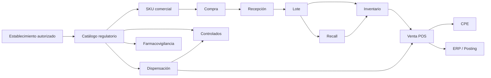
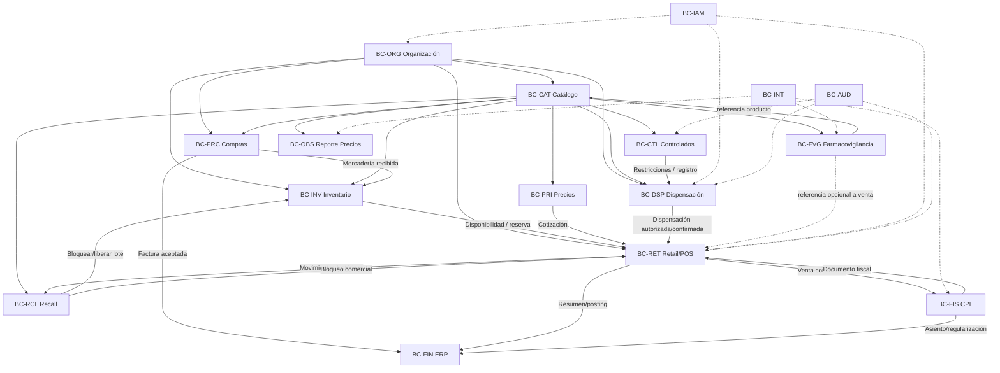
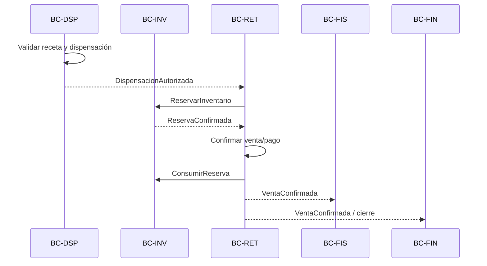
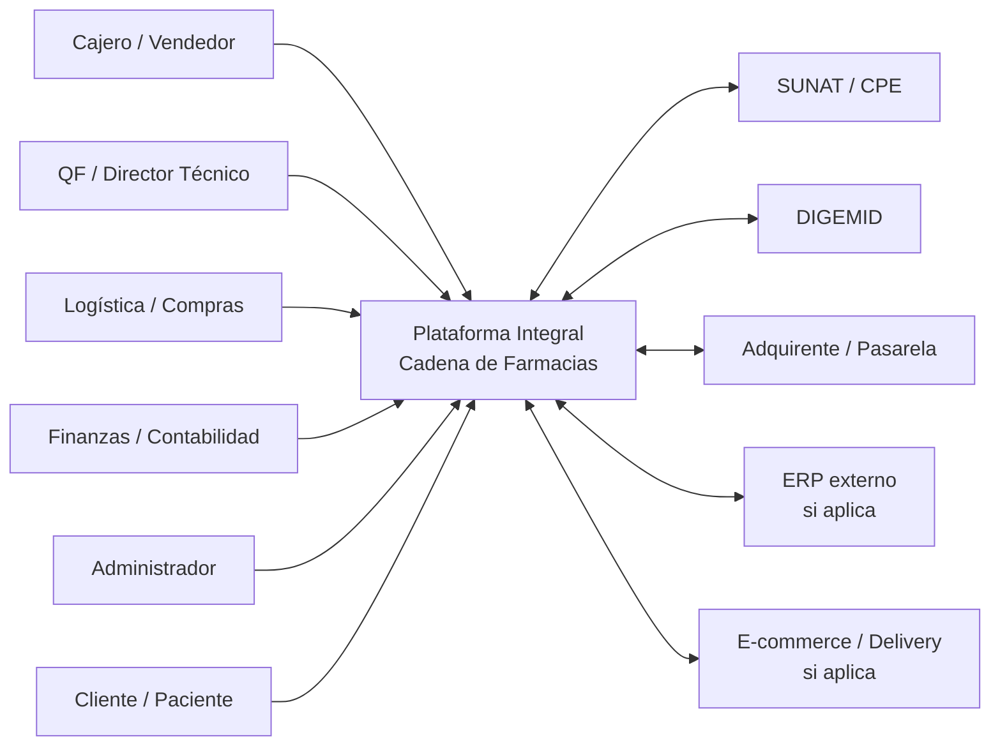
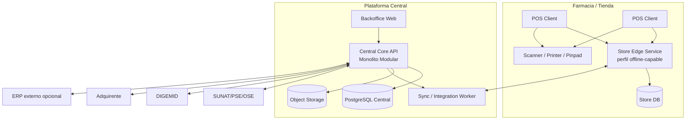
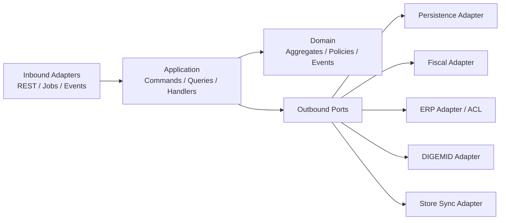
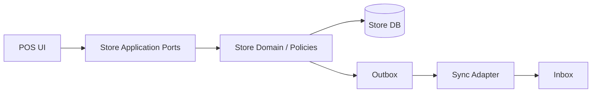
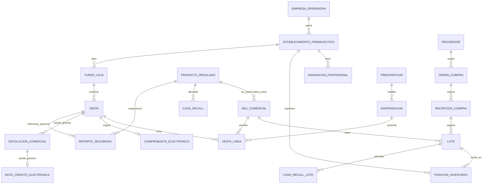
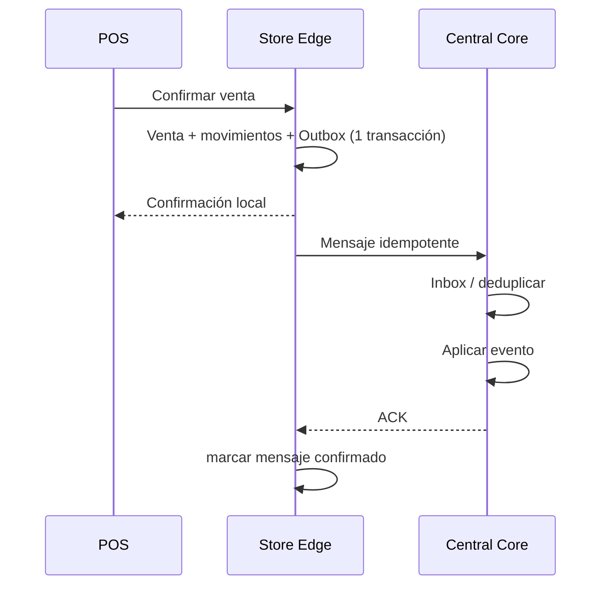

# DOCUMENTACIÓN COMPLETA — Plataforma Integral de Gestión para Cadena de Farmacias
> Documento consolidado generado desde los archivos fuente del repositorio. La fuente de verdad sigue siendo cada `.md` individual y las migraciones de `database/migrations/`.


---

## Fuente: `README.md`

# Plataforma Integral de Gestión para Cadena de Farmacias

Estado: **Fase 9 — Modelo físico PostgreSQL 18 consolidado y enriquecido**  
Fecha base: **02-09-2026**

## Propósito

Este repositorio documenta el análisis y diseño de una plataforma integral para una cadena de farmacias en Perú. El enfoque sigue el mismo rigor aplicado a otros proyectos: primero negocio y normativa; después procesos, requisitos, reglas de negocio, dominio, arquitectura, datos, API, seguridad y pruebas.

## Regla de evidencia

Cada capacidad, regla o dato debe identificarse según su origen:

- `NORM`: norma, autoridad o fuente oficial.
- `MKT`: capacidad observada en productos/sistemas actuales del mercado.
- `FUNC`: necesidad funcional del proyecto validada por stakeholders.
- `DOM`: decisión del modelo de dominio.
- `STD`: estándar técnico.
- `TEC`: decisión tecnológica/arquitectónica.
- `POR_VALIDAR`: hipótesis aún no confirmada.

No se presentará una decisión `TEC` o una práctica `MKT` como si fuera una obligación `NORM`.

## Arquitectura funcional

La plataforma se divide inicialmente en cinco grandes dominios de capacidad:

1. **ERP Corporativo** — finanzas, contabilidad, tesorería, compras, proveedores, cuentas por pagar/cobrar y consolidación.
2. **Retail / POS** — tienda, caja, ventas, precios, promociones, devoluciones, clientes y operación offline.
3. **Supply Chain / WMS** — inventario, almacenes, lotes, vencimientos, FEFO, transferencias, reposición, compras y distribución.
4. **Farmacéutico / Regulatorio** — registro sanitario, condición de venta, recetas, dispensación, director técnico, productos controlados, alertas/retiros y farmacovigilancia.
5. **Omnicanal / CRM** — web/app, pedidos, retiro en tienda, delivery, fidelización, disponibilidad por local y atención al cliente.

> Esta separación es funcional. **No implica todavía microservicios ni bases de datos independientes.** La arquitectura técnica se decidirá después de validar procesos y requisitos.

## Documentos de la fase actual

- [Visión y alcance](docs/01-negocio/01-vision-alcance.md)
- [Benchmarking de mercado](docs/01-negocio/02-benchmarking.md)
- [Mapa de capacidades](docs/01-negocio/03-mapa-capacidades.md)
- [Fronteras ERP / Retail / WMS / Farmacéutico](docs/01-negocio/04-fronteras-funcionales.md)
- [Mapa de procesos macro](docs/02-procesos/01-mapa-procesos.md)
- [Matriz fuente → capacidad](docs/01-negocio/05-matriz-fuente-capacidad.md)
- [Stakeholders y actores](docs/01-negocio/06-stakeholders-actores.md)
- [TO-BE abastecimiento y recepción](docs/02-procesos/02-to-be-abastecimiento-recepcion.md)
- [TO-BE transferencias e inventario](docs/02-procesos/03-to-be-transferencias-inventario.md)
- [TO-BE venta, dispensación y POS](docs/02-procesos/04-to-be-venta-dispensacion-pos.md)
- [TO-BE precios/promociones/Observatorio](docs/02-procesos/05-to-be-precios-promociones-observatorio.md)
- [Modelo de dominio DDD](docs/04-dominio/01-modelo-dominio.md)
- [Bounded Contexts / Context Map](docs/04-dominio/02-bounded-contexts-context-map.md)
- [Agregados / Entidades / Value Objects](docs/04-dominio/03-agregados-entidades-value-objects.md)
- [Referencias](docs/99-referencias.md)

## Secuencia de trabajo

```text
01. Visión y alcance
        ↓
02. Benchmarking
        ↓
03. Mapa de capacidades
        ↓
04. Procesos AS-IS / TO-BE
        ↓
05. Stakeholders y actores
        ↓
06. Requerimientos funcionales
        ↓
07. Requerimientos no funcionales
        ↓
08. Reglas de negocio
        ↓
09. Casos de uso y criterios de aceptación
        ↓
10. Modelo de dominio
        ↓
11. Arquitectura / ADR
        ↓
12. Modelo lógico y físico
        ↓
13. API / OpenAPI
        ↓
14. Seguridad / auditoría
        ↓
15. Pruebas / CI-CD
```

## Fase 2 — Procesos profundizados

Ya se encuentran documentados:

- compras/proveedores/ERP (Procure-to-Pay);
- caja/POS/cierre de turno;
- devoluciones y notas de crédito;
- productos fiscalizados;
- alertas e inmovilizaciones/retiros;
- farmacovigilancia y tecnovigilancia;
- cierre financiero e integración Retail → ERP;
- matriz proceso → regla → fuente.

Ver [Mapa de procesos](docs/02-procesos/01-mapa-procesos.md).
## Fase 3 — Requerimientos

La fase de requerimientos ya contiene:

- SRS funcional;
- catálogo de RF por dominio;
- RNF sin inventar SLO/RPO/RTO;
- reglas de negocio clasificadas por fuente;
- trazabilidad inicial proceso → RF → RN → prueba candidata.

Ver [docs/03-requerimientos/README.md](docs/03-requerimientos/README.md).

## Fase 4 — Casos de uso y criterios de aceptación

La especificación funcional ya fue refinada a comportamiento verificable:

- [Casos de uso detallados](docs/03-requerimientos/05-casos-uso.md)
- [Criterios de aceptación](docs/03-requerimientos/08-criterios-aceptacion.md)
- [Matriz de trazabilidad expandida](docs/03-requerimientos/07-matriz-trazabilidad.md)
- [Estrategia de pruebas](docs/10-pruebas/01-estrategia-pruebas.md)

Cobertura funcional: 22 CU prioritarios, 206 RF vinculados y 626 criterios de aceptación.

## Fase 5 — Modelo de Dominio DDD

El modelo de dominio ya incorpora:

- subdominios Core / Supporting / Generic;
- 16 Bounded Contexts candidatos;
- Context Map;
- agregados, entidades y Value Objects;
- estados/transiciones;
- comandos, Domain Events y servicios/políticas;
- invariantes sanitarias, fiscales y de dominio;
- lenguaje ubicuo;
- trazabilidad RF/CU/CA → dominio;
- matriz de origen de conceptos;
- decisiones abiertas que no deben hardcodearse.

Ver [docs/04-dominio/README.md](docs/04-dominio/README.md).

Esta fase quedó superada por la arquitectura y el modelo físico PostgreSQL 18 ya documentados.


## Fase 6 — Arquitectura y ADR

La arquitectura base ya fue definida como:

```text
Core Central
  = Monolito Modular multi-módulo
  + DDD
  + Clean Architecture / Ports & Adapters
  + CQRS selectivo
  + Result Pattern
  + Domain Events

Store Edge
  = perfil opcional por tienda para continuidad offline
  + base/servicio local
  + Outbox/Inbox
  + sincronización idempotente
```

Decisiones principales:

- POS `online-first` con perfil `STORE_EDGE` offline-capable;
- SUNAT/CPE detrás de Fiscal Port/Adapter;
- ERP detrás de un boundary/ACL independiente de si será propio o externo;
- no microservicios por Bounded Context;
- no Event Sourcing ni broker obligatorio por ahora;
- política detallada de stock offline continúa propuesta/por validar.

Ver [Arquitectura y ADR](docs/05-arquitectura/README.md).

Esta fase quedó superada por el modelo lógico/físico y la validación estática del DDL.

## Fase 7 — Datos, API, Seguridad y UX

Ya se incorporó la línea base documental que faltaba:

- [06 — Datos](docs/06-datos/README.md): modelo conceptual/lógico y ownership Central vs Store Edge.
- [07 — API](docs/07-api/README.md): REST, Problem Details, idempotencia, OpenAPI e integraciones.
- [08 — Seguridad](docs/08-seguridad/README.md): seguridad por capas, scopes, Store Edge, privacidad, pagos/PCI y auditoría.
- [09 — UX](docs/09-ux/README.md): arquitectura de información, POS, dispensación, inventario, offline y accesibilidad.

El Core Central ya cuenta con baseline físico PostgreSQL 18; la persistencia específica del Store Edge continúa pendiente de ADR.

## Fase 8 — DevOps, Roadmap y Estándares de Desarrollo

Ya se incorporó la capa documental complementaria:

- [11 — DevOps/DevSecOps](docs/11-devops/README.md): entornos, CI/CD, observabilidad, Store Edge, DR, releases, supply-chain security y runbooks.
- [12 — Roadmap](docs/12-roadmap/README.md): fases por capacidades, MVP candidato, gates, riesgos y decisiones pendientes.
- [13 — Estándares de Desarrollo](docs/13-estandares-desarrollo/README.md): SOLID/GRASP/KISS/YAGNI/DRY, patrones, Java candidato, frontend/POS, CQRS/Result/Events, Git, pruebas de arquitectura, persistencia y Definition of Done.

Estas secciones no fijan proveedor cloud, Kubernetes, herramienta CI/CD ni stack Java como decisiones definitivas. Las elecciones dependientes de tecnología siguen sujetas a ADR.


## Fase 9 — Consolidación del modelo físico

Se consolidaron los scripts de referencia aportados posteriormente con el modelo DDD/arquitectónico vigente. La fuente de verdad queda en `database/migrations/V001..V017`; el SQL consolidado es una representación derivada.

El enriquecimiento incluye campos adicionales de organización, catálogo regulatorio/SKU, proveedores/compras, lotes/stock/kardex, clientes/POS/pagos, prescripción/dispensación, controlados, CPE, recall/farmacovigilancia, ERP, IAM/RBAC, navegación, auditoría, integración, notificaciones y feature flags.

No se ejecutan en paralelo los antiguos scripts `V1/V2`; sus capacidades útiles fueron absorbidas y alineadas. RRHH completo, CRM/CMR avanzado y e-commerce/delivery completo permanecen diferidos hasta contar con RF/CU/ADR específicos.

Ver [consolidación V1/V2 y campos](docs/06-datos/08-consolidacion-v1-v2-campos.md).

## Base de datos PostgreSQL 18

La línea base física del Core Central se encuentra en [`database/`](database/README.md).

- [DDL consolidado PostgreSQL 18](database/cadena_farmacias_postgresql18.sql)
- [Migraciones V001–V017](database/migrations)
- [Modelo físico documentado](docs/06-datos/07-modelo-fisico-postgresql18.md)
- [Consolidación V1/V2 y enriquecimiento de campos](docs/06-datos/08-consolidacion-v1-v2-campos.md)
- [Validación estática del DDL](docs/10-pruebas/02-validacion-ddl-postgresql18.md)

---

## Fuente: `database/README.md`

# Database — PostgreSQL 18

**Baseline consolidado:** v0.3  
**Estado:** borrador técnico avanzado; validación estática realizada, pendiente de ejecución real en PostgreSQL 18.x.

## Fuente de verdad

- `migrations/V001...V017`: migraciones modulares.
- `cadena_farmacias_postgresql18.sql`: consolidado generado a partir de las migraciones.

Los scripts aportados `V1__init_erp_boticas_postgres_revisado.sql` y `V2__menu_navegacion_rbac.sql` se usaron como **referencia de consolidación**. No deben ejecutarse en paralelo con esta línea base.

## Migraciones

| Migración | Área |
|---|---|
| V001 | schemas, extensiones, tenant |
| V002 | organización, establecimientos, almacenes, terminales y profesionales |
| V003 | catálogo regulatorio, categoría/marca y SKU |
| V004 | proveedores, solicitudes, órdenes y recepción |
| V005 | lotes, posiciones, kardex, reservas, transferencias y conteos |
| V006 | listas de precios y promociones |
| V007 | clientes, caja, ventas, pagos y devoluciones |
| V008 | prescripción y dispensación |
| V009 | productos controlados |
| V010 | fiscal / CPE |
| V011 | recall + farmacovigilancia |
| V012 | ERP financiero + Observatorio |
| V013 | IAM / RBAC / ámbitos / sesiones |
| V014 | auditoría |
| V015 | integraciones + Outbox/Inbox |
| V016 | navegación dinámica RBAC |
| V017 | notificaciones, feature flags y versiones |

## Convenciones

- PK interna: `BIGINT GENERATED ALWAYS AS IDENTITY`.
- Identificador público: `UUID DEFAULT uuidv7()`.
- `tenant_id` en datos tenant-scoped.
- FKs contextuales para reducir cruces entre empresa/establecimiento.
- `NULLS NOT DISTINCT` solo cuando `NULL` representa el mismo valor lógico en una clave.
- no guardar PAN/CVV, access tokens, refresh tokens ni secretos en tablas funcionales/logs.
- documentos binarios fuera de PostgreSQL; la BD conserva URI/hash/metadatos.

## Store Edge

Este DDL corresponde al **Core Central**. El motor físico del Store Edge permanece pendiente de ADR; el modelo de sincronización central (`outbox`, `inbox`, `sync_checkpoint`) sí forma parte del Core.

---

## Fuente: `docs/01-negocio/01-vision-alcance.md`

# DOC-FAR-001 — Visión y Alcance

## 1. Nombre de trabajo

**Plataforma Integral de Gestión para Cadena de Farmacias**

No se utilizará todavía el nombre “ERP Farmacia” como denominación única porque el alcance incluye capacidades especializadas de retail, logística y operación farmacéutica que trascienden un ERP administrativo tradicional.

## 2. Problema de negocio

Una cadena de farmacias opera simultáneamente como:

- empresa multi-sucursal;
- retailer con POS y cajas;
- operador logístico con inventario distribuido;
- establecimiento farmacéutico sujeto a regulación sanitaria;
- organización financiera que compra, vende, paga, cobra y consolida resultados;
- canal potencialmente omnicanal (tienda física, web/app, retiro y delivery).

El riesgo de tratar todo como un único “módulo ERP” es mezclar responsabilidades y crear dependencias innecesarias entre procesos contables, operación de tienda, control farmacéutico y logística.

## 3. Objetivo general

Diseñar e implementar una plataforma modular que permita gestionar de extremo a extremo la operación de una cadena de farmacias, manteniendo trazabilidad de inventario y productos, cumplimiento regulatorio, continuidad del POS, control financiero y capacidad de crecimiento omnicanal.

## 4. Objetivos específicos

1. Centralizar maestros de empresas, establecimientos, productos, proveedores y clientes.
2. Controlar inventario por establecimiento, ubicación y lote, incluyendo vencimientos.
3. Soportar recepción, transferencias, ajustes, inventarios físicos, reposición y distribución.
4. Gestionar ventas POS, cajas, turnos, pagos, devoluciones y comprobantes electrónicos.
5. Aplicar controles farmacéuticos según condición de venta y receta.
6. Registrar responsables profesionales y Director Técnico por establecimiento cuando corresponda.
7. Controlar productos fiscalizados mediante flujos específicos cuando sean aplicables.
8. Integrar compras, proveedores, cuentas por pagar, tesorería y contabilidad.
9. Permitir precios, promociones y fidelización con reglas centralizadas y ejecución por tienda.
10. Preparar la plataforma para canales digitales, pedidos, retiro en tienda y delivery.
11. Proveer auditoría, seguridad y segregación de funciones.
12. Generar información regulatoria, operacional, comercial y financiera.

## 5. Alcance funcional inicial

### 5.1 Incluido en el análisis

- Organización y establecimientos.
- Autorización sanitaria y responsables profesionales como información del establecimiento.
- Catálogo maestro farmacéutico y retail.
- Proveedores y compras.
- Centros de distribución, almacenes y ubicaciones.
- Lotes, series cuando aplique, fechas de vencimiento y alertas.
- Inventario y movimientos.
- Transferencias entre locales.
- Reposición.
- POS y cajas.
- Ventas y devoluciones.
- Precios y promociones.
- Clientes y fidelización.
- Recetas y dispensación.
- Productos controlados.
- Retiro/recall y bloqueo de lotes/productos.
- Farmacovigilancia / tecnovigilancia como capacidad a delimitar.
- ERP financiero.
- Reportes y BI.
- Omnicanalidad.
- IAM y auditoría.

### 5.2 No se declara todavía como MVP

La inclusión en el mapa de capacidades **no significa** que todo deba implementarse en la primera versión. El MVP se definirá después del análisis de procesos y priorización.

## 6. Principios funcionales preliminares

1. **Una venta no debe poder evadir la condición de venta sanitaria del producto.** `NORM`
2. **El inventario farmacéutico debe mantener trazabilidad por lote y vencimiento cuando corresponda.** `NORM/DOM`
3. **Los establecimientos deben estar asociados a su autorización sanitaria vigente cuando aplique.** `NORM`
4. **El POS debe continuar operando frente a interrupciones de conectividad si el modelo de negocio exige continuidad.** `MKT/POR_VALIDAR`
5. **ERP y POS son capacidades distintas aunque se integren.** `DOM`
6. **El producto maestro debe diferenciar atributos farmacéuticos de atributos comerciales.** `DOM`
7. **Precio, promoción y margen no deben modificar reglas sanitarias de dispensación.** `DOM`
8. **Los movimientos físicos deben producir trazabilidad auditable.** `DOM/MKT`
9. **Las funciones del personal deben respetar perfiles y responsabilidades regulatorias.** `NORM/DOM`
10. **No se modelará una regla sanitaria como dato fijo sin fuente vigente.** `DOM`

## 7. Evidencia regulatoria principal

- Ley N.° 29459: regula productos farmacéuticos, dispositivos médicos y productos sanitarios.
- D.S. N.° 014-2011-SA y modificatorias: Reglamento de Establecimientos Farmacéuticos.
- D.S. N.° 015-2025-SA: modifica el artículo 43 y el Anexo 01 del Reglamento, incluyendo responsabilidades del personal técnico y Director Técnico.
- D.S. N.° 016-2011-SA: registro, control y vigilancia sanitaria de productos.
- D.S. N.° 023-2001-SA: productos/sustancias sujetos a fiscalización sanitaria.
- Directiva Sanitaria N.° 105-MINSA/2020/DIGEMID: buenas prácticas de dispensación; incluye recepción/validación, análisis, selección, registro, entrega e información al paciente.
- DIGEMID: Observatorio de Precios; las farmacias y boticas reportan precios de medicamentos.
- SUNAT: emisión de comprobantes electrónicos según obligación tributaria vigente.

## 8. Hipótesis que deben validarse con stakeholders

- Cantidad esperada de empresas, locales, almacenes y cajas.
- Necesidad real de POS offline por tienda.
- Existencia de centro de distribución propio.
- Gestión centralizada o descentralizada de compras.
- Si habrá e-commerce/app desde la primera versión.
- Si se comercializarán productos controlados.
- Si se manejarán fórmulas magistrales.
- Si el ERP contable será propio o integración con un ERP existente.
- Si la cadena utilizará una sola razón social o múltiples empresas.
- Modelo de fidelización.
- Política de devoluciones por tipo de producto.

---

## Fuente: `docs/01-negocio/02-benchmarking.md`

# DOC-FAR-002 — Benchmarking de Sistemas y Plataformas

## 1. Objetivo

Identificar capacidades implementadas actualmente en soluciones de retail, farmacia, ERP y supply chain para utilizarlas como evidencia de mercado (`MKT`) y fuente de ideas, **sin copiar automáticamente su modelo ni asumir que son requisitos regulatorios peruanos**.

## 2. Plataformas revisadas

### 2.1 LS Central for Pharmacies

Capacidades observadas:

- POS para medicamentos, retail y servicios en una misma transacción.
- Manejo de recetas en diferentes formatos.
- Búsqueda por atributos farmacéuticos como sustancia, ATC, concentración y clasificación.
- Control de vencimientos y recalls.
- Inventario en tiempo real por local.
- Transferencias entre tiendas.
- Reposición automática por producto/local.
- Promociones y fidelización.
- Permisos específicos para usuarios de farmacia.
- Integración con Business Central ERP.
- Pedidos en línea, delivery y click & collect.
- Servicios/citas.

**Conclusión:** confirma que en una farmacia de cadena conviven ERP, retail, farmacia e inventario especializado y que una separación modular es habitual.

### 2.2 Microsoft Dynamics 365 Commerce

Capacidades observadas:

- POS moderno.
- clientes, pricing y descuentos;
- pagos;
- pedidos y fulfillment;
- inventario;
- recibos;
- reporting;
- extensibilidad;
- soporte offline.

La documentación vigente describe un modo offline en el que el POS usa una base local cuando el componente central no está disponible y sincroniza transacciones posteriormente.

**Conclusión:** la continuidad de operación de tienda debe evaluarse como requisito arquitectónico propio, especialmente para sucursales con conectividad variable.

### 2.3 Oracle Retail Merchandising Foundation

Capacidades observadas:

- item management;
- replenishment;
- purchasing;
- inventory;
- transferencias;
- sales audit;
- seguimiento financiero.

**Conclusión:** en retail de escala, merchandising, compras, inventario, transferencias y auditoría de ventas forman un núcleo separado del POS.

### 2.4 SAP Retail / S/4HANA

Capacidades observadas:

- stock por niveles organizacionales y ubicaciones;
- movimientos de mercancía con documentos/audit trail;
- integración del movimiento físico con valoración/contabilidad;
- procurement y recepción;
- análisis por lotes y shelf-life.

**Conclusión:** soporta la separación entre inventario físico, valoración financiera y contabilidad.

### 2.5 Odoo Inventory

Capacidades observadas:

- lotes y números de serie;
- fechas de vencimiento/alerta/remoción;
- estrategias FIFO/LIFO/FEFO;
- FEFO basado en fecha próxima a expirar.

**Conclusión:** FEFO es una práctica de supply chain útil para productos con vencimiento; su aplicación concreta en el proyecto será una política de negocio/configuración y no se etiquetará automáticamente como obligación legal.

## 3. Capacidades comunes identificadas

| Capacidad | LS Central | D365 Commerce | Oracle Retail | SAP Retail | Odoo | Proyecto |
|---|---:|---:|---:|---:|---:|---:|
| POS | Sí | Sí | Integrable | Integrable | Sí | Sí |
| Offline POS | Depende despliegue | Sí | Depende solución | Depende | Limitado/depende | Por validar |
| Inventario multi-local | Sí | Sí | Sí | Sí | Sí | Sí |
| Lotes/vencimientos | Sí | Depende configuración | Sí | Sí | Sí | Sí |
| Transferencias | Sí | Sí | Sí | Sí | Sí | Sí |
| Reposición | Sí | Sí | Sí | Sí | Reglas | Sí |
| Recetas/dispensación | Sí | No nativo específico | No nativo específico | No nativo específico | No nativo específico | Sí |
| Promociones | Sí | Sí | Sí | Sí | Sí | Sí |
| Fidelización | Sí | Sí | Integrable | Integrable | Sí | Sí |
| ERP financiero | Business Central | Dynamics Finance | Integrable | S/4HANA | Sí | Sí/integrable |
| Omnicanal | Sí | Sí | Sí | Sí | Integrable | Fase a definir |

## 4. Lecciones que sí conviene adoptar

1. **Separar el producto farmacéutico del SKU/ítem comercial.**
2. **Separar inventario lógico de lote físico.**
3. **Centralizar precios/promociones pero ejecutar transacciones en tienda.**
4. **Diseñar transferencias como proceso con despacho y recepción, no como simple actualización de stock.**
5. **Modelar reposición como política configurable.**
6. **Usar trazabilidad de movimientos y sales audit.**
7. **Separar receta/dispensación de venta POS, aunque terminen en una misma transacción de cobro.**
8. **Preparar una estrategia de continuidad/offline para POS si se valida el requisito.**
9. **Mantener datos regulatorios del producto separados de precio/costos/promociones.**
10. **Evitar que el ERP financiero gobierne directamente las reglas de dispensación.**

## 5. Lo que no se debe copiar sin análisis

- Modelos de receta de otros países.
- Sistemas de seguros/reembolso extranjeros.
- FMD europeo.
- SSN o registros nacionales de pacientes no aplicables al Perú.
- Reglas de sustitución de medicamentos de otras jurisdicciones.
- Lógica tributaria extranjera.
- Modelos de productos controlados de otras jurisdicciones.

Esas capacidades sirven como benchmarking pero deben adaptarse a la normativa peruana.

---

## Fuente: `docs/01-negocio/03-mapa-capacidades.md`

# DOC-FAR-003 — Mapa de Capacidades de Negocio

## 1. Vista general

```text
CADENA DE FARMACIAS
│
├── A. Gobierno y Organización
├── B. Maestro de Productos
├── C. ERP Corporativo
├── D. Supply Chain / WMS
├── E. Retail / POS
├── F. Operación Farmacéutica
├── G. Cliente / CRM
├── H. Omnicanalidad
├── I. Cumplimiento / Calidad
├── J. Datos / BI
└── K. Capacidades Transversales
```

---

## A. Gobierno y Organización

### A1. Grupo / tenant
### A2. Empresa / razón social
### A3. Establecimiento farmacéutico
### A4. Centro de distribución / almacén
### A5. Local / tienda
### A6. POS / terminal
### A7. Caja
### A8. Áreas y ubicaciones internas
### A9. Autorización sanitaria
### A10. Director Técnico / QF asistentes
### A11. Horario de funcionamiento
### A12. Personal técnico

**Evidencia:** `NORM + DOM`.

La DIGEMID indica que establecimientos que realizan almacenamiento, comercialización, dispensación o expendio requieren autorización sanitaria previa. El Reglamento y su modificación 2025 establecen responsabilidades del Director Técnico y personal técnico.

---

## B. Maestro de Productos / MDM

### B1. Producto farmacéutico
### B2. Dispositivo médico
### B3. Producto sanitario
### B4. Producto retail no farmacéutico
### B5. Principio activo / IFA
### B6. Concentración
### B7. Forma farmacéutica
### B8. Vía de administración
### B9. Presentación
### B10. Fabricante / laboratorio
### B11. Registro sanitario
### B12. Condición de venta
### B13. Clasificación ATC
### B14. Clasificación/control sanitario
### B15. Unidad de medida
### B16. Código de barras
### B17. SKU comercial
### B18. Marca
### B19. Categoría retail
### B20. Impuestos
### B21. Estado comercial
### B22. Estado sanitario

**Evidencia:** `NORM + MKT + DOM`.

DIGEMID publica estándares vigentes para forma farmacéutica, vía de administración, unidad de medida, condición de venta, clasificación ATC y productos/sustancias controladas. La consulta oficial de registro sanitario expone datos como registro, nombre, fabricante, condición de venta, ATC y principio activo.

---

## C. ERP Corporativo

### C1. Proveedores
### C2. Contratos comerciales
### C3. Solicitud de compra
### C4. Orden de compra
### C5. Recepción y conformidad
### C6. Factura proveedor
### C7. Cuentas por pagar
### C8. Tesorería
### C9. Bancos / conciliación
### C10. Contabilidad general
### C11. Centros de costo / dimensiones
### C12. Cuentas por cobrar
### C13. Activos fijos
### C14. Presupuestos
### C15. Consolidación multiempresa
### C16. Costeo / valoración de inventario

**Evidencia:** `MKT + FUNC/POR_VALIDAR`.

Los ERP actuales separan cuentas por pagar, tesorería, bancos y libro mayor de los procesos operativos de tienda.

---

## D. Supply Chain / WMS

### D1. Almacenes y ubicaciones
### D2. Recepción
### D3. Lotes
### D4. Fechas de vencimiento
### D5. Estado de lote
### D6. Cuarentena / bloqueo
### D7. Stock disponible
### D8. Stock reservado
### D9. Stock en tránsito
### D10. Stock no vendible
### D11. Movimientos de inventario
### D12. Transferencias
### D13. Picking
### D14. Packing
### D15. Despacho
### D16. Recepción en destino
### D17. Ajustes
### D18. Inventarios físicos / conteos
### D19. Reposición automática
### D20. Stock mínimo/máximo
### D21. Pronóstico de demanda
### D22. FEFO configurable
### D23. Alertas de vencimiento
### D24. Devolución a proveedor
### D25. Retiro / recall
### D26. Trazabilidad de producto/lote

**Evidencia:** `NORM + MKT + DOM`.

La Ley 29459 prohíbe comercialización/dispensación de productos vencidos, en mal estado o de procedencia desconocida; por ello lote, vencimiento, estado y trazabilidad son capacidades críticas. FEFO se considera una política operacional soportada ampliamente por WMS/ERP modernos, pero se etiquetará `MKT/DOM` hasta precisar la regla aplicable por categoría.

---

## E. Retail / POS

### E1. Apertura de caja
### E2. Turnos
### E3. Venta
### E4. Venta mixta medicamentos + retail
### E5. Escaneo de código de barras
### E6. Pricing
### E7. Promociones
### E8. Descuentos autorizados
### E9. Medios de pago
### E10. Comprobantes electrónicos
### E11. Devoluciones
### E12. Anulaciones
### E13. Nota de crédito
### E14. Cierre y arqueo
### E15. Diferencias de caja
### E16. Consulta de stock de otras tiendas
### E17. Reserva
### E18. Suspender/recuperar transacción
### E19. Sales audit
### E20. Operación offline y sincronización

**Evidencia:** `MKT + NORM tributaria + POR_VALIDAR offline`.

SUNAT mantiene la obligación de comprobantes electrónicos para los sujetos designados/emisores obligados. El modelo POS debe integrar la emisión sin acoplar toda la venta a un proveedor único de CPE.

---

## F. Operación Farmacéutica

### F1. Recepción de receta
### F2. Validación de receta
### F3. Prescriptor
### F4. Paciente
### F5. Detalle prescrito
### F6. Vigencia / uso de receta
### F7. Condición de venta
### F8. Análisis e interpretación
### F9. Selección/preparación del producto
### F10. Dispensación
### F11. Expendio
### F12. Registro de dispensación
### F13. Información/orientación al paciente
### F14. Intervención del Químico Farmacéutico
### F15. Productos controlados
### F16. Receta especial
### F17. Registro/control de fiscalizados
### F18. Bloqueo sanitario
### F19. Alertas sanitarias / recall
### F20. Farmacovigilancia
### F21. Tecnovigilancia
### F22. Fórmulas magistrales (si aplica)
### F23. Cannabis medicinal (si aplica/licencia)

**Evidencia:** `NORM`.

La Directiva Sanitaria 105 describe la dispensación como recepción/validación, análisis/interpretación, preparación/selección, registros, entrega e información. También acepta recetas físicas, imagen digital y electrónicas que cumplan las reglas vigentes y establece confidencialidad. Productos controlados siguen normativa específica.

---

## G. Cliente / CRM

### G1. Cliente
### G2. Identificación
### G3. Consentimientos comerciales
### G4. Preferencias
### G5. Fidelización
### G6. Puntos
### G7. Cupones
### G8. Historial comercial
### G9. Segmentación
### G10. Atención/reclamos

**Evidencia:** `MKT + NORM protección datos`.

No se asumirá que un historial comercial habilita automáticamente el almacenamiento/uso de información de salud. La privacidad y finalidades de tratamiento deberán analizarse por separado.

---

## H. Omnicanalidad

### H1. Catálogo web/app
### H2. Stock disponible por local
### H3. Pedido online
### H4. Pago online
### H5. Click & Collect
### H6. Delivery
### H7. Reserva de stock
### H8. Asignación de tienda fulfillment
### H9. Seguimiento de pedido
### H10. Cancelación/devolución
### H11. Receta en canal digital
### H12. Validación farmacéutica en canal digital

**Evidencia:** `MKT + NORM por validar en detalle`.

No se habilitará venta digital de medicamentos sujetos a receta sin conservar los controles aplicables a la dispensación.

---

## I. Cumplimiento / Calidad

### I1. Autorizaciones sanitarias
### I2. Responsables profesionales
### I3. Registros de capacitación
### I4. Buenas prácticas
### I5. Alertas sanitarias
### I6. Productos robados / prohibidos
### I7. Retiro de producto
### I8. Farmacovigilancia
### I9. Tecnovigilancia
### I10. Reporte al Observatorio de Precios
### I11. Reportes de controlados
### I12. Trazabilidad de inspecciones

---

## J. Datos / BI

### J1. Ventas por tienda
### J2. Margen
### J3. Ticket promedio
### J4. Rotación
### J5. Quiebre de stock
### J6. Sobre-stock
### J7. Vencimientos y merma
### J8. Fill rate
### J9. Transferencias
### J10. Efectividad promociones
### J11. Fidelización
### J12. Rentabilidad por SKU/local
### J13. Compras/proveedor
### J14. Cash flow
### J15. Indicadores farmacéuticos/regulatorios

---

## K. Capacidades Transversales

### K1. IAM
### K2. JWT / sesiones
### K3. RBAC / ámbitos
### K4. Auditoría
### K5. Integraciones
### K6. Notificaciones
### K7. Gestión documental
### K8. Configuración
### K9. Observabilidad
### K10. Feature flags
### K11. Importación/exportación
### K12. Gestión de catálogos

---

## Fuente: `docs/01-negocio/04-fronteras-funcionales.md`

# DOC-FAR-004 — Fronteras ERP, Retail, WMS y Farmacéutico

## 1. Objetivo

Evitar el error de modelar toda la plataforma como un único ERP genérico.

## 2. ERP Corporativo

El ERP responde principalmente a:

- ¿qué compramos y a quién?
- ¿qué debemos pagar?
- ¿cuánto dinero tenemos y dónde?
- ¿cómo se contabilizan las operaciones?
- ¿cuál es el costo y resultado por empresa/centro?

No debería decidir:

- si una receta es válida;
- si un producto requiere receta;
- qué QF puede realizar una actividad;
- qué lote puede dispensarse por regla sanitaria;
- si una venta de producto fiscalizado puede realizarse.

## 3. Retail / POS

El POS responde principalmente a:

- ¿qué está comprando el cliente?
- ¿a qué precio?
- ¿qué promoción aplica?
- ¿qué medio de pago usa?
- ¿qué comprobante corresponde?
- ¿qué caja/turno realiza la operación?

El POS debe solicitar autorizaciones/reglas del dominio farmacéutico cuando corresponda.

## 4. Supply Chain / WMS

Responde a:

- ¿dónde está físicamente el stock?
- ¿de qué lote?
- ¿cuándo vence?
- ¿qué cantidad está disponible/reservada/bloqueada/en tránsito?
- ¿qué debe reponerse?
- ¿qué se despachó y qué se recibió?

No debe asumir que `stock > 0` significa `vendible = true`.

Ejemplo:

```text
Stock físico: 100
├── disponible: 60
├── reservado: 10
├── bloqueado: 20
└── vencido/no vendible: 10
```

## 5. Dominio Farmacéutico

Responde a:

- ¿qué es el producto desde el punto de vista sanitario?
- ¿cuál es su registro y condición de venta?
- ¿requiere receta?
- ¿qué receta aplica?
- ¿quién está autorizado para dispensar/intervenir?
- ¿es producto controlado?
- ¿hay alerta/retiro/bloqueo?
- ¿qué orientación/registros son necesarios?

## 6. Relación entre venta y dispensación

No son exactamente lo mismo.

```text
Receta / necesidad del usuario
          ↓
Validación farmacéutica
          ↓
Dispensación / expendio autorizado
          ↓
Producto(s) listos para cobro
          ↓
POS / Venta
          ↓
Pago + comprobante
          ↓
Salida de inventario
          ↓
Contabilización / ERP
```

Un único flujo de usuario puede atravesar varios dominios sin convertirlos en un solo agregado o módulo.

## 7. Relación compra → inventario → ERP

```text
Planificación / reposición
        ↓
Solicitud / Orden de compra
        ↓
Proveedor
        ↓
Recepción
        ↓
Validación de producto/lote/vencimiento
        ↓
Inventario disponible o cuarentena
        ↓
Cuenta por pagar
        ↓
Tesorería
        ↓
Contabilidad
```

## 8. Relación POS → contabilidad

No se recomienda que cada pantalla POS genere directamente asientos contables.

```text
Venta POS
   ↓
Transacción retail cerrada
   ↓
Evento / integración contable
   ↓
Resumen / documento contabilizable
   ↓
ERP financiero
```

La granularidad final se definirá con Contabilidad y SUNAT.

## 9. Frontera Producto Sanitario vs SKU Comercial

```text
Producto farmacéutico
│
├── principio activo
├── concentración
├── forma farmacéutica
├── vía
├── registro sanitario
├── condición de venta
└── clasificación regulatoria
        │
        ▼
Presentación / SKU comercial
│
├── código de barras
├── paquete
├── unidad de venta
├── marca
├── precio
├── costo
└── promociones
```

Un cambio de precio no debe alterar la identidad/regla sanitaria del medicamento.

---

## Fuente: `docs/01-negocio/05-matriz-fuente-capacidad.md`

# DOC-FAR-005 — Matriz Fuente → Capacidad

## 1. Propósito

Evitar que una funcionalidad del mercado se confunda con una obligación legal o que una decisión técnica se presente como regla sanitaria.

| Fuente | Tipo | Concepto sustentado | Capacidades derivables |
|---|---|---|---|
| Ley 29459 | NORM | productos farmacéuticos/dispositivos/productos sanitarios y condiciones básicas | producto regulado, estado sanitario, trazabilidad, prohibiciones |
| D.S. 014-2011-SA + modificatorias | NORM | establecimientos farmacéuticos, funcionamiento, responsabilidades | establecimiento, autorización, Director Técnico, personal, dispensación |
| D.S. 015-2025-SA | NORM | actualización art. 43; personal técnico y responsabilidad del DT | perfiles profesionales, restricciones de funciones, capacitación/supervisión |
| D.S. 016-2011-SA | NORM | registro/control/vigilancia sanitaria y condición de venta | registro sanitario, condición de venta, atributos regulatorios |
| D.S. 023-2001-SA | NORM | estupefacientes/psicotrópicos sujetos a fiscalización | producto controlado, receta/documento especial, registros de control |
| DS 105-MINSA/2020/DIGEMID | NORM | proceso de dispensación | receta, validación, análisis, selección, registro, entrega/orientación |
| DIGEMID Estándares PF 2026 | NORM/OFICIAL | catálogos: forma, vía, condición de venta, ATC, controlados, etc. | MDM farmacéutico |
| DIGEMID Registro Sanitario | OFICIAL | consulta de producto y condición | integración/verificación maestro |
| Observatorio de Precios | NORM/OFICIAL | reporte de precios por farmacias/boticas | pricing regulatorio/reportes |
| SUNAT CPE | NORM/OFICIAL | comprobantes electrónicos | facturación/comprobantes POS |
| LS Central Pharmacy | MKT | farmacia + POS + inventario + recetas + omnicanal | benchmark funcional |
| Dynamics 365 Commerce | MKT | POS, offline, pricing, inventario, pedidos | continuidad POS/retail |
| Oracle Retail | MKT | merchandising, purchasing, replenishment, transferencias, sales audit | núcleo retail central |
| SAP Retail | MKT | inventario por local/ubicación, movimientos, valoración | integración logística-finanzas |
| Odoo 19 Inventory | MKT | lotes, vencimiento y FEFO | política de picking/rotación |

## 2. Ejemplos de clasificación correcta

### `requiere_receta`

- Fuente: registro/condición de venta oficial.
- Tipo: `NORM`.

### `FEFO`

- Fuente: práctica de supply chain y sistemas actuales.
- Tipo: `MKT/DOM`.
- No se declara como obligación sanitaria universal hasta localizar una norma específica aplicable al proceso/categoría.

### `POS offline`

- Fuente: soluciones retail actuales.
- Tipo: `MKT/POR_VALIDAR`.
- Solo se convertirá en `FUNC` si el negocio exige continuidad ante pérdida de internet.

### `uuid_publico`

- Fuente: decisión técnica futura.
- Tipo: `TEC`.

### `Microservicio de inventario`

- Fuente: ninguna todavía.
- Tipo: **no decidido**.

---

## Fuente: `docs/01-negocio/06-stakeholders-actores.md`

# DOC-FAR-006 — Stakeholders y Actores

## 1. Objetivo

Identificar quién participa o es afectado por la plataforma. Esta lista mezcla actores `NORM`, actores observados en el negocio retail (`MKT`) y roles internos `POR_VALIDAR`.

## 2. Stakeholders externos

| Stakeholder | Tipo | Interés |
|---|---|---|
| DIGEMID / Autoridad sanitaria competente | NORM | cumplimiento sanitario, establecimientos, productos, fiscalización |
| SUNAT | NORM | comprobantes, tributos y obligaciones fiscales |
| Colegio / registro profesional aplicable | NORM | habilitación/registro profesional según proceso |
| Proveedores / laboratorios / droguerías | MKT/FUNC | abastecimiento, documentos, lotes, condiciones comerciales |
| Clientes / pacientes | NORM/FUNC | compra, dispensación segura, privacidad, comprobantes |
| Bancos / adquirentes / PSP | MKT | pagos y conciliación |
| Operadores de delivery | MKT | fulfillment del pedido si se terceriza |
| Plataformas de e-commerce / marketplaces | POR_VALIDAR | canal digital |

## 3. Actores internos regulatorios

### 3.1 Director Técnico / Químico Farmacéutico

`NORM`

Responsabilidades del sistema a evaluar:

- identificación del profesional;
- establecimiento y horario asociado;
- presencia/cobertura según normativa aplicable;
- validaciones de dispensación que requieran intervención profesional;
- control/supervisión del personal;
- acciones sobre productos controlados cuando corresponda;
- trazabilidad de intervenciones.

### 3.2 Químico Farmacéutico Asistente

`NORM`

Puede ejecutar funciones profesionales dentro del ámbito permitido y bajo la organización establecida por el establecimiento.

### 3.3 Técnico en Farmacia

`NORM`

El D.S. N.° 015-2025-SA modificó el artículo 43 del Reglamento de Establecimientos Farmacéuticos y establece requisitos para el personal técnico, además de restricciones respecto de actos correspondientes a dispensación de productos de venta bajo receta y ofrecimiento de alternativas al medicamento prescrito.

Por ello, **el sistema no debe tratar a “cajero”, “técnico” y “QF” como usuarios equivalentes**.

## 4. Actores operativos propuestos

Estos roles son `MKT/FUNC/POR_VALIDAR` hasta entrevistas con la cadena.

- Administrador de cadena.
- Administrador de empresa.
- Jefe de tienda.
- Cajero.
- Vendedor / atención retail.
- Responsable de almacén de tienda.
- Jefe de centro de distribución.
- Operario de recepción.
- Picker / despachador.
- Comprador.
- Analista de abastecimiento.
- Gestor de precios/promociones.
- Contabilidad.
- Tesorería.
- Cuentas por pagar.
- Auditor interno.
- Servicio al cliente.
- E-commerce / fulfillment.
- Analista BI.
- Soporte TI.
- Administrador IAM.

## 5. Principio de autorización

La autorización futura deberá considerar como mínimo:

```text
Usuario
  +
Rol
  +
Empresa
  +
Establecimiento / almacén
  +
Caja / terminal cuando aplique
  +
Competencia profesional cuando aplique
  +
Acción
  ↓
PERMITIR / DENEGAR
```

Ejemplos:

- Un cajero puede cobrar una venta, pero no necesariamente validar una receta.
- Un técnico no debe recibir permisos de QF solo porque pertenezca a la misma tienda.
- Un comprador corporativo puede crear órdenes para varios almacenes sin tener acceso a caja POS.
- Un administrador TI no debe poder ejecutar dispensación farmacéutica por su rol técnico.

---

## Fuente: `docs/02-procesos/01-mapa-procesos.md`

# BPM-FAR-001 — Mapa de Procesos Macro

## 1. Procesos estratégicos

- Planeamiento comercial.
- Planeamiento de abastecimiento.
- Gestión financiera.
- Gobierno de precios y promociones.
- Gestión de proveedores.
- Cumplimiento sanitario.
- Gobierno de datos maestros.
- Analítica y BI.

## 2. Procesos misionales / core

### P01. Alta y gobierno de producto

```text
Fuente regulatoria / proveedor
        ↓
Validar producto
        ↓
Registrar atributos sanitarios
        ↓
Crear presentación / SKU
        ↓
Configurar venta / inventario / precio
        ↓
Publicar a canales
```

### P02. Abastecimiento

```text
Demanda / stock / política
        ↓
Necesidad de reposición
        ↓
Compra o transferencia
        ↓
Orden
        ↓
Recepción
        ↓
Validación lote / vencimiento
        ↓
Stock disponible o bloqueado
```

### P03. Distribución / transferencia

```text
Solicitud
  ↓
Aprobación
  ↓
Reserva origen
  ↓
Picking
  ↓
Despacho
  ↓
Stock en tránsito
  ↓
Recepción destino
  ↓
Diferencias
  ↓
Cierre
```

### P04. Venta OTC / retail

```text
Cliente
  ↓
Producto
  ↓
Validación disponibilidad
  ↓
Precio / promoción
  ↓
Cobro
  ↓
Comprobante
  ↓
Salida de inventario
  ↓
Cierre POS
```

### P05. Venta con receta / dispensación

```text
Cliente / paciente
        ↓
Receta
        ↓
Recepción y validación
        ↓
Análisis / interpretación
        ↓
Selección del producto
        ↓
Validaciones de stock/lote
        ↓
Registro de dispensación
        ↓
Información al usuario
        ↓
Cobro POS
        ↓
Salida de inventario
```

La Directiva Sanitaria N.° 105-MINSA/2020/DIGEMID sustenta las etapas de recepción/validación, análisis, preparación/selección, registros y entrega/información.

### P06. Producto controlado

```text
Producto identificado como controlado
        ↓
Regla específica
        ↓
Receta/documento requerido
        ↓
Validación profesional
        ↓
Registro de control
        ↓
Dispensación
        ↓
Actualización de existencias/registros
```

La operativa fue profundizada con D.S. N.° 023-2001-SA y fuentes aplicables antes de consolidar los RF/RN y el baseline físico; cualquier cambio regulatorio posterior debe volver a trazarse contra esas reglas.

### P07. Devolución / reclamo

Debe distinguir:

- devolución comercial;
- error de despacho;
- producto deteriorado;
- producto sujeto a retiro;
- devolución a proveedor.

La política por categoría queda `POR_VALIDAR`.

### P08. Retiro / recall

```text
Alerta / orden de retiro
        ↓
Identificar producto/lote
        ↓
Bloquear venta
        ↓
Localizar stock por tienda/almacén
        ↓
Retirar / segregar
        ↓
Registrar destino
        ↓
Cerrar campaña de retiro
```

### P09. Reporte de precios

```text
Maestro de precios vigentes
        ↓
Validación de establecimientos/productos
        ↓
Generación de información
        ↓
Reporte al Observatorio
        ↓
Evidencia / auditoría
```

DIGEMID informa que farmacias y boticas reportan precios mensualmente al Observatorio Peruano de Productos Farmacéuticos.

## 3. Procesos de soporte

- IAM y administración de usuarios.
- Directorio de personal y turnos.
- Auditoría.
- Gestión documental.
- Integraciones.
- Emisión electrónica.
- Soporte POS.
- Configuración de tiendas.
- Gestión de dispositivos/periféricos.
- Observabilidad.
- Continuidad de negocio.

---

## Fuente: `docs/02-procesos/02-to-be-abastecimiento-recepcion.md`

# BPM-FAR-002 — TO-BE Abastecimiento, Compra y Recepción

## 1. Objetivo

Definir el flujo desde la necesidad de stock hasta su disponibilidad física y financiera.

## 2. Flujo propuesto

```text
Demanda / stock / política
        ↓
Necesidad de abastecimiento
        ↓
¿Compra o transferencia interna?
        │
        ├── Transferencia → proceso BPM-FAR-003
        │
        └── Compra
              ↓
        Solicitud de compra
              ↓
        Selección proveedor
              ↓
        Orden de compra
              ↓
        Despacho proveedor
              ↓
        Recepción física
              ↓
        Validación documental
              ↓
        Producto + lote + vencimiento
              ↓
        ¿conforme?
           ┌──┴───┐
           │      │
          Sí      No
           │      ↓
           │   Cuarentena/rechazo/diferencia
           ↓
   Stock en ubicación válida
           ↓
   Disponibilidad según estado
           ↓
   Conformidad para CxP / ERP
```

## 3. Controles de recepción a profundizar

- producto solicitado vs recibido;
- cantidad;
- presentación;
- lote;
- vencimiento;
- estado/condiciones del producto;
- registro sanitario/estado cuando corresponda;
- proveedor autorizado según reglas aplicables;
- temperatura/cadena de frío si aplica;
- documentos de traslado/compra;
- diferencias y motivo.

## 4. Principios

1. Recibir físicamente no significa que el stock quede automáticamente vendible.
2. El inventario debe distinguir al menos estados disponibles, bloqueados/cuarentena y no vendibles.
3. El lote recibido debe quedar ligado al origen de recepción.
4. La conformidad logística y la conformidad financiera son conceptos distintos.
5. Una factura de proveedor no debe crear stock por sí sola.

---

## Fuente: `docs/02-procesos/03-to-be-transferencias-inventario.md`

# BPM-FAR-003 — TO-BE Transferencias e Inventario Distribuido

## 1. Objetivo

Mover productos entre almacenes/tiendas preservando cantidades, lotes, vencimientos y trazabilidad.

## 2. Flujo

```text
Origen detecta excedente / destino requiere stock
                    ↓
             Solicitud transferencia
                    ↓
                 Aprobación
                    ↓
              Reserva en origen
                    ↓
             Picking por lote
                    ↓
                 Despacho
                    ↓
            STOCK EN TRÁNSITO
                    ↓
               Recepción destino
                    ↓
          Comparación enviado/recibido
                    ↓
           ¿Existen diferencias?
             ┌──────┴───────┐
             │              │
            No             Sí
             │              ↓
             │        Incidencia/ajuste
             ↓
       Stock destino disponible
             ↓
              Cierre
```

## 3. Invariantes candidatas

- No transferir stock inexistente.
- No transferir stock bloqueado salvo proceso autorizado específico.
- El lote despachado debe ser el lote recibido o existir diferencia documentada.
- Despacho disminuye disponibilidad de origen y aumenta stock en tránsito; no debe aumentar inmediatamente stock disponible del destino.
- La recepción debe ser explícita.
- Diferencias necesitan motivo y actor.

## 4. Selección de lote

La selección podrá utilizar FEFO cuando la política del producto/almacén lo establezca.

```text
Lote A vence 10/2026
Lote B vence 04/2027
Lote C vence 09/2027
          ↓
Política FEFO
          ↓
Lote A primero
```

FEFO se mantiene como `MKT/DOM` hasta fijar las políticas del negocio y normas específicas aplicables.

---

## Fuente: `docs/02-procesos/04-to-be-venta-dispensacion-pos.md`

# BPM-FAR-004 — TO-BE Venta, Dispensación y POS

## 1. Objetivo

Separar claramente la decisión farmacéutica de la transacción comercial y del cobro.

## 2. Producto de venta libre / retail

```text
Producto escaneado/buscado
        ↓
Identificar SKU y producto regulado
        ↓
Condición de venta
        ↓
¿requiere control farmacéutico/receta?
        │
       No
        ↓
Validar stock vendible
        ↓
Seleccionar lote conforme política
        ↓
Precio / promoción
        ↓
Pago
        ↓
Comprobante
        ↓
Movimiento de inventario
        ↓
Auditoría venta
```

## 3. Producto bajo receta

```text
Producto / receta
        ↓
Recepción de prescripción
        ↓
Validar legibilidad/formato/vigencia/datos
        ↓
Validar prescriptor/paciente/producto según reglas
        ↓
Análisis e interpretación por actor competente
        ↓
Selección / preparación
        ↓
Validar stock y lote
        ↓
Registrar dispensación
        ↓
Orientación/información al usuario
        ↓
Liberar ítem para cobro
        ↓
POS / Pago / Comprobante
        ↓
Salida de inventario
```

## 4. Fuente normativa

La Directiva Sanitaria N.° 105-MINSA/2020/DIGEMID establece que el proceso de dispensación incluye:

- recepción y validación de la prescripción;
- análisis e interpretación;
- preparación y selección de productos;
- registros;
- entrega e información para el paciente.

Asimismo, la dispensación debe respetar la condición de venta del registro sanitario y acepta recetas físicas, en imagen digital y electrónicas que cumplan los requisitos aplicables.

## 5. Diseño funcional

Por lo anterior, no se modelará:

```text
VentaDetalle
    receta_id nullable
```

como única representación del proceso.

Conceptualmente habrá una relación más rica:

```text
Prescripción
    ↓
ProcesoDispensación
    ↓
LíneaDispensada
    ↓
LíneaVentaPOS
```

La estructura definitiva se resolverá durante el modelo de dominio.

---

## Fuente: `docs/02-procesos/05-to-be-precios-promociones-observatorio.md`

# BPM-FAR-005 — TO-BE Precios, Promociones y Observatorio DIGEMID

## 1. Objetivo

Separar precio comercial, promociones y obligación de reporte regulatorio.

## 2. Modelo conceptual

```text
Costo
  ↓
Precio base
  ↓
Precio por zona/local/canal
  ↓
Promoción / descuento
  ↓
Precio efectivo de transacción
```

El precio sanitario/regulatorio reportado no debe deducirse improvisadamente desde el último ticket; se debe definir qué precio/dato exige el mecanismo oficial de reporte.

## 3. Flujo de gobierno de precios

```text
Propuesta precio
     ↓
Validar vigencia
     ↓
Validar ámbito (cadena/zona/local/canal)
     ↓
Aprobación
     ↓
Publicación
     ↓
Distribución a tiendas/canales
     ↓
POS ejecuta precio vigente
     ↓
Auditoría
```

## 4. Promociones

Una promoción debe ser independiente de:

- registro sanitario;
- condición de venta;
- obligación de receta;
- estado del lote.

Una promoción nunca debe desbloquear un producto no vendible.

## 5. Observatorio DIGEMID

DIGEMID informa que farmacias y boticas privadas reportan mensualmente precios de productos farmacéuticos al Observatorio Peruano de Productos Farmacéuticos.

Por tanto se requiere una capacidad futura:

```text
Fuente de precios
       ↓
Preparar reporte
       ↓
Validar establecimiento / producto
       ↓
Transmitir / cargar
       ↓
Registrar respuesta/evidencia
       ↓
Reprocesar errores
```

La interfaz técnica exacta (API, archivo, portal, etc.) queda `POR_VALIDAR` mediante investigación específica del mecanismo vigente.

---

## Fuente: `docs/02-procesos/06-to-be-compras-erp.md`

# BPM-FAR-006 — TO-BE Compras, Proveedores y ERP (Procure-to-Pay)

## 1. Objetivo

Definir el flujo de abastecimiento corporativo desde la necesidad de compra hasta la obligación de pago y su contabilización, sin mezclar la decisión sanitaria de recepción con el proceso financiero.

## 2. Clasificación de la fuente

- **NORM**: requisitos sanitarios aplicables al establecimiento, producto y documentación.
- **ERP/MKT**: patrón Procure-to-Pay observado en ERP actuales.
- **DOM**: decisión de dominio propuesta para la cadena.
- **POR_VALIDAR**: política que debe confirmar la empresa.

## 3. Flujo objetivo

```text
Necesidad de abastecimiento
        ↓
Propuesta de reposición / solicitud de compra
        ↓
Validar producto, proveedor y establecimiento
        ↓
Aprobación según política corporativa
        ↓
Orden de compra
        ↓
Proveedor despacha
        ↓
Recepción física y sanitaria
        │
        ├── cantidades
        ├── lote
        ├── vencimiento
        ├── registro/identificación del producto
        ├── estado de conservación
        └── condiciones especiales cuando apliquen
        ↓
Recepción aceptada / parcial / observada / rechazada
        ↓
Factura del proveedor
        ↓
Conciliación OC ↔ recepción ↔ factura
        ↓
Cuenta por pagar
        ↓
Pago
        ↓
Contabilización / costos / impuestos
```

## 4. Frontera ERP vs. dominio farmacéutico

El ERP será responsable de:

- proveedor y condiciones comerciales;
- solicitud y orden de compra;
- aprobaciones;
- factura de proveedor;
- cuentas por pagar;
- pagos;
- costo e integración contable.

El dominio farmacéutico/logístico será responsable de decidir si lo recibido puede incorporarse al inventario disponible:

```text
ERP dice: "se recibieron 20 unidades"
             ≠
Farmacéutico/WMS dice: "20 unidades vendibles"
```

Una recepción puede generar inventario en estado `CUARENTENA`, `OBSERVADO` o equivalente hasta que se resuelva la conformidad aplicable.

## 5. Matching financiero

Como patrón ERP se documenta el **three-way match**:

```text
Orden de Compra
      +
Recepción
      +
Factura proveedor
      ↓
Validación para pago
```

No se declara como obligación normativa peruana; es una capacidad ERP recomendada para reducir pagos incorrectos y discrepancias.

## 6. Compras de productos fiscalizados

Los productos sujetos al D.S. N.° 023-2001-SA no deben pasar por un flujo genérico sin controles adicionales. El reglamento atribuye al químico farmacéutico responsable obligaciones sobre adquisición, almacenamiento, custodia, dispensación y control; para determinadas adquisiciones de estupefacientes contempla el Formulario Oficial de Pedido y autorización correspondiente.

Por ello el modelo deberá soportar una política:

```text
Producto normal
    → compra estándar

Producto fiscalizado
    → compra estándar
      + validación regulatoria
      + actor QF
      + documentación específica
      + trazabilidad reforzada
```

## 7. Reglas candidatas derivadas

| Código candidato | Regla | Tipo |
|---|---|---|
| RC-COM-001 | No crear una OC con proveedor inactivo/no habilitado para la organización. | DOM |
| RC-COM-002 | La recepción debe mantener referencia a OC y proveedor cuando proviene de compra. | DOM |
| RC-COM-003 | Todo producto trazable por lote debe registrar lote y vencimiento al momento de recepción cuando corresponda. | NORM/DOM |
| RC-COM-004 | Una discrepancia de cantidad/precio no debe ocultarse; debe quedar registrada y resolverse. | ERP/DOM |
| RC-COM-005 | Los productos fiscalizados aplican un flujo reforzado de compra/control. | NORM |
| RC-COM-006 | Pago de factura puede condicionarse a políticas de conciliación configurables. | ERP/POR_VALIDAR |

## 8. Fuentes

- DIGEMID — Establecimientos Farmacéuticos: https://www.digemid.minsa.gob.pe/webDigemid/establecimientos/
- D.S. N.° 023-2001-SA: https://www.digemid.minsa.gob.pe/Archivos/Normatividad/2001/DecretoSupremoN023-2001-SA.pdf
- SAP — Procurement workflow / invoice processing: https://help.sap.com/docs/buying-invoicing/shopping-guide-for-business-purchases/procurement-overview
- Microsoft Dynamics 365 — Vendor invoices: https://learn.microsoft.com/en-us/dynamics365/finance/accounts-payable/vendor-invoices-overview
- Odoo 19 — 3-way matching: https://www.odoo.com/documentation/19.0/applications/inventory_and_mrp/purchase/manage_deals/control_bills.html

---

## Fuente: `docs/02-procesos/07-to-be-caja-pos-cierre-turno.md`

# BPM-FAR-007 — TO-BE Caja, POS y Cierre de Turno

## 1. Objetivo

Definir cómo una venta se convierte en una transacción de caja conciliable y posteriormente en información financiera para el ERP.

## 2. Apertura

```text
Trabajador autenticado
       ↓
Asignar caja / terminal / turno
       ↓
Registrar fondo inicial cuando aplique
       ↓
Abrir turno
       ↓
POS habilitado
```

La política de fondo inicial, arqueo ciego, doble conteo o aprobación de diferencias queda como **POR_VALIDAR** con la cadena.

## 3. Operación durante el turno

El POS puede producir:

- ventas;
- pagos por efectivo, tarjeta u otros medios configurados;
- anulaciones conforme a autorización;
- devoluciones;
- notas de crédito asociadas cuando corresponda;
- ingresos/retiros de efectivo autorizados;
- aperturas de gaveta auditables;
- operaciones offline si finalmente se aprueba esa capacidad.

## 4. Emisión tributaria

Para consumidores finales, el sistema debe soportar Boleta de Venta Electrónica; para operaciones que correspondan, Factura Electrónica. SUNAT permite emisión desde sistemas del contribuyente y contempla notas electrónicas vinculadas.

La capa POS no debe considerar una venta `FISCALMENTE_CONFIRMADA` solo porque el pago fue exitoso; debe existir un estado separado de emisión/aceptación tributaria.

```text
Pago aprobado
    ↓
Venta cerrada comercialmente
    ↓
Generar CPE
    ↓
Enviar a SEE/OSE/PSE según decisión tecnológica
    ↓
Respuesta tributaria
    ↓
ACEPTADO / OBSERVADO / RECHAZADO / PENDIENTE
```

La estrategia exacta de integración SUNAT será un ADR posterior.

## 5. Cierre de turno

```text
Solicitar cierre
     ↓
Bloquear nuevas ventas del turno
     ↓
Calcular ventas por medio de pago
     ↓
Registrar conteo físico / declaraciones
     ↓
Comparar esperado vs. contado
     ↓
Registrar diferencia
     ↓
Justificar / aprobar según umbral
     ↓
Cerrar turno
     ↓
Generar resumen conciliable
     ↓
ERP / conciliación financiera
```

Los sistemas de retail empresariales actuales manejan conciliación por tienda/caja/medio de pago y posterior posting financiero; esto se toma como patrón de mercado, no como norma sanitaria.

## 6. Invariantes candidatas

| Código candidato | Regla | Tipo |
|---|---|---|
| RC-POS-001 | Una caja no puede operar sin turno abierto y usuario autorizado. | DOM |
| RC-POS-002 | Toda venta debe identificar establecimiento, terminal, turno y operador. | DOM/AUD |
| RC-POS-003 | El cierre conserva esperado, contado y diferencia; no sobreescribe la diferencia. | DOM/AUD |
| RC-POS-004 | Una transacción rechazada tributariamente no se marca como CPE aceptado. | NORM/DOM |
| RC-POS-005 | Cambios de precio manuales y anulaciones requieren permisos y auditoría. | SEC/DOM |
| RC-POS-006 | La venta offline no se habilita hasta aceptar una política de sincronización y límites. | POR_VALIDAR |

## 7. Fuentes

- SUNAT — SEE desde Sistemas del Contribuyente: https://cpe.sunat.gob.pe/sistema_emision/see_contribuyente
- SUNAT — Boleta de Venta Electrónica: https://cpe.sunat.gob.pe/tipos_de_comprobantes/boleta
- Microsoft Dynamics 365 Commerce — Store Commerce capabilities: https://learn.microsoft.com/en-us/dynamics365/commerce/dev-itpro/store-commerce-capabilities
- Microsoft Dynamics 365 Commerce — Store statements: https://learn.microsoft.com/en-us/dynamics365/commerce/tasks/create-calculate-post-statement-retail-store

---

## Fuente: `docs/02-procesos/08-to-be-devoluciones-notas-credito.md`

# BPM-FAR-008 — TO-BE Devoluciones, Reembolsos y Notas de Crédito

## 1. Objetivo

Separar tres decisiones distintas:

1. **devolución comercial** al cliente;
2. **regularización tributaria** de la venta;
3. **disposición sanitaria** del producto físico devuelto.

Nunca deben modelarse como un único booleano `devuelto = true`.

## 2. Flujo de devolución comercial

```text
Cliente solicita devolución
       ↓
Localizar venta/comprobante original
       ↓
Validar política comercial + restricciones regulatorias
       ↓
Identificar ítems/cantidades
       ↓
Autorizar devolución
       ↓
Determinar devolución total/parcial
       ↓
Generar regularización tributaria cuando corresponda
       ↓
Reembolsar por medio permitido
       ↓
Enviar producto físico a evaluación de disposición
```

SUNAT reconoce la Nota de Crédito Electrónica como documento para anulaciones, descuentos, bonificaciones, devoluciones y otras disminuciones relacionadas con una factura o boleta previa.

## 3. Disposición del producto devuelto

**Decisión crítica:** aceptar comercialmente una devolución no autoriza automáticamente el reingreso a stock vendible.

```text
Producto físico devuelto
       ↓
Estado = PENDIENTE_EVALUACION
       ↓
Evaluar integridad / conservación / trazabilidad
       ↓
┌────────────────┬─────────────────┬───────────────────┐
│ REINTEGRABLE   │ NO_REINTEGRABLE │ CUARENTENA/ANÁLISIS│
└────────────────┴─────────────────┴───────────────────┘
```

El Manual de Buenas Prácticas de Almacenamiento aprobado por RM 132-2015/MINSA exige, para los establecimientos a los que aplica expresamente (laboratorios, droguerías, almacenes especializados y almacenes aduaneros), área/procedimiento/registros de devoluciones, identificación y decisión de destino; para productos termosensibles condiciona el retorno al inventario a evidencia de conservación de cadena de frío y autorización del Director Técnico.

**No se extiende automáticamente esa obligación específica a toda botica:** para farmacia minorista se tratará como principio de seguridad de dominio y la política sanitaria exacta se validará con el Director Técnico y la norma aplicable al tipo de establecimiento.

## 4. Devolución a proveedor

```text
Producto no conforme / próximo a vencer / error proveedor
       ↓
Segregar inventario
       ↓
Solicitud devolución proveedor
       ↓
Aprobación
       ↓
Salida trazable por lote
       ↓
Guía/documentación de traslado cuando corresponda
       ↓
Nota de crédito proveedor / ajuste ERP
```

## 5. Reglas candidatas

| Código candidato | Regla | Tipo |
|---|---|---|
| RC-DEV-001 | Toda devolución comercial referencia la venta original, salvo excepción documentada. | DOM |
| RC-DEV-002 | El reembolso no elimina ni modifica la venta histórica original. | DOM/AUD |
| RC-DEV-003 | La regularización tributaria debe conservar la relación con el CPE original. | NORM |
| RC-DEV-004 | Producto devuelto no ingresa automáticamente a stock vendible. | DOM/SEGURIDAD_SANITARIA |
| RC-DEV-005 | Reingreso de termosensible requiere política/evidencia de conservación cuando la norma aplicable así lo exija. | NORM/DOM |
| RC-DEV-006 | Toda disposición final debe registrar motivo, actor y fecha. | DOM/AUD |

## 6. Fuentes

- SUNAT — Nota de Crédito Electrónica: https://cpe.sunat.gob.pe/tipos_de_comprobantes/nota_de_credito
- SUNAT — Comprobantes de Pago: https://orientacion.sunat.gob.pe/04-comprobantes-de-pago
- DIGEMID — RM 132-2015/MINSA, Manual BPA: https://www.digemid.minsa.gob.pe/Archivos/Normatividad/2015/RM_132-2015.pdf

---

## Fuente: `docs/02-procesos/09-to-be-productos-controlados.md`

# BPM-FAR-009 — TO-BE Productos Fiscalizados / Controlados

## 1. Objetivo

Modelar los medicamentos que contienen estupefacientes, psicotrópicos, precursores u otras sustancias sujetas a fiscalización sanitaria como un flujo regulatorio especializado.

## 2. Fuente normativa principal

D.S. N.° 023-2001-SA — Reglamento de Estupefacientes, Psicotrópicos, Precursores y otras sustancias sujetas a fiscalización sanitaria.

DIGEMID mantiene además estándares/listados y formatos de fiscalización y comercialización actualizados.

## 3. Clasificación previa a toda operación

```text
Producto/SKU
    ↓
Sustancia(s)
    ↓
¿Fiscalizada?
    │
   Sí
    ↓
Lista / clasificación regulatoria vigente
    ↓
Política de adquisición + almacenamiento + receta + dispensación + registro + balance
```

La clasificación no debe quedar hardcodeada eternamente en Java; debe ser versionable y actualizable con fuente oficial.

## 4. Prescripción y dispensación

El D.S. 023-2001-SA distingue listas y tipos de receta. Para las Listas II A, III A, III B y III C contempla recetarios especiales; la receta especial tiene vigencia de tres días, debe retenerse al ser atendida y conservarse copia en el establecimiento por dos años. Para otras listas existen reglas diferentes, por lo que no se utilizará un único `requiere_receta_especial = true/false` como única lógica regulatoria.

Flujo:

```text
Escanear producto controlado
      ↓
Resolver regla vigente por clasificación
      ↓
Validar tipo de receta exigido
      ↓
Validar fecha / integridad / datos requeridos
      ↓
Validación por QF cuando corresponda
      ↓
Registrar paciente + prescriptor + receta + cantidad
      ↓
Registrar dispensación
      ↓
Retener/archivar receta cuando aplique
      ↓
Actualizar registro/libro de control
      ↓
Salida de stock por lote
      ↓
POS / comprobante
```

## 5. Libro/registro de control

El artículo 47 establece información a registrar para farmacias/boticas que dispensan medicamentos con estupefacientes, incluyendo proveedor, cantidad/concentración dispensada, prescriptor, paciente, número de receta especial y fecha de dispensación, según corresponda.

El sistema deberá soportar un **registro electrónico auditable** sin asumir que por existir en nuestro software sustituye automáticamente cualquier formalidad de visación/calificación requerida por DIGEMID.

## 6. Balance trimestral

El artículo 50 exige, para determinadas listas, balances trimestrales; el cierre es el último día útil del trimestre y la presentación se realiza dentro de los quince días calendario siguientes, con documentación adjunta según corresponda.

```text
Movimientos regulados
      ↓
Cierre regulatorio trimestral
      ↓
Existencia inicial
+ ingresos
- dispensaciones/consumos
± ajustes autorizados
= saldo
      ↓
Conciliar con existencia física y registro
      ↓
Generar balance
      ↓
Revisión QF
      ↓
Presentación / archivo
```

## 7. Reglas candidatas

| Código candidato | Regla | Tipo |
|---|---|---|
| RC-CTL-001 | La regla de receta depende de la clasificación regulatoria vigente. | NORM |
| RC-CTL-002 | Receta especial de listas aplicables no puede atenderse vencida según plazo normativo. | NORM |
| RC-CTL-003 | La receta especial atendida debe quedar retenida/archivada conforme a la norma aplicable. | NORM |
| RC-CTL-004 | La dispensación controlada registra paciente, prescriptor, receta y cantidad cuando aplique. | NORM |
| RC-CTL-005 | Cada movimiento controlado es trazable a establecimiento, producto/lote y actor. | NORM/DOM |
| RC-CTL-006 | El balance regulatorio se genera desde movimientos cerrados y conciliados; no desde valores editados manualmente sin evidencia. | DOM |
| RC-CTL-007 | La clasificación oficial debe poder versionarse. | DOM |

## 8. Fuentes

- D.S. N.° 023-2001-SA: https://www.digemid.minsa.gob.pe/Archivos/Normatividad/2001/DecretoSupremoN023-2001-SA.pdf
- DIGEMID — Psicotrópicos y Estupefacientes: https://www.digemid.minsa.gob.pe/webDigemid/psicotropicos-y-estupefacientes/
- DIGEMID — Formatos y trámites empresa: https://www.digemid.minsa.gob.pe/webDigemid/formatos-y-tramites%20empresa/
- DIGEMID — Estándares de Productos Farmacéuticos: https://www.digemid.minsa.gob.pe/webDigemid/estandares-de-productos-farmaceuticos/

---

## Fuente: `docs/02-procesos/10-to-be-alertas-retiros-recall.md`

# BPM-FAR-010 — TO-BE Alertas, Inmovilizaciones y Retiros (Recall)

## 1. Objetivo

Permitir que una alerta sanitaria o decisión interna de calidad se convierta rápidamente en inmovilización y trazabilidad por producto, lote y establecimiento.

DIGEMID publica alertas que pueden ordenar o comunicar retiro del mercado de lotes específicos de productos farmacéuticos o dispositivos médicos. El sistema debe poder actuar a nivel de lote, no solo de producto.

## 2. Ingreso de alerta

```text
Alerta DIGEMID / proveedor / calidad interna
        ↓
Registrar fuente y documento
        ↓
Identificar producto(s)
        ↓
Identificar lote(s) afectados
        ↓
Clasificar acción
```

Acciones de dominio candidatas:

- `INFORMATIVA`;
- `BLOQUEO_VENTA`;
- `INMOVILIZACION`;
- `RETIRO`;
- `DESTRUCCION_PENDIENTE`;
- otras a validar.

Estos nombres son **DOM**, no una taxonomía normativa oficial cerrada.

## 3. Ejecución en cadena

```text
Alerta/lote afectado
       ↓
Consultar stock corporativo
       ↓
Bloquear lote en todos los canales
       ↓
Farmacia 001 → 4 unidades
Farmacia 002 → 0
CD           → 25 unidades
E-commerce   → quitar disponibilidad
       ↓
Tareas de localización/inmovilización
       ↓
Confirmación física por establecimiento
       ↓
Transferencia / devolución / destrucción según instrucción
       ↓
Cerrar recall con conciliación
```

## 4. Venta histórica y localización

Debe ser posible responder:

- ¿qué lotes siguen en stock?;
- ¿en qué locales?;
- ¿qué cantidades fueron inmovilizadas?;
- ¿qué unidades fueron transferidas o destruidas?;
- ¿hubo ventas del lote antes del bloqueo?;
- ¿qué canal las realizó?;
- si la política legal/privacidad lo permite, ¿qué clientes identificados podrían requerir comunicación?

No se asumirá que todo comprador debe ser identificado: eso depende del tipo de venta y de la base legal aplicable.

## 5. Reglas candidatas

| Código candidato | Regla | Tipo |
|---|---|---|
| RC-RCL-001 | Un bloqueo por lote impide nuevas salidas vendibles de ese lote. | DOM/SEGURIDAD_SANITARIA |
| RC-RCL-002 | El bloqueo debe propagarse a tienda, POS y canales digitales. | DOM |
| RC-RCL-003 | La evidencia de inmovilización se registra por establecimiento. | DOM/AUD |
| RC-RCL-004 | Cierre de recall exige conciliación de cantidades afectadas y destino. | DOM |
| RC-RCL-005 | La alerta conserva fuente, fecha, documento y alcance. | DOM/AUD |

## 6. Fuentes

- DIGEMID — Alertas: https://www.digemid.minsa.gob.pe/webDigemid/alertas-/
- Ejemplo de retiro de lote por control de calidad: https://www.digemid.minsa.gob.pe/webDigemid/alertas-modificaciones/2025/alerta-digemid-no-124-2025/
- DIGEMID — Productos robados: https://www.digemid.minsa.gob.pe/webDigemid/establecimientos/productos-robados/

---

## Fuente: `docs/02-procesos/11-to-be-farmacovigilancia-tecnovigilancia.md`

# BPM-FAR-011 — TO-BE Farmacovigilancia y Tecnovigilancia

## 1. Objetivo

Capturar sospechas de reacciones adversas a medicamentos (SRAM) e incidentes adversos de dispositivos desde la operación de la cadena, preservando confidencialidad y permitiendo su derivación al sistema oficial aplicable.

## 2. Alcance inicial

El portal DIGEMID mantiene formatos para profesionales de salud de establecimientos públicos/privados y establecimientos farmacéuticos (farmacias, boticas y droguerías), además de mecanismos electrónicos como NotiMED/NotiVAC.

Por tanto, la cadena debe al menos poder:

- registrar un reporte recibido en local/canal;
- asociarlo a producto cuando sea posible;
- identificar gravedad y datos mínimos conforme al formulario/proceso aplicable;
- asignarlo al responsable farmacéutico;
- proteger los datos del paciente/reportante;
- dar seguimiento a información faltante;
- registrar su notificación externa o cierre.

## 3. Flujo

```text
Paciente/cliente/profesional comunica evento
        ↓
Registrar reporte inicial
        ↓
Clasificar: medicamento / dispositivo
        ↓
Validar datos mínimos
        ↓
Evaluar gravedad/prioridad
        ↓
Asignar QF / responsable
        ↓
Completar información
        ↓
Notificar por canal oficial cuando corresponda
        ↓
Registrar identificador/evidencia de notificación
        ↓
Seguimiento
        ↓
Cierre
```

## 4. Separación de dominio

Farmacovigilancia **no debe depender de que exista una venta POS**. Un evento puede ser reportado aunque el producto haya sido adquirido en otro establecimiento.

```text
ReporteFarmacovigilancia
    producto?       sí/no
    venta_origen?   opcional
    paciente?       protegido
    reportante?     protegido
```

## 5. Plazos

El sistema deberá soportar plazos regulatorios parametrizados por tipo/gravedad y fuente normativa vigente. El D.S. 016-2011 contiene plazos para centros de referencia respecto de eventos graves y leves/moderados; antes de aplicarlos de forma idéntica a cada farmacia privada se validará el rol exacto que corresponde a la cadena dentro del Sistema Peruano de Farmacovigilancia.

Por ello no se hardcodeará una única regla global del tipo `grave = 24h` sin resolver el sujeto obligado específico.

## 6. Reglas candidatas

| Código candidato | Regla | Tipo |
|---|---|---|
| RC-FVG-001 | Un reporte de farmacovigilancia puede existir sin venta POS asociada. | NORM/DOM |
| RC-FVG-002 | Datos clínicos/personales del reporte tienen acceso restringido. | NORM/SEC |
| RC-FVG-003 | Todo envío oficial conserva fecha, canal, responsable y evidencia/identificador cuando exista. | DOM/AUD |
| RC-FVG-004 | Los plazos se parametrizan por sujeto, gravedad y norma vigente. | DOM/NORM |
| RC-FVG-005 | Una actualización no elimina el reporte original; conserva trazabilidad. | DOM/AUD |

## 7. Buenas Prácticas de Farmacovigilancia

DIGEMID mantiene el Manual de Buenas Prácticas de Farmacovigilancia aprobado por RM 1053-2020/MINSA y modificado por RM 049-2025/MINSA. Su aplicabilidad concreta depende del tipo de establecimiento/empresa y responsabilidades regulatorias que asumamos; se utilizará como fuente de requisitos en la siguiente fase.

## 8. Fuentes

- DIGEMID — Farmacovigilancia y Tecnovigilancia: https://www.digemid.minsa.gob.pe/webDigemid/farmacovigilancia-y-tecnovigilancia/
- DIGEMID — Formatos para profesionales de salud: https://www.digemid.minsa.gob.pe/webDigemid/formatos-profesionales-salud/
- DIGEMID — NotiMED/NotiVAC: https://www.digemid.minsa.gob.pe/webDigemid/formulario-electronico/
- RM 1053-2020/MINSA: https://www.digemid.minsa.gob.pe/webDigemid/normas-legales/2020/resolucion-ministerial-n-1053-2020-minsa/
- RM 049-2025/MINSA: https://www.digemid.minsa.gob.pe/webDigemid/normas-legales/2025/resolucion-ministerial-n-049-2025-minsa/

---

## Fuente: `docs/02-procesos/12-to-be-cierre-financiero-integracion-erp.md`

# BPM-FAR-012 — TO-BE Cierre Financiero e Integración Retail → ERP

## 1. Objetivo

Definir la frontera entre transacciones operativas de tienda y registros consolidados/contabilizados en ERP.

## 2. Principio

El POS es la fuente operativa de la transacción retail, pero el ERP es responsable de la consolidación financiera y contable.

```text
POS / Tiendas / E-commerce
        ↓
Transacciones validadas
        ↓
Conciliación por tienda / turno / medio pago
        ↓
Statement / resumen financiero
        ↓
ERP
        ↓
Contabilidad / Tesorería / CxC / impuestos / bancos
```

## 3. Validaciones previas al posting

Antes de contabilizar un bloque se deberá validar, según configuración:

- totales de cabecera vs. líneas;
- impuestos;
- medios de pago;
- devoluciones/notas;
- existencia de dimensiones contables requeridas;
- estado tributario del CPE cuando aplique;
- integridad de stock/costo para operaciones que generen movimiento;
- duplicidad/idempotencia del lote de integración.

Dynamics 365 Commerce documenta un patrón similar: las transacciones de tienda son validadas antes de incorporarse a statements y posting financiero. Se utiliza como benchmark técnico.

## 4. Cierre de tienda vs. cierre contable

No deben confundirse:

```text
CIERRE TURNO/CAJA
    → responsabilidad operativa retail

CIERRE DIARIO TIENDA
    → conciliación y consolidación

POSTING ERP
    → registro financiero

CIERRE CONTABLE MENSUAL
    → proceso de Finanzas/Contabilidad
```

Una tienda puede estar cerrada operativamente aunque existan transacciones pendientes de posting por error de integración; dicho error debe ser visible y reintentable sin duplicar asientos.

## 5. Flujo diario propuesto

```text
Cerrar turnos
   ↓
Validar transacciones
   ↓
Resolver excepciones
   ↓
Conciliar medios de pago
   ↓
Generar resumen por tienda/fecha
   ↓
Publicar a ERP
   ↓
ERP acepta / rechaza
   ↓
Registrar identificador de posting
   ↓
Conciliar bancos/adquirentes posteriormente
```

## 6. Reglas candidatas

| Código candidato | Regla | Tipo |
|---|---|---|
| RC-FIN-001 | Una transacción se contabiliza una sola vez por clave idempotente. | DOM/TEC |
| RC-FIN-002 | El cierre de caja no borra transacciones pendientes de integración. | DOM |
| RC-FIN-003 | Una corrección posterior genera ajuste/reversa trazable, no edición destructiva del histórico contabilizado. | ERP/AUD |
| RC-FIN-004 | Diferencias de caja se registran y clasifican; no se compensan silenciosamente. | DOM/AUD |
| RC-FIN-005 | El estado de posting ERP es independiente del estado de venta POS. | DOM |

## 7. Decisiones abiertas

- ERP propio vs. integración con ERP externo.
- nivel de detalle a contabilizar: transacción individual vs. resumen diario;
- tratamiento de costos: promedio, FIFO u otra política contable/inventario;
- integración síncrona vs. asíncrona/outbox;
- conciliación con adquirentes/tarjetas;
- arquitectura offline de tiendas.

Estas decisiones deberán convertirse en ADR una vez se conozca el tamaño/operación real de la cadena.

## 8. Fuentes

- Microsoft Dynamics 365 Commerce — Statements: https://learn.microsoft.com/en-us/dynamics365/commerce/tasks/create-calculate-post-statement-retail-store
- Microsoft Dynamics 365 Commerce — Validación de transacciones: https://learn.microsoft.com/en-us/dynamics365/commerce/valid-checker
- Microsoft Dynamics 365 Commerce — Posting parameters: https://learn.microsoft.com/en-us/dynamics365/commerce/dev-itpro/commerce-posting-parameters
- SAP Retail — Financial Transactions (Store): https://help.sap.com/docs/SAP_S4HANA_ON-PREMISE/9905622a5c1f49ba84e9076fc83a9c2c/bbcbc353b677b44ce10000000a174cb4.html

---

## Fuente: `docs/02-procesos/13-matriz-proceso-regla-fuente.md`

# BPM-FAR-013 — Matriz Proceso → Regla → Fuente

## 1. Objetivo

Consolidar las reglas candidatas surgidas de los procesos TO-BE antes de convertirlas en requisitos y reglas formales `RF-*` / `RN-*`.

## 2. Clasificación

| Etiqueta | Significado |
|---|---|
| `NORM` | Derivada de norma/fuente oficial aplicable. |
| `FISCAL` | Derivada de SUNAT/comprobantes/tributación. |
| `DOM` | Decisión propuesta del dominio. |
| `ERP` | Práctica de ERP/retail contrastada con mercado. |
| `SEC` | Seguridad, autorización o confidencialidad. |
| `AUD` | Trazabilidad/auditoría. |
| `POR_VALIDAR` | Requiere política empresarial o validación especializada. |

## 3. Matriz inicial

| Proceso | Regla candidata | Fuente principal | Tipo |
|---|---|---|---|
| Compra | Producto fiscalizado activa controles específicos. | D.S. 023-2001-SA | NORM |
| Compra | Factura puede conciliarse con OC y recepción. | ERP actuales | ERP/DOM |
| Recepción | Lote/vencimiento deben preservarse para productos trazables. | Farmacéutico + inventario | NORM/DOM |
| POS | Boleta/factura tienen flujo tributario independiente del pago. | SUNAT | FISCAL |
| POS | Toda venta identifica local, terminal, turno y operador. | Retail | DOM/AUD |
| Devolución | Nota de crédito puede sustentar devolución total/parcial. | SUNAT | FISCAL |
| Devolución | Producto físico devuelto no vuelve automáticamente a vendible. | BPA + seguridad sanitaria | NORM/DOM |
| Controlados | Tipo de receta depende de lista/clasificación. | D.S. 023-2001-SA | NORM |
| Controlados | Receta especial atendida debe ser retenida/archivada cuando aplica. | D.S. 023-2001-SA | NORM |
| Controlados | Balance trimestral para listas/sujetos previstos por norma. | D.S. 023-2001-SA | NORM |
| Recall | Bloqueo se realiza a nivel de lote afectado. | Alertas DIGEMID | NORM/DOM |
| Recall | Stock inmovilizado se concilia por establecimiento. | Recall | DOM/AUD |
| Farmacovigilancia | Reporte puede existir sin venta asociada. | DIGEMID | NORM/DOM |
| Farmacovigilancia | Datos del paciente/reportante requieren confidencialidad. | Marco sanitario/privacidad | NORM/SEC |
| Cierre | Posting ERP debe ser idempotente. | Arquitectura/ERP | TEC/DOM |
| Cierre | Diferencia de caja queda registrada. | Retail | DOM/AUD |
| Cierre | Estado de venta y estado contable son independientes. | ERP/DDD | DOM |

## 4. Regla de gobierno documental

Nada de esta matriz pasa automáticamente a `RN` normativa. Durante la siguiente fase cada regla deberá:

1. identificar sujeto obligado;
2. verificar vigencia de fuente;
3. precisar alcance (farmacia, botica, droguería, almacén, cadena, QF, etc.);
4. documentar excepción;
5. definir criterio de aceptación;
6. clasificar qué parte es técnica/configurable.

## 5. Resultado esperado

Esta matriz será la entrada para:

```text
03-requerimientos/
├── 01-srs.md
├── 02-requerimientos-funcionales.md
├── 03-requerimientos-no-funcionales.md
├── 04-reglas-negocio.md
├── 05-casos-uso.md
└── 08-criterios-aceptacion.md
```

---

## Fuente: `docs/03-requerimientos/01-srs.md`

# SRS-FAR-001 — Especificación de Requerimientos del Sistema Integral para Cadena de Farmacias

**Versión:** 0.1  
**Estado:** Borrador funcional trazable  
**Fecha de corte de fuentes:** 2026-08-30

## 1. Propósito

Definir los requisitos del **Sistema Integral de Gestión para Cadena de Farmacias**, separando las capacidades de ERP corporativo, Retail/POS, Supply Chain/WMS, dominio farmacéutico y capacidades transversales.

Este SRS se deriva de los documentos de negocio y procesos `BPM-FAR-001` a `BPM-FAR-013`. No constituye todavía un diseño de base de datos ni una selección definitiva de arquitectura tecnológica.

## 2. Principio de trazabilidad

Todo requisito deberá poder relacionarse con una o más de estas fuentes:

- `NORM`: norma o fuente sanitaria oficial;
- `FISCAL`: SUNAT/comprobantes/tributación;
- `FUNC`: proceso o necesidad funcional validada;
- `ERP`: práctica ERP/retail contrastada con productos actuales;
- `DOM`: decisión de dominio propuesta;
- `SEC`: privacidad/seguridad;
- `AUD`: auditoría/trazabilidad;
- `CFG`: política parametrizable de la cadena;
- `POR_VALIDAR`: decisión pendiente.

No se presentará como obligación legal una característica tomada solamente de SAP, Dynamics, LS Retail, Oracle u Odoo.

## 3. Alcance funcional

```text
Cadena de Farmacias
├── Organización / establecimientos
├── Catálogo farmacéutico
├── Proveedores y compras
├── Inventario / lotes / vencimientos
├── Transferencias / reposición
├── Precios / promociones
├── Retail / POS / caja / CPE
├── Prescripción / dispensación
├── Productos fiscalizados
├── Devoluciones
├── Alertas / recall
├── Farmacovigilancia / tecnovigilancia
├── ERP financiero / cierre
├── Observatorio / reportes regulatorios
├── Seguridad / privacidad
├── Auditoría
├── Integraciones
└── Reportes / analítica
```

## 4. Actores principales

- Administrador de plataforma/cadena.
- Administrador corporativo.
- Jefe de compras.
- Comprador.
- Proveedor (actor externo/integración).
- Responsable de almacén/CD.
- Responsable de inventario.
- Jefe/encargado de establecimiento.
- Cajero/operador POS.
- Químico Farmacéutico / Director Técnico.
- Químico Farmacéutico asistente.
- Personal técnico en farmacia dentro de sus competencias permitidas.
- Responsable de farmacovigilancia/tecnovigilancia.
- Finanzas / Contabilidad / Tesorería.
- Auditor/Compliance.
- Cliente/paciente/usuario.
- Sistemas externos: SUNAT, ERP, adquirentes, e-commerce, delivery y fuentes regulatorias cuando exista integración.

## 5. Restricciones normativas verificadas relevantes

1. El D.S. N.° 015-2025-SA modificó el artículo 43 del Reglamento de Establecimientos Farmacéuticos: el personal técnico en farmacia de farmacias y boticas está impedido de realizar actos correspondientes a la dispensación de productos farmacéuticos de venta bajo receta médica o de ofrecer alternativas al medicamento prescrito; además, el Director Técnico supervisa al personal.
2. El D.S. N.° 023-2001-SA define reglas específicas para productos fiscalizados. Para medicamentos de las Listas II A, III A, III B y III C se utiliza receta especial y el reglamento establece vigencia de tres días; las recetas atendidas tienen requisitos de retención/archivo y control según los artículos aplicables.
3. SUNAT distingue factura, boleta y notas electrónicas y mantiene reglas de emisión, relación con comprobantes previos y envío del SEE del contribuyente.
4. DIGEMID publica indicadores de precios con datos informados mensualmente por farmacias y boticas privadas al Observatorio Peruano de Productos Farmacéuticos.
5. La Ley N.° 29733 y su Reglamento vigente desde el 31/03/2025 regulan el tratamiento de datos personales; esto afecta clientes identificados, recetas, farmacovigilancia, fidelización y marketing.

## 6. Exclusiones/decisiones abiertas

Por ahora no se considera decidido:

- ERP propio vs. integración con ERP externo;
- operación POS offline y mecanismo de sincronización;
- motor contable completo vs. interface a ERP;
- política de costeo (promedio, FIFO u otra);
- política FEFO por categoría;
- alcance de e-commerce/delivery en el MVP;
- mecanismo técnico exacto del Observatorio;
- proveedor de pagos/adquirente;
- tecnología de autenticación;
- base de datos/arquitectura física definitiva.

## 7. Criterio de calidad de un RF

Cada RF debe ser:

- identificable;
- verificable;
- trazable a proceso/regla;
- independiente de una pantalla concreta cuando sea posible;
- explícito respecto a actor/resultado;
- no ambiguo respecto a obligaciones normativas;
- compatible con auditoría e histórico.

## 8. Documentos asociados

- [Requerimientos funcionales](docs/03-requerimientos/02-requerimientos-funcionales.md)
- [Requerimientos no funcionales](docs/03-requerimientos/03-requerimientos-no-funcionales.md)
- [Reglas de negocio](docs/03-requerimientos/04-reglas-negocio.md)
- [Matriz de trazabilidad](docs/03-requerimientos/07-matriz-trazabilidad.md)
- [Procesos TO-BE](docs/02-procesos/01-mapa-procesos.md)
- [Referencias](docs/99-referencias.md)

---

## Fuente: `docs/03-requerimientos/02-requerimientos-funcionales.md`

# RF-FAR — Requerimientos Funcionales

**Versión:** 0.1  
**Estado:** Borrador funcional trazable  
**Total inicial:** 260 RF

## 1. Convenciones

Los códigos usan `RF-<MÓDULO>-NNN`. La prioridad es inicial y deberá validarse con la cadena. Los requisitos regulatorios críticos se detallan después del catálogo.

## 2. Resumen por módulo

| Módulo | Nombre | RF |
|---|---|---:|
| `ORG` | Organización y establecimientos | 12 |
| `CAT` | Catálogo farmacéutico y maestro de productos | 18 |
| `COM` | Compras y proveedores / Procure-to-Pay | 16 |
| `INV` | Inventario, lotes, vencimientos y almacenes | 22 |
| `TRF` | Transferencias y reposición | 12 |
| `PRE` | Precios, promociones y Observatorio | 14 |
| `POS` | Retail, POS, caja y comprobantes | 22 |
| `DSP` | Prescripción y dispensación farmacéutica | 22 |
| `CTL` | Productos fiscalizados / controlados | 18 |
| `DEV` | Devoluciones y notas de crédito | 14 |
| `RCL` | Alertas sanitarias, inmovilización y recall | 12 |
| `FVG` | Farmacovigilancia y tecnovigilancia | 14 |
| `ERP` | ERP financiero, tesorería y cierre | 18 |
| `OBS` | Reportes regulatorios / Observatorio | 8 |
| `SEC` | Seguridad, privacidad y autorización | 12 |
| `AUD` | Auditoría y trazabilidad | 8 |
| `INT` | Integraciones | 10 |
| `RPT` | Reportes y analítica | 8 |

## 3. Catálogo

### 3.1. ORG — Organización y establecimientos

| Código | Requerimiento | Descripción | Prioridad inicial |
|---|---|---|---|
| `RF-ORG-001` | Registrar grupo/empresa operadora | Gestionar la organización legal/corporativa que opera la cadena. | Alta |
| `RF-ORG-002` | Registrar establecimiento farmacéutico | Registrar cada farmacia/botica/local con identidad, ubicación y estado operativo. | Alta |
| `RF-ORG-003` | Mantener autorización sanitaria del establecimiento | Registrar datos y evidencias de autorización sanitaria y sus vigencias cuando correspondan. | Alta |
| `RF-ORG-004` | Asignar Director Técnico | Asociar al establecimiento su Director Técnico y período de responsabilidad. | Alta |
| `RF-ORG-005` | Registrar profesionales QF asistentes | Mantener profesionales habilitados/asignados por establecimiento y período. | Alta |
| `RF-ORG-006` | Registrar personal técnico | Mantener personal técnico y evidencia de su acreditación aplicable. | Alta |
| `RF-ORG-007` | Definir horarios operativos | Configurar horarios de establecimiento, caja y atención farmacéutica. | Alta |
| `RF-ORG-008` | Definir almacenes y ubicaciones internas | Configurar almacenes, zonas, cámaras, cuarentena y ubicaciones por establecimiento. | Alta |
| `RF-ORG-009` | Definir cajas y terminales POS | Registrar terminales, cajas y su pertenencia a un establecimiento. | Alta |
| `RF-ORG-010` | Gestionar vigencia/inactivación de local | Impedir nuevas operaciones en establecimientos inactivos sin borrar historia. | Alta |
| `RF-ORG-011` | Consultar estructura corporativa | Consultar empresas, establecimientos, almacenes y responsables vigentes. | Alta |
| `RF-ORG-012` | Auditar cambios organizacionales | Registrar cambios relevantes de autorizaciones, responsables y configuración. | Alta |

### 3.2. CAT — Catálogo farmacéutico y maestro de productos

| Código | Requerimiento | Descripción | Prioridad inicial |
|---|---|---|---|
| `RF-CAT-001` | Registrar producto maestro | Registrar producto farmacéutico, dispositivo médico, producto sanitario u otro artículo permitido. | Alta |
| `RF-CAT-002` | Registrar SKU/presentación comercial | Separar el producto regulado de su presentación/SKU comercial. | Alta |
| `RF-CAT-003` | Registrar denominación/DCI/marca | Mantener denominaciones aplicables y marca comercial cuando corresponda. | Alta |
| `RF-CAT-004` | Registrar concentración y forma farmacéutica | Mantener atributos farmacéuticos estructurados cuando correspondan. | Alta |
| `RF-CAT-005` | Registrar vía/unidad/presentación | Mantener atributos de administración, unidad y presentación cuando correspondan. | Alta |
| `RF-CAT-006` | Registrar laboratorio/titular/fabricante | Mantener las entidades relacionadas al producto según datos disponibles. | Alta |
| `RF-CAT-007` | Registrar registro sanitario | Mantener número, estado, vigencia y evidencia/consulta del registro sanitario cuando aplique. | Alta |
| `RF-CAT-008` | Registrar condición de venta | Clasificar la condición de venta y si requiere receta/control específico. | Alta |
| `RF-CAT-009` | Clasificar producto fiscalizado | Asociar listas/control aplicables sin inferirlos desde el nombre comercial. | Alta |
| `RF-CAT-010` | Registrar código de barras | Permitir uno o más códigos de barras por SKU y vigencia. | Alta |
| `RF-CAT-011` | Registrar clasificación regulatoria | Distinguir farmacéutico, dispositivo, sanitario y otras categorías comerciales. | Alta |
| `RF-CAT-012` | Gestionar estados del producto | Distinguir borrador, activo, suspendido, bloqueado y retirado sin borrar historia. | Alta |
| `RF-CAT-013` | Versionar atributos regulatorios | Conservar la versión efectiva de atributos que afectan dispensación/venta. | Alta |
| `RF-CAT-014` | Importar/actualizar catálogo desde fuente externa | Permitir actualización controlada desde fuentes autorizadas cuando exista integración. | Alta |
| `RF-CAT-015` | Detectar duplicados de producto/SKU | Prevenir duplicidad por identificadores y reglas de negocio. | Alta |
| `RF-CAT-016` | Consultar producto por múltiples claves | Buscar por código interno, barras, DCI, marca, registro sanitario y descripción. | Alta |
| `RF-CAT-017` | Registrar sustitutos/alternativas como datos | Mantener relaciones informativas sin autorizar automáticamente sustitución al usuario. | Alta |
| `RF-CAT-018` | Auditar cambios del maestro | Registrar cambios a condición de venta, fiscalización y atributos regulatorios. | Alta |

### 3.3. COM — Compras y proveedores / Procure-to-Pay

| Código | Requerimiento | Descripción | Prioridad inicial |
|---|---|---|---|
| `RF-COM-001` | Registrar proveedor | Gestionar proveedores y sus datos comerciales/fiscales. | Alta |
| `RF-COM-002` | Mantener habilitación del proveedor | Registrar evidencias/condiciones aplicables para comprar determinados productos. | Alta |
| `RF-COM-003` | Crear solicitud de compra | Registrar necesidad de compra y sus líneas. | Alta |
| `RF-COM-004` | Aprobar solicitud de compra | Aplicar niveles de aprobación configurables. | Alta |
| `RF-COM-005` | Generar orden de compra | Emitir OC a partir de solicitud/aprobación válida. | Alta |
| `RF-COM-006` | Versionar/modificar OC antes de recepción | Conservar cambios autorizados a cantidades, precios o fechas. | Alta |
| `RF-COM-007` | Registrar condiciones comerciales | Plazos, moneda, impuestos, descuentos y condiciones pactadas. | Alta |
| `RF-COM-008` | Registrar despacho/documento proveedor | Relacionar documento de traslado/entrega con la OC. | Alta |
| `RF-COM-009` | Registrar recepción contra OC | Registrar recepción total/parcial con trazabilidad a la orden. | Alta |
| `RF-COM-010` | Registrar diferencias de recepción | Documentar faltantes, sobrantes, daño u observaciones. | Alta |
| `RF-COM-011` | Registrar factura de proveedor | Registrar documento por pagar sin crear stock por sí mismo. | Alta |
| `RF-COM-012` | Conciliar OC-recepción-factura | Soportar matching configurable antes de pago. | Alta |
| `RF-COM-013` | Gestionar excepción de matching | Permitir aprobación documentada de discrepancias según política. | Media |
| `RF-COM-014` | Generar cuenta por pagar | Crear obligación financiera por factura aceptada. | Media |
| `RF-COM-015` | Gestionar devolución a proveedor | Relacionar productos/lotes y documentos de devolución. | Media |
| `RF-COM-016` | Auditar ciclo Procure-to-Pay | Trazar aprobaciones, recepciones, matching y pago. | Media |

### 3.4. INV — Inventario, lotes, vencimientos y almacenes

| Código | Requerimiento | Descripción | Prioridad inicial |
|---|---|---|---|
| `RF-INV-001` | Registrar lote | Registrar lote/serie cuando sea trazable, con producto, origen y vencimiento. | Alta |
| `RF-INV-002` | Registrar fecha de vencimiento | Mantener vencimiento a nivel de lote/unidad cuando aplique. | Alta |
| `RF-INV-003` | Registrar inventario por ubicación | Mantener existencias por establecimiento, almacén, ubicación, producto y lote. | Alta |
| `RF-INV-004` | Distinguir estado de inventario | Separar disponible, reservado, tránsito, cuarentena, bloqueado y no vendible. | Alta |
| `RF-INV-005` | Registrar movimiento de inventario | Todo cambio de cantidad debe originar un movimiento trazable. | Alta |
| `RF-INV-006` | Consultar kardex | Consultar entradas/salidas/ajustes por producto, lote y establecimiento. | Alta |
| `RF-INV-007` | Realizar conteo cíclico | Registrar conteos físicos y diferencias. | Alta |
| `RF-INV-008` | Realizar inventario general | Soportar campañas de inventario por local/almacén. | Alta |
| `RF-INV-009` | Ajustar inventario con autorización | Los ajustes deben requerir motivo y autorización según política. | Alta |
| `RF-INV-010` | Bloquear lote | Impedir disponibilidad vendible de lote bloqueado. | Alta |
| `RF-INV-011` | Liberar lote bloqueado | Liberar solo mediante proceso autorizado y auditable. | Alta |
| `RF-INV-012` | Gestionar cuarentena | Mantener stock físicamente recibido pero no disponible. | Alta |
| `RF-INV-013` | Consultar próximos vencimientos | Listar lotes por horizonte configurable de vencimiento. | Alta |
| `RF-INV-014` | Gestionar merma | Registrar merma, motivo, lote, cantidad y responsable. | Alta |
| `RF-INV-015` | Gestionar destrucción/disposición | Registrar salida no comercial y evidencia cuando corresponda. | Alta |
| `RF-INV-016` | Reservar inventario | Reservar stock para transferencia/pedido evitando doble asignación. | Alta |
| `RF-INV-017` | Liberar reserva | Liberar reserva por cancelación, expiración o cumplimiento. | Alta |
| `RF-INV-018` | Aplicar política de selección de lote | Resolver FEFO/FIFO/manual u otra política configurada sin vender lotes bloqueados. | Alta |
| `RF-INV-019` | Evitar stock negativo no autorizado | No permitir disponibilidad negativa salvo política explícita y controlada. | Alta |
| `RF-INV-020` | Trazar origen-destino de lote | Conocer recepción, transferencias, ventas y otras salidas del lote. | Alta |
| `RF-INV-021` | Consultar stock corporativo | Consultar stock por local/canal/estado sin confundir disponible con físico. | Alta |
| `RF-INV-022` | Auditar ajustes e inventarios | Registrar actor, motivo y antes/después de operaciones sensibles. | Alta |

### 3.5. TRF — Transferencias y reposición

| Código | Requerimiento | Descripción | Prioridad inicial |
|---|---|---|---|
| `RF-TRF-001` | Crear solicitud de transferencia | Registrar origen, destino, productos y cantidades. | Alta |
| `RF-TRF-002` | Aprobar transferencia | Aplicar aprobación cuando política lo exija. | Alta |
| `RF-TRF-003` | Reservar stock en origen | Impedir que stock comprometido se venda dos veces. | Alta |
| `RF-TRF-004` | Realizar picking por lote | Seleccionar lotes válidos según política. | Alta |
| `RF-TRF-005` | Despachar transferencia | Mover stock de disponible origen a tránsito. | Alta |
| `RF-TRF-006` | Registrar documento de traslado | Relacionar evidencia/documento de despacho cuando aplique. | Alta |
| `RF-TRF-007` | Recibir transferencia | Registrar recepción explícita por destino. | Alta |
| `RF-TRF-008` | Registrar diferencias de transferencia | Documentar faltante/sobrante/daño/cambio de lote. | Alta |
| `RF-TRF-009` | Resolver incidencia de transferencia | Ajustar diferencias mediante flujo autorizado. | Alta |
| `RF-TRF-010` | Cerrar transferencia | Cerrar cuando cantidades y diferencias estén resueltas. | Alta |
| `RF-TRF-011` | Generar propuesta de reposición | Calcular necesidades por demanda/stock/políticas configuradas. | Alta |
| `RF-TRF-012` | Convertir propuesta en compra o transferencia | Resolver el origen de abastecimiento sin crear movimiento automáticamente. | Alta |

### 3.6. PRE — Precios, promociones y Observatorio

| Código | Requerimiento | Descripción | Prioridad inicial |
|---|---|---|---|
| `RF-PRE-001` | Registrar precio base | Mantener precio base con vigencia. | Alta |
| `RF-PRE-002` | Definir precio por ámbito | Aplicar precio por cadena, zona, establecimiento o canal. | Alta |
| `RF-PRE-003` | Aprobar precio | Separar propuesta, aprobación y publicación. | Alta |
| `RF-PRE-004` | Publicar precio | Distribuir precio vigente a canales. | Alta |
| `RF-PRE-005` | Registrar promoción | Configurar promoción con vigencia, condiciones y ámbito. | Alta |
| `RF-PRE-006` | Validar compatibilidad de promoción | No permitir que promoción eluda receta, bloqueo o controles sanitarios. | Alta |
| `RF-PRE-007` | Resolver precio efectivo | Determinar precio aplicable de forma reproducible y auditable. | Alta |
| `RF-PRE-008` | Registrar descuentos manuales | Requerir permiso/motivo según umbral configurable. | Alta |
| `RF-PRE-009` | Registrar evidencia de precio aplicado | Conservar reglas/versión de precio/promoción usadas en la venta. | Alta |
| `RF-PRE-010` | Preparar reporte Observatorio | Construir conjunto de datos exigible por establecimiento/producto/período. | Alta |
| `RF-PRE-011` | Validar reporte Observatorio | Detectar datos faltantes/inconsistentes antes de envío. | Alta |
| `RF-PRE-012` | Registrar envío/carga al Observatorio | Conservar fecha, canal, responsable y evidencia/acuse cuando exista. | Alta |
| `RF-PRE-013` | Reprocesar errores de reporte | Corregir y reenviar sin duplicar evidencia. | Media |
| `RF-PRE-014` | Consultar histórico de precios | Consultar vigencias y cambios por producto/ámbito. | Media |

### 3.7. POS — Retail, POS, caja y comprobantes

| Código | Requerimiento | Descripción | Prioridad inicial |
|---|---|---|---|
| `RF-POS-001` | Abrir turno de caja | Registrar operador, terminal, caja, fondo y fecha/hora. | Alta |
| `RF-POS-002` | Registrar venta | Crear venta con establecimiento, terminal, turno, operador y canal. | Alta |
| `RF-POS-003` | Agregar producto por escaneo/búsqueda | Resolver SKU/producto y restricciones aplicables. | Alta |
| `RF-POS-004` | Validar stock vendible | Impedir venta de cantidad no disponible/bloqueada. | Alta |
| `RF-POS-005` | Aplicar precio/promoción vigente | Resolver precio efectivo con reglas aprobadas. | Alta |
| `RF-POS-006` | Gestionar cliente de venta | Identificar cliente cuando sea requerido o voluntario conforme a privacidad. | Alta |
| `RF-POS-007` | Gestionar múltiples medios de pago | Soportar efectivo, tarjeta y otros medios configurados. | Alta |
| `RF-POS-008` | Registrar pago mixto | Permitir combinación de medios preservando conciliación. | Alta |
| `RF-POS-009` | Emitir boleta electrónica | Generar CPE conforme a configuración fiscal aplicable. | Alta |
| `RF-POS-010` | Emitir factura electrónica | Requerir datos del adquirente exigibles para factura. | Alta |
| `RF-POS-011` | Registrar estado SUNAT del CPE | Separar venta, emisión y estado/aceptación tributaria. | Alta |
| `RF-POS-012` | Reintentar envío CPE | Reintentar sin duplicar correlativos/documentos. | Alta |
| `RF-POS-013` | Imprimir/entregar representación | Entregar representación física/electrónica según flujo configurado. | Alta |
| `RF-POS-014` | Cancelar venta antes de cierre | Aplicar reglas de anulación según estado y CPE. | Alta |
| `RF-POS-015` | Registrar retiro/ingreso de efectivo | Gestionar movimientos no venta con autorización. | Alta |
| `RF-POS-016` | Realizar arqueo | Comparar esperado vs contado por medio de pago. | Alta |
| `RF-POS-017` | Registrar diferencia de caja | Registrar faltante/sobrante con motivo. | Alta |
| `RF-POS-018` | Cerrar turno | Cerrar operación del turno preservando pendientes de integración. | Alta |
| `RF-POS-019` | Consultar ventas de turno/local | Consultar ventas, devoluciones, pagos y CPE. | Alta |
| `RF-POS-020` | Operar contingencia de conectividad | Soportar estrategia de contingencia según ADR/política futura. | Alta |
| `RF-POS-021` | Sincronizar transacciones de tienda | Sincronizar sin duplicados cuando exista operación distribuida/offline. | Alta |
| `RF-POS-022` | Auditar operaciones POS sensibles | Auditar descuentos, anulaciones, retiros y reaperturas. | Alta |

### 3.8. DSP — Prescripción y dispensación farmacéutica

| Código | Requerimiento | Descripción | Prioridad inicial |
|---|---|---|---|
| `RF-DSP-001` | Registrar/recibir prescripción | Registrar receta física, imagen o electrónica según alcance vigente. | Alta |
| `RF-DSP-002` | Capturar datos del prescriptor | Registrar identidad/colegiatura y datos requeridos según tipo de receta. | Alta |
| `RF-DSP-003` | Capturar datos del paciente | Registrar datos requeridos por receta y minimización aplicable. | Alta |
| `RF-DSP-004` | Registrar líneas prescritas | DCI/producto, concentración, forma, dosis, vía, duración e indicaciones cuando correspondan. | Alta |
| `RF-DSP-005` | Validar integridad de receta | Verificar presencia de datos mínimos aplicables. | Alta |
| `RF-DSP-006` | Validar vigencia de receta | Aplicar regla según tipo/lista/norma, sin plazo universal inventado. | Alta |
| `RF-DSP-007` | Validar condición de venta | Determinar si el producto puede venderse sin receta o requiere dispensación. | Alta |
| `RF-DSP-008` | Asignar QF responsable | Toda dispensación que requiera acto farmacéutico debe identificar profesional competente. | Alta |
| `RF-DSP-009` | Analizar prescripción | Registrar validación/análisis farmacéutico cuando corresponda. | Alta |
| `RF-DSP-010` | Registrar observación al prescriptor | Documentar consulta/subsanación/rechazo cuando receta tenga defectos. | Alta |
| `RF-DSP-011` | Seleccionar producto/lote dispensable | Seleccionar stock válido sin alterar la prescripción de forma no autorizada. | Alta |
| `RF-DSP-012` | Registrar dispensación total | Registrar cantidades efectivamente dispensadas. | Alta |
| `RF-DSP-013` | Registrar dispensación parcial | Permitir parcial cuando la regla del tipo de receta lo admita y preservar saldo. | Alta |
| `RF-DSP-014` | Registrar entrega e información al usuario | Documentar orientación/información mínima cuando el proceso lo requiera. | Alta |
| `RF-DSP-015` | Relacionar dispensación con venta POS | Liberar líneas válidas al cobro sin fusionar ambos procesos. | Alta |
| `RF-DSP-016` | Impedir dispensación por personal no competente | Aplicar las restricciones vigentes al personal técnico. | Alta |
| `RF-DSP-017` | Impedir alternativa automática al medicamento prescrito | El sistema no debe permitir al técnico ofrecer/sustituir alternativas como acto de dispensación. | Alta |
| `RF-DSP-018` | Conservar evidencia de receta atendida | Retener/archivar según tipo de receta y regla aplicable. | Alta |
| `RF-DSP-019` | Registrar rechazo de receta | Registrar motivo, responsable y fecha. | Alta |
| `RF-DSP-020` | Auditar dispensación | Registrar actor, receta, producto, cantidad y resultado. | Alta |
| `RF-DSP-021` | Consultar histórico de dispensaciones | Consultar por receta/paciente/producto con permisos adecuados. | Alta |
| `RF-DSP-022` | Proteger datos de prescripción | Restringir exposición de datos personales/salud según finalidad y rol. | Alta |

### 3.9. CTL — Productos fiscalizados / controlados

| Código | Requerimiento | Descripción | Prioridad inicial |
|---|---|---|---|
| `RF-CTL-001` | Clasificar producto por lista fiscalizada | Resolver la lista normativa aplicable por versión/fuente. | Alta |
| `RF-CTL-002` | Determinar tipo de receta exigible | Aplicar receta especial o común según clasificación vigente. | Alta |
| `RF-CTL-003` | Validar receta especial | Validar requisitos y vigencia aplicable a listas correspondientes. | Alta |
| `RF-CTL-004` | Bloquear receta especial vencida | No atender recetas fuera de vigencia normativa. | Alta |
| `RF-CTL-005` | Bloquear receta adulterada/sospechosa | Impedir atención cuando existan señales/sospecha conforme a regla aplicable. | Alta |
| `RF-CTL-006` | Retener receta atendida | Registrar retención/archivo cuando norma lo exige. | Alta |
| `RF-CTL-007` | Registrar adquirente y cantidad dispensada | Capturar datos exigibles en la atención de controlados. | Alta |
| `RF-CTL-008` | Registrar dispensación parcial controlada | Mantener saldo y anotaciones/evidencia cuando se admita dispensación parcial. | Alta |
| `RF-CTL-009` | Gestionar adquisición con control especial | Incorporar autorización/formulario cuando el tipo de producto lo exija. | Alta |
| `RF-CTL-010` | Gestionar almacenamiento restringido | Controlar ubicación/estado especial según exigencias aplicables. | Alta |
| `RF-CTL-011` | Registrar libro/registro de existencias | Mantener movimientos y saldos de productos fiscalizados. | Alta |
| `RF-CTL-012` | Conciliar saldo físico vs registro | Detectar faltantes/excedentes y generar incidencia. | Alta |
| `RF-CTL-013` | Registrar robo/sustracción/siniestro | Registrar evento y evidencias/comunicaciones aplicables. | Alta |
| `RF-CTL-014` | Preparar balance trimestral | Consolidar movimientos para listas/sujetos obligados. | Alta |
| `RF-CTL-015` | Registrar presentación de balance | Conservar período, fecha, responsable y evidencia. | Alta |
| `RF-CTL-016` | Reportar receta falsificada/adulterada | Gestionar comunicación dentro del plazo aplicable cuando corresponda. | Alta |
| `RF-CTL-017` | Restringir promoción de controlados | Aplicar restricciones normativas de promoción a listas correspondientes. | Alta |
| `RF-CTL-018` | Auditar acceso y movimientos controlados | Auditoría reforzada de stock, receta y usuario. | Alta |

### 3.10. DEV — Devoluciones y notas de crédito

| Código | Requerimiento | Descripción | Prioridad inicial |
|---|---|---|---|
| `RF-DEV-001` | Registrar solicitud de devolución | Identificar venta, ítem, cantidad, motivo y solicitante. | Alta |
| `RF-DEV-002` | Validar elegibilidad comercial | Aplicar política de devolución sin confundirla con disposición sanitaria. | Alta |
| `RF-DEV-003` | Autorizar devolución | Aplicar permisos/umbrales según política. | Alta |
| `RF-DEV-004` | Emitir nota de crédito | Generar nota electrónica vinculada al comprobante anterior cuando corresponda. | Alta |
| `RF-DEV-005` | Registrar estado SUNAT de nota | Mantener aceptación/rechazo tributario independiente del producto físico. | Alta |
| `RF-DEV-006` | Recibir producto devuelto | Registrar producto/lote/cantidad y condición física. | Alta |
| `RF-DEV-007` | Enviar producto devuelto a evaluación | Ingresar a cuarentena/no vendible mientras se determina disposición cuando aplique. | Alta |
| `RF-DEV-008` | Determinar disposición de producto devuelto | Definir reingreso, devolución proveedor, destrucción u otro destino autorizado. | Alta |
| `RF-DEV-009` | Reingresar a stock solo con autorización | No aumentar stock vendible por mera emisión de nota de crédito. | Alta |
| `RF-DEV-010` | Gestionar devolución parcial | Afectar únicamente cantidades devueltas. | Alta |
| `RF-DEV-011` | Gestionar devolución a proveedor | Relacionar lote/recepción/compra y documentos. | Alta |
| `RF-DEV-012` | Registrar reembolso | Relacionar nota/venta con devolución del medio de pago. | Alta |
| `RF-DEV-013` | Auditar devolución | Registrar antes/después, motivo, aprobación y destino físico. | Media |
| `RF-DEV-014` | Consultar historial de devoluciones | Consultar comercial, tributario y sanitario de forma separada. | Media |

### 3.11. RCL — Alertas sanitarias, inmovilización y recall

| Código | Requerimiento | Descripción | Prioridad inicial |
|---|---|---|---|
| `RF-RCL-001` | Registrar alerta | Registrar fuente, fecha, documento, producto/lote y alcance. | Alta |
| `RF-RCL-002` | Clasificar acción de alerta | Definir acción operativa sin asumir taxonomía normativa no validada. | Alta |
| `RF-RCL-003` | Identificar stock afectado | Localizar lotes y cantidades en todos los establecimientos/canales. | Alta |
| `RF-RCL-004` | Bloquear venta por lote | Impedir nuevas salidas vendibles del lote afectado. | Alta |
| `RF-RCL-005` | Propagar bloqueo a canales | Aplicar bloqueo a POS, e-commerce y reservas. | Alta |
| `RF-RCL-006` | Generar tareas de inmovilización | Asignar acciones por establecimiento/almacén. | Alta |
| `RF-RCL-007` | Confirmar inmovilización física | Registrar cantidad localizada, responsable y fecha. | Alta |
| `RF-RCL-008` | Localizar movimientos/ventas históricos | Trazar movimientos del lote antes del bloqueo. | Alta |
| `RF-RCL-009` | Gestionar destino del lote | Registrar devolución, traslado, destrucción u otro destino indicado. | Alta |
| `RF-RCL-010` | Conciliar recall | Conciliar cantidad afectada, localizada y destino. | Alta |
| `RF-RCL-011` | Cerrar recall | Cerrar solo con evidencia/pendientes resueltos según política. | Alta |
| `RF-RCL-012` | Auditar recall | Preservar fuente, acciones, actores y evidencias. | Alta |

### 3.12. FVG — Farmacovigilancia y tecnovigilancia

| Código | Requerimiento | Descripción | Prioridad inicial |
|---|---|---|---|
| `RF-FVG-001` | Registrar reporte de evento | Registrar sospecha/evento aun sin venta asociada. | Alta |
| `RF-FVG-002` | Clasificar medicamento/dispositivo | Distinguir farmacovigilancia y tecnovigilancia. | Alta |
| `RF-FVG-003` | Registrar producto sospechoso | Relacionar producto/lote cuando la información exista. | Alta |
| `RF-FVG-004` | Registrar paciente protegido | Capturar datos mínimos con acceso restringido. | Alta |
| `RF-FVG-005` | Registrar reportante | Capturar profesional/usuario y contacto según finalidad. | Alta |
| `RF-FVG-006` | Registrar descripción del evento | Mantener narrativa y fechas relevantes. | Alta |
| `RF-FVG-007` | Clasificar gravedad/prioridad | Aplicar catálogos/reglas validadas. | Alta |
| `RF-FVG-008` | Asignar responsable QF | Asignar seguimiento a profesional autorizado. | Alta |
| `RF-FVG-009` | Solicitar información faltante | Registrar seguimientos y respuestas. | Alta |
| `RF-FVG-010` | Determinar plazo aplicable | Resolver plazo por sujeto/gravedad/norma, parametrizable. | Alta |
| `RF-FVG-011` | Registrar notificación oficial | Conservar canal, fecha, responsable e identificador/evidencia. | Alta |
| `RF-FVG-012` | Actualizar reporte sin borrar historia | Versionar/complementar información. | Alta |
| `RF-FVG-013` | Cerrar reporte | Cerrar con estado y motivo. | Media |
| `RF-FVG-014` | Auditar acceso a datos sensibles | Registrar acceso a información protegida. | Media |

### 3.13. ERP — ERP financiero, tesorería y cierre

| Código | Requerimiento | Descripción | Prioridad inicial |
|---|---|---|---|
| `RF-ERP-001` | Generar resumen financiero de tienda | Consolidar transacciones por período/establecimiento/turno según diseño. | Alta |
| `RF-ERP-002` | Validar transacciones antes de posting | Validar totales, impuestos, pagos, CPE y referencias. | Alta |
| `RF-ERP-003` | Conciliar medios de pago | Comparar POS con efectivo/adquirentes/otros medios. | Alta |
| `RF-ERP-004` | Gestionar cuentas por pagar | Mantener obligaciones a proveedor. | Alta |
| `RF-ERP-005` | Registrar pago a proveedor | Aplicar pago y conciliación a CxP. | Alta |
| `RF-ERP-006` | Gestionar cuentas por cobrar | Mantener saldos cuando existan ventas a crédito/convenios. | Alta |
| `RF-ERP-007` | Generar asiento/posting de venta | Publicar transacciones/resúmenes al ERP/contabilidad. | Alta |
| `RF-ERP-008` | Generar posting de devoluciones | Contabilizar notas/devoluciones sin editar histórico. | Alta |
| `RF-ERP-009` | Generar posting de inventario/costo | Integrar movimientos de stock/costo según política contable definida. | Alta |
| `RF-ERP-010` | Aplicar clave idempotente de posting | Evitar contabilización duplicada. | Alta |
| `RF-ERP-011` | Registrar aceptación/rechazo ERP | Mantener resultado e identificador del sistema destino. | Alta |
| `RF-ERP-012` | Reintentar posting fallido | Reintentar de manera idempotente. | Alta |
| `RF-ERP-013` | Registrar ajustes/reversas | Corregir con transacciones nuevas trazables. | Media |
| `RF-ERP-014` | Separar cierre de caja y cierre contable | Mantener estados independientes. | Media |
| `RF-ERP-015` | Consultar pendientes de integración | Visibilizar transacciones no contabilizadas. | Media |
| `RF-ERP-016` | Gestionar período contable | Respetar apertura/cierre según ERP/política. | Media |
| `RF-ERP-017` | Integrar impuestos/comprobantes | Transmitir datos requeridos al componente financiero/fiscal. | Media |
| `RF-ERP-018` | Auditar posting financiero | Registrar origen, clave, actor/proceso, fecha y respuesta. | Media |

### 3.14. OBS — Reportes regulatorios / Observatorio

| Código | Requerimiento | Descripción | Prioridad inicial |
|---|---|---|---|
| `RF-OBS-001` | Determinar establecimientos obligados a reporte | Configurar alcance por sujeto y norma vigente. | Alta |
| `RF-OBS-002` | Seleccionar productos reportables | Resolver universo según fuente/regla vigente. | Alta |
| `RF-OBS-003` | Generar reporte mensual de precios | Preparar información por período. | Alta |
| `RF-OBS-004` | Validar consistencia del reporte | Detectar campos/establecimientos/productos incompletos. | Alta |
| `RF-OBS-005` | Registrar presentación | Conservar evidencia, fecha y responsable. | Alta |
| `RF-OBS-006` | Reprocesar observaciones | Corregir sin perder histórico. | Alta |
| `RF-OBS-007` | Consultar cumplimiento por período | Mostrar reportado/pendiente/error. | Alta |
| `RF-OBS-008` | Auditar cambios previos al envío | Registrar transformaciones y aprobaciones. | Alta |

### 3.15. SEC — Seguridad, privacidad y autorización

| Código | Requerimiento | Descripción | Prioridad inicial |
|---|---|---|---|
| `RF-SEC-001` | Autenticar usuarios | Proveer autenticación segura; mecanismo tecnológico se definirá en ADR. | Alta |
| `RF-SEC-002` | Gestionar roles | Definir roles por funciones de negocio. | Alta |
| `RF-SEC-003` | Gestionar permisos | Administrar permisos granulares por capacidad/acción. | Alta |
| `RF-SEC-004` | Gestionar ámbitos de acceso | Limitar acceso por empresa, establecimiento, almacén u otro ámbito. | Alta |
| `RF-SEC-005` | Restringir actos farmacéuticos por competencia | La autorización técnica no sustituye competencia profesional. | Alta |
| `RF-SEC-006` | Proteger datos personales | Aplicar minimización, finalidad y controles de acceso. | Alta |
| `RF-SEC-007` | Proteger datos de salud/recetas/FVG | Aplicar controles reforzados a datos sensibles. | Alta |
| `RF-SEC-008` | Gestionar sesiones/revocación | Permitir cierre/revocación de sesiones conforme a arquitectura definida. | Alta |
| `RF-SEC-009` | Aplicar MFA a roles críticos cuando se defina | Soportar MFA configurable según riesgo/ADR. | Alta |
| `RF-SEC-010` | Registrar accesos denegados | Auditar intentos de acceso relevantes. | Alta |
| `RF-SEC-011` | Gestionar segregación de funciones | Evitar combinaciones de permisos incompatibles cuando se definan. | Alta |
| `RF-SEC-012` | No exponer secretos en logs | Impedir registro de credenciales/tokens/secretos. | Alta |
| `RF-SEC-013` | Resolver navegación dinámica | Construir el menú de la sesión según aplicación, permisos y ámbito vigente. | Media |
| `RF-SEC-014` | Autorizar independientemente del menú | Cada endpoint debe validar autorización aunque la opción esté oculta/no presente en navegación. | Alta |

### 3.16. AUD — Auditoría y trazabilidad

| Código | Requerimiento | Descripción | Prioridad inicial |
|---|---|---|---|
| `RF-AUD-001` | Auditar operaciones críticas | Registrar actor, acción, recurso, fecha, resultado y contexto. | Alta |
| `RF-AUD-002` | Auditar cambios de maestros regulatorios | Registrar antes/después o versión de cambios sensibles. | Alta |
| `RF-AUD-003` | Auditar acceso a datos sensibles | Registrar consulta/descarga/exportación de recetas/FVG cuando corresponda. | Alta |
| `RF-AUD-004` | Auditar ajustes de stock | Registrar motivos y autorizaciones. | Alta |
| `RF-AUD-005` | Auditar descuentos/devoluciones | Registrar operaciones retail susceptibles a fraude. | Alta |
| `RF-AUD-006` | Auditar roles/permisos | Registrar cambios de autorización. | Alta |
| `RF-AUD-007` | Correlacionar operaciones distribuidas | Usar identificador de correlación entre POS/ERP/integraciones. | Alta |
| `RF-AUD-008` | Conservar auditoría sin edición destructiva | No permitir modificación ordinaria del histórico de auditoría. | Alta |

### 3.17. INT — Integraciones

| Código | Requerimiento | Descripción | Prioridad inicial |
|---|---|---|---|
| `RF-INT-001` | Integrar SUNAT CPE | Emitir/enviar/consultar CPE mediante mecanismo aprobado. | Alta |
| `RF-INT-002` | Integrar ERP externo cuando aplique | Publicar/consultar transacciones mediante contratos versionados. | Alta |
| `RF-INT-003` | Integrar adquirentes de pago cuando aplique | Importar/conciliar liquidaciones según proveedor. | Alta |
| `RF-INT-004` | Integrar catálogo/registros sanitarios cuando exista fuente | Consumir fuentes oficiales sin convertir indisponibilidad externa en corrupción del maestro. | Alta |
| `RF-INT-005` | Integrar Observatorio según mecanismo vigente | Soportar API/archivo/portal asistido según investigación específica. | Alta |
| `RF-INT-006` | Integrar e-commerce/app | Exponer stock/precio/pedido con reglas comunes. | Alta |
| `RF-INT-007` | Integrar delivery | Gestionar despacho/entrega preservando restricciones de producto. | Alta |
| `RF-INT-008` | Aplicar idempotencia | Evitar duplicados en mensajes/comandos reintentados. | Alta |
| `RF-INT-009` | Registrar errores/reintentos | Mantener trazabilidad operacional. | Alta |
| `RF-INT-010` | Versionar contratos | Mantener compatibilidad y evolución controlada. | Alta |

### 3.18. RPT — Reportes y analítica

| Código | Requerimiento | Descripción | Prioridad inicial |
|---|---|---|---|
| `RF-RPT-001` | Dashboard ventas | Mostrar indicadores por cadena/local/canal sin sustituir contabilidad. | Media |
| `RF-RPT-002` | Dashboard inventario | Mostrar stock, disponibilidad, lotes y vencimientos. | Media |
| `RF-RPT-003` | Dashboard compras | Mostrar OC, recepciones, facturas y discrepancias. | Media |
| `RF-RPT-004` | Dashboard productos controlados | Mostrar saldos/movimientos/cumplimiento con autorización. | Media |
| `RF-RPT-005` | Dashboard recall | Mostrar lotes afectados y conciliación. | Media |
| `RF-RPT-006` | Dashboard farmacovigilancia | Mostrar cumplimiento agregado preservando confidencialidad. | Media |
| `RF-RPT-007` | Exportar reportes autorizados | Aplicar permisos, límites y auditoría. | Media |
| `RF-RPT-008` | Distinguir dato operativo de dato contable | Etiquetar fuente/fecha de corte de indicadores. | Media |

## 4. RF críticos detallados

### RF-CAT-008 — Registrar condición de venta

**Precondiciones**
- Producto maestro/SKU existente.
- Usuario con permiso de gobierno de catálogo.

**Flujo funcional mínimo**
1. El usuario selecciona el producto/SKU regulado.
2. Registra la condición de venta y su fuente/vigencia.
3. El sistema valida que la clasificación sea compatible con la categoría regulatoria.
4. Se publica una nueva versión efectiva.
5. Los canales de venta consumen la versión vigente; las ventas históricas conservan la versión aplicada.

**Criterios funcionales asociados**
- No se permite cambiar retrospectivamente una venta cerrada al modificar la condición de venta.
- Una condición que exige receta activa el flujo de dispensación antes del cobro.
- El cambio queda auditado.

### RF-INV-003 — Registrar inventario por ubicación

**Precondiciones**
- Establecimiento/almacén/ubicación válidos.
- Producto/SKU válido.

**Flujo funcional mínimo**
1. Una recepción/movimiento identifica producto, lote cuando corresponda, ubicación y estado.
2. El sistema registra el movimiento que explica el cambio de existencia.
3. Se recalculan existencias físicas, reservadas y disponibles sin mezclar estados.

**Criterios funcionales asociados**
- No existe modificación de saldo sin movimiento justificante.
- Stock bloqueado/cuarentena no se expone como vendible.
- La trazabilidad permite reconstruir el saldo por movimientos.

### RF-INV-010 — Bloquear lote

**Precondiciones**
- Lote existente.
- Actor autorizado.
- Motivo/fuente identificada.

**Flujo funcional mínimo**
1. El actor selecciona lote y alcance.
2. Registra motivo, fuente y vigencia si aplica.
3. El sistema cambia la disponibilidad de todas las existencias afectadas.
4. Se propaga la restricción a POS/canales/reservas.

**Criterios funcionales asociados**
- Una venta nueva del lote bloqueado debe rechazarse.
- El stock físico no se elimina por el bloqueo.
- El evento queda auditado por establecimiento/lote.

### RF-POS-002 — Registrar venta

**Precondiciones**
- Turno/caja válidos.
- Operador autenticado/autorizado.
- Establecimiento operativo.

**Flujo funcional mínimo**
1. El operador crea la venta.
2. Agrega líneas y el sistema resuelve producto, condición de venta, stock y precio.
3. Si una línea requiere dispensación, el POS exige referencia válida al proceso farmacéutico.
4. Se registran pagos.
5. Se emite/relaciona el CPE según el flujo fiscal.
6. Se registran movimientos de inventario y cierre transaccional de la venta de manera consistente.

**Criterios funcionales asociados**
- No puede cerrarse una venta con línea bajo receta sin dispensación válida cuando sea exigible.
- La venta conserva establecimiento, terminal, turno y operador.
- Un reintento técnico no debe crear una segunda venta/CPE.

### RF-POS-009 — Emitir boleta electrónica

**Precondiciones**
- Venta apta para comprobante.
- Configuración CPE vigente.

**Flujo funcional mínimo**
1. El sistema asigna serie/correlativo conforme al emisor/configuración.
2. Genera el documento en formato exigido por el mecanismo SUNAT aplicable.
3. Envía o deja en cola de envío según contingencia válida.
4. Registra respuesta/estado tributario.
5. Pone a disposición la representación/consulta según política.

**Criterios funcionales asociados**
- El estado de la venta no se confunde con la aceptación SUNAT.
- El reintento usa idempotencia y no genera un correlativo adicional.
- La nota de crédito referencia un comprobante previo válido conforme a SUNAT.

### RF-DSP-001 — Registrar/recibir prescripción

**Precondiciones**
- Producto potencialmente sujeto a receta o usuario solicita dispensación.
- Actor autorizado para recepción.

**Flujo funcional mínimo**
1. El sistema registra el tipo/soporte de receta dentro del alcance habilitado.
2. Captura prescriptor, paciente, fecha y líneas prescritas.
3. Conserva evidencia/documento conforme a política y base legal.
4. La receta queda pendiente de validación farmacéutica.

**Criterios funcionales asociados**
- No se asume que toda imagen digital tenga validez permanente fuera del marco normativo aplicable.
- Los datos sensibles quedan restringidos por rol/finalidad.
- La receta no se marca atendida al momento de registrarla.

### RF-DSP-016 — Impedir dispensación por personal no competente

**Precondiciones**
- Usuario autenticado.
- Receta/producto sujeto a dispensación bajo receta.

**Flujo funcional mínimo**
1. El sistema identifica la función/competencia del actor.
2. Si el actor es personal técnico en farmacia, no permite ejecutar el acto de dispensación de productos de venta bajo receta.
3. La operación requiere un profesional competente según la regla vigente.

**Criterios funcionales asociados**
- Personal técnico puede ejecutar solo acciones administrativas permitidas por su rol, no confirmar el acto farmacéutico.
- El intento denegado queda auditado.
- La autorización informática no puede sobrepasar la competencia profesional.

### RF-CTL-003 — Validar receta especial

**Precondiciones**
- Producto clasificado en lista que exige receta especial.

**Flujo funcional mínimo**
1. El sistema determina la regla aplicable por lista/version normativa.
2. Valida campos exigibles, ausencia de condiciones bloqueantes y fecha de expedición.
3. Presenta la receta al QF responsable para decisión.
4. Si es atendida, registra cantidad/adquirente/evidencia y retención/archivo según corresponda.

**Criterios funcionales asociados**
- Para listas II A, III A, III B y III C se controla la vigencia de tres días indicada por el D.S. 023-2001-SA.
- No se atiende receta con enmendaduras o sospecha/evidencia de adulteración/falsificación según norma aplicable.
- La receta retenida conserva trazabilidad de archivo.

### RF-CTL-014 — Preparar balance trimestral

**Precondiciones**
- Establecimiento/sujeto obligado configurado.
- Período cerrado.

**Flujo funcional mínimo**
1. El sistema determina productos/listas sujetos al balance.
2. Consolida saldo inicial, entradas, salidas y saldo final desde el registro controlado.
3. Valida consistencia contra existencias y movimientos.
4. Genera salida en el formato/mecanismo vigente o datos para su presentación.

**Criterios funcionales asociados**
- No se presenta balance de una lista/sujeto no aplicable por mera configuración genérica.
- Las diferencias quedan bloqueantes o justificadas según regla.
- Se conserva evidencia de la versión presentada.

### RF-DEV-004 — Emitir nota de crédito

**Precondiciones**
- Comprobante previo elegible.
- Devolución/anulación/ajuste autorizado.

**Flujo funcional mínimo**
1. El sistema identifica factura/boleta previa.
2. Calcula importes y líneas afectadas.
3. Genera nota electrónica según mecanismo SUNAT.
4. Registra estado y relación con devolución/pago cuando corresponda.

**Criterios funcionales asociados**
- La nota de crédito no reingresa automáticamente producto físico a stock vendible.
- No se emite contra comprobante incompatible.
- Los reintentos son idempotentes.

### RF-RCL-004 — Bloquear venta por lote

**Precondiciones**
- Alerta/decisión vigente.
- Lote identificado.

**Flujo funcional mínimo**
1. El responsable activa el bloqueo.
2. El sistema identifica existencias y reservas del lote.
3. Marca la disponibilidad como no vendible y propaga el bloqueo a canales.
4. Genera tareas de inmovilización por establecimiento.

**Criterios funcionales asociados**
- El lote no puede venderse después del bloqueo.
- La venta histórica no se altera.
- El cierre de recall exige conciliación posterior, no solo cambio de estado.

### RF-FVG-001 — Registrar reporte de evento

**Precondiciones**
- Usuario/reportante comunica evento.

**Flujo funcional mínimo**
1. El sistema registra el reporte aunque no exista venta POS.
2. Clasifica medicamento/dispositivo.
3. Captura datos mínimos disponibles del producto, paciente, reportante y evento.
4. Asigna acceso restringido y responsable.

**Criterios funcionales asociados**
- La ausencia de venta de la cadena no impide registrar el evento.
- Los datos personales/salud no se muestran a perfiles comerciales sin base/permiso.
- Las actualizaciones preservan el reporte original.

### RF-ERP-010 — Aplicar clave idempotente de posting

**Precondiciones**
- Lote de integración listo.

**Flujo funcional mínimo**
1. El sistema genera/recibe clave idempotente estable.
2. Publica el posting al ERP.
3. Registra respuesta y clave del destino.
4. Ante reintento, reconoce una operación ya aplicada o reintenta sin duplicar asiento.

**Criterios funcionales asociados**
- Una misma clave no produce dos postings válidos.
- Un error de integración no cambia el estado histórico de la venta.
- Las reversas se modelan como nuevas operaciones trazables.

### RF-OBS-003 — Generar reporte mensual de precios

**Precondiciones**
- Período/establecimientos reportables determinados.
- Datos de precio disponibles.

**Flujo funcional mínimo**
1. El sistema reúne los datos exigibles por el mecanismo oficial vigente.
2. Valida establecimientos, productos y campos obligatorios.
3. Genera el artefacto o carga preparada para presentación.
4. Registra aprobación/envío/evidencia.

**Criterios funcionales asociados**
- La periodicidad mensual se parametriza desde la obligación vigente, no desde el último ticket.
- Los errores se reprocesan sin borrar el envío anterior.
- Se puede demostrar qué fuente de precio produjo cada registro.

## 5. Reglas de diseño funcional

- `Venta`, `Dispensación`, `Pago` y `CPE` son conceptos diferentes aunque formen parte de una misma experiencia de caja.
- `Stock físico`, `stock disponible`, `stock reservado`, `stock en tránsito` y `stock bloqueado` no son equivalentes.
- `Producto`, `SKU/presentación`, `lote` y `existencia por ubicación` se mantendrán conceptualmente separados.
- `Devolución comercial`, `nota de crédito`, `reembolso` y `disposición sanitaria del producto devuelto` son procesos diferentes.
- Los estados históricos cerrados se rectifican/ajustan mediante operaciones trazables; no mediante sobrescritura destructiva.
- Los requisitos de productos fiscalizados se resuelven por clasificación/lista y versión normativa, no por texto libre del producto.
- La operación offline es una capacidad candidata: no se da por aceptada hasta ADR y requisitos de recuperación/sincronización.

---

## Fuente: `docs/03-requerimientos/03-requerimientos-no-funcionales.md`

# RNF-FAR — Requerimientos No Funcionales

**Versión:** 0.1  
**Estado:** Borrador; SLO/RPO/RTO numéricos pendientes de medición y decisión de negocio.

**Total inicial:** 57 RNF

## 1. Principio

No se inventan umbrales de milisegundos, RPO/RTO, TPS o disponibilidad sin conocer número de locales, volumen, horario, infraestructura y costo de indisponibilidad. El SRS establece capacidades verificables y deja los valores como SLO a definir mediante ADR/medición.

## 1. SEG — Seguridad y privacidad

| Código | Requisito |
|---|---|
| `RNF-SEG-001` | **Autenticación robusta.** Todo acceso no público deberá requerir autenticación mediante un mecanismo aprobado en ADR. |
| `RNF-SEG-002` | **Autorización por mínimo privilegio.** Las acciones deberán validarse por permiso y ámbito; el rol técnico no reemplaza competencias profesionales. |
| `RNF-SEG-003` | **Protección de datos personales.** El tratamiento de datos personales deberá incorporar finalidad, minimización, acceso y retención conforme al marco vigente. |
| `RNF-SEG-004` | **Protección de datos sensibles.** Recetas y farmacovigilancia deberán tener controles reforzados de acceso y auditoría. |
| `RNF-SEG-005` | **Cifrado en tránsito.** Las comunicaciones externas e internas sensibles deberán usar canales cifrados adecuados. |
| `RNF-SEG-006` | **Protección de secretos.** Contraseñas, llaves, tokens y credenciales no deberán persistirse en repositorio ni logs. |
| `RNF-SEG-007` | **MFA extensible.** La plataforma deberá permitir MFA para roles/operaciones de riesgo si la política/ADR lo exige. |
| `RNF-SEG-008` | **Segregación de funciones.** El modelo de autorización deberá soportar restricciones entre funciones incompatibles. |
| `RNF-SEG-009` | **Exportación controlada.** Exportaciones masivas deberán requerir permiso, finalidad y auditoría. |
| `RNF-SEG-010` | **Privacidad por diseño.** Nuevas capacidades de CRM/fidelización/marketing deberán evaluar base legal y datos necesarios antes de implementación. |

## 2. PER — Rendimiento

| Código | Requisito |
|---|---|
| `RNF-PER-001` | **Respuesta interactiva POS.** Operaciones de caja deberán mantener tiempos de respuesta compatibles con atención en tienda; los umbrales se fijarán mediante SLO medidos, no números inventados. |
| `RNF-PER-002` | **Búsqueda de producto.** La búsqueda por código de barras/código interno deberá ser apta para interacción de caja aun con catálogos grandes. |
| `RNF-PER-003` | **Consulta de stock.** Las consultas corporativas podrán usar proyecciones/cachés sin alterar la fuente transaccional. |
| `RNF-PER-004` | **Procesos batch separados.** Reportes regulatorios, conciliación y posting no deberán bloquear ventas. |
| `RNF-PER-005` | **Paginación.** Listados grandes deberán utilizar paginación/cursores apropiados. |

## 3. AVL — Disponibilidad y continuidad

| Código | Requisito |
|---|---|
| `RNF-AVL-001` | **Continuidad POS.** La disponibilidad objetivo del POS deberá definirse por horario de operación y criticidad. |
| `RNF-AVL-002` | **Contingencia SUNAT.** La indisponibilidad de SUNAT deberá manejarse conforme al mecanismo fiscal válido sin perder trazabilidad. |
| `RNF-AVL-003` | **Contingencia ERP.** Una caída del ERP no deberá borrar transacciones retail ya confirmadas. |
| `RNF-AVL-004` | **Offline candidato.** Si la cadena exige venta offline, deberá existir diseño explícito de catálogo/stock/precio local, sincronización, conflictos y seguridad. |
| `RNF-AVL-005` | **Backups.** RPO/RTO se definirán por clase de datos y criticidad antes de producción. |
| `RNF-AVL-006` | **Recuperación probada.** La recuperación de backups deberá probarse periódicamente. |

## 4. INT — Integridad y consistencia

| Código | Requisito |
|---|---|
| `RNF-INT-001` | **Idempotencia.** Operaciones externas reintentables deberán usar claves idempotentes. |
| `RNF-INT-002` | **Atomicidad venta.** Una venta no podrá quedar parcialmente confirmada sin estado explícito y proceso de recuperación. |
| `RNF-INT-003` | **Inventario por movimiento.** Todo cambio de existencia debe poder explicarse por movimientos/ajustes trazables. |
| `RNF-INT-004` | **No stock negativo accidental.** La concurrencia no deberá permitir doble venta/reserva que produzca stock negativo no autorizado. |
| `RNF-INT-005` | **Histórico inmutable lógico.** Registros fiscales, ventas cerradas, recetas atendidas y postings no se editarán destructivamente. |
| `RNF-INT-006` | **Versionado regulatorio.** Atributos que afecten venta/dispensación deberán conservar la versión efectiva usada en la transacción. |

## 5. SCL — Escalabilidad

| Código | Requisito |
|---|---|
| `RNF-SCL-001` | **Multisucursal.** La plataforma deberá soportar crecimiento en número de establecimientos sin duplicar configuración/reglas manualmente. |
| `RNF-SCL-002` | **Volumen transaccional.** La solución deberá escalar con ventas, líneas, movimientos y lotes preservando trazabilidad. |
| `RNF-SCL-003` | **Procesamiento asíncrono.** Integraciones/reportes podrán desacoplarse cuando sea necesario sin perder idempotencia. |
| `RNF-SCL-004` | **Particionamiento futuro.** El diseño de datos no deberá impedir particionamiento/archivo por fecha o establecimiento cuando el volumen lo justifique. |

## 6. AUD — Auditoría y trazabilidad

| Código | Requisito |
|---|---|
| `RNF-AUD-001` | **Auditoría funcional.** Operaciones críticas deben registrar actor, acción, recurso, establecimiento, fecha y resultado. |
| `RNF-AUD-002` | **Correlación.** Procesos que cruzan POS-WMS-ERP-CPE deberán compartir identificadores de correlación. |
| `RNF-AUD-003` | **Reloj consistente.** La infraestructura deberá usar sincronización temporal adecuada. |
| `RNF-AUD-004` | **No datos secretos en auditoría.** Los logs no deberán duplicar secretos ni payloads sensibles completos. |
| `RNF-AUD-005` | **Retención definida.** La retención de auditoría se definirá por obligación/finalidad, no de forma indefinida por defecto. |

## 7. OBS — Observabilidad

| Código | Requisito |
|---|---|
| `RNF-OBS-001` | **Logs estructurados.** Los componentes deberán emitir logs estructurados con correlation/trace id. |
| `RNF-OBS-002` | **Métricas.** Se medirán disponibilidad, latencia, errores, colas e integraciones críticas. |
| `RNF-OBS-003` | **Trazas.** Los flujos distribuidos deberán poder trazarse de extremo a extremo. |
| `RNF-OBS-004` | **Alertas operativas.** Fallos de CPE, ERP, sincronización, stock e integraciones críticas deberán generar alertas accionables. |
| `RNF-OBS-005` | **Separación auditoría-logs.** La auditoría de negocio no se sustituirá con logs técnicos. |

## 8. API — Interoperabilidad y APIs

| Código | Requisito |
|---|---|
| `RNF-API-001` | **Contratos versionados.** APIs e integraciones deberán tener contratos versionados. |
| `RNF-API-002` | **Errores estandarizados.** Las APIs deberán usar un esquema de errores consistente. |
| `RNF-API-003` | **Compatibilidad.** Cambios incompatibles deberán gestionarse mediante política de versión. |
| `RNF-API-004` | **OpenAPI candidato.** La API pública/interna HTTP deberá documentarse mediante OpenAPI si la arquitectura lo confirma. |
| `RNF-API-005` | **Reintentos seguros.** Clientes/adapters deberán distinguir errores reintentables de definitivos. |

## 9. MAN — Mantenibilidad y calidad

| Código | Requisito |
|---|---|
| `RNF-MAN-001` | **Módulos cohesionados.** El software deberá separar ERP, retail, inventario y farmacéutico conforme a límites de dominio. |
| `RNF-MAN-002` | **Reglas centralizadas.** Las reglas sanitarias no deberán duplicarse en POS, e-commerce y backend. |
| `RNF-MAN-003` | **Pruebas automatizadas.** RF/RN críticos deberán tener pruebas unitarias/integración/contrato según corresponda. |
| `RNF-MAN-004` | **Migraciones versionadas.** Cambios de esquema/datos deberán estar versionados y repetibles. |
| `RNF-MAN-005` | **Configuración externa.** Parámetros de negocio no secretos deberán configurarse sin recompilar cuando corresponda. |
| `RNF-MAN-006` | **Deuda explícita.** Decisiones temporales deberán registrarse como ADR/deuda técnica. |

## 10. UX — Usabilidad y accesibilidad

| Código | Requisito |
|---|---|
| `RNF-UX-001` | **POS orientado a teclado/escáner.** La operación frecuente deberá minimizar pasos y soportar escáner/teclado. |
| `RNF-UX-002` | **Mensajes accionables.** Los bloqueos sanitarios/fiscales deberán indicar motivo y acción posible sin revelar datos innecesarios. |
| `RNF-UX-003` | **Confirmación de acciones críticas.** Ajustes, anulaciones, bloqueos y devoluciones deberán tener confirmación/permiso acorde al riesgo. |
| `RNF-UX-004` | **Accesibilidad.** Los canales web administrativos deberán aplicar criterios de accesibilidad definidos por el proyecto. |
| `RNF-UX-005` | **Zona horaria/moneda.** Fechas, moneda e impuestos deberán representarse de forma consistente para Perú y extensible si cambia el alcance. |

## Criterios que requieren ADR/SLO posterior

- Disponibilidad objetivo POS y servicios centrales.
- RPO/RTO por ventas, inventario, CPE, seguridad y reportes.
- Arquitectura offline y tiempo máximo de desconexión.
- Tecnología de autenticación/autorización.
- Modelo de consistencia de stock entre central y tiendas.
- Tamaño de colas/reintentos y retención de eventos.
- Costeo y granularidad de posting ERP.
- Política de archivo/retención por tipo documental.

---

## Fuente: `docs/03-requerimientos/04-reglas-negocio.md`

# RN-FAR — Catálogo de Reglas de Negocio

**Versión:** 0.1  
**Estado:** Borrador trazable; reglas marcadas `POR_VALIDAR` no deben codificarse como obligación.

## 1. Clasificación

| Etiqueta | Significado |
|---|---|
| `NORM` | Norma/fuente sanitaria oficial. |
| `FISCAL` | SUNAT/tributario. |
| `DOM` | Invariante/decisión del dominio. |
| `ERP` | Práctica de ERP/retail. |
| `SEC` | Seguridad/privacidad. |
| `AUD` | Auditoría. |
| `CFG` | Parametrizable por cadena/sujeto/norma. |
| `TEC` | Decisión técnica. |
| `POR_VALIDAR` | Pendiente de evidencia/decisión. |

## 2. Catálogo inicial (87 reglas)

### 2.1. ORG

| Código | Regla | Fuente | Tipo | Alcance |
|---|---|---|---|---|
| `RN-ORG-001` **Competencia de personal técnico** | El personal técnico en farmacia de farmacias/boticas no puede ejecutar actos correspondientes a la dispensación de productos farmacéuticos de venta bajo receta médica ni ofrecer alternativas al medicamento prescrito. | D.S. 015-2025-SA, art. 43 | `NORM` | Farmacias y boticas |
| `RN-ORG-002` **Supervisión del Director Técnico** | El Director Técnico responde por la competencia técnica y capacita/supervisa permanentemente al personal asistente y técnico. | D.S. 015-2025-SA, art. 43 | `NORM` | Farmacias y boticas |
| `RN-ORG-003` **Acreditación de técnico** | El personal técnico debe contar con título o certificado de estudios culminados que lo acredite como técnico en farmacia. | D.S. 015-2025-SA, art. 43 | `NORM` | Farmacias y boticas |
| `RN-ORG-004` **Histórico de responsables** | El cambio de Director Técnico/QF no elimina el período de responsabilidad anterior. | Derivado de trazabilidad | `DOM/AUD` | Cadena/establecimiento según aplique |

### 2.2. CAT

| Código | Regla | Fuente | Tipo | Alcance |
|---|---|---|---|---|
| `RN-CAT-001` **Condición de venta** | La venta/dispensación debe respetar la condición de venta vigente del producto y las reglas especiales aplicables. | Ley 29459 / D.S. 016-2011-SA / proceso | `NORM/DOM` | Cadena/establecimiento según aplique |
| `RN-CAT-002` **Versión regulatoria** | Cambios de condición de venta o fiscalización no modifican retrospectivamente transacciones cerradas. | Trazabilidad | `DOM/AUD` | Cadena/establecimiento según aplique |
| `RN-CAT-003` **Controlados por clasificación** | Las obligaciones de fiscalización se determinan por listas/clasificación normativa, no por coincidencias de texto del nombre. | D.S. 023-2001-SA | `NORM/DOM` | Cadena/establecimiento según aplique |
| `RN-CAT-004` **Producto vs SKU** | Un producto regulado puede tener una o más presentaciones/SKU comerciales; esta separación no altera su condición sanitaria. | Modelo retail/farmacéutico | `DOM` | Cadena/establecimiento según aplique |

### 2.3. INV

| Código | Regla | Fuente | Tipo | Alcance |
|---|---|---|---|---|
| `RN-INV-001` **Movimiento obligatorio** | Todo cambio de existencia debe estar sustentado por un movimiento, recepción, transferencia, venta, ajuste o disposición trazable. | BPM-FAR-002/003 | `DOM/AUD` | Cadena/establecimiento según aplique |
| `RN-INV-002` **Estado vendible** | Existencia en cuarentena/bloqueada/no vendible no se considera stock disponible para venta. | BPM-FAR-002 + seguridad sanitaria | `DOM` | Cadena/establecimiento según aplique |
| `RN-INV-003` **Factura no crea stock** | Registrar una factura de proveedor no incrementa inventario por sí sola. | Procure-to-Pay | `ERP/DOM` | Cadena/establecimiento según aplique |
| `RN-INV-004` **Recepción no implica vendible** | La recepción física puede quedar en cuarentena/observada hasta conformidad aplicable. | BPM-FAR-002 | `DOM` | Cadena/establecimiento según aplique |
| `RN-INV-005` **Lote y origen** | El lote recibido debe conservar vínculo con recepción/origen. | Trazabilidad farmacéutica | `DOM/AUD` | Cadena/establecimiento según aplique |
| `RN-INV-006` **No doble reserva** | La concurrencia no puede reservar/vender dos veces la misma disponibilidad. | Integridad | `DOM/TEC` | Cadena/establecimiento según aplique |
| `RN-INV-007` **FEFO configurable** | FEFO se aplica solo cuando la política del producto/almacén lo defina; no se asume como obligación universal. | Benchmark WMS | `CFG/ERP` | Cadena/establecimiento según aplique |
| `RN-INV-008` **Ajuste autorizado** | Todo ajuste de inventario exige motivo y actor; umbrales/aprobaciones son configurables. | Control interno | `DOM/AUD/CFG` | Cadena/establecimiento según aplique |

### 2.4. TRF

| Código | Regla | Fuente | Tipo | Alcance |
|---|---|---|---|---|
| `RN-TRF-001` **Stock en tránsito** | El despacho de transferencia disminuye disponible del origen y crea stock en tránsito; no aumenta disponible del destino hasta recepción. | BPM-FAR-003 | `DOM/AUD` | Cadena/establecimiento según aplique |
| `RN-TRF-002` **Recepción explícita** | El destino debe confirmar recepción; no se infiere por el despacho. | BPM-FAR-003 | `DOM/AUD` | Cadena/establecimiento según aplique |
| `RN-TRF-003` **Diferencia documentada** | Faltantes, sobrantes, daño o discrepancia de lote requieren incidencia/motivo y actor. | BPM-FAR-003 | `DOM/AUD` | Cadena/establecimiento según aplique |
| `RN-TRF-004` **Stock bloqueado** | No se transfiere stock bloqueado como operación ordinaria salvo proceso autorizado específico. | BPM-FAR-003 | `DOM/AUD` | Cadena/establecimiento según aplique |

### 2.5. PRE

| Código | Regla | Fuente | Tipo | Alcance |
|---|---|---|---|---|
| `RN-PRE-001` **Precio vigente** | El POS usa una versión de precio vigente para su ámbito/canal y conserva evidencia del precio aplicado. | BPM-FAR-005 / DIGEMID Observatorio | `DOM/AUD` | Cadena/establecimiento según aplique |
| `RN-PRE-002` **Promoción no vence controles** | Una promoción/descuento no puede volver vendible un lote bloqueado ni eliminar requisito de receta. | BPM-FAR-005 / DIGEMID Observatorio | `DOM/NORM` | Cadena/establecimiento según aplique |
| `RN-PRE-003` **Descuento manual** | Descuentos manuales requieren permiso/motivo según política configurable. | BPM-FAR-005 / DIGEMID Observatorio | `DOM/AUD/CFG` | Cadena/establecimiento según aplique |
| `RN-PRE-004` **Observatorio mensual** | La capacidad de reporte debe soportar periodicidad mensual para farmacias/boticas privadas conforme a información vigente publicada por DIGEMID. | BPM-FAR-005 / DIGEMID Observatorio | `NORM` | Cadena/establecimiento según aplique |

### 2.6. POS

| Código | Regla | Fuente | Tipo | Alcance |
|---|---|---|---|---|
| `RN-POS-001` **Identificación de operación** | Toda venta identifica establecimiento, terminal/caja, turno, operador y momento. | Retail/auditoría | `DOM/AUD` | Cadena/establecimiento según aplique |
| `RN-POS-002` **CPE separado del pago** | Pago, venta y estado tributario del CPE son estados relacionados pero independientes. | SUNAT + DDD | `FISCAL/DOM` | Cadena/establecimiento según aplique |
| `RN-POS-003` **Boleta consumidor final** | La boleta electrónica se utiliza para operaciones con consumidores finales conforme a reglas SUNAT. | SUNAT CPE | `FISCAL` | Cadena/establecimiento según aplique |
| `RN-POS-004` **Factura adquirente** | La factura se emite conforme a requisitos del adquirente y reglas SUNAT aplicables. | SUNAT CPE | `FISCAL` | Cadena/establecimiento según aplique |
| `RN-POS-005` **Nota de crédito** | La nota de crédito electrónica se vincula a factura/boleta previa para anulaciones, descuentos, bonificaciones, devoluciones u otros supuestos admitidos. | SUNAT Nota de Crédito | `FISCAL` | Cadena/establecimiento según aplique |
| `RN-POS-006` **Idempotencia CPE** | El reintento técnico no debe crear múltiples comprobantes/correlativos para una misma intención de emisión. | Integridad de integración | `DOM/TEC` | Cadena/establecimiento según aplique |
| `RN-POS-007` **Envío SEE** | El plazo/mecanismo de envío del SEE del contribuyente debe parametrizarse conforme a la regla SUNAT vigente; actualmente SUNAT publica hasta tres días calendario para factura y nota vinculada. | SUNAT SEE del Contribuyente | `FISCAL/CFG` | Cadena/establecimiento según aplique |
| `RN-POS-008` **Cierre no borra pendientes** | Cerrar turno no elimina CPE/postings pendientes de integración. | BPM-FAR-007/012 | `DOM` | Cadena/establecimiento según aplique |
| `RN-POS-009` **Diferencia de caja** | Faltante/sobrante se registra y clasifica; no se compensa silenciosamente. | Retail control interno | `DOM/AUD` | Cadena/establecimiento según aplique |

### 2.7. DSP

| Código | Regla | Fuente | Tipo | Alcance |
|---|---|---|---|---|
| `RN-DSP-001` **Proceso de dispensación separado** | La dispensación se modela como proceso farmacéutico separado de la venta/cobro. | BPM-FAR-004 + marco farmacéutico | `NORM/DOM` | Cadena/establecimiento según aplique |
| `RN-DSP-002` **Receta pendiente de validación** | Registrar una receta no significa que esté validada o atendida. | Proceso dispensación | `DOM` | Cadena/establecimiento según aplique |
| `RN-DSP-003` **No técnico bajo receta** | El personal técnico no puede confirmar el acto de dispensación bajo receta. | D.S. 015-2025-SA | `NORM` | Cadena/establecimiento según aplique |
| `RN-DSP-004` **No alternativas por técnico** | El personal técnico no puede ofrecer alternativas al medicamento prescrito. | D.S. 015-2025-SA | `NORM` | Cadena/establecimiento según aplique |
| `RN-DSP-005` **Receta con datos mínimos** | La validación de receta debe aplicar los datos mínimos exigibles según tipo de receta/norma vigente. | Normativa de prescripción aplicable | `NORM/CFG` | Cadena/establecimiento según aplique |
| `RN-DSP-006` **Vigencia por tipo** | No existe un plazo universal de receta; la vigencia se resuelve por tipo/clasificación y norma aplicable. | D.S. 023-2001-SA y otras | `NORM/DOM` | Cadena/establecimiento según aplique |
| `RN-DSP-007` **Dispensación parcial** | La dispensación parcial solo se admite cuando la regla aplicable al tipo de receta lo permita y debe conservar saldo/histórico. | D.S. 023-2001-SA para supuestos aplicables | `NORM/DOM` | Cadena/establecimiento según aplique |

### 2.8. CTL

| Código | Regla | Fuente | Tipo | Alcance |
|---|---|---|---|---|
| `RN-CTL-001` **Receta especial por listas** | Para medicamentos con sustancias de las Listas II A, III A, III B y III C se utiliza receta especial conforme al D.S. 023-2001-SA. | D.S. 023-2001-SA, arts. 23 y ss. | `NORM` | Cadena/establecimiento según aplique |
| `RN-CTL-002` **Vigencia tres días** | La receta especial indicada para esas listas tiene vigencia de tres días desde la expedición. | D.S. 023-2001-SA, art. 23 | `NORM` | Cadena/establecimiento según aplique |
| `RN-CTL-003` **Retención receta especial** | Una receta especial atendida debe quedar retenida/archivada por el establecimiento dispensador conforme a las reglas del art. 30. | D.S. 023-2001-SA, art. 30 | `NORM` | Cadena/establecimiento según aplique |
| `RN-CTL-004` **Archivo dos años** | La copia de receta especial atendida queda archivada en el establecimiento dispensador por dos años; otras recetas de listas señaladas por el art. 36 también tienen retención/archivo por dos años. | D.S. 023-2001-SA, arts. 30 y 36 | `NORM` | Cadena/establecimiento según aplique |
| `RN-CTL-005` **Datos de adquirente** | En la atención de receta especial aplicable se registra cantidad dispensada y datos/firma del adquirente conforme al art. 30. | D.S. 023-2001-SA, art. 30 | `NORM` | Cadena/establecimiento según aplique |
| `RN-CTL-006` **No receta >3 días** | Para los supuestos del art. 31 no se atienden recetas con más de tres días, enmendaduras o sospecha/evidencia de adulteración/falsificación. | D.S. 023-2001-SA, art. 31 | `NORM` | Cadena/establecimiento según aplique |
| `RN-CTL-007` **Responsabilidad QF** | El QF regente es responsable por adquisición, almacenamiento, custodia, dispensación y control de sustancias/medicamentos comprendidos en el reglamento. | D.S. 023-2001-SA, art. 28 | `NORM` | Cadena/establecimiento según aplique |
| `RN-CTL-008` **Registro de existencias** | Los establecimientos que manejan sustancias/medicamentos fiscalizados están obligados a registrar existencias y contabilidad relativa a consumo conforme al reglamento. | D.S. 023-2001-SA, arts. 40-41 | `NORM` | Cadena/establecimiento según aplique |
| `RN-CTL-009` **Concordancia física-registro** | Las existencias deben guardar conformidad con saldos de libros/control correspondientes. | D.S. 023-2001-SA, art. 41 | `NORM` | Cadena/establecimiento según aplique |
| `RN-CTL-010` **Faltante/excedente** | Faltantes/excedentes deben tratarse como incidencia regulatoria; el propietario y DT/regente tienen responsabilidades según art. 42. | D.S. 023-2001-SA, art. 42 | `NORM` | Cadena/establecimiento según aplique |
| `RN-CTL-011` **Falsificación comunicación** | Si se determina receta adulterada/falsificada, el regente la retiene y comunica a la autoridad dentro de las 48 horas de conocido el hecho según art. 35. | D.S. 023-2001-SA, art. 35 | `NORM` | Cadena/establecimiento según aplique |
| `RN-CTL-012` **Promoción restringida** | Está prohibida la promoción de medicamentos con sustancias de las listas señaladas por el art. 38. | D.S. 023-2001-SA, art. 38 | `NORM` | Cadena/establecimiento según aplique |
| `RN-CTL-013` **Balance por sujeto/lista** | La generación de balance trimestral se aplica solo a los sujetos/listas obligados; no se universaliza a todo producto controlado sin validar alcance. | DIGEMID formatos fiscalización | `NORM/CFG` | Cadena/establecimiento según aplique |

### 2.9. DEV

| Código | Regla | Fuente | Tipo | Alcance |
|---|---|---|---|---|
| `RN-DEV-001` **Nota no reingresa stock** | Emitir una nota de crédito no devuelve automáticamente el producto físico al stock vendible. | SUNAT + seguridad sanitaria | `FISCAL/DOM` | Cadena/establecimiento según aplique |
| `RN-DEV-002` **Devolución separada** | Devolución comercial, reembolso, regularización fiscal y disposición sanitaria son subprocesos distintos. | BPM-FAR-008 | `DOM` | Cadena/establecimiento según aplique |
| `RN-DEV-003` **Producto devuelto evaluado** | El producto recibido de cliente entra a estado no vendible/cuarentena hasta decisión aplicable cuando corresponda. | BPM-FAR-008 / BPA con alcance a validar | `DOM/NORM_PARCIAL` | Cadena/establecimiento según aplique |
| `RN-DEV-004` **Histórico no destructivo** | Una devolución no edita la venta original; crea transacciones vinculadas. | Integridad fiscal/retail | `DOM/AUD` | Cadena/establecimiento según aplique |

### 2.10. RCL

| Código | Regla | Fuente | Tipo | Alcance |
|---|---|---|---|---|
| `RN-RCL-001` **Bloqueo por lote** | Una alerta que afecte un lote debe permitir bloqueo operativo a nivel de lote. | Alertas DIGEMID / BPM-FAR-010 | `NORM/DOM/AUD` | Cadena/establecimiento según aplique |
| `RN-RCL-002` **Propagación omnicanal** | El bloqueo se propaga a POS, e-commerce y reservas del alcance afectado. | Alertas DIGEMID / BPM-FAR-010 | `NORM/DOM/AUD` | Cadena/establecimiento según aplique |
| `RN-RCL-003` **Evidencia por local** | La inmovilización física se confirma por establecimiento y cantidad. | Alertas DIGEMID / BPM-FAR-010 | `NORM/DOM/AUD` | Cadena/establecimiento según aplique |
| `RN-RCL-004` **Conciliación de recall** | El cierre requiere conciliar cantidad afectada, localizada y destino final. | Alertas DIGEMID / BPM-FAR-010 | `NORM/DOM/AUD` | Cadena/establecimiento según aplique |
| `RN-RCL-005` **Historia de ventas** | La trazabilidad debe permitir localizar movimientos/ventas históricas del lote sin alterar esas transacciones. | Alertas DIGEMID / BPM-FAR-010 | `NORM/DOM/AUD` | Cadena/establecimiento según aplique |

### 2.11. FVG

| Código | Regla | Fuente | Tipo | Alcance |
|---|---|---|---|---|
| `RN-FVG-001` **Independencia de venta** | Un reporte de farmacovigilancia/tecnovigilancia puede registrarse aunque la venta no sea de la cadena. | DIGEMID formatos / BPM-FAR-011 | `NORM/DOM` | Cadena/establecimiento según aplique |
| `RN-FVG-002` **Datos protegidos** | Los datos de paciente/reportante/evento están sujetos a privacidad y acceso por finalidad. | Ley 29733 / DS 016-2024-JUS | `NORM/SEC` | Cadena/establecimiento según aplique |
| `RN-FVG-003` **Trazabilidad de envío** | La notificación externa conserva fecha, canal, responsable e identificador/evidencia cuando exista. | BPM-FAR-011 | `DOM/AUD` | Cadena/establecimiento según aplique |
| `RN-FVG-004` **Plazo por sujeto/gravedad** | Los plazos regulatorios se resuelven por rol del sujeto, gravedad y norma vigente; no se hardcodea un plazo global sin validar obligación de la cadena. | D.S. 016-2011-SA / Manual BPFV | `NORM/CFG` | Cadena/establecimiento según aplique |
| `RN-FVG-005` **Actualización no borra** | La complementación de un reporte conserva versiones/histórico. | Buenas prácticas/trazabilidad | `DOM/AUD` | Cadena/establecimiento según aplique |

### 2.12. ERP

| Código | Regla | Fuente | Tipo | Alcance |
|---|---|---|---|---|
| `RN-ERP-001` **Three-way match configurable** | La conciliación OC-recepción-factura es una política ERP recomendada/configurable, no una obligación sanitaria. | BPM-FAR-006/012 + benchmark ERP | `ERP/DOM/AUD` | Cadena/establecimiento según aplique |
| `RN-ERP-002` **Posting idempotente** | Una misma clave de integración no produce dos postings válidos. | BPM-FAR-006/012 + benchmark ERP | `ERP/DOM/AUD` | Cadena/establecimiento según aplique |
| `RN-ERP-003` **Venta vs posting** | El estado retail de una venta es independiente del estado de contabilización ERP. | BPM-FAR-006/012 + benchmark ERP | `ERP/DOM/AUD` | Cadena/establecimiento según aplique |
| `RN-ERP-004` **Reversa trazable** | Correcciones a operaciones contabilizadas se realizan con ajuste/reversa, no edición destructiva. | BPM-FAR-006/012 + benchmark ERP | `ERP/DOM/AUD` | Cadena/establecimiento según aplique |
| `RN-ERP-005` **Cierre de caja vs contable** | Cerrar caja/tienda no equivale a cierre contable mensual. | BPM-FAR-006/012 + benchmark ERP | `ERP/DOM/AUD` | Cadena/establecimiento según aplique |
| `RN-ERP-006` **Factura proveedor sin stock** | La factura de proveedor no es evento de inventario. | BPM-FAR-006/012 + benchmark ERP | `ERP/DOM/AUD` | Cadena/establecimiento según aplique |

### 2.13. OBS

| Código | Regla | Fuente | Tipo | Alcance |
|---|---|---|---|---|
| `RN-OBS-001` **Reporte mensual** | El sistema debe soportar el reporte mensual de precios para farmacias/boticas privadas según la información vigente del Observatorio DIGEMID. | DIGEMID Indicador/Observatorio | `NORM` | Cadena/establecimiento según aplique |
| `RN-OBS-002` **Fuente reproducible** | Cada dato reportado debe poder relacionarse con la fuente/versión de precio utilizada. | Trazabilidad | `DOM/AUD` | Cadena/establecimiento según aplique |
| `RN-OBS-003` **Mecanismo por validar** | API/archivo/portal exacto no se fija hasta investigar el mecanismo operativo vigente para el sujeto. | Investigación pendiente | `POR_VALIDAR` | Cadena/establecimiento según aplique |

### 2.14. SEC

| Código | Regla | Fuente | Tipo | Alcance |
|---|---|---|---|---|
| `RN-SEC-001` **Protección de datos** | El tratamiento de clientes identificados, recetas, farmacovigilancia y fidelización se sujeta a la Ley 29733 y su Reglamento vigente. | Ley 29733 + D.S. 016-2024-JUS | `NORM/SEC` | Cadena/establecimiento según aplique |
| `RN-SEC-002` **Banco de datos** | La organización deberá evaluar/gestionar la inscripción de bancos de datos personales que le corresponda; el sistema debe poder documentar las finalidades/categorías necesarias para esa gestión. | ANPD trámite vigente | `NORM/ORG` | Cadena/establecimiento según aplique |
| `RN-SEC-003` **Marketing separado** | El consentimiento/base para marketing no se infiere de una compra ni de una receta; debe modelarse separadamente cuando se implemente CRM. | D.S. 016-2024-JUS / ANPD | `NORM/SEC` | Cadena/establecimiento según aplique |
| `RN-SEC-004` **Mínimo privilegio** | El permiso comercial no concede acceso a receta/farmacovigilancia sin necesidad y autorización. | Privacidad por diseño | `SEC/DOM` | Cadena/establecimiento según aplique |
| `RN-SEC-005` **Competencia profesional** | Un permiso informático nunca habilita un acto que la norma reserva o prohíbe a un determinado perfil profesional. | D.S. 015-2025-SA | `NORM/SEC` | Cadena/establecimiento según aplique |
| `RN-SEC-006` **Menú no autoriza** | La visibilidad de una opción de navegación no sustituye la autorización del endpoint; esta se resuelve con identidad, permiso, ámbito y reglas contextuales. | ADR-010 / contrato navegación | `SEC/DOM` | Todas las aplicaciones |

### 2.15. AUD

| Código | Regla | Fuente | Tipo | Alcance |
|---|---|---|---|---|
| `RN-AUD-001` **Actor y contexto** | Operaciones críticas conservan actor, establecimiento, recurso, momento y resultado. | Control interno | `AUD` | Cadena/establecimiento según aplique |
| `RN-AUD-002` **No sobrescritura** | Auditoría no se modifica mediante operaciones ordinarias del negocio. | Integridad | `AUD/SEC` | Cadena/establecimiento según aplique |
| `RN-AUD-003` **Exportación sensible** | Las exportaciones de recetas/FVG/datos masivos quedan auditadas. | Privacidad | `SEC/AUD` | Cadena/establecimiento según aplique |

### 2.16. INT

| Código | Regla | Fuente | Tipo | Alcance |
|---|---|---|---|---|
| `RN-INT-001` **Idempotencia externa** | Integraciones reintentables usan identificadores idempotentes. | Arquitectura | `TEC/DOM` | Cadena/establecimiento según aplique |
| `RN-INT-002` **Error reintentable** | Errores externos se clasifican como reintentables/definitivos para evitar bucles o pérdida de transacciones. | Arquitectura | `TEC/DOM` | Cadena/establecimiento según aplique |
| `RN-INT-003` **Contratos versionados** | Las integraciones evolucionan mediante contratos/versionado controlado. | Arquitectura | `TEC` | Cadena/establecimiento según aplique |

## 3. Reglas que NO deben hardcodearse universalmente

- `periodo_receta = 3 días` para todas las recetas: **incorrecto**. Los tres días corresponden a supuestos específicos de receta especial/controlados.
- `FEFO = obligatorio` para todo producto: **no demostrado**; queda como política configurable salvo fuente específica.
- `grave = 24 horas` para toda farmacia en farmacovigilancia: **no se aplicará** sin validar sujeto y obligación exacta.
- `todo producto devuelto = destrucción` o `todo producto devuelto = vendible`: ambos extremos son incorrectos sin política/evaluación aplicable.
- `factura proveedor = recepción`: incorrecto; son hechos distintos.
- `CPE aceptado = venta pagada`: son estados distintos.
- `Director Técnico = usuario administrador`: incorrecto; rol profesional y rol técnico de plataforma son dimensiones distintas.
- `offline = siempre habilitado`: requiere ADR, controles de conflicto, seguridad y fiscalidad.

---

## Fuente: `docs/03-requerimientos/05-casos-uso.md`

# CU-FAR — Casos de Uso Detallados

**Versión:** 0.2  
**Estado:** Borrador funcional trazable  
**Fecha de corte:** 2026-08-30  
**Alcance:** Casos de uso prioritarios derivados de `BPM-FAR-001..013`, RF y RN vigentes.

## 1. Convenciones

- Un CU describe comportamiento de negocio, no pantallas ni tablas.
- Los pasos regulatorios remiten a `RN-*`; la fuente primaria está registrada en `docs/99-referencias.md`.
- Los flujos `ERP/DOM/CFG` no se presentan como obligación legal.
- `POS`, `Dispensación`, `Pago`, `CPE`, `Inventario` y `Posting ERP` se mantienen como conceptos separados aunque participen en una experiencia integrada.
- Los CU de seguridad no otorgan competencia profesional por el solo hecho de poseer un permiso informático.

## 2. Mapa de casos prioritarios

| CU | Caso | Núcleo |
|---|---|---|
| `CU-CAT-001` | Registrar y publicar producto/SKU farmacéutico | CAT |
| `CU-ORG-001` | Habilitar establecimiento farmacéutico y responsables | ORG |
| `CU-COM-001` | Solicitar, aprobar y emitir orden de compra | COM |
| `CU-COM-002` | Recibir compra y conciliar OC–recepción–factura | COM |
| `CU-INV-001` | Gestionar inventario, lotes y movimientos | INV |
| `CU-INV-002` | Bloquear, inmovilizar y liberar lote | INV |
| `CU-TRF-001` | Transferir inventario entre establecimientos | TRF |
| `CU-PRE-001` | Definir y publicar precio/promoción | PRE |
| `CU-POS-001` | Abrir turno y registrar venta POS | POS |
| `CU-POS-002` | Emitir y gestionar comprobante electrónico | POS |
| `CU-POS-003` | Arqueo y cierre de turno de caja | POS |
| `CU-DSP-001` | Registrar y validar prescripción | DSP |
| `CU-DSP-002` | Realizar dispensación farmacéutica | DSP |
| `CU-CTL-001` | Dispensar producto fiscalizado/controlado | CTL |
| `CU-CTL-002` | Conciliar existencias y preparar balance de controlados | CTL |
| `CU-DEV-001` | Gestionar devolución de cliente, reembolso y nota de crédito | DEV |
| `CU-RCL-001` | Ejecutar alerta sanitaria, inmovilización y recall | RCL |
| `CU-FVG-001` | Registrar y gestionar reporte de farmacovigilancia/tecnovigilancia | FVG |
| `CU-ERP-001` | Publicar cierre retail al ERP de forma idempotente | ERP |
| `CU-OBS-001` | Preparar y registrar reporte mensual de precios | OBS |
| `CU-SEC-001` | Autorizar operación por rol, ámbito y competencia profesional | SEC |
| `CU-SEC-002` | Resolver navegación dinámica de la sesión | SEC |
| `CU-AUD-001` | Consultar trazabilidad de operación crítica | AUD |

## 3. Casos de uso detallados

### CU-CAT-001 — Registrar y publicar producto/SKU farmacéutico

**Actor principal:** Administrador de catálogo farmacéutico  
**Actores secundarios:** Químico Farmacéutico / Cumplimiento regulatorio  

**RF relacionadas:** `RF-CAT-001`, `RF-CAT-002`, `RF-CAT-007`, `RF-CAT-008`, `RF-CAT-009`, `RF-CAT-013`, `RF-CAT-015`, `RF-CAT-018`  
**RN relacionadas:** `RN-CAT-001`, `RN-CAT-002`, `RN-CAT-003`, `RN-CAT-004`  
**Fuentes/soporte:** Ley 29459; D.S. 016-2011-SA; DIGEMID — Estándares/Registro Sanitario

**Disparador:** Se requiere incorporar o modificar una presentación comercial que será comprada, almacenada, dispensada o vendida por la cadena.

**Precondiciones**
- El actor posee permiso de mantenimiento del maestro.
- La categoría regulatoria del ítem ha sido identificada.

**Datos mínimos / contexto**
- Identificación del producto y SKU.
- Datos regulatorios aplicables.
- Condición de venta y clasificación fiscalizada cuando corresponda.
- Vigencia de la versión.

**Flujo principal**
1. Buscar previamente por registro sanitario, código de barras, DCI/marca y claves internas.
2. Crear o seleccionar el producto maestro.
3. Crear la presentación/SKU comercial sin duplicar la identidad regulatoria.
4. Registrar atributos regulatorios aplicables y evidencia/fuente.
5. Asignar condición de venta y clasificación fiscalizada mediante catálogos versionados.
6. Validar incompatibilidades y duplicidades.
7. Publicar una nueva versión efectiva.
8. Registrar auditoría de los atributos críticos.

**Flujos alternativos / extensiones**
- Si el producto ya existe, se crea/actualiza únicamente la presentación o versión correspondiente.
- Si una fuente externa propone un cambio, este queda pendiente de revisión antes de publicarse.

**Excepciones bloqueantes**
- Registro duplicado incompatible.
- Clasificación regulatoria/condición de venta inconsistente.
- Intento de sobrescribir una versión histórica ya utilizada.

**Postcondiciones**
- El SKU queda disponible para los procesos permitidos por su estado y condición de venta.
- Las transacciones históricas conservan la versión regulatoria aplicada.

**Seguridad y auditoría**
- Toda operación sensible conserva actor, establecimiento/ámbito, fecha/hora, resultado y correlación cuando aplique.
- Los datos personales, recetas, farmacovigilancia y productos controlados se muestran únicamente según finalidad, rol, ámbito y competencia.

**Criterios de aceptación:** ver `08-criterios-aceptacion.md` para los RF asociados.

### CU-ORG-001 — Habilitar establecimiento farmacéutico y responsables

**Actor principal:** Administrador corporativo autorizado  
**Actores secundarios:** Director Técnico / Cumplimiento  

**RF relacionadas:** `RF-ORG-002`, `RF-ORG-003`, `RF-ORG-004`, `RF-ORG-005`, `RF-ORG-006`, `RF-ORG-010`, `RF-ORG-012`  
**RN relacionadas:** `RN-ORG-001`, `RN-ORG-002`, `RN-ORG-003`, `RN-ORG-004`  
**Fuentes/soporte:** D.S. 015-2025-SA; DIGEMID — Establecimientos Farmacéuticos

**Disparador:** Se abre, actualiza o inactiva un local de la cadena.

**Precondiciones**
- Empresa operadora existente.
- Actores y profesionales identificados.

**Datos mínimos / contexto**
- Identidad y ubicación del establecimiento.
- Autorización sanitaria/evidencia.
- Director Técnico y período.
- QF asistentes/personal técnico y acreditaciones aplicables.

**Flujo principal**
1. Registrar el establecimiento.
2. Registrar autorización sanitaria y vigencias aplicables.
3. Asignar Director Técnico con fecha de inicio.
4. Asignar QF asistentes y personal técnico.
5. Configurar horarios, almacenes y cajas.
6. Validar que la inactivación no borre historia.
7. Auditar cambios de responsables y autorizaciones.

**Flujos alternativos / extensiones**
- El cambio de Director Técnico cierra el período anterior y abre uno nuevo.

**Excepciones bloqueantes**
- Asignación con períodos incompatibles según política validada.
- Intento de eliminar historia de responsabilidad.

**Postcondiciones**
- El establecimiento queda operativo o inactivo según el estado aprobado.
- Se conserva la historia de responsables.

**Seguridad y auditoría**
- Toda operación sensible conserva actor, establecimiento/ámbito, fecha/hora, resultado y correlación cuando aplique.
- Los datos personales, recetas, farmacovigilancia y productos controlados se muestran únicamente según finalidad, rol, ámbito y competencia.

**Criterios de aceptación:** ver `08-criterios-aceptacion.md` para los RF asociados.

### CU-COM-001 — Solicitar, aprobar y emitir orden de compra

**Actor principal:** Comprador / Abastecimiento  
**Actores secundarios:** Aprobador de compras / Proveedor  

**RF relacionadas:** `RF-COM-001`, `RF-COM-002`, `RF-COM-003`, `RF-COM-004`, `RF-COM-005`, `RF-COM-006`, `RF-COM-007`, `RF-COM-016`  
**RN relacionadas:** `RN-ERP-001`, `RN-INV-003`  
**Fuentes/soporte:** BPM-FAR-006; Benchmark ERP — Odoo/SAP/Oracle

**Disparador:** Una necesidad de abastecimiento requiere compra externa.

**Precondiciones**
- Proveedor registrado.
- Productos/SKU comprables y establecimiento/almacén destino válidos.

**Datos mínimos / contexto**
- Proveedor.
- Líneas, cantidades, precios/condiciones.
- Destino y fechas.
- Moneda/impuestos según configuración.

**Flujo principal**
1. Crear solicitud de compra.
2. Aplicar flujo de aprobación configurable.
3. Seleccionar proveedor habilitado para el alcance.
4. Generar OC con líneas y condiciones.
5. Enviar/poner a disposición la OC.
6. Si se modifica antes de recepción, crear versión y conservar cambios.
7. Auditar aprobaciones y modificaciones.

**Flujos alternativos / extensiones**
- Una solicitud rechazada vuelve a corrección o se cierra.
- Una OC puede tener entregas parciales.

**Excepciones bloqueantes**
- Proveedor inactivo/no habilitado para política aplicable.
- Solicitud no aprobada cuando el nivel de aprobación es obligatorio.

**Postcondiciones**
- Existe una OC vigente lista para despacho/recepción.

**Seguridad y auditoría**
- Toda operación sensible conserva actor, establecimiento/ámbito, fecha/hora, resultado y correlación cuando aplique.
- Los datos personales, recetas, farmacovigilancia y productos controlados se muestran únicamente según finalidad, rol, ámbito y competencia.

**Criterios de aceptación:** ver `08-criterios-aceptacion.md` para los RF asociados.

### CU-COM-002 — Recibir compra y conciliar OC–recepción–factura

**Actor principal:** Recepción / Almacén  
**Actores secundarios:** Compras / Cuentas por pagar  

**RF relacionadas:** `RF-COM-008`, `RF-COM-009`, `RF-COM-010`, `RF-COM-011`, `RF-COM-012`, `RF-COM-013`, `RF-COM-014`, `RF-INV-001`, `RF-INV-002`, `RF-INV-003`, `RF-INV-004`, `RF-INV-005`  
**RN relacionadas:** `RN-INV-001`, `RN-INV-003`, `RN-INV-004`, `RN-INV-005`, `RN-ERP-001`, `RN-ERP-006`  
**Fuentes/soporte:** BPM-FAR-002; BPM-FAR-006; Benchmark ERP

**Disparador:** Arriba un despacho del proveedor y posteriormente se recibe la factura.

**Precondiciones**
- OC válida.
- Almacén destino habilitado.

**Datos mínimos / contexto**
- Documento proveedor.
- Lotes/vencimientos aplicables.
- Cantidades recibidas y diferencias.
- Factura del proveedor.

**Flujo principal**
1. Identificar OC y despacho.
2. Registrar recepción total/parcial por SKU y lote cuando corresponda.
3. Registrar vencimiento, origen y estado de inventario.
4. Crear movimientos de inventario; no modificar saldos sin movimiento.
5. Registrar faltantes/sobrantes/daños.
6. Registrar factura de proveedor sin crear stock adicional.
7. Ejecutar matching OC–recepción–factura según política.
8. Aprobar excepción documentada cuando corresponda.
9. Generar cuenta por pagar solo después del evento financiero aplicable.

**Flujos alternativos / extensiones**
- La recepción observada queda en cuarentena/no vendible.
- La factura puede llegar antes o después de la recepción sin alterar inventario.

**Excepciones bloqueantes**
- Lote/vencimiento obligatorio ausente.
- Intento de conciliar diferencias fuera de tolerancia sin autorización.

**Postcondiciones**
- La existencia física está trazada por recepción/movimiento.
- La obligación financiera queda separada del inventario.

**Seguridad y auditoría**
- Toda operación sensible conserva actor, establecimiento/ámbito, fecha/hora, resultado y correlación cuando aplique.
- Los datos personales, recetas, farmacovigilancia y productos controlados se muestran únicamente según finalidad, rol, ámbito y competencia.

**Criterios de aceptación:** ver `08-criterios-aceptacion.md` para los RF asociados.

### CU-INV-001 — Gestionar inventario, lotes y movimientos

**Actor principal:** Encargado de almacén  
**Actores secundarios:** Auditor de inventario / QF cuando corresponda  

**RF relacionadas:** `RF-INV-001`, `RF-INV-002`, `RF-INV-003`, `RF-INV-004`, `RF-INV-005`, `RF-INV-006`, `RF-INV-013`, `RF-INV-018`, `RF-INV-019`, `RF-INV-020`, `RF-INV-021`  
**RN relacionadas:** `RN-INV-001`, `RN-INV-002`, `RN-INV-005`, `RN-INV-006`, `RN-INV-007`  
**Fuentes/soporte:** BPM-FAR-002; BPM-FAR-003; Benchmark WMS/retail

**Disparador:** Se produce un evento que cambia, consulta o selecciona existencias.

**Precondiciones**
- Producto/SKU y ubicación válidos.

**Datos mínimos / contexto**
- Producto/SKU.
- Lote/vencimiento cuando aplique.
- Ubicación y estado.
- Cantidad y tipo de movimiento.

**Flujo principal**
1. Registrar o resolver el lote.
2. Registrar el movimiento de entrada/salida/reserva/liberación/ajuste.
3. Actualizar proyecciones de existencia por estado.
4. Impedir que cuarentena/bloqueado/no vendible se exponga como disponible.
5. Aplicar FEFO/FIFO/manual únicamente según política configurada.
6. Exponer kardex y trazabilidad origen–destino.

**Flujos alternativos / extensiones**
- Para artículos sin lote obligatorio, la dimensión lote puede no aplicar según catálogo.

**Excepciones bloqueantes**
- Stock negativo no autorizado.
- Doble reserva concurrente.
- Movimiento sin causa/actor.

**Postcondiciones**
- Todo saldo puede explicarse por movimientos trazables.

**Seguridad y auditoría**
- Toda operación sensible conserva actor, establecimiento/ámbito, fecha/hora, resultado y correlación cuando aplique.
- Los datos personales, recetas, farmacovigilancia y productos controlados se muestran únicamente según finalidad, rol, ámbito y competencia.

**Criterios de aceptación:** ver `08-criterios-aceptacion.md` para los RF asociados.

### CU-INV-002 — Bloquear, inmovilizar y liberar lote

**Actor principal:** Responsable autorizado de calidad/regulatorio  
**Actores secundarios:** Almacén / Tiendas / POS  

**RF relacionadas:** `RF-INV-010`, `RF-INV-011`, `RF-INV-012`, `RF-RCL-003`, `RF-RCL-004`, `RF-RCL-005`, `RF-RCL-006`, `RF-RCL-007`  
**RN relacionadas:** `RN-INV-002`, `RN-RCL-001`, `RN-RCL-002`, `RN-RCL-003`  
**Fuentes/soporte:** BPM-FAR-010; Alertas DIGEMID

**Disparador:** Se recibe una alerta, decisión interna o incidencia que exige inmovilización.

**Precondiciones**
- Lote identificado.
- Actor con competencia/permiso.

**Datos mínimos / contexto**
- Lote.
- Motivo/fuente.
- Alcance.
- Fecha y evidencia.

**Flujo principal**
1. Registrar motivo y fuente.
2. Identificar todas las existencias y reservas afectadas.
3. Cambiar la disponibilidad a bloqueada/no vendible sin eliminar stock físico.
4. Propagar el bloqueo a POS, e-commerce y reservas.
5. Generar tareas de inmovilización por establecimiento.
6. Confirmar físicamente cantidades inmovilizadas.
7. Liberar solo mediante decisión autorizada y auditable.

**Flujos alternativos / extensiones**
- El alcance puede ser un lote, producto o establecimientos específicos según la alerta.

**Excepciones bloqueantes**
- Venta/reserva nueva del lote bloqueado.
- Liberación por actor no autorizado.

**Postcondiciones**
- El lote queda inmovilizado o liberado con historia completa.

**Seguridad y auditoría**
- Toda operación sensible conserva actor, establecimiento/ámbito, fecha/hora, resultado y correlación cuando aplique.
- Los datos personales, recetas, farmacovigilancia y productos controlados se muestran únicamente según finalidad, rol, ámbito y competencia.

**Criterios de aceptación:** ver `08-criterios-aceptacion.md` para los RF asociados.

### CU-TRF-001 — Transferir inventario entre establecimientos

**Actor principal:** Responsable de abastecimiento/almacén origen  
**Actores secundarios:** Almacén destino / Aprobador  

**RF relacionadas:** `RF-TRF-001`, `RF-TRF-002`, `RF-TRF-003`, `RF-TRF-004`, `RF-TRF-005`, `RF-TRF-006`, `RF-TRF-007`, `RF-TRF-008`, `RF-TRF-009`, `RF-TRF-010`  
**RN relacionadas:** `RN-TRF-001`, `RN-TRF-002`, `RN-TRF-003`, `RN-TRF-004`, `RN-INV-006`  
**Fuentes/soporte:** BPM-FAR-003; Oracle Retail — Transfers

**Disparador:** Un local/centro necesita mover stock a otro destino de la cadena.

**Precondiciones**
- Origen/destino activos.
- Stock disponible y transferible.

**Datos mínimos / contexto**
- Origen/destino.
- SKU/lote/cantidad.
- Documento de traslado cuando aplique.

**Flujo principal**
1. Crear solicitud.
2. Aprobar según política.
3. Reservar stock en origen.
4. Realizar picking por lote.
5. Despachar: descontar disponible origen y crear tránsito.
6. Registrar documento de traslado.
7. Destino confirma recepción.
8. Convertir lo recibido a existencia destino.
9. Registrar diferencias e incidencia.
10. Cerrar solo cuando las diferencias estén resueltas.

**Flujos alternativos / extensiones**
- Recepción parcial conserva saldo en tránsito/incidencia.

**Excepciones bloqueantes**
- Transferir lote bloqueado como operación ordinaria.
- Aumentar disponible destino antes de recepción.

**Postcondiciones**
- La transferencia conserva trazabilidad origen–tránsito–destino.

**Seguridad y auditoría**
- Toda operación sensible conserva actor, establecimiento/ámbito, fecha/hora, resultado y correlación cuando aplique.
- Los datos personales, recetas, farmacovigilancia y productos controlados se muestran únicamente según finalidad, rol, ámbito y competencia.

**Criterios de aceptación:** ver `08-criterios-aceptacion.md` para los RF asociados.

### CU-PRE-001 — Definir y publicar precio/promoción

**Actor principal:** Pricing / Comercial autorizado  
**Actores secundarios:** Aprobador / Cumplimiento  

**RF relacionadas:** `RF-PRE-001`, `RF-PRE-002`, `RF-PRE-003`, `RF-PRE-004`, `RF-PRE-005`, `RF-PRE-006`, `RF-PRE-007`, `RF-PRE-008`, `RF-PRE-009`, `RF-PRE-014`  
**RN relacionadas:** `RN-PRE-001`, `RN-PRE-002`, `RN-PRE-003`  
**Fuentes/soporte:** BPM-FAR-005; Benchmark retail

**Disparador:** Se crea o modifica una política de precio/promoción.

**Precondiciones**
- SKU activo.
- Ámbito/canal válido.

**Datos mínimos / contexto**
- Precio base/efectivo.
- Ámbito y vigencia.
- Promoción/descuento y condiciones.

**Flujo principal**
1. Crear precio o promoción en borrador.
2. Definir ámbito, canal y vigencia.
3. Validar solapamientos/incompatibilidades.
4. Aprobar según política.
5. Publicar versión efectiva.
6. POS resuelve precio vigente y conserva evidencia.
7. Descuento manual requiere permiso/motivo cuando la política lo exige.

**Flujos alternativos / extensiones**
- Promociones incompatibles se resuelven según reglas configuradas.

**Excepciones bloqueantes**
- Promoción que intente omitir receta o bloqueo sanitario.
- Precio no aprobado cuando la aprobación sea obligatoria.

**Postcondiciones**
- Existe una versión de precio/promoción reproducible por fecha/ámbito.

**Seguridad y auditoría**
- Toda operación sensible conserva actor, establecimiento/ámbito, fecha/hora, resultado y correlación cuando aplique.
- Los datos personales, recetas, farmacovigilancia y productos controlados se muestran únicamente según finalidad, rol, ámbito y competencia.

**Criterios de aceptación:** ver `08-criterios-aceptacion.md` para los RF asociados.

### CU-POS-001 — Abrir turno y registrar venta POS

**Actor principal:** Cajero/Vendedor autorizado  
**Actores secundarios:** Cliente / Módulo de dispensación  

**RF relacionadas:** `RF-POS-001`, `RF-POS-002`, `RF-POS-003`, `RF-POS-004`, `RF-POS-005`, `RF-POS-006`, `RF-POS-007`, `RF-POS-008`, `RF-POS-014`, `RF-POS-019`, `RF-POS-022`  
**RN relacionadas:** `RN-POS-001`, `RN-POS-002`, `RN-PRE-001`, `RN-PRE-002`, `RN-INV-002`, `RN-DSP-001`  
**Fuentes/soporte:** BPM-FAR-004; BPM-FAR-007; Benchmark POS

**Disparador:** Un cliente solicita adquirir uno o más productos.

**Precondiciones**
- Establecimiento, terminal y turno activos.
- Operador autenticado/autorizado.

**Datos mínimos / contexto**
- Productos/SKU.
- Cliente cuando corresponda.
- Medios de pago.
- Dispensación vinculada cuando sea exigible.

**Flujo principal**
1. Crear venta identificando local, caja, turno y operador.
2. Agregar productos por escaneo/búsqueda.
3. Resolver condición de venta, stock vendible y precio vigente.
4. Si requiere receta, derivar/exigir dispensación válida.
5. Reservar/seleccionar stock evitando doble asignación.
6. Registrar uno o varios medios de pago.
7. Confirmar venta de forma idempotente.
8. Generar movimientos de inventario asociados.
9. Derivar a emisión CPE.

**Flujos alternativos / extensiones**
- La venta puede cancelarse antes de su cierre siguiendo las reglas del estado.
- Pago mixto conserva el detalle por medio.

**Excepciones bloqueantes**
- Lote bloqueado/no vendible.
- Stock insuficiente.
- Producto bajo receta sin dispensación válida.

**Postcondiciones**
- La venta queda cerrada o cancelada con trazabilidad y movimientos consistentes.

**Seguridad y auditoría**
- Toda operación sensible conserva actor, establecimiento/ámbito, fecha/hora, resultado y correlación cuando aplique.
- Los datos personales, recetas, farmacovigilancia y productos controlados se muestran únicamente según finalidad, rol, ámbito y competencia.

**Criterios de aceptación:** ver `08-criterios-aceptacion.md` para los RF asociados.

### CU-POS-002 — Emitir y gestionar comprobante electrónico

**Actor principal:** Sistema POS / Servicio CPE  
**Actores secundarios:** SUNAT/PSE/OSE según mecanismo  

**RF relacionadas:** `RF-POS-009`, `RF-POS-010`, `RF-POS-011`, `RF-POS-012`, `RF-POS-013`, `RF-INT-001`, `RF-INT-008`, `RF-INT-009`  
**RN relacionadas:** `RN-POS-002`, `RN-POS-003`, `RN-POS-004`, `RN-POS-005`, `RN-POS-006`, `RN-POS-007`, `RN-INT-001`, `RN-INT-002`  
**Fuentes/soporte:** SUNAT — CPE / SEE del contribuyente

**Disparador:** Una venta u operación fiscal requiere emitir boleta/factura/nota.

**Precondiciones**
- Venta u operación fiscal elegible.
- Configuración fiscal vigente.

**Datos mínimos / contexto**
- Tipo CPE.
- Serie/correlativo.
- Adquirente cuando corresponda.
- Importes/impuestos.
- Clave idempotente.

**Flujo principal**
1. Determinar tipo de CPE.
2. Asignar serie/correlativo conforme a configuración.
3. Generar payload/archivo fiscal.
4. Transmitir o encolar según mecanismo/contingencia.
5. Registrar CDR/estado/respuesta.
6. Ante reintento usar la misma intención idempotente.
7. Poner representación/consulta a disposición según política.

**Flujos alternativos / extensiones**
- Un fallo de red deja el CPE pendiente sin deshacer una venta válida por una regla no definida.

**Excepciones bloqueantes**
- Crear segundo CPE para la misma intención por un reintento técnico.
- Emitir factura/boleta con datos incompatibles con el tipo.

**Postcondiciones**
- Venta y CPE conservan estados relacionados pero separados.

**Seguridad y auditoría**
- Toda operación sensible conserva actor, establecimiento/ámbito, fecha/hora, resultado y correlación cuando aplique.
- Los datos personales, recetas, farmacovigilancia y productos controlados se muestran únicamente según finalidad, rol, ámbito y competencia.

**Criterios de aceptación:** ver `08-criterios-aceptacion.md` para los RF asociados.

### CU-POS-003 — Arqueo y cierre de turno de caja

**Actor principal:** Cajero / Supervisor  
**Actores secundarios:** ERP / Tesorería  

**RF relacionadas:** `RF-POS-015`, `RF-POS-016`, `RF-POS-017`, `RF-POS-018`, `RF-ERP-001`, `RF-ERP-003`, `RF-ERP-014`  
**RN relacionadas:** `RN-POS-008`, `RN-POS-009`, `RN-ERP-003`, `RN-ERP-005`  
**Fuentes/soporte:** BPM-FAR-007; BPM-FAR-012; Benchmark retail/ERP

**Disparador:** Finaliza el turno o se requiere cierre controlado.

**Precondiciones**
- Turno abierto.

**Datos mínimos / contexto**
- Efectivo contado.
- Movimientos de caja.
- Medios de pago conciliables.

**Flujo principal**
1. Detener nuevas ventas en el turno según transición de estado.
2. Calcular ventas, ingresos/retiros y medios de pago.
3. Registrar arqueo físico.
4. Calcular diferencias.
5. Exigir motivo/aprobación según umbral.
6. Cerrar el turno sin borrar CPE/postings pendientes.
7. Generar resumen financiero para integración ERP.

**Flujos alternativos / extensiones**
- Una diferencia puede quedar en investigación según política.

**Excepciones bloqueantes**
- Compensar silenciosamente faltantes/sobrantes.
- Confundir cierre de caja con cierre contable mensual.

**Postcondiciones**
- Turno cerrado con resumen y pendientes explícitos.

**Seguridad y auditoría**
- Toda operación sensible conserva actor, establecimiento/ámbito, fecha/hora, resultado y correlación cuando aplique.
- Los datos personales, recetas, farmacovigilancia y productos controlados se muestran únicamente según finalidad, rol, ámbito y competencia.

**Criterios de aceptación:** ver `08-criterios-aceptacion.md` para los RF asociados.

### CU-DSP-001 — Registrar y validar prescripción

**Actor principal:** Químico Farmacéutico / personal autorizado para recepción  
**Actores secundarios:** Paciente/cliente / Prescriptor  

**RF relacionadas:** `RF-DSP-001`, `RF-DSP-002`, `RF-DSP-003`, `RF-DSP-004`, `RF-DSP-005`, `RF-DSP-006`, `RF-DSP-007`, `RF-DSP-008`, `RF-DSP-019`, `RF-DSP-022`  
**RN relacionadas:** `RN-DSP-001`, `RN-DSP-002`, `RN-DSP-005`, `RN-DSP-006`, `RN-SEC-001`, `RN-SEC-004`  
**Fuentes/soporte:** R.M. 013-2009/MINSA — Manual de Buenas Prácticas de Dispensación; Normativa aplicable según tipo de receta

**Disparador:** Se presenta una receta o la condición de venta obliga a validarla.

**Precondiciones**
- Producto/condición de venta identificables.
- Actor con permiso para la etapa que realiza.

**Datos mínimos / contexto**
- Paciente.
- Prescriptor.
- Fecha y soporte.
- Medicamentos, concentración, forma y pauta cuando corresponda.

**Flujo principal**
1. Registrar la receta sin marcarla atendida.
2. Capturar paciente, prescriptor y líneas.
3. Determinar tipo de receta/regla aplicable.
4. Validar integridad, vigencia y condiciones bloqueantes.
5. Asignar QF responsable cuando corresponda.
6. Registrar rechazo y motivo si no es atendible.
7. Proteger el documento y datos sensibles.

**Flujos alternativos / extensiones**
- La información faltante puede originar consulta/observación al prescriptor según el proceso farmacéutico.

**Excepciones bloqueantes**
- Receta vencida según regla aplicable.
- Datos mínimos faltantes que impidan validación.

**Postcondiciones**
- La receta queda validable/validada/rechazada según el workflow, nunca “atendida” solo por registrarse.

**Seguridad y auditoría**
- Toda operación sensible conserva actor, establecimiento/ámbito, fecha/hora, resultado y correlación cuando aplique.
- Los datos personales, recetas, farmacovigilancia y productos controlados se muestran únicamente según finalidad, rol, ámbito y competencia.

**Criterios de aceptación:** ver `08-criterios-aceptacion.md` para los RF asociados.

### CU-DSP-002 — Realizar dispensación farmacéutica

**Actor principal:** Químico Farmacéutico competente  
**Actores secundarios:** Paciente/cliente / POS  

**RF relacionadas:** `RF-DSP-009`, `RF-DSP-010`, `RF-DSP-011`, `RF-DSP-012`, `RF-DSP-013`, `RF-DSP-014`, `RF-DSP-015`, `RF-DSP-016`, `RF-DSP-017`, `RF-DSP-018`, `RF-DSP-020`, `RF-DSP-021`  
**RN relacionadas:** `RN-ORG-001`, `RN-DSP-001`, `RN-DSP-003`, `RN-DSP-004`, `RN-DSP-007`, `RN-SEC-005`  
**Fuentes/soporte:** R.M. 013-2009/MINSA; D.S. 015-2025-SA

**Disparador:** Existe una receta validable y el paciente solicita atención.

**Precondiciones**
- Receta registrada/validada según tipo.
- QF autorizado para el establecimiento/acto.

**Datos mínimos / contexto**
- Receta.
- Productos/lotes seleccionables.
- Cantidad a dispensar.

**Flujo principal**
1. Analizar e interpretar la prescripción.
2. Registrar observación/consulta cuando sea necesaria.
3. Seleccionar producto y lote vendible compatibles con la prescripción.
4. Registrar dispensación total o parcial solo si la regla lo permite.
5. Registrar entrega e información al paciente.
6. Conservar evidencia de atención/retención cuando corresponda.
7. Vincular la dispensación al POS sin fusionar ambos conceptos.

**Flujos alternativos / extensiones**
- Una dispensación parcial conserva saldo e histórico solo en supuestos permitidos.

**Excepciones bloqueantes**
- Personal técnico intenta confirmar dispensación bajo receta.
- Sustitución/alternativa automática sin decisión profesional/regla aplicable.
- Lote bloqueado/no vendible.

**Postcondiciones**
- La dispensación queda cerrada con QF, receta, cantidades, productos/lotes y evidencia trazables.

**Seguridad y auditoría**
- Toda operación sensible conserva actor, establecimiento/ámbito, fecha/hora, resultado y correlación cuando aplique.
- Los datos personales, recetas, farmacovigilancia y productos controlados se muestran únicamente según finalidad, rol, ámbito y competencia.

**Criterios de aceptación:** ver `08-criterios-aceptacion.md` para los RF asociados.

### CU-CTL-001 — Dispensar producto fiscalizado/controlado

**Actor principal:** Químico Farmacéutico responsable  
**Actores secundarios:** Adquirente / Cumplimiento regulatorio  

**RF relacionadas:** `RF-CTL-001`, `RF-CTL-002`, `RF-CTL-003`, `RF-CTL-004`, `RF-CTL-005`, `RF-CTL-006`, `RF-CTL-007`, `RF-CTL-008`, `RF-CTL-011`, `RF-CTL-018`  
**RN relacionadas:** `RN-CAT-003`, `RN-DSP-006`, `RN-CTL-001`, `RN-CTL-002`, `RN-CTL-003`, `RN-CTL-004`, `RN-CTL-005`, `RN-CTL-006`  
**Fuentes/soporte:** D.S. 023-2001-SA

**Disparador:** Se intenta dispensar un producto clasificado como fiscalizado/controlado.

**Precondiciones**
- Clasificación/lista normativa vigente identificada.
- QF competente.

**Datos mínimos / contexto**
- Producto/lista.
- Receta exigible.
- Fecha de expedición.
- Adquirente y cantidad.

**Flujo principal**
1. Resolver lista y tipo de receta.
2. Validar receta especial cuando corresponda.
3. Controlar vigencia específica de la receta; para listas aplicables, tres días según D.S. 023-2001-SA.
4. Rechazar receta con enmendaduras o sospecha/evidencia de adulteración/falsificación según regla aplicable.
5. Registrar adquirente y cantidad.
6. Registrar dispensación parcial únicamente si está permitida.
7. Retener/archivar evidencia cuando corresponda.
8. Actualizar registro de existencias controladas.
9. Auditar el acceso y movimiento.

**Flujos alternativos / extensiones**
- Una receta sospechosa sigue el flujo de incidencia/reporte correspondiente.

**Excepciones bloqueantes**
- Receta vencida.
- Receta adulterada/falsificada o con condiciones bloqueantes.
- Actor no competente.

**Postcondiciones**
- Movimiento controlado y evidencia quedan conciliables con existencias.

**Seguridad y auditoría**
- Toda operación sensible conserva actor, establecimiento/ámbito, fecha/hora, resultado y correlación cuando aplique.
- Los datos personales, recetas, farmacovigilancia y productos controlados se muestran únicamente según finalidad, rol, ámbito y competencia.

**Criterios de aceptación:** ver `08-criterios-aceptacion.md` para los RF asociados.

### CU-CTL-002 — Conciliar existencias y preparar balance de controlados

**Actor principal:** Director Técnico / QF responsable  
**Actores secundarios:** Cumplimiento / Autoridad según mecanismo  

**RF relacionadas:** `RF-CTL-010`, `RF-CTL-011`, `RF-CTL-012`, `RF-CTL-013`, `RF-CTL-014`, `RF-CTL-015`, `RF-CTL-016`, `RF-CTL-017`  
**RN relacionadas:** `RN-CTL-007`, `RN-CTL-008`, `RN-CTL-009`, `RN-CTL-010`, `RN-CTL-011`, `RN-CTL-012`, `RN-CTL-013`  
**Fuentes/soporte:** D.S. 023-2001-SA; DIGEMID — Psicotrópicos y Estupefacientes

**Disparador:** Cierre periódico o incidencia regulatoria de productos fiscalizados.

**Precondiciones**
- Establecimiento/sujeto y listas aplicables configurados con evidencia.

**Datos mínimos / contexto**
- Saldo inicial.
- Entradas/salidas.
- Saldo físico/final.
- Incidencias.

**Flujo principal**
1. Consolidar movimientos del período por lista/producto.
2. Conciliar registro vs existencia física.
3. Investigar/registrar diferencias.
4. Registrar robo/sustracción/siniestro con flujo regulatorio cuando corresponda.
5. Preparar balance solo para sujetos/listas obligados.
6. Registrar presentación y evidencia.
7. Restringir promociones prohibidas por la norma aplicable.

**Flujos alternativos / extensiones**
- Una diferencia impide cierre o exige justificación/aprobación según regla aplicable.

**Excepciones bloqueantes**
- Generar balance como obligación universal sin validar sujeto/lista.

**Postcondiciones**
- El período y la evidencia quedan auditables y reproducibles.

**Seguridad y auditoría**
- Toda operación sensible conserva actor, establecimiento/ámbito, fecha/hora, resultado y correlación cuando aplique.
- Los datos personales, recetas, farmacovigilancia y productos controlados se muestran únicamente según finalidad, rol, ámbito y competencia.

**Criterios de aceptación:** ver `08-criterios-aceptacion.md` para los RF asociados.

### CU-DEV-001 — Gestionar devolución de cliente, reembolso y nota de crédito

**Actor principal:** Cajero/Supervisor de devoluciones  
**Actores secundarios:** SUNAT / Inventario / QF-Calidad cuando corresponda  

**RF relacionadas:** `RF-DEV-001`, `RF-DEV-002`, `RF-DEV-003`, `RF-DEV-004`, `RF-DEV-005`, `RF-DEV-006`, `RF-DEV-007`, `RF-DEV-008`, `RF-DEV-009`, `RF-DEV-010`, `RF-DEV-012`, `RF-DEV-013`  
**RN relacionadas:** `RN-POS-005`, `RN-DEV-001`, `RN-DEV-002`, `RN-DEV-003`, `RN-DEV-004`  
**Fuentes/soporte:** SUNAT — Nota de Crédito Electrónica; BPM-FAR-008

**Disparador:** El cliente solicita devolución/anulación/regularización de una venta previa.

**Precondiciones**
- Venta/comprobante previo localizable.
- Política comercial aplicable.

**Datos mínimos / contexto**
- Venta/CPE original.
- Líneas/cantidades.
- Motivo.
- Producto físico recibido cuando aplique.

**Flujo principal**
1. Registrar solicitud vinculada a la venta original.
2. Validar elegibilidad comercial.
3. Autorizar según política.
4. Emitir nota de crédito cuando corresponda, vinculada al CPE previo.
5. Registrar estado fiscal de la nota.
6. Registrar reembolso por separado.
7. Si se recibe producto físico, enviarlo a estado no vendible/evaluación.
8. Determinar disposición.
9. Reingresar a stock vendible únicamente mediante autorización/regla aplicable.
10. Auditar todo el proceso.

**Flujos alternativos / extensiones**
- Puede existir devolución parcial.
- Puede existir ajuste fiscal sin retorno físico y retorno físico sin reingreso vendible.

**Excepciones bloqueantes**
- Modificar destructivamente la venta original.
- Reingreso automático por la sola emisión de nota de crédito.

**Postcondiciones**
- La venta original permanece histórica; devolución, nota, reembolso y disposición quedan vinculados.

**Seguridad y auditoría**
- Toda operación sensible conserva actor, establecimiento/ámbito, fecha/hora, resultado y correlación cuando aplique.
- Los datos personales, recetas, farmacovigilancia y productos controlados se muestran únicamente según finalidad, rol, ámbito y competencia.

**Criterios de aceptación:** ver `08-criterios-aceptacion.md` para los RF asociados.

### CU-RCL-001 — Ejecutar alerta sanitaria, inmovilización y recall

**Actor principal:** Responsable regulatorio / Director Técnico  
**Actores secundarios:** Tiendas / Almacén / POS / E-commerce  

**RF relacionadas:** `RF-RCL-001`, `RF-RCL-002`, `RF-RCL-003`, `RF-RCL-004`, `RF-RCL-005`, `RF-RCL-006`, `RF-RCL-007`, `RF-RCL-008`, `RF-RCL-009`, `RF-RCL-010`, `RF-RCL-011`, `RF-RCL-012`  
**RN relacionadas:** `RN-RCL-001`, `RN-RCL-002`, `RN-RCL-003`, `RN-RCL-004`, `RN-RCL-005`  
**Fuentes/soporte:** DIGEMID — Alertas sanitarias; BPM-FAR-010

**Disparador:** Se recibe una alerta/retiro o decisión interna que afecta producto/lote.

**Precondiciones**
- Alerta y alcance identificados.

**Datos mínimos / contexto**
- Fuente de alerta.
- Producto/lote/serie.
- Acción requerida.
- Alcance temporal/geográfico.

**Flujo principal**
1. Registrar la alerta sin sobrescribir la fuente.
2. Clasificar acción.
3. Localizar stock, tránsito, reservas y ventas históricas.
4. Bloquear venta y propagar a canales.
5. Generar tareas de inmovilización por local.
6. Confirmar cantidades físicas.
7. Gestionar devolución/destrucción/destino autorizado.
8. Conciliar cantidad afectada, localizada, no localizada y destino final.
9. Cerrar recall con aprobación/evidencia.

**Flujos alternativos / extensiones**
- La alerta puede ampliarse/reducirse mediante nueva versión sin borrar la anterior.

**Excepciones bloqueantes**
- Cerrar recall sin conciliación.
- Permitir venta nueva del lote afectado.

**Postcondiciones**
- El recall es reproducible por lote, local, cantidad y acción.

**Seguridad y auditoría**
- Toda operación sensible conserva actor, establecimiento/ámbito, fecha/hora, resultado y correlación cuando aplique.
- Los datos personales, recetas, farmacovigilancia y productos controlados se muestran únicamente según finalidad, rol, ámbito y competencia.

**Criterios de aceptación:** ver `08-criterios-aceptacion.md` para los RF asociados.

### CU-FVG-001 — Registrar y gestionar reporte de farmacovigilancia/tecnovigilancia

**Actor principal:** Químico Farmacéutico / Responsable de farmacovigilancia  
**Actores secundarios:** Reportante / DIGEMID-CENAFyT  

**RF relacionadas:** `RF-FVG-001`, `RF-FVG-002`, `RF-FVG-003`, `RF-FVG-004`, `RF-FVG-005`, `RF-FVG-006`, `RF-FVG-007`, `RF-FVG-008`, `RF-FVG-009`, `RF-FVG-010`, `RF-FVG-011`, `RF-FVG-012`, `RF-FVG-013`, `RF-FVG-014`  
**RN relacionadas:** `RN-FVG-001`, `RN-FVG-002`, `RN-FVG-003`, `RN-FVG-004`, `RN-FVG-005`, `RN-SEC-001`, `RN-SEC-004`  
**Fuentes/soporte:** DIGEMID — NotiMED/NotiVAC; DIGEMID — formatos de farmacovigilancia/tecnovigilancia

**Disparador:** Un profesional, paciente u otra fuente comunica una sospecha de reacción/evento.

**Precondiciones**
- Canal de reporte habilitado.

**Datos mínimos / contexto**
- Producto sospechoso.
- Paciente protegido.
- Reportante.
- Descripción del evento.
- Gravedad/prioridad cuando pueda determinarse.

**Flujo principal**
1. Registrar el reporte aunque no exista venta POS de la cadena.
2. Clasificar producto/evento.
3. Registrar datos mínimos disponibles y proteger identidad.
4. Asignar responsable.
5. Solicitar información faltante sin borrar lo recibido originalmente.
6. Resolver plazo aplicable según sujeto/gravedad/norma vigente.
7. Registrar notificación oficial/canal/identificador cuando se realice.
8. Actualizar mediante versiones/complementos.
9. Cerrar con motivo y auditoría.

**Flujos alternativos / extensiones**
- Un reporte incompleto puede permanecer abierto y recibir follow-up.

**Excepciones bloqueantes**
- Negar el reporte solo porque no existe ticket de venta.
- Exponer datos de salud a perfiles comerciales.

**Postcondiciones**
- Existe un expediente de reporte trazable y restringido.

**Seguridad y auditoría**
- Toda operación sensible conserva actor, establecimiento/ámbito, fecha/hora, resultado y correlación cuando aplique.
- Los datos personales, recetas, farmacovigilancia y productos controlados se muestran únicamente según finalidad, rol, ámbito y competencia.

**Criterios de aceptación:** ver `08-criterios-aceptacion.md` para los RF asociados.

### CU-ERP-001 — Publicar cierre retail al ERP de forma idempotente

**Actor principal:** Proceso de integración ERP  
**Actores secundarios:** Finanzas/Tesorería / ERP destino  

**RF relacionadas:** `RF-ERP-001`, `RF-ERP-002`, `RF-ERP-003`, `RF-ERP-007`, `RF-ERP-008`, `RF-ERP-009`, `RF-ERP-010`, `RF-ERP-011`, `RF-ERP-012`, `RF-ERP-013`, `RF-ERP-014`, `RF-ERP-015`, `RF-ERP-018`, `RF-INT-002`, `RF-INT-008`, `RF-INT-009`  
**RN relacionadas:** `RN-ERP-002`, `RN-ERP-003`, `RN-ERP-004`, `RN-ERP-005`, `RN-INT-001`, `RN-INT-002`  
**Fuentes/soporte:** BPM-FAR-012; Benchmark ERP

**Disparador:** Un turno/día/lote contable dispone de transacciones listas para integración.

**Precondiciones**
- Transacciones operativas consolidadas y validadas.

**Datos mínimos / contexto**
- Ventas.
- Devoluciones.
- Medios de pago.
- Movimientos de inventario/costo.
- Clave idempotente.

**Flujo principal**
1. Generar resumen financiero de la fuente.
2. Validar consistencia.
3. Conciliar medios de pago.
4. Construir postings según reglas contables del ERP.
5. Asignar clave idempotente.
6. Enviar al ERP.
7. Registrar aceptación/rechazo e identificador destino.
8. Reintentar errores reintentables sin duplicar.
9. Resolver correcciones con reversa/ajuste, no edición destructiva.

**Flujos alternativos / extensiones**
- Un posting rechazado permanece pendiente mientras la venta sigue en su estado retail histórico.

**Excepciones bloqueantes**
- Dos postings válidos para la misma clave idempotente.
- Tratar cierre de tienda como cierre contable mensual.

**Postcondiciones**
- Cada posting puede reconciliarse con transacciones fuente y respuesta ERP.

**Seguridad y auditoría**
- Toda operación sensible conserva actor, establecimiento/ámbito, fecha/hora, resultado y correlación cuando aplique.
- Los datos personales, recetas, farmacovigilancia y productos controlados se muestran únicamente según finalidad, rol, ámbito y competencia.

**Criterios de aceptación:** ver `08-criterios-aceptacion.md` para los RF asociados.

### CU-OBS-001 — Preparar y registrar reporte mensual de precios

**Actor principal:** Cumplimiento / Pricing  
**Actores secundarios:** DIGEMID — Observatorio  

**RF relacionadas:** `RF-PRE-010`, `RF-PRE-011`, `RF-PRE-012`, `RF-PRE-013`, `RF-OBS-001`, `RF-OBS-002`, `RF-OBS-003`, `RF-OBS-004`, `RF-OBS-005`, `RF-OBS-006`, `RF-OBS-007`, `RF-OBS-008`  
**RN relacionadas:** `RN-PRE-004`, `RN-OBS-001`, `RN-OBS-002`, `RN-OBS-003`  
**Fuentes/soporte:** DIGEMID — Observatorio/Indicador de precios; R.M. 040-2010/MINSA y fuente vigente del mecanismo

**Disparador:** Corresponde preparar el reporte periódico de precios de establecimientos obligados.

**Precondiciones**
- Sujeto/establecimientos reportables determinados.
- Precios fuente disponibles.

**Datos mínimos / contexto**
- Período.
- Establecimientos.
- Productos reportables.
- Precio/versión fuente.

**Flujo principal**
1. Determinar establecimientos obligados.
2. Seleccionar productos/reportes aplicables.
3. Consolidar precio desde una fuente/version reproducible.
4. Validar campos y consistencia.
5. Generar archivo/carga según mecanismo vigente una vez confirmado.
6. Registrar aprobación/presentación/evidencia.
7. Reprocesar observaciones sin borrar envíos anteriores.

**Flujos alternativos / extensiones**
- El mecanismo técnico permanece configurable mientras la fuente oficial no justifique API/archivo específico.

**Excepciones bloqueantes**
- Inferir obligatoriedad por configuración genérica sin sujeto aplicable.

**Postcondiciones**
- El cumplimiento mensual puede demostrarse por período, fuente y evidencia.

**Seguridad y auditoría**
- Toda operación sensible conserva actor, establecimiento/ámbito, fecha/hora, resultado y correlación cuando aplique.
- Los datos personales, recetas, farmacovigilancia y productos controlados se muestran únicamente según finalidad, rol, ámbito y competencia.

**Criterios de aceptación:** ver `08-criterios-aceptacion.md` para los RF asociados.

### CU-SEC-001 — Autorizar operación por rol, ámbito y competencia profesional

**Actor principal:** Servicio de autorización  
**Actores secundarios:** Usuario de negocio / Auditoría  

**RF relacionadas:** `RF-SEC-002`, `RF-SEC-003`, `RF-SEC-004`, `RF-SEC-005`, `RF-SEC-006`, `RF-SEC-007`, `RF-SEC-010`, `RF-SEC-011`, `RF-AUD-001`, `RF-AUD-003`  
**RN relacionadas:** `RN-ORG-001`, `RN-SEC-001`, `RN-SEC-004`, `RN-SEC-005`, `RN-AUD-001`  
**Fuentes/soporte:** D.S. 015-2025-SA; Ley 29733 + Reglamento; Política de seguridad

**Disparador:** Un usuario solicita una operación sensible o farmacéutica.

**Precondiciones**
- Usuario autenticado.
- Contexto organizacional disponible.

**Datos mínimos / contexto**
- Usuario.
- Roles/permisos.
- Establecimiento/ámbito.
- Tipo de operación y recurso.

**Flujo principal**
1. Resolver identidad y sesión.
2. Resolver roles/permisos vigentes.
3. Validar ámbito del establecimiento/recurso.
4. Aplicar restricciones de competencia profesional.
5. Aplicar segregación de funciones cuando esté definida.
6. Permitir o denegar.
7. Auditar accesos sensibles y denegaciones.

**Flujos alternativos / extensiones**
- Un administrador técnico puede administrar usuarios sin adquirir competencia farmacéutica.

**Excepciones bloqueantes**
- Permiso informático usado para sobrepasar una prohibición profesional.
- Acceso comercial a receta/FVG sin finalidad/permiso.

**Postcondiciones**
- La decisión de autorización queda trazable.

**Seguridad y auditoría**
- Toda operación sensible conserva actor, establecimiento/ámbito, fecha/hora, resultado y correlación cuando aplique.
- Los datos personales, recetas, farmacovigilancia y productos controlados se muestran únicamente según finalidad, rol, ámbito y competencia.

**Criterios de aceptación:** ver `08-criterios-aceptacion.md` para los RF asociados.

### CU-AUD-001 — Consultar trazabilidad de operación crítica

**Actor principal:** Auditor autorizado  
**Actores secundarios:** Cumplimiento / Seguridad  

**RF relacionadas:** `RF-AUD-001`, `RF-AUD-002`, `RF-AUD-003`, `RF-AUD-004`, `RF-AUD-005`, `RF-AUD-006`, `RF-AUD-007`, `RF-AUD-008`  
**RN relacionadas:** `RN-AUD-001`, `RN-AUD-002`, `RN-AUD-003`  
**Fuentes/soporte:** Política de auditoría; Ley 29733 cuando involucra datos personales

**Disparador:** Se requiere investigar o demostrar una operación crítica.

**Precondiciones**
- Actor con permiso de auditoría y ámbito válido.

**Datos mínimos / contexto**
- Período.
- Actor/recurso/correlación.
- Tipo de evento.

**Flujo principal**
1. Buscar eventos por filtros autorizados.
2. Correlacionar operación entre módulos/integraciones.
3. Mostrar actor, local, recurso, tiempo, resultado y referencias sin exponer secretos.
4. Permitir exportación solo con autorización y auditoría.

**Flujos alternativos / extensiones**
- Datos sensibles se minimizan/mascaran según finalidad.

**Excepciones bloqueantes**
- Edición/borrado ordinario de la auditoría.
- Exposición de contraseñas/tokens/secretos.

**Postcondiciones**
- La evidencia consultada conserva integridad y trazabilidad.

**Seguridad y auditoría**
- Toda operación sensible conserva actor, establecimiento/ámbito, fecha/hora, resultado y correlación cuando aplique.
- Los datos personales, recetas, farmacovigilancia y productos controlados se muestran únicamente según finalidad, rol, ámbito y competencia.

**Criterios de aceptación:** ver `08-criterios-aceptacion.md` para los RF asociados.

## 4. Escenarios end-to-end que deberán probarse

### E2E-FAR-001 — Compra a venta

`Producto publicado → OC → recepción → lote/stock → precio → venta POS → CPE → movimiento de inventario → posting ERP`.

### E2E-FAR-002 — Venta bajo receta

`Producto con receta → receta registrada → validación QF → dispensación → lote vendible → POS → pago → CPE`.

### E2E-FAR-003 — Producto controlado

`Clasificación fiscalizada → receta especial → validación por regla vigente → dispensación QF → registro controlado → conciliación/balance`.

### E2E-FAR-004 — Devolución

`Venta histórica → solicitud → autorización → nota de crédito/reembolso → producto físico no vendible → evaluación → disposición/reingreso autorizado`.

### E2E-FAR-005 — Recall

`Alerta → lote afectado → bloqueo omnicanal → inmovilización por local → trazabilidad histórica → destino → conciliación → cierre`.

### E2E-FAR-006 — Farmacovigilancia sin ticket

`Reporte externo → registro → protección de datos → evaluación/follow-up → notificación oficial → cierre`, sin exigir una venta POS previa.

### E2E-FAR-007 — Cierre financiero

`Turno POS → arqueo → cierre tienda → resumen → posting idempotente ERP → aceptación/rechazo → reintento/reversa`.

## 5. Gobierno

Los CU se actualizarán cuando una nueva fuente oficial modifique una regla `NORM/FISCAL`. Cambios de política interna (`CFG/ERP`) no deben reescribir retrospectivamente transacciones cerradas.


### CU-SEC-002 — Resolver navegación dinámica de la sesión

**Actor principal:** Usuario autenticado  
**RF:** RF-SEC-013, RF-SEC-014  
**RN:** RN-SEC-006

**Precondiciones:** sesión/identidad válida y contexto tenant resuelto.

**Flujo principal:**
1. El cliente solicita navegación para una aplicación permitida.
2. El backend obtiene el usuario desde la sesión/token validado.
3. Resuelve roles, permisos y ámbitos vigentes.
4. Selecciona menús activos/visibles.
5. Aplica `AUTENTICADO`, `CUALQUIERA` o `TODOS`.
6. Elimina grupos sin hijos y ordena el árbol.
7. Retorna códigos/rutas/iconos semánticos sin PK internas.

**Alternos/bloqueos:** aplicación no permitida; sesión inválida; contexto no vigente.

**Postcondición:** el usuario recibe un árbol de navegación coherente; ningún permiso adicional se concede por esta operación.

---

## Fuente: `docs/03-requerimientos/07-matriz-trazabilidad.md`

# TRA-FAR-001 — Matriz inicial de trazabilidad

## 1. Objetivo

Relacionar procesos TO-BE con módulos de requisitos, reglas y futuros casos de uso/pruebas.

| Proceso | Capacidades/RF principales | RN principales | Próximo CU |
|---|---|---|---|
| BPM-FAR-002 Abastecimiento/Recepción | RF-COM-*, RF-INV-* | RN-INV-*, RN-ERP-* | CU-COM-001 Comprar y recibir |
| BPM-FAR-003 Transferencias | RF-TRF-*, RF-INV-* | RN-TRF-*, RN-INV-* | CU-TRF-001 Transferir stock |
| BPM-FAR-004 Venta/Dispensación | RF-POS-*, RF-DSP-* | RN-POS-*, RN-DSP-*, RN-ORG-* | CU-POS-001 Vender / CU-DSP-001 Dispensar |
| BPM-FAR-005 Precios/Observatorio | RF-PRE-*, RF-OBS-* | RN-PRE-*, RN-OBS-* | CU-PRE-001 Publicar precio / CU-OBS-001 Reportar precios |
| BPM-FAR-006 Compras ERP | RF-COM-*, RF-ERP-* | RN-ERP-*, RN-INV-* | CU-COM-002 Conciliar compra |
| BPM-FAR-007 Caja/POS | RF-POS-* | RN-POS-* | CU-POS-002 Cerrar turno |
| BPM-FAR-008 Devoluciones | RF-DEV-*, RF-POS-* | RN-DEV-*, RN-POS-* | CU-DEV-001 Devolver venta |
| BPM-FAR-009 Controlados | RF-CTL-*, RF-DSP-* | RN-CTL-* | CU-CTL-001 Dispensar controlado |
| BPM-FAR-010 Recall | RF-RCL-*, RF-INV-* | RN-RCL-* | CU-RCL-001 Ejecutar recall |
| BPM-FAR-011 Farmacovigilancia | RF-FVG-* | RN-FVG-*, RN-SEC-* | CU-FVG-001 Gestionar reporte |
| BPM-FAR-012 Cierre ERP | RF-ERP-*, RF-POS-* | RN-ERP-*, RN-INT-* | CU-ERP-001 Publicar cierre |

## 2. Trazabilidad de RF críticos

| RF | Proceso | Regla/fuente principal | Prueba candidata |
|---|---|---|---|
| RF-DSP-016 | BPM-FAR-004 | RN-ORG-001 / D.S. 015-2025-SA | TST-DSP-SEC-001 técnico intenta dispensar bajo receta → denegado |
| RF-CTL-003 | BPM-FAR-009 | RN-CTL-001..006 / D.S. 023-2001-SA | TST-CTL-REC-001 receta especial vencida → no atender |
| RF-POS-009 | BPM-FAR-007 | RN-POS fiscal / SUNAT | TST-POS-CPE-001 reintento → un solo CPE |
| RF-DEV-004 | BPM-FAR-008 | SUNAT nota crédito + RN-DEV | TST-DEV-001 nota emitida no aumenta stock |
| RF-RCL-004 | BPM-FAR-010 | RN-RCL | TST-RCL-001 lote bloqueado → venta rechazada |
| RF-FVG-001 | BPM-FAR-011 | RN-FVG-001 + privacidad | TST-FVG-001 reporte sin venta → permitido |
| RF-ERP-010 | BPM-FAR-012 | RN-ERP/INT idempotencia | TST-ERP-001 doble envío → un posting |
| RF-OBS-003 | BPM-FAR-005 | RN-OBS-001 | TST-OBS-001 generar período mensual y preservar fuente |
| RF-SEC-013 / RF-SEC-014 | Seguridad transversal | RN-SEC-006 / ADR-010 | TST-SEC-NAV-001 menú visible/oculto no cambia autorización del endpoint |

## 3. Próxima extensión

La trazabilidad prioritaria ya usa `RF → RN → CU → CA`; el siguiente incremento es completar sistemáticamente `→ dominio → API → dato → prueba` para todos los módulos.

---

## Fuente: `docs/03-requerimientos/08-criterios-aceptacion.md`

# CA-FAR — Criterios de Aceptación

**Versión:** 0.2  
**Estado:** Borrador verificable para QA  
**Fecha de corte:** 2026-08-30

## 1. Convenciones

- Formato `Dado / Cuando / Entonces`.
- IDs: `CA-<RF>-NN-TIPO`.
- Tipos usados: `POS` positivo, `VAL` validación, `SEC/COMP/PRIV` seguridad/competencia/privacidad, `AUD` auditoría, `HIS` histórico, `IDE` idempotencia, `CON` concurrencia, `SEP` separación de conceptos, `NORM/FISCAL` regla normativa/fiscal.
- Los criterios `NORM/FISCAL` solo son válidos dentro del alcance documentado por su `RN-*`; no universalizan plazos o mecanismos.

## 2. Cobertura

Esta versión cubre **206 RF** vinculados a los 22 casos de uso prioritarios.

## 3. Criterios por RF

### RF-AUD-001 — Auditar operaciones críticas

#### CA-RF-AUD-001-01-POS

**Dado** un evento crítico dentro del ámbito autorizado  
**Cuando** se ejecuta "Auditar operaciones críticas"  
**Entonces** la auditoría conserva actor, local/ámbito, recurso, fecha, resultado y correlación suficiente

#### CA-RF-AUD-001-02-IMM

**Dado** un evento de auditoría registrado  
**Cuando** un usuario ordinario intenta modificarlo o borrarlo  
**Entonces** la operación es rechazada o está fuera de los casos de uso de negocio

#### CA-RF-AUD-001-03-SEC

**Dado** datos sensibles o credenciales asociados al evento  
**Cuando** se persiste/consulta la auditoría  
**Entonces** no se almacenan ni exponen secretos, tokens o payloads sensibles completos


### RF-AUD-002 — Auditar cambios de maestros regulatorios

#### CA-RF-AUD-002-01-POS

**Dado** un evento crítico dentro del ámbito autorizado  
**Cuando** se ejecuta "Auditar cambios de maestros regulatorios"  
**Entonces** la auditoría conserva actor, local/ámbito, recurso, fecha, resultado y correlación suficiente

#### CA-RF-AUD-002-02-IMM

**Dado** un evento de auditoría registrado  
**Cuando** un usuario ordinario intenta modificarlo o borrarlo  
**Entonces** la operación es rechazada o está fuera de los casos de uso de negocio

#### CA-RF-AUD-002-03-SEC

**Dado** datos sensibles o credenciales asociados al evento  
**Cuando** se persiste/consulta la auditoría  
**Entonces** no se almacenan ni exponen secretos, tokens o payloads sensibles completos


### RF-AUD-003 — Auditar acceso a datos sensibles

#### CA-RF-AUD-003-01-POS

**Dado** un evento crítico dentro del ámbito autorizado  
**Cuando** se ejecuta "Auditar acceso a datos sensibles"  
**Entonces** la auditoría conserva actor, local/ámbito, recurso, fecha, resultado y correlación suficiente

#### CA-RF-AUD-003-02-IMM

**Dado** un evento de auditoría registrado  
**Cuando** un usuario ordinario intenta modificarlo o borrarlo  
**Entonces** la operación es rechazada o está fuera de los casos de uso de negocio

#### CA-RF-AUD-003-03-SEC

**Dado** datos sensibles o credenciales asociados al evento  
**Cuando** se persiste/consulta la auditoría  
**Entonces** no se almacenan ni exponen secretos, tokens o payloads sensibles completos


### RF-AUD-004 — Auditar ajustes de stock

#### CA-RF-AUD-004-01-POS

**Dado** un evento crítico dentro del ámbito autorizado  
**Cuando** se ejecuta "Auditar ajustes de stock"  
**Entonces** la auditoría conserva actor, local/ámbito, recurso, fecha, resultado y correlación suficiente

#### CA-RF-AUD-004-02-IMM

**Dado** un evento de auditoría registrado  
**Cuando** un usuario ordinario intenta modificarlo o borrarlo  
**Entonces** la operación es rechazada o está fuera de los casos de uso de negocio

#### CA-RF-AUD-004-03-SEC

**Dado** datos sensibles o credenciales asociados al evento  
**Cuando** se persiste/consulta la auditoría  
**Entonces** no se almacenan ni exponen secretos, tokens o payloads sensibles completos


### RF-AUD-005 — Auditar descuentos/devoluciones

#### CA-RF-AUD-005-01-POS

**Dado** un evento crítico dentro del ámbito autorizado  
**Cuando** se ejecuta "Auditar descuentos/devoluciones"  
**Entonces** la auditoría conserva actor, local/ámbito, recurso, fecha, resultado y correlación suficiente

#### CA-RF-AUD-005-02-IMM

**Dado** un evento de auditoría registrado  
**Cuando** un usuario ordinario intenta modificarlo o borrarlo  
**Entonces** la operación es rechazada o está fuera de los casos de uso de negocio

#### CA-RF-AUD-005-03-SEC

**Dado** datos sensibles o credenciales asociados al evento  
**Cuando** se persiste/consulta la auditoría  
**Entonces** no se almacenan ni exponen secretos, tokens o payloads sensibles completos


### RF-AUD-006 — Auditar roles/permisos

#### CA-RF-AUD-006-01-POS

**Dado** un evento crítico dentro del ámbito autorizado  
**Cuando** se ejecuta "Auditar roles/permisos"  
**Entonces** la auditoría conserva actor, local/ámbito, recurso, fecha, resultado y correlación suficiente

#### CA-RF-AUD-006-02-IMM

**Dado** un evento de auditoría registrado  
**Cuando** un usuario ordinario intenta modificarlo o borrarlo  
**Entonces** la operación es rechazada o está fuera de los casos de uso de negocio

#### CA-RF-AUD-006-03-SEC

**Dado** datos sensibles o credenciales asociados al evento  
**Cuando** se persiste/consulta la auditoría  
**Entonces** no se almacenan ni exponen secretos, tokens o payloads sensibles completos


### RF-AUD-007 — Correlacionar operaciones distribuidas

#### CA-RF-AUD-007-01-POS

**Dado** un evento crítico dentro del ámbito autorizado  
**Cuando** se ejecuta "Correlacionar operaciones distribuidas"  
**Entonces** la auditoría conserva actor, local/ámbito, recurso, fecha, resultado y correlación suficiente

#### CA-RF-AUD-007-02-IMM

**Dado** un evento de auditoría registrado  
**Cuando** un usuario ordinario intenta modificarlo o borrarlo  
**Entonces** la operación es rechazada o está fuera de los casos de uso de negocio

#### CA-RF-AUD-007-03-SEC

**Dado** datos sensibles o credenciales asociados al evento  
**Cuando** se persiste/consulta la auditoría  
**Entonces** no se almacenan ni exponen secretos, tokens o payloads sensibles completos


### RF-AUD-008 — Conservar auditoría sin edición destructiva

#### CA-RF-AUD-008-01-POS

**Dado** un evento crítico dentro del ámbito autorizado  
**Cuando** se ejecuta "Conservar auditoría sin edición destructiva"  
**Entonces** la auditoría conserva actor, local/ámbito, recurso, fecha, resultado y correlación suficiente

#### CA-RF-AUD-008-02-IMM

**Dado** un evento de auditoría registrado  
**Cuando** un usuario ordinario intenta modificarlo o borrarlo  
**Entonces** la operación es rechazada o está fuera de los casos de uso de negocio

#### CA-RF-AUD-008-03-SEC

**Dado** datos sensibles o credenciales asociados al evento  
**Cuando** se persiste/consulta la auditoría  
**Entonces** no se almacenan ni exponen secretos, tokens o payloads sensibles completos


### RF-CAT-001 — Registrar producto maestro

#### CA-RF-CAT-001-01-POS

**Dado** un producto/SKU con datos válidos y fuente identificada  
**Cuando** se ejecuta "Registrar producto maestro"  
**Entonces** la información queda registrada en una versión efectiva y consultable por sus identificadores

#### CA-RF-CAT-001-02-HIS

**Dado** que el atributo regulatorio ya fue utilizado en una transacción cerrada  
**Cuando** se publica una modificación mediante "Registrar producto maestro"  
**Entonces** la transacción histórica conserva la versión originalmente aplicada

#### CA-RF-CAT-001-03-VAL

**Dado** un duplicado o una combinación regulatoria incompatible  
**Cuando** se intenta "Registrar producto maestro"  
**Entonces** el sistema rechaza la publicación y no crea una identidad regulatoria paralela inconsistente


### RF-CAT-002 — Registrar SKU/presentación comercial

#### CA-RF-CAT-002-01-POS

**Dado** un producto/SKU con datos válidos y fuente identificada  
**Cuando** se ejecuta "Registrar SKU/presentación comercial"  
**Entonces** la información queda registrada en una versión efectiva y consultable por sus identificadores

#### CA-RF-CAT-002-02-HIS

**Dado** que el atributo regulatorio ya fue utilizado en una transacción cerrada  
**Cuando** se publica una modificación mediante "Registrar SKU/presentación comercial"  
**Entonces** la transacción histórica conserva la versión originalmente aplicada

#### CA-RF-CAT-002-03-VAL

**Dado** un duplicado o una combinación regulatoria incompatible  
**Cuando** se intenta "Registrar SKU/presentación comercial"  
**Entonces** el sistema rechaza la publicación y no crea una identidad regulatoria paralela inconsistente


### RF-CAT-007 — Registrar registro sanitario

#### CA-RF-CAT-007-01-POS

**Dado** un producto/SKU con datos válidos y fuente identificada  
**Cuando** se ejecuta "Registrar registro sanitario"  
**Entonces** la información queda registrada en una versión efectiva y consultable por sus identificadores

#### CA-RF-CAT-007-02-HIS

**Dado** que el atributo regulatorio ya fue utilizado en una transacción cerrada  
**Cuando** se publica una modificación mediante "Registrar registro sanitario"  
**Entonces** la transacción histórica conserva la versión originalmente aplicada

#### CA-RF-CAT-007-03-VAL

**Dado** un duplicado o una combinación regulatoria incompatible  
**Cuando** se intenta "Registrar registro sanitario"  
**Entonces** el sistema rechaza la publicación y no crea una identidad regulatoria paralela inconsistente


### RF-CAT-008 — Registrar condición de venta

#### CA-RF-CAT-008-01-POS

**Dado** un producto con condición de venta sustentada  
**Cuando** se publica una nueva versión  
**Entonces** los canales aplican esa condición desde su vigencia y la versión queda identificable

#### CA-RF-CAT-008-02-FLOW

**Dado** un producto cuya condición exige receta  
**Cuando** se agrega a una venta  
**Entonces** se activa/exige el flujo de dispensación antes del cierre de la línea/venta según el proceso

#### CA-RF-CAT-008-03-HIS

**Dado** ventas cerradas con una condición anterior  
**Cuando** cambia la condición de venta  
**Entonces** las ventas históricas no se reinterpretan retroactivamente


### RF-CAT-009 — Clasificar producto fiscalizado

#### CA-RF-CAT-009-01-POS

**Dado** un producto/SKU con datos válidos y fuente identificada  
**Cuando** se ejecuta "Clasificar producto fiscalizado"  
**Entonces** la información queda registrada en una versión efectiva y consultable por sus identificadores

#### CA-RF-CAT-009-02-HIS

**Dado** que el atributo regulatorio ya fue utilizado en una transacción cerrada  
**Cuando** se publica una modificación mediante "Clasificar producto fiscalizado"  
**Entonces** la transacción histórica conserva la versión originalmente aplicada

#### CA-RF-CAT-009-03-VAL

**Dado** un duplicado o una combinación regulatoria incompatible  
**Cuando** se intenta "Clasificar producto fiscalizado"  
**Entonces** el sistema rechaza la publicación y no crea una identidad regulatoria paralela inconsistente


### RF-CAT-013 — Versionar atributos regulatorios

#### CA-RF-CAT-013-01-POS

**Dado** un producto/SKU con datos válidos y fuente identificada  
**Cuando** se ejecuta "Versionar atributos regulatorios"  
**Entonces** la información queda registrada en una versión efectiva y consultable por sus identificadores

#### CA-RF-CAT-013-02-HIS

**Dado** que el atributo regulatorio ya fue utilizado en una transacción cerrada  
**Cuando** se publica una modificación mediante "Versionar atributos regulatorios"  
**Entonces** la transacción histórica conserva la versión originalmente aplicada

#### CA-RF-CAT-013-03-VAL

**Dado** un duplicado o una combinación regulatoria incompatible  
**Cuando** se intenta "Versionar atributos regulatorios"  
**Entonces** el sistema rechaza la publicación y no crea una identidad regulatoria paralela inconsistente


### RF-CAT-015 — Detectar duplicados de producto/SKU

#### CA-RF-CAT-015-01-POS

**Dado** un producto/SKU con datos válidos y fuente identificada  
**Cuando** se ejecuta "Detectar duplicados de producto/SKU"  
**Entonces** la información queda registrada en una versión efectiva y consultable por sus identificadores

#### CA-RF-CAT-015-02-HIS

**Dado** que el atributo regulatorio ya fue utilizado en una transacción cerrada  
**Cuando** se publica una modificación mediante "Detectar duplicados de producto/SKU"  
**Entonces** la transacción histórica conserva la versión originalmente aplicada

#### CA-RF-CAT-015-03-VAL

**Dado** un duplicado o una combinación regulatoria incompatible  
**Cuando** se intenta "Detectar duplicados de producto/SKU"  
**Entonces** el sistema rechaza la publicación y no crea una identidad regulatoria paralela inconsistente


### RF-CAT-018 — Auditar cambios del maestro

#### CA-RF-CAT-018-01-POS

**Dado** un producto/SKU con datos válidos y fuente identificada  
**Cuando** se ejecuta "Auditar cambios del maestro"  
**Entonces** la información queda registrada en una versión efectiva y consultable por sus identificadores

#### CA-RF-CAT-018-02-HIS

**Dado** que el atributo regulatorio ya fue utilizado en una transacción cerrada  
**Cuando** se publica una modificación mediante "Auditar cambios del maestro"  
**Entonces** la transacción histórica conserva la versión originalmente aplicada

#### CA-RF-CAT-018-03-VAL

**Dado** un duplicado o una combinación regulatoria incompatible  
**Cuando** se intenta "Auditar cambios del maestro"  
**Entonces** el sistema rechaza la publicación y no crea una identidad regulatoria paralela inconsistente


### RF-COM-001 — Registrar proveedor

#### CA-RF-COM-001-01-POS

**Dado** un ciclo de compra con proveedor, documentos y productos válidos  
**Cuando** se ejecuta "Registrar proveedor"  
**Entonces** el hecho de compra queda relacionado con solicitud/OC/recepción/factura según corresponda y conserva trazabilidad

#### CA-RF-COM-001-02-SEP

**Dado** que existen eventos físicos y financieros distintos  
**Cuando** se procesa "Registrar proveedor"  
**Entonces** una factura no crea stock y una recepción no crea por sí sola una obligación financiera distinta a la definida por el proceso

#### CA-RF-COM-001-03-AUD

**Dado** una aprobación, diferencia o excepción de compra  
**Cuando** se confirma "Registrar proveedor"  
**Entonces** motivo, actor y referencias del ciclo Procure-to-Pay quedan auditables


### RF-COM-002 — Mantener habilitación del proveedor

#### CA-RF-COM-002-01-POS

**Dado** un ciclo de compra con proveedor, documentos y productos válidos  
**Cuando** se ejecuta "Mantener habilitación del proveedor"  
**Entonces** el hecho de compra queda relacionado con solicitud/OC/recepción/factura según corresponda y conserva trazabilidad

#### CA-RF-COM-002-02-SEP

**Dado** que existen eventos físicos y financieros distintos  
**Cuando** se procesa "Mantener habilitación del proveedor"  
**Entonces** una factura no crea stock y una recepción no crea por sí sola una obligación financiera distinta a la definida por el proceso

#### CA-RF-COM-002-03-AUD

**Dado** una aprobación, diferencia o excepción de compra  
**Cuando** se confirma "Mantener habilitación del proveedor"  
**Entonces** motivo, actor y referencias del ciclo Procure-to-Pay quedan auditables


### RF-COM-003 — Crear solicitud de compra

#### CA-RF-COM-003-01-POS

**Dado** un ciclo de compra con proveedor, documentos y productos válidos  
**Cuando** se ejecuta "Crear solicitud de compra"  
**Entonces** el hecho de compra queda relacionado con solicitud/OC/recepción/factura según corresponda y conserva trazabilidad

#### CA-RF-COM-003-02-SEP

**Dado** que existen eventos físicos y financieros distintos  
**Cuando** se procesa "Crear solicitud de compra"  
**Entonces** una factura no crea stock y una recepción no crea por sí sola una obligación financiera distinta a la definida por el proceso

#### CA-RF-COM-003-03-AUD

**Dado** una aprobación, diferencia o excepción de compra  
**Cuando** se confirma "Crear solicitud de compra"  
**Entonces** motivo, actor y referencias del ciclo Procure-to-Pay quedan auditables


### RF-COM-004 — Aprobar solicitud de compra

#### CA-RF-COM-004-01-POS

**Dado** un ciclo de compra con proveedor, documentos y productos válidos  
**Cuando** se ejecuta "Aprobar solicitud de compra"  
**Entonces** el hecho de compra queda relacionado con solicitud/OC/recepción/factura según corresponda y conserva trazabilidad

#### CA-RF-COM-004-02-SEP

**Dado** que existen eventos físicos y financieros distintos  
**Cuando** se procesa "Aprobar solicitud de compra"  
**Entonces** una factura no crea stock y una recepción no crea por sí sola una obligación financiera distinta a la definida por el proceso

#### CA-RF-COM-004-03-AUD

**Dado** una aprobación, diferencia o excepción de compra  
**Cuando** se confirma "Aprobar solicitud de compra"  
**Entonces** motivo, actor y referencias del ciclo Procure-to-Pay quedan auditables


### RF-COM-005 — Generar orden de compra

#### CA-RF-COM-005-01-POS

**Dado** un ciclo de compra con proveedor, documentos y productos válidos  
**Cuando** se ejecuta "Generar orden de compra"  
**Entonces** el hecho de compra queda relacionado con solicitud/OC/recepción/factura según corresponda y conserva trazabilidad

#### CA-RF-COM-005-02-SEP

**Dado** que existen eventos físicos y financieros distintos  
**Cuando** se procesa "Generar orden de compra"  
**Entonces** una factura no crea stock y una recepción no crea por sí sola una obligación financiera distinta a la definida por el proceso

#### CA-RF-COM-005-03-AUD

**Dado** una aprobación, diferencia o excepción de compra  
**Cuando** se confirma "Generar orden de compra"  
**Entonces** motivo, actor y referencias del ciclo Procure-to-Pay quedan auditables


### RF-COM-006 — Versionar/modificar OC antes de recepción

#### CA-RF-COM-006-01-POS

**Dado** un ciclo de compra con proveedor, documentos y productos válidos  
**Cuando** se ejecuta "Versionar/modificar OC antes de recepción"  
**Entonces** el hecho de compra queda relacionado con solicitud/OC/recepción/factura según corresponda y conserva trazabilidad

#### CA-RF-COM-006-02-SEP

**Dado** que existen eventos físicos y financieros distintos  
**Cuando** se procesa "Versionar/modificar OC antes de recepción"  
**Entonces** una factura no crea stock y una recepción no crea por sí sola una obligación financiera distinta a la definida por el proceso

#### CA-RF-COM-006-03-AUD

**Dado** una aprobación, diferencia o excepción de compra  
**Cuando** se confirma "Versionar/modificar OC antes de recepción"  
**Entonces** motivo, actor y referencias del ciclo Procure-to-Pay quedan auditables


### RF-COM-007 — Registrar condiciones comerciales

#### CA-RF-COM-007-01-POS

**Dado** un ciclo de compra con proveedor, documentos y productos válidos  
**Cuando** se ejecuta "Registrar condiciones comerciales"  
**Entonces** el hecho de compra queda relacionado con solicitud/OC/recepción/factura según corresponda y conserva trazabilidad

#### CA-RF-COM-007-02-SEP

**Dado** que existen eventos físicos y financieros distintos  
**Cuando** se procesa "Registrar condiciones comerciales"  
**Entonces** una factura no crea stock y una recepción no crea por sí sola una obligación financiera distinta a la definida por el proceso

#### CA-RF-COM-007-03-AUD

**Dado** una aprobación, diferencia o excepción de compra  
**Cuando** se confirma "Registrar condiciones comerciales"  
**Entonces** motivo, actor y referencias del ciclo Procure-to-Pay quedan auditables


### RF-COM-008 — Registrar despacho/documento proveedor

#### CA-RF-COM-008-01-POS

**Dado** un ciclo de compra con proveedor, documentos y productos válidos  
**Cuando** se ejecuta "Registrar despacho/documento proveedor"  
**Entonces** el hecho de compra queda relacionado con solicitud/OC/recepción/factura según corresponda y conserva trazabilidad

#### CA-RF-COM-008-02-SEP

**Dado** que existen eventos físicos y financieros distintos  
**Cuando** se procesa "Registrar despacho/documento proveedor"  
**Entonces** una factura no crea stock y una recepción no crea por sí sola una obligación financiera distinta a la definida por el proceso

#### CA-RF-COM-008-03-AUD

**Dado** una aprobación, diferencia o excepción de compra  
**Cuando** se confirma "Registrar despacho/documento proveedor"  
**Entonces** motivo, actor y referencias del ciclo Procure-to-Pay quedan auditables


### RF-COM-009 — Registrar recepción contra OC

#### CA-RF-COM-009-01-POS

**Dado** una OC con saldo pendiente y un despacho recibido  
**Cuando** se registra la recepción  
**Entonces** se crean cantidades recibidas y movimientos por SKU/lote sin exceder reglas de tolerancia no autorizadas

#### CA-RF-COM-009-02-PART

**Dado** una entrega parcial  
**Cuando** se confirma la recepción  
**Entonces** la OC conserva saldo pendiente y la recepción queda cerrada por sus cantidades reales

#### CA-RF-COM-009-03-INV

**Dado** una recepción observada  
**Cuando** se ingresa físicamente  
**Entonces** el stock puede quedar en cuarentena/no vendible hasta la conformidad aplicable


### RF-COM-010 — Registrar diferencias de recepción

#### CA-RF-COM-010-01-POS

**Dado** un ciclo de compra con proveedor, documentos y productos válidos  
**Cuando** se ejecuta "Registrar diferencias de recepción"  
**Entonces** el hecho de compra queda relacionado con solicitud/OC/recepción/factura según corresponda y conserva trazabilidad

#### CA-RF-COM-010-02-SEP

**Dado** que existen eventos físicos y financieros distintos  
**Cuando** se procesa "Registrar diferencias de recepción"  
**Entonces** una factura no crea stock y una recepción no crea por sí sola una obligación financiera distinta a la definida por el proceso

#### CA-RF-COM-010-03-AUD

**Dado** una aprobación, diferencia o excepción de compra  
**Cuando** se confirma "Registrar diferencias de recepción"  
**Entonces** motivo, actor y referencias del ciclo Procure-to-Pay quedan auditables


### RF-COM-011 — Registrar factura de proveedor

#### CA-RF-COM-011-01-POS

**Dado** un ciclo de compra con proveedor, documentos y productos válidos  
**Cuando** se ejecuta "Registrar factura de proveedor"  
**Entonces** el hecho de compra queda relacionado con solicitud/OC/recepción/factura según corresponda y conserva trazabilidad

#### CA-RF-COM-011-02-SEP

**Dado** que existen eventos físicos y financieros distintos  
**Cuando** se procesa "Registrar factura de proveedor"  
**Entonces** una factura no crea stock y una recepción no crea por sí sola una obligación financiera distinta a la definida por el proceso

#### CA-RF-COM-011-03-AUD

**Dado** una aprobación, diferencia o excepción de compra  
**Cuando** se confirma "Registrar factura de proveedor"  
**Entonces** motivo, actor y referencias del ciclo Procure-to-Pay quedan auditables


### RF-COM-012 — Conciliar OC-recepción-factura

#### CA-RF-COM-012-01-POS

**Dado** un ciclo de compra con proveedor, documentos y productos válidos  
**Cuando** se ejecuta "Conciliar OC-recepción-factura"  
**Entonces** el hecho de compra queda relacionado con solicitud/OC/recepción/factura según corresponda y conserva trazabilidad

#### CA-RF-COM-012-02-SEP

**Dado** que existen eventos físicos y financieros distintos  
**Cuando** se procesa "Conciliar OC-recepción-factura"  
**Entonces** una factura no crea stock y una recepción no crea por sí sola una obligación financiera distinta a la definida por el proceso

#### CA-RF-COM-012-03-AUD

**Dado** una aprobación, diferencia o excepción de compra  
**Cuando** se confirma "Conciliar OC-recepción-factura"  
**Entonces** motivo, actor y referencias del ciclo Procure-to-Pay quedan auditables


### RF-COM-013 — Gestionar excepción de matching

#### CA-RF-COM-013-01-POS

**Dado** un ciclo de compra con proveedor, documentos y productos válidos  
**Cuando** se ejecuta "Gestionar excepción de matching"  
**Entonces** el hecho de compra queda relacionado con solicitud/OC/recepción/factura según corresponda y conserva trazabilidad

#### CA-RF-COM-013-02-SEP

**Dado** que existen eventos físicos y financieros distintos  
**Cuando** se procesa "Gestionar excepción de matching"  
**Entonces** una factura no crea stock y una recepción no crea por sí sola una obligación financiera distinta a la definida por el proceso

#### CA-RF-COM-013-03-AUD

**Dado** una aprobación, diferencia o excepción de compra  
**Cuando** se confirma "Gestionar excepción de matching"  
**Entonces** motivo, actor y referencias del ciclo Procure-to-Pay quedan auditables


### RF-COM-014 — Generar cuenta por pagar

#### CA-RF-COM-014-01-POS

**Dado** un ciclo de compra con proveedor, documentos y productos válidos  
**Cuando** se ejecuta "Generar cuenta por pagar"  
**Entonces** el hecho de compra queda relacionado con solicitud/OC/recepción/factura según corresponda y conserva trazabilidad

#### CA-RF-COM-014-02-SEP

**Dado** que existen eventos físicos y financieros distintos  
**Cuando** se procesa "Generar cuenta por pagar"  
**Entonces** una factura no crea stock y una recepción no crea por sí sola una obligación financiera distinta a la definida por el proceso

#### CA-RF-COM-014-03-AUD

**Dado** una aprobación, diferencia o excepción de compra  
**Cuando** se confirma "Generar cuenta por pagar"  
**Entonces** motivo, actor y referencias del ciclo Procure-to-Pay quedan auditables


### RF-COM-016 — Auditar ciclo Procure-to-Pay

#### CA-RF-COM-016-01-POS

**Dado** un ciclo de compra con proveedor, documentos y productos válidos  
**Cuando** se ejecuta "Auditar ciclo Procure-to-Pay"  
**Entonces** el hecho de compra queda relacionado con solicitud/OC/recepción/factura según corresponda y conserva trazabilidad

#### CA-RF-COM-016-02-SEP

**Dado** que existen eventos físicos y financieros distintos  
**Cuando** se procesa "Auditar ciclo Procure-to-Pay"  
**Entonces** una factura no crea stock y una recepción no crea por sí sola una obligación financiera distinta a la definida por el proceso

#### CA-RF-COM-016-03-AUD

**Dado** una aprobación, diferencia o excepción de compra  
**Cuando** se confirma "Auditar ciclo Procure-to-Pay"  
**Entonces** motivo, actor y referencias del ciclo Procure-to-Pay quedan auditables


### RF-CTL-001 — Clasificar producto por lista fiscalizada

#### CA-RF-CTL-001-01-POS

**Dado** un producto fiscalizado con lista normativa identificada  
**Cuando** se ejecuta "Clasificar producto por lista fiscalizada"  
**Entonces** el sistema aplica la regla correspondiente a esa lista/tipo de receta y registra el movimiento controlado

#### CA-RF-CTL-001-02-NORM

**Dado** una receta especial sujeta a plazo o condiciones bloqueantes  
**Cuando** se valida para dispensación  
**Entonces** se rechaza si excede la vigencia aplicable o presenta enmendaduras/sospecha de adulteración según la norma correspondiente

#### CA-RF-CTL-001-03-AUD

**Dado** una operación con producto controlado  
**Cuando** se confirma "Clasificar producto por lista fiscalizada"  
**Entonces** actor, adquirente/cantidad cuando aplique, receta/evidencia y movimiento quedan trazables para conciliación


### RF-CTL-002 — Determinar tipo de receta exigible

#### CA-RF-CTL-002-01-POS

**Dado** un producto fiscalizado con lista normativa identificada  
**Cuando** se ejecuta "Determinar tipo de receta exigible"  
**Entonces** el sistema aplica la regla correspondiente a esa lista/tipo de receta y registra el movimiento controlado

#### CA-RF-CTL-002-02-NORM

**Dado** una receta especial sujeta a plazo o condiciones bloqueantes  
**Cuando** se valida para dispensación  
**Entonces** se rechaza si excede la vigencia aplicable o presenta enmendaduras/sospecha de adulteración según la norma correspondiente

#### CA-RF-CTL-002-03-AUD

**Dado** una operación con producto controlado  
**Cuando** se confirma "Determinar tipo de receta exigible"  
**Entonces** actor, adquirente/cantidad cuando aplique, receta/evidencia y movimiento quedan trazables para conciliación


### RF-CTL-003 — Validar receta especial

#### CA-RF-CTL-003-01-3D

**Dado** una receta especial de una lista a la que aplica el plazo de tres días  
**Cuando** han transcurrido más de tres días desde su expedición  
**Entonces** no se permite atenderla

#### CA-RF-CTL-003-02-TAMPER

**Dado** una receta con enmendaduras o sospecha/evidencia de adulteración/falsificación  
**Cuando** se valida  
**Entonces** se bloquea la atención y se habilita el flujo de incidencia aplicable

#### CA-RF-CTL-003-03-TRACE

**Dado** una receta especial válida que se atiende  
**Cuando** se cierra la dispensación  
**Entonces** quedan trazados adquirente, cantidad, QF y retención/archivo cuando corresponda


### RF-CTL-004 — Bloquear receta especial vencida

#### CA-RF-CTL-004-01-POS

**Dado** un producto fiscalizado con lista normativa identificada  
**Cuando** se ejecuta "Bloquear receta especial vencida"  
**Entonces** el sistema aplica la regla correspondiente a esa lista/tipo de receta y registra el movimiento controlado

#### CA-RF-CTL-004-02-NORM

**Dado** una receta especial sujeta a plazo o condiciones bloqueantes  
**Cuando** se valida para dispensación  
**Entonces** se rechaza si excede la vigencia aplicable o presenta enmendaduras/sospecha de adulteración según la norma correspondiente

#### CA-RF-CTL-004-03-AUD

**Dado** una operación con producto controlado  
**Cuando** se confirma "Bloquear receta especial vencida"  
**Entonces** actor, adquirente/cantidad cuando aplique, receta/evidencia y movimiento quedan trazables para conciliación


### RF-CTL-005 — Bloquear receta adulterada/sospechosa

#### CA-RF-CTL-005-01-POS

**Dado** un producto fiscalizado con lista normativa identificada  
**Cuando** se ejecuta "Bloquear receta adulterada/sospechosa"  
**Entonces** el sistema aplica la regla correspondiente a esa lista/tipo de receta y registra el movimiento controlado

#### CA-RF-CTL-005-02-NORM

**Dado** una receta especial sujeta a plazo o condiciones bloqueantes  
**Cuando** se valida para dispensación  
**Entonces** se rechaza si excede la vigencia aplicable o presenta enmendaduras/sospecha de adulteración según la norma correspondiente

#### CA-RF-CTL-005-03-AUD

**Dado** una operación con producto controlado  
**Cuando** se confirma "Bloquear receta adulterada/sospechosa"  
**Entonces** actor, adquirente/cantidad cuando aplique, receta/evidencia y movimiento quedan trazables para conciliación


### RF-CTL-006 — Retener receta atendida

#### CA-RF-CTL-006-01-POS

**Dado** un producto fiscalizado con lista normativa identificada  
**Cuando** se ejecuta "Retener receta atendida"  
**Entonces** el sistema aplica la regla correspondiente a esa lista/tipo de receta y registra el movimiento controlado

#### CA-RF-CTL-006-02-NORM

**Dado** una receta especial sujeta a plazo o condiciones bloqueantes  
**Cuando** se valida para dispensación  
**Entonces** se rechaza si excede la vigencia aplicable o presenta enmendaduras/sospecha de adulteración según la norma correspondiente

#### CA-RF-CTL-006-03-AUD

**Dado** una operación con producto controlado  
**Cuando** se confirma "Retener receta atendida"  
**Entonces** actor, adquirente/cantidad cuando aplique, receta/evidencia y movimiento quedan trazables para conciliación


### RF-CTL-007 — Registrar adquirente y cantidad dispensada

#### CA-RF-CTL-007-01-POS

**Dado** un producto fiscalizado con lista normativa identificada  
**Cuando** se ejecuta "Registrar adquirente y cantidad dispensada"  
**Entonces** el sistema aplica la regla correspondiente a esa lista/tipo de receta y registra el movimiento controlado

#### CA-RF-CTL-007-02-NORM

**Dado** una receta especial sujeta a plazo o condiciones bloqueantes  
**Cuando** se valida para dispensación  
**Entonces** se rechaza si excede la vigencia aplicable o presenta enmendaduras/sospecha de adulteración según la norma correspondiente

#### CA-RF-CTL-007-03-AUD

**Dado** una operación con producto controlado  
**Cuando** se confirma "Registrar adquirente y cantidad dispensada"  
**Entonces** actor, adquirente/cantidad cuando aplique, receta/evidencia y movimiento quedan trazables para conciliación


### RF-CTL-008 — Registrar dispensación parcial controlada

#### CA-RF-CTL-008-01-POS

**Dado** un producto fiscalizado con lista normativa identificada  
**Cuando** se ejecuta "Registrar dispensación parcial controlada"  
**Entonces** el sistema aplica la regla correspondiente a esa lista/tipo de receta y registra el movimiento controlado

#### CA-RF-CTL-008-02-NORM

**Dado** una receta especial sujeta a plazo o condiciones bloqueantes  
**Cuando** se valida para dispensación  
**Entonces** se rechaza si excede la vigencia aplicable o presenta enmendaduras/sospecha de adulteración según la norma correspondiente

#### CA-RF-CTL-008-03-AUD

**Dado** una operación con producto controlado  
**Cuando** se confirma "Registrar dispensación parcial controlada"  
**Entonces** actor, adquirente/cantidad cuando aplique, receta/evidencia y movimiento quedan trazables para conciliación


### RF-CTL-010 — Gestionar almacenamiento restringido

#### CA-RF-CTL-010-01-POS

**Dado** un producto fiscalizado con lista normativa identificada  
**Cuando** se ejecuta "Gestionar almacenamiento restringido"  
**Entonces** el sistema aplica la regla correspondiente a esa lista/tipo de receta y registra el movimiento controlado

#### CA-RF-CTL-010-02-NORM

**Dado** una receta especial sujeta a plazo o condiciones bloqueantes  
**Cuando** se valida para dispensación  
**Entonces** se rechaza si excede la vigencia aplicable o presenta enmendaduras/sospecha de adulteración según la norma correspondiente

#### CA-RF-CTL-010-03-AUD

**Dado** una operación con producto controlado  
**Cuando** se confirma "Gestionar almacenamiento restringido"  
**Entonces** actor, adquirente/cantidad cuando aplique, receta/evidencia y movimiento quedan trazables para conciliación


### RF-CTL-011 — Registrar libro/registro de existencias

#### CA-RF-CTL-011-01-POS

**Dado** un producto fiscalizado con lista normativa identificada  
**Cuando** se ejecuta "Registrar libro/registro de existencias"  
**Entonces** el sistema aplica la regla correspondiente a esa lista/tipo de receta y registra el movimiento controlado

#### CA-RF-CTL-011-02-NORM

**Dado** una receta especial sujeta a plazo o condiciones bloqueantes  
**Cuando** se valida para dispensación  
**Entonces** se rechaza si excede la vigencia aplicable o presenta enmendaduras/sospecha de adulteración según la norma correspondiente

#### CA-RF-CTL-011-03-AUD

**Dado** una operación con producto controlado  
**Cuando** se confirma "Registrar libro/registro de existencias"  
**Entonces** actor, adquirente/cantidad cuando aplique, receta/evidencia y movimiento quedan trazables para conciliación


### RF-CTL-012 — Conciliar saldo físico vs registro

#### CA-RF-CTL-012-01-POS

**Dado** un producto fiscalizado con lista normativa identificada  
**Cuando** se ejecuta "Conciliar saldo físico vs registro"  
**Entonces** el sistema aplica la regla correspondiente a esa lista/tipo de receta y registra el movimiento controlado

#### CA-RF-CTL-012-02-NORM

**Dado** una receta especial sujeta a plazo o condiciones bloqueantes  
**Cuando** se valida para dispensación  
**Entonces** se rechaza si excede la vigencia aplicable o presenta enmendaduras/sospecha de adulteración según la norma correspondiente

#### CA-RF-CTL-012-03-AUD

**Dado** una operación con producto controlado  
**Cuando** se confirma "Conciliar saldo físico vs registro"  
**Entonces** actor, adquirente/cantidad cuando aplique, receta/evidencia y movimiento quedan trazables para conciliación


### RF-CTL-013 — Registrar robo/sustracción/siniestro

#### CA-RF-CTL-013-01-POS

**Dado** un producto fiscalizado con lista normativa identificada  
**Cuando** se ejecuta "Registrar robo/sustracción/siniestro"  
**Entonces** el sistema aplica la regla correspondiente a esa lista/tipo de receta y registra el movimiento controlado

#### CA-RF-CTL-013-02-NORM

**Dado** una receta especial sujeta a plazo o condiciones bloqueantes  
**Cuando** se valida para dispensación  
**Entonces** se rechaza si excede la vigencia aplicable o presenta enmendaduras/sospecha de adulteración según la norma correspondiente

#### CA-RF-CTL-013-03-AUD

**Dado** una operación con producto controlado  
**Cuando** se confirma "Registrar robo/sustracción/siniestro"  
**Entonces** actor, adquirente/cantidad cuando aplique, receta/evidencia y movimiento quedan trazables para conciliación


### RF-CTL-014 — Preparar balance trimestral

#### CA-RF-CTL-014-01-SCOPE

**Dado** un establecimiento y listas/sujeto configurados como obligados  
**Cuando** se prepara el balance  
**Entonces** solo se incluyen los productos/movimientos del alcance normativo aplicable

#### CA-RF-CTL-014-02-RECON

**Dado** saldo inicial, movimientos y saldo final  
**Cuando** se genera el balance  
**Entonces** las diferencias se bloquean o quedan justificadas antes de marcarlo listo

#### CA-RF-CTL-014-03-HIS

**Dado** un balance presentado  
**Cuando** existe una corrección posterior  
**Entonces** se conserva la versión/evidencia presentada y la nueva regularización


### RF-CTL-015 — Registrar presentación de balance

#### CA-RF-CTL-015-01-POS

**Dado** un producto fiscalizado con lista normativa identificada  
**Cuando** se ejecuta "Registrar presentación de balance"  
**Entonces** el sistema aplica la regla correspondiente a esa lista/tipo de receta y registra el movimiento controlado

#### CA-RF-CTL-015-02-NORM

**Dado** una receta especial sujeta a plazo o condiciones bloqueantes  
**Cuando** se valida para dispensación  
**Entonces** se rechaza si excede la vigencia aplicable o presenta enmendaduras/sospecha de adulteración según la norma correspondiente

#### CA-RF-CTL-015-03-AUD

**Dado** una operación con producto controlado  
**Cuando** se confirma "Registrar presentación de balance"  
**Entonces** actor, adquirente/cantidad cuando aplique, receta/evidencia y movimiento quedan trazables para conciliación


### RF-CTL-016 — Reportar receta falsificada/adulterada

#### CA-RF-CTL-016-01-POS

**Dado** un producto fiscalizado con lista normativa identificada  
**Cuando** se ejecuta "Reportar receta falsificada/adulterada"  
**Entonces** el sistema aplica la regla correspondiente a esa lista/tipo de receta y registra el movimiento controlado

#### CA-RF-CTL-016-02-NORM

**Dado** una receta especial sujeta a plazo o condiciones bloqueantes  
**Cuando** se valida para dispensación  
**Entonces** se rechaza si excede la vigencia aplicable o presenta enmendaduras/sospecha de adulteración según la norma correspondiente

#### CA-RF-CTL-016-03-AUD

**Dado** una operación con producto controlado  
**Cuando** se confirma "Reportar receta falsificada/adulterada"  
**Entonces** actor, adquirente/cantidad cuando aplique, receta/evidencia y movimiento quedan trazables para conciliación


### RF-CTL-017 — Restringir promoción de controlados

#### CA-RF-CTL-017-01-POS

**Dado** un producto fiscalizado con lista normativa identificada  
**Cuando** se ejecuta "Restringir promoción de controlados"  
**Entonces** el sistema aplica la regla correspondiente a esa lista/tipo de receta y registra el movimiento controlado

#### CA-RF-CTL-017-02-NORM

**Dado** una receta especial sujeta a plazo o condiciones bloqueantes  
**Cuando** se valida para dispensación  
**Entonces** se rechaza si excede la vigencia aplicable o presenta enmendaduras/sospecha de adulteración según la norma correspondiente

#### CA-RF-CTL-017-03-AUD

**Dado** una operación con producto controlado  
**Cuando** se confirma "Restringir promoción de controlados"  
**Entonces** actor, adquirente/cantidad cuando aplique, receta/evidencia y movimiento quedan trazables para conciliación


### RF-CTL-018 — Auditar acceso y movimientos controlados

#### CA-RF-CTL-018-01-POS

**Dado** un producto fiscalizado con lista normativa identificada  
**Cuando** se ejecuta "Auditar acceso y movimientos controlados"  
**Entonces** el sistema aplica la regla correspondiente a esa lista/tipo de receta y registra el movimiento controlado

#### CA-RF-CTL-018-02-NORM

**Dado** una receta especial sujeta a plazo o condiciones bloqueantes  
**Cuando** se valida para dispensación  
**Entonces** se rechaza si excede la vigencia aplicable o presenta enmendaduras/sospecha de adulteración según la norma correspondiente

#### CA-RF-CTL-018-03-AUD

**Dado** una operación con producto controlado  
**Cuando** se confirma "Auditar acceso y movimientos controlados"  
**Entonces** actor, adquirente/cantidad cuando aplique, receta/evidencia y movimiento quedan trazables para conciliación


### RF-DEV-001 — Registrar solicitud de devolución

#### CA-RF-DEV-001-01-POS

**Dado** una venta/comprobante previo elegible  
**Cuando** se ejecuta "Registrar solicitud de devolución"  
**Entonces** la devolución/ajuste queda vinculada a la transacción original sin modificarla destructivamente

#### CA-RF-DEV-001-02-SEP

**Dado** una nota de crédito o reembolso  
**Cuando** se confirma el efecto comercial/fiscal  
**Entonces** el producto físico no reingresa automáticamente al stock vendible

#### CA-RF-DEV-001-03-VAL

**Dado** un producto devuelto físicamente  
**Cuando** se recibe  
**Entonces** queda no vendible/en evaluación hasta una decisión de disposición o reingreso autorizada


### RF-DEV-002 — Validar elegibilidad comercial

#### CA-RF-DEV-002-01-POS

**Dado** una venta/comprobante previo elegible  
**Cuando** se ejecuta "Validar elegibilidad comercial"  
**Entonces** la devolución/ajuste queda vinculada a la transacción original sin modificarla destructivamente

#### CA-RF-DEV-002-02-SEP

**Dado** una nota de crédito o reembolso  
**Cuando** se confirma el efecto comercial/fiscal  
**Entonces** el producto físico no reingresa automáticamente al stock vendible

#### CA-RF-DEV-002-03-VAL

**Dado** un producto devuelto físicamente  
**Cuando** se recibe  
**Entonces** queda no vendible/en evaluación hasta una decisión de disposición o reingreso autorizada


### RF-DEV-003 — Autorizar devolución

#### CA-RF-DEV-003-01-POS

**Dado** una venta/comprobante previo elegible  
**Cuando** se ejecuta "Autorizar devolución"  
**Entonces** la devolución/ajuste queda vinculada a la transacción original sin modificarla destructivamente

#### CA-RF-DEV-003-02-SEP

**Dado** una nota de crédito o reembolso  
**Cuando** se confirma el efecto comercial/fiscal  
**Entonces** el producto físico no reingresa automáticamente al stock vendible

#### CA-RF-DEV-003-03-VAL

**Dado** un producto devuelto físicamente  
**Cuando** se recibe  
**Entonces** queda no vendible/en evaluación hasta una decisión de disposición o reingreso autorizada


### RF-DEV-004 — Emitir nota de crédito

#### CA-RF-DEV-004-01-LINK

**Dado** una devolución/ajuste elegible y un CPE previo compatible  
**Cuando** se emite nota de crédito  
**Entonces** queda vinculada al comprobante anterior conforme al mecanismo SUNAT

#### CA-RF-DEV-004-02-NOINV

**Dado** la nota de crédito aceptada  
**Cuando** cambia el estado fiscal  
**Entonces** no se incrementa automáticamente stock vendible

#### CA-RF-DEV-004-03-IDE

**Dado** un error técnico de transmisión  
**Cuando** se reintenta la misma nota  
**Entonces** no se genera una segunda nota fiscal equivalente


### RF-DEV-005 — Registrar estado SUNAT de nota

#### CA-RF-DEV-005-01-POS

**Dado** una venta/comprobante previo elegible  
**Cuando** se ejecuta "Registrar estado SUNAT de nota"  
**Entonces** la devolución/ajuste queda vinculada a la transacción original sin modificarla destructivamente

#### CA-RF-DEV-005-02-SEP

**Dado** una nota de crédito o reembolso  
**Cuando** se confirma el efecto comercial/fiscal  
**Entonces** el producto físico no reingresa automáticamente al stock vendible

#### CA-RF-DEV-005-03-VAL

**Dado** un producto devuelto físicamente  
**Cuando** se recibe  
**Entonces** queda no vendible/en evaluación hasta una decisión de disposición o reingreso autorizada


### RF-DEV-006 — Recibir producto devuelto

#### CA-RF-DEV-006-01-POS

**Dado** una venta/comprobante previo elegible  
**Cuando** se ejecuta "Recibir producto devuelto"  
**Entonces** la devolución/ajuste queda vinculada a la transacción original sin modificarla destructivamente

#### CA-RF-DEV-006-02-SEP

**Dado** una nota de crédito o reembolso  
**Cuando** se confirma el efecto comercial/fiscal  
**Entonces** el producto físico no reingresa automáticamente al stock vendible

#### CA-RF-DEV-006-03-VAL

**Dado** un producto devuelto físicamente  
**Cuando** se recibe  
**Entonces** queda no vendible/en evaluación hasta una decisión de disposición o reingreso autorizada


### RF-DEV-007 — Enviar producto devuelto a evaluación

#### CA-RF-DEV-007-01-POS

**Dado** una venta/comprobante previo elegible  
**Cuando** se ejecuta "Enviar producto devuelto a evaluación"  
**Entonces** la devolución/ajuste queda vinculada a la transacción original sin modificarla destructivamente

#### CA-RF-DEV-007-02-SEP

**Dado** una nota de crédito o reembolso  
**Cuando** se confirma el efecto comercial/fiscal  
**Entonces** el producto físico no reingresa automáticamente al stock vendible

#### CA-RF-DEV-007-03-VAL

**Dado** un producto devuelto físicamente  
**Cuando** se recibe  
**Entonces** queda no vendible/en evaluación hasta una decisión de disposición o reingreso autorizada


### RF-DEV-008 — Determinar disposición de producto devuelto

#### CA-RF-DEV-008-01-POS

**Dado** una venta/comprobante previo elegible  
**Cuando** se ejecuta "Determinar disposición de producto devuelto"  
**Entonces** la devolución/ajuste queda vinculada a la transacción original sin modificarla destructivamente

#### CA-RF-DEV-008-02-SEP

**Dado** una nota de crédito o reembolso  
**Cuando** se confirma el efecto comercial/fiscal  
**Entonces** el producto físico no reingresa automáticamente al stock vendible

#### CA-RF-DEV-008-03-VAL

**Dado** un producto devuelto físicamente  
**Cuando** se recibe  
**Entonces** queda no vendible/en evaluación hasta una decisión de disposición o reingreso autorizada


### RF-DEV-009 — Reingresar a stock solo con autorización

#### CA-RF-DEV-009-01-POS

**Dado** una venta/comprobante previo elegible  
**Cuando** se ejecuta "Reingresar a stock solo con autorización"  
**Entonces** la devolución/ajuste queda vinculada a la transacción original sin modificarla destructivamente

#### CA-RF-DEV-009-02-SEP

**Dado** una nota de crédito o reembolso  
**Cuando** se confirma el efecto comercial/fiscal  
**Entonces** el producto físico no reingresa automáticamente al stock vendible

#### CA-RF-DEV-009-03-VAL

**Dado** un producto devuelto físicamente  
**Cuando** se recibe  
**Entonces** queda no vendible/en evaluación hasta una decisión de disposición o reingreso autorizada


### RF-DEV-010 — Gestionar devolución parcial

#### CA-RF-DEV-010-01-POS

**Dado** una venta/comprobante previo elegible  
**Cuando** se ejecuta "Gestionar devolución parcial"  
**Entonces** la devolución/ajuste queda vinculada a la transacción original sin modificarla destructivamente

#### CA-RF-DEV-010-02-SEP

**Dado** una nota de crédito o reembolso  
**Cuando** se confirma el efecto comercial/fiscal  
**Entonces** el producto físico no reingresa automáticamente al stock vendible

#### CA-RF-DEV-010-03-VAL

**Dado** un producto devuelto físicamente  
**Cuando** se recibe  
**Entonces** queda no vendible/en evaluación hasta una decisión de disposición o reingreso autorizada


### RF-DEV-012 — Registrar reembolso

#### CA-RF-DEV-012-01-POS

**Dado** una venta/comprobante previo elegible  
**Cuando** se ejecuta "Registrar reembolso"  
**Entonces** la devolución/ajuste queda vinculada a la transacción original sin modificarla destructivamente

#### CA-RF-DEV-012-02-SEP

**Dado** una nota de crédito o reembolso  
**Cuando** se confirma el efecto comercial/fiscal  
**Entonces** el producto físico no reingresa automáticamente al stock vendible

#### CA-RF-DEV-012-03-VAL

**Dado** un producto devuelto físicamente  
**Cuando** se recibe  
**Entonces** queda no vendible/en evaluación hasta una decisión de disposición o reingreso autorizada


### RF-DEV-013 — Auditar devolución

#### CA-RF-DEV-013-01-POS

**Dado** una venta/comprobante previo elegible  
**Cuando** se ejecuta "Auditar devolución"  
**Entonces** la devolución/ajuste queda vinculada a la transacción original sin modificarla destructivamente

#### CA-RF-DEV-013-02-SEP

**Dado** una nota de crédito o reembolso  
**Cuando** se confirma el efecto comercial/fiscal  
**Entonces** el producto físico no reingresa automáticamente al stock vendible

#### CA-RF-DEV-013-03-VAL

**Dado** un producto devuelto físicamente  
**Cuando** se recibe  
**Entonces** queda no vendible/en evaluación hasta una decisión de disposición o reingreso autorizada


### RF-DSP-001 — Registrar/recibir prescripción

#### CA-RF-DSP-001-01-REG

**Dado** una receta presentada  
**Cuando** se registra  
**Entonces** se captura soporte/tipo, paciente, prescriptor, fecha y líneas disponibles y queda pendiente de validación

#### CA-RF-DSP-001-02-PRIV

**Dado** datos de receta/paciente  
**Cuando** un perfil comercial intenta consultarlos sin finalidad/permiso  
**Entonces** el acceso se deniega y audita

#### CA-RF-DSP-001-03-STATE

**Dado** una receta recién registrada  
**Cuando** finaliza el registro  
**Entonces** no se marca automáticamente como atendida/dispensada


### RF-DSP-002 — Capturar datos del prescriptor

#### CA-RF-DSP-002-01-POS

**Dado** una prescripción y actor competente según la etapa  
**Cuando** se ejecuta "Capturar datos del prescriptor"  
**Entonces** la operación de dispensación conserva receta, QF/actor, producto, cantidad y evidencia aplicable

#### CA-RF-DSP-002-02-COMP

**Dado** un producto de venta bajo receta y un usuario que no posee competencia profesional para dispensarlo  
**Cuando** intenta confirmar el acto farmacéutico  
**Entonces** el sistema deniega la operación aunque el usuario tenga acceso técnico a la aplicación

#### CA-RF-DSP-002-03-PRIV

**Dado** datos de receta/paciente  
**Cuando** se consultan o modifican mediante "Capturar datos del prescriptor"  
**Entonces** se aplica acceso por finalidad/rol/ámbito y la operación sensible queda auditada


### RF-DSP-003 — Capturar datos del paciente

#### CA-RF-DSP-003-01-POS

**Dado** una prescripción y actor competente según la etapa  
**Cuando** se ejecuta "Capturar datos del paciente"  
**Entonces** la operación de dispensación conserva receta, QF/actor, producto, cantidad y evidencia aplicable

#### CA-RF-DSP-003-02-COMP

**Dado** un producto de venta bajo receta y un usuario que no posee competencia profesional para dispensarlo  
**Cuando** intenta confirmar el acto farmacéutico  
**Entonces** el sistema deniega la operación aunque el usuario tenga acceso técnico a la aplicación

#### CA-RF-DSP-003-03-PRIV

**Dado** datos de receta/paciente  
**Cuando** se consultan o modifican mediante "Capturar datos del paciente"  
**Entonces** se aplica acceso por finalidad/rol/ámbito y la operación sensible queda auditada


### RF-DSP-004 — Registrar líneas prescritas

#### CA-RF-DSP-004-01-POS

**Dado** una prescripción y actor competente según la etapa  
**Cuando** se ejecuta "Registrar líneas prescritas"  
**Entonces** la operación de dispensación conserva receta, QF/actor, producto, cantidad y evidencia aplicable

#### CA-RF-DSP-004-02-COMP

**Dado** un producto de venta bajo receta y un usuario que no posee competencia profesional para dispensarlo  
**Cuando** intenta confirmar el acto farmacéutico  
**Entonces** el sistema deniega la operación aunque el usuario tenga acceso técnico a la aplicación

#### CA-RF-DSP-004-03-PRIV

**Dado** datos de receta/paciente  
**Cuando** se consultan o modifican mediante "Registrar líneas prescritas"  
**Entonces** se aplica acceso por finalidad/rol/ámbito y la operación sensible queda auditada


### RF-DSP-005 — Validar integridad de receta

#### CA-RF-DSP-005-01-POS

**Dado** una prescripción y actor competente según la etapa  
**Cuando** se ejecuta "Validar integridad de receta"  
**Entonces** la operación de dispensación conserva receta, QF/actor, producto, cantidad y evidencia aplicable

#### CA-RF-DSP-005-02-COMP

**Dado** un producto de venta bajo receta y un usuario que no posee competencia profesional para dispensarlo  
**Cuando** intenta confirmar el acto farmacéutico  
**Entonces** el sistema deniega la operación aunque el usuario tenga acceso técnico a la aplicación

#### CA-RF-DSP-005-03-PRIV

**Dado** datos de receta/paciente  
**Cuando** se consultan o modifican mediante "Validar integridad de receta"  
**Entonces** se aplica acceso por finalidad/rol/ámbito y la operación sensible queda auditada


### RF-DSP-006 — Validar vigencia de receta

#### CA-RF-DSP-006-01-POS

**Dado** una prescripción y actor competente según la etapa  
**Cuando** se ejecuta "Validar vigencia de receta"  
**Entonces** la operación de dispensación conserva receta, QF/actor, producto, cantidad y evidencia aplicable

#### CA-RF-DSP-006-02-COMP

**Dado** un producto de venta bajo receta y un usuario que no posee competencia profesional para dispensarlo  
**Cuando** intenta confirmar el acto farmacéutico  
**Entonces** el sistema deniega la operación aunque el usuario tenga acceso técnico a la aplicación

#### CA-RF-DSP-006-03-PRIV

**Dado** datos de receta/paciente  
**Cuando** se consultan o modifican mediante "Validar vigencia de receta"  
**Entonces** se aplica acceso por finalidad/rol/ámbito y la operación sensible queda auditada


### RF-DSP-007 — Validar condición de venta

#### CA-RF-DSP-007-01-POS

**Dado** una prescripción y actor competente según la etapa  
**Cuando** se ejecuta "Validar condición de venta"  
**Entonces** la operación de dispensación conserva receta, QF/actor, producto, cantidad y evidencia aplicable

#### CA-RF-DSP-007-02-COMP

**Dado** un producto de venta bajo receta y un usuario que no posee competencia profesional para dispensarlo  
**Cuando** intenta confirmar el acto farmacéutico  
**Entonces** el sistema deniega la operación aunque el usuario tenga acceso técnico a la aplicación

#### CA-RF-DSP-007-03-PRIV

**Dado** datos de receta/paciente  
**Cuando** se consultan o modifican mediante "Validar condición de venta"  
**Entonces** se aplica acceso por finalidad/rol/ámbito y la operación sensible queda auditada


### RF-DSP-008 — Asignar QF responsable

#### CA-RF-DSP-008-01-POS

**Dado** una prescripción y actor competente según la etapa  
**Cuando** se ejecuta "Asignar QF responsable"  
**Entonces** la operación de dispensación conserva receta, QF/actor, producto, cantidad y evidencia aplicable

#### CA-RF-DSP-008-02-COMP

**Dado** un producto de venta bajo receta y un usuario que no posee competencia profesional para dispensarlo  
**Cuando** intenta confirmar el acto farmacéutico  
**Entonces** el sistema deniega la operación aunque el usuario tenga acceso técnico a la aplicación

#### CA-RF-DSP-008-03-PRIV

**Dado** datos de receta/paciente  
**Cuando** se consultan o modifican mediante "Asignar QF responsable"  
**Entonces** se aplica acceso por finalidad/rol/ámbito y la operación sensible queda auditada


### RF-DSP-009 — Analizar prescripción

#### CA-RF-DSP-009-01-POS

**Dado** una prescripción y actor competente según la etapa  
**Cuando** se ejecuta "Analizar prescripción"  
**Entonces** la operación de dispensación conserva receta, QF/actor, producto, cantidad y evidencia aplicable

#### CA-RF-DSP-009-02-COMP

**Dado** un producto de venta bajo receta y un usuario que no posee competencia profesional para dispensarlo  
**Cuando** intenta confirmar el acto farmacéutico  
**Entonces** el sistema deniega la operación aunque el usuario tenga acceso técnico a la aplicación

#### CA-RF-DSP-009-03-PRIV

**Dado** datos de receta/paciente  
**Cuando** se consultan o modifican mediante "Analizar prescripción"  
**Entonces** se aplica acceso por finalidad/rol/ámbito y la operación sensible queda auditada


### RF-DSP-010 — Registrar observación al prescriptor

#### CA-RF-DSP-010-01-POS

**Dado** una prescripción y actor competente según la etapa  
**Cuando** se ejecuta "Registrar observación al prescriptor"  
**Entonces** la operación de dispensación conserva receta, QF/actor, producto, cantidad y evidencia aplicable

#### CA-RF-DSP-010-02-COMP

**Dado** un producto de venta bajo receta y un usuario que no posee competencia profesional para dispensarlo  
**Cuando** intenta confirmar el acto farmacéutico  
**Entonces** el sistema deniega la operación aunque el usuario tenga acceso técnico a la aplicación

#### CA-RF-DSP-010-03-PRIV

**Dado** datos de receta/paciente  
**Cuando** se consultan o modifican mediante "Registrar observación al prescriptor"  
**Entonces** se aplica acceso por finalidad/rol/ámbito y la operación sensible queda auditada


### RF-DSP-011 — Seleccionar producto/lote dispensable

#### CA-RF-DSP-011-01-POS

**Dado** una prescripción y actor competente según la etapa  
**Cuando** se ejecuta "Seleccionar producto/lote dispensable"  
**Entonces** la operación de dispensación conserva receta, QF/actor, producto, cantidad y evidencia aplicable

#### CA-RF-DSP-011-02-COMP

**Dado** un producto de venta bajo receta y un usuario que no posee competencia profesional para dispensarlo  
**Cuando** intenta confirmar el acto farmacéutico  
**Entonces** el sistema deniega la operación aunque el usuario tenga acceso técnico a la aplicación

#### CA-RF-DSP-011-03-PRIV

**Dado** datos de receta/paciente  
**Cuando** se consultan o modifican mediante "Seleccionar producto/lote dispensable"  
**Entonces** se aplica acceso por finalidad/rol/ámbito y la operación sensible queda auditada


### RF-DSP-012 — Registrar dispensación total

#### CA-RF-DSP-012-01-POS

**Dado** una prescripción y actor competente según la etapa  
**Cuando** se ejecuta "Registrar dispensación total"  
**Entonces** la operación de dispensación conserva receta, QF/actor, producto, cantidad y evidencia aplicable

#### CA-RF-DSP-012-02-COMP

**Dado** un producto de venta bajo receta y un usuario que no posee competencia profesional para dispensarlo  
**Cuando** intenta confirmar el acto farmacéutico  
**Entonces** el sistema deniega la operación aunque el usuario tenga acceso técnico a la aplicación

#### CA-RF-DSP-012-03-PRIV

**Dado** datos de receta/paciente  
**Cuando** se consultan o modifican mediante "Registrar dispensación total"  
**Entonces** se aplica acceso por finalidad/rol/ámbito y la operación sensible queda auditada


### RF-DSP-013 — Registrar dispensación parcial

#### CA-RF-DSP-013-01-POS

**Dado** una prescripción y actor competente según la etapa  
**Cuando** se ejecuta "Registrar dispensación parcial"  
**Entonces** la operación de dispensación conserva receta, QF/actor, producto, cantidad y evidencia aplicable

#### CA-RF-DSP-013-02-COMP

**Dado** un producto de venta bajo receta y un usuario que no posee competencia profesional para dispensarlo  
**Cuando** intenta confirmar el acto farmacéutico  
**Entonces** el sistema deniega la operación aunque el usuario tenga acceso técnico a la aplicación

#### CA-RF-DSP-013-03-PRIV

**Dado** datos de receta/paciente  
**Cuando** se consultan o modifican mediante "Registrar dispensación parcial"  
**Entonces** se aplica acceso por finalidad/rol/ámbito y la operación sensible queda auditada


### RF-DSP-014 — Registrar entrega e información al usuario

#### CA-RF-DSP-014-01-POS

**Dado** una prescripción y actor competente según la etapa  
**Cuando** se ejecuta "Registrar entrega e información al usuario"  
**Entonces** la operación de dispensación conserva receta, QF/actor, producto, cantidad y evidencia aplicable

#### CA-RF-DSP-014-02-COMP

**Dado** un producto de venta bajo receta y un usuario que no posee competencia profesional para dispensarlo  
**Cuando** intenta confirmar el acto farmacéutico  
**Entonces** el sistema deniega la operación aunque el usuario tenga acceso técnico a la aplicación

#### CA-RF-DSP-014-03-PRIV

**Dado** datos de receta/paciente  
**Cuando** se consultan o modifican mediante "Registrar entrega e información al usuario"  
**Entonces** se aplica acceso por finalidad/rol/ámbito y la operación sensible queda auditada


### RF-DSP-015 — Relacionar dispensación con venta POS

#### CA-RF-DSP-015-01-POS

**Dado** una prescripción y actor competente según la etapa  
**Cuando** se ejecuta "Relacionar dispensación con venta POS"  
**Entonces** la operación de dispensación conserva receta, QF/actor, producto, cantidad y evidencia aplicable

#### CA-RF-DSP-015-02-COMP

**Dado** un producto de venta bajo receta y un usuario que no posee competencia profesional para dispensarlo  
**Cuando** intenta confirmar el acto farmacéutico  
**Entonces** el sistema deniega la operación aunque el usuario tenga acceso técnico a la aplicación

#### CA-RF-DSP-015-03-PRIV

**Dado** datos de receta/paciente  
**Cuando** se consultan o modifican mediante "Relacionar dispensación con venta POS"  
**Entonces** se aplica acceso por finalidad/rol/ámbito y la operación sensible queda auditada


### RF-DSP-016 — Impedir dispensación por personal no competente

#### CA-RF-DSP-016-01-DEN

**Dado** personal técnico y un medicamento de venta bajo receta  
**Cuando** intenta confirmar la dispensación  
**Entonces** el sistema deniega el acto

#### CA-RF-DSP-016-02-ADMIN

**Dado** el mismo personal técnico  
**Cuando** realiza una acción administrativa expresamente permitida por su rol  
**Entonces** puede completarla sin adquirir competencia para dispensar

#### CA-RF-DSP-016-03-AUD

**Dado** un intento denegado de dispensación  
**Cuando** se evalúa la autorización  
**Entonces** queda auditado usuario, local, operación y resultado


### RF-DSP-017 — Impedir alternativa automática al medicamento prescrito

#### CA-RF-DSP-017-01-POS

**Dado** una prescripción y actor competente según la etapa  
**Cuando** se ejecuta "Impedir alternativa automática al medicamento prescrito"  
**Entonces** la operación de dispensación conserva receta, QF/actor, producto, cantidad y evidencia aplicable

#### CA-RF-DSP-017-02-COMP

**Dado** un producto de venta bajo receta y un usuario que no posee competencia profesional para dispensarlo  
**Cuando** intenta confirmar el acto farmacéutico  
**Entonces** el sistema deniega la operación aunque el usuario tenga acceso técnico a la aplicación

#### CA-RF-DSP-017-03-PRIV

**Dado** datos de receta/paciente  
**Cuando** se consultan o modifican mediante "Impedir alternativa automática al medicamento prescrito"  
**Entonces** se aplica acceso por finalidad/rol/ámbito y la operación sensible queda auditada


### RF-DSP-018 — Conservar evidencia de receta atendida

#### CA-RF-DSP-018-01-POS

**Dado** una prescripción y actor competente según la etapa  
**Cuando** se ejecuta "Conservar evidencia de receta atendida"  
**Entonces** la operación de dispensación conserva receta, QF/actor, producto, cantidad y evidencia aplicable

#### CA-RF-DSP-018-02-COMP

**Dado** un producto de venta bajo receta y un usuario que no posee competencia profesional para dispensarlo  
**Cuando** intenta confirmar el acto farmacéutico  
**Entonces** el sistema deniega la operación aunque el usuario tenga acceso técnico a la aplicación

#### CA-RF-DSP-018-03-PRIV

**Dado** datos de receta/paciente  
**Cuando** se consultan o modifican mediante "Conservar evidencia de receta atendida"  
**Entonces** se aplica acceso por finalidad/rol/ámbito y la operación sensible queda auditada


### RF-DSP-019 — Registrar rechazo de receta

#### CA-RF-DSP-019-01-POS

**Dado** una prescripción y actor competente según la etapa  
**Cuando** se ejecuta "Registrar rechazo de receta"  
**Entonces** la operación de dispensación conserva receta, QF/actor, producto, cantidad y evidencia aplicable

#### CA-RF-DSP-019-02-COMP

**Dado** un producto de venta bajo receta y un usuario que no posee competencia profesional para dispensarlo  
**Cuando** intenta confirmar el acto farmacéutico  
**Entonces** el sistema deniega la operación aunque el usuario tenga acceso técnico a la aplicación

#### CA-RF-DSP-019-03-PRIV

**Dado** datos de receta/paciente  
**Cuando** se consultan o modifican mediante "Registrar rechazo de receta"  
**Entonces** se aplica acceso por finalidad/rol/ámbito y la operación sensible queda auditada


### RF-DSP-020 — Auditar dispensación

#### CA-RF-DSP-020-01-POS

**Dado** una prescripción y actor competente según la etapa  
**Cuando** se ejecuta "Auditar dispensación"  
**Entonces** la operación de dispensación conserva receta, QF/actor, producto, cantidad y evidencia aplicable

#### CA-RF-DSP-020-02-COMP

**Dado** un producto de venta bajo receta y un usuario que no posee competencia profesional para dispensarlo  
**Cuando** intenta confirmar el acto farmacéutico  
**Entonces** el sistema deniega la operación aunque el usuario tenga acceso técnico a la aplicación

#### CA-RF-DSP-020-03-PRIV

**Dado** datos de receta/paciente  
**Cuando** se consultan o modifican mediante "Auditar dispensación"  
**Entonces** se aplica acceso por finalidad/rol/ámbito y la operación sensible queda auditada


### RF-DSP-021 — Consultar histórico de dispensaciones

#### CA-RF-DSP-021-01-POS

**Dado** una prescripción y actor competente según la etapa  
**Cuando** se ejecuta "Consultar histórico de dispensaciones"  
**Entonces** la operación de dispensación conserva receta, QF/actor, producto, cantidad y evidencia aplicable

#### CA-RF-DSP-021-02-COMP

**Dado** un producto de venta bajo receta y un usuario que no posee competencia profesional para dispensarlo  
**Cuando** intenta confirmar el acto farmacéutico  
**Entonces** el sistema deniega la operación aunque el usuario tenga acceso técnico a la aplicación

#### CA-RF-DSP-021-03-PRIV

**Dado** datos de receta/paciente  
**Cuando** se consultan o modifican mediante "Consultar histórico de dispensaciones"  
**Entonces** se aplica acceso por finalidad/rol/ámbito y la operación sensible queda auditada


### RF-DSP-022 — Proteger datos de prescripción

#### CA-RF-DSP-022-01-POS

**Dado** una prescripción y actor competente según la etapa  
**Cuando** se ejecuta "Proteger datos de prescripción"  
**Entonces** la operación de dispensación conserva receta, QF/actor, producto, cantidad y evidencia aplicable

#### CA-RF-DSP-022-02-COMP

**Dado** un producto de venta bajo receta y un usuario que no posee competencia profesional para dispensarlo  
**Cuando** intenta confirmar el acto farmacéutico  
**Entonces** el sistema deniega la operación aunque el usuario tenga acceso técnico a la aplicación

#### CA-RF-DSP-022-03-PRIV

**Dado** datos de receta/paciente  
**Cuando** se consultan o modifican mediante "Proteger datos de prescripción"  
**Entonces** se aplica acceso por finalidad/rol/ámbito y la operación sensible queda auditada


### RF-ERP-001 — Generar resumen financiero de tienda

#### CA-RF-ERP-001-01-POS

**Dado** transacciones operativas consistentes y un período/lote de integración válido  
**Cuando** se ejecuta "Generar resumen financiero de tienda"  
**Entonces** el posting/resumen conserva referencias a las transacciones fuente y al resultado del ERP

#### CA-RF-ERP-001-02-IDE

**Dado** una clave idempotente ya aceptada por el destino  
**Cuando** se reintenta la misma intención  
**Entonces** no se genera un segundo posting financiero válido

#### CA-RF-ERP-001-03-REV

**Dado** un posting ya contabilizado que requiere corrección  
**Cuando** se procesa el ajuste  
**Entonces** se crea reversa/ajuste trazable y no se edita destructivamente el asiento original


### RF-ERP-002 — Validar transacciones antes de posting

#### CA-RF-ERP-002-01-POS

**Dado** transacciones operativas consistentes y un período/lote de integración válido  
**Cuando** se ejecuta "Validar transacciones antes de posting"  
**Entonces** el posting/resumen conserva referencias a las transacciones fuente y al resultado del ERP

#### CA-RF-ERP-002-02-IDE

**Dado** una clave idempotente ya aceptada por el destino  
**Cuando** se reintenta la misma intención  
**Entonces** no se genera un segundo posting financiero válido

#### CA-RF-ERP-002-03-REV

**Dado** un posting ya contabilizado que requiere corrección  
**Cuando** se procesa el ajuste  
**Entonces** se crea reversa/ajuste trazable y no se edita destructivamente el asiento original


### RF-ERP-003 — Conciliar medios de pago

#### CA-RF-ERP-003-01-POS

**Dado** transacciones operativas consistentes y un período/lote de integración válido  
**Cuando** se ejecuta "Conciliar medios de pago"  
**Entonces** el posting/resumen conserva referencias a las transacciones fuente y al resultado del ERP

#### CA-RF-ERP-003-02-IDE

**Dado** una clave idempotente ya aceptada por el destino  
**Cuando** se reintenta la misma intención  
**Entonces** no se genera un segundo posting financiero válido

#### CA-RF-ERP-003-03-REV

**Dado** un posting ya contabilizado que requiere corrección  
**Cuando** se procesa el ajuste  
**Entonces** se crea reversa/ajuste trazable y no se edita destructivamente el asiento original


### RF-ERP-007 — Generar asiento/posting de venta

#### CA-RF-ERP-007-01-POS

**Dado** transacciones operativas consistentes y un período/lote de integración válido  
**Cuando** se ejecuta "Generar asiento/posting de venta"  
**Entonces** el posting/resumen conserva referencias a las transacciones fuente y al resultado del ERP

#### CA-RF-ERP-007-02-IDE

**Dado** una clave idempotente ya aceptada por el destino  
**Cuando** se reintenta la misma intención  
**Entonces** no se genera un segundo posting financiero válido

#### CA-RF-ERP-007-03-REV

**Dado** un posting ya contabilizado que requiere corrección  
**Cuando** se procesa el ajuste  
**Entonces** se crea reversa/ajuste trazable y no se edita destructivamente el asiento original


### RF-ERP-008 — Generar posting de devoluciones

#### CA-RF-ERP-008-01-POS

**Dado** transacciones operativas consistentes y un período/lote de integración válido  
**Cuando** se ejecuta "Generar posting de devoluciones"  
**Entonces** el posting/resumen conserva referencias a las transacciones fuente y al resultado del ERP

#### CA-RF-ERP-008-02-IDE

**Dado** una clave idempotente ya aceptada por el destino  
**Cuando** se reintenta la misma intención  
**Entonces** no se genera un segundo posting financiero válido

#### CA-RF-ERP-008-03-REV

**Dado** un posting ya contabilizado que requiere corrección  
**Cuando** se procesa el ajuste  
**Entonces** se crea reversa/ajuste trazable y no se edita destructivamente el asiento original


### RF-ERP-009 — Generar posting de inventario/costo

#### CA-RF-ERP-009-01-POS

**Dado** transacciones operativas consistentes y un período/lote de integración válido  
**Cuando** se ejecuta "Generar posting de inventario/costo"  
**Entonces** el posting/resumen conserva referencias a las transacciones fuente y al resultado del ERP

#### CA-RF-ERP-009-02-IDE

**Dado** una clave idempotente ya aceptada por el destino  
**Cuando** se reintenta la misma intención  
**Entonces** no se genera un segundo posting financiero válido

#### CA-RF-ERP-009-03-REV

**Dado** un posting ya contabilizado que requiere corrección  
**Cuando** se procesa el ajuste  
**Entonces** se crea reversa/ajuste trazable y no se edita destructivamente el asiento original


### RF-ERP-010 — Aplicar clave idempotente de posting

#### CA-RF-ERP-010-01-ONE

**Dado** una clave idempotente de posting ya aceptada  
**Cuando** el proceso se ejecuta otra vez  
**Entonces** no se crea un segundo asiento/posting válido

#### CA-RF-ERP-010-02-FAIL

**Dado** un timeout con resultado desconocido  
**Cuando** se reintenta  
**Entonces** se consulta/reconcilia por clave antes de crear una nueva intención

#### CA-RF-ERP-010-03-REV

**Dado** un posting aceptado que necesita corrección  
**Cuando** se regulariza  
**Entonces** se usa reversa/ajuste con nueva trazabilidad y no edición destructiva


### RF-ERP-011 — Registrar aceptación/rechazo ERP

#### CA-RF-ERP-011-01-POS

**Dado** transacciones operativas consistentes y un período/lote de integración válido  
**Cuando** se ejecuta "Registrar aceptación/rechazo ERP"  
**Entonces** el posting/resumen conserva referencias a las transacciones fuente y al resultado del ERP

#### CA-RF-ERP-011-02-IDE

**Dado** una clave idempotente ya aceptada por el destino  
**Cuando** se reintenta la misma intención  
**Entonces** no se genera un segundo posting financiero válido

#### CA-RF-ERP-011-03-REV

**Dado** un posting ya contabilizado que requiere corrección  
**Cuando** se procesa el ajuste  
**Entonces** se crea reversa/ajuste trazable y no se edita destructivamente el asiento original


### RF-ERP-012 — Reintentar posting fallido

#### CA-RF-ERP-012-01-POS

**Dado** transacciones operativas consistentes y un período/lote de integración válido  
**Cuando** se ejecuta "Reintentar posting fallido"  
**Entonces** el posting/resumen conserva referencias a las transacciones fuente y al resultado del ERP

#### CA-RF-ERP-012-02-IDE

**Dado** una clave idempotente ya aceptada por el destino  
**Cuando** se reintenta la misma intención  
**Entonces** no se genera un segundo posting financiero válido

#### CA-RF-ERP-012-03-REV

**Dado** un posting ya contabilizado que requiere corrección  
**Cuando** se procesa el ajuste  
**Entonces** se crea reversa/ajuste trazable y no se edita destructivamente el asiento original


### RF-ERP-013 — Registrar ajustes/reversas

#### CA-RF-ERP-013-01-POS

**Dado** transacciones operativas consistentes y un período/lote de integración válido  
**Cuando** se ejecuta "Registrar ajustes/reversas"  
**Entonces** el posting/resumen conserva referencias a las transacciones fuente y al resultado del ERP

#### CA-RF-ERP-013-02-IDE

**Dado** una clave idempotente ya aceptada por el destino  
**Cuando** se reintenta la misma intención  
**Entonces** no se genera un segundo posting financiero válido

#### CA-RF-ERP-013-03-REV

**Dado** un posting ya contabilizado que requiere corrección  
**Cuando** se procesa el ajuste  
**Entonces** se crea reversa/ajuste trazable y no se edita destructivamente el asiento original


### RF-ERP-014 — Separar cierre de caja y cierre contable

#### CA-RF-ERP-014-01-POS

**Dado** transacciones operativas consistentes y un período/lote de integración válido  
**Cuando** se ejecuta "Separar cierre de caja y cierre contable"  
**Entonces** el posting/resumen conserva referencias a las transacciones fuente y al resultado del ERP

#### CA-RF-ERP-014-02-IDE

**Dado** una clave idempotente ya aceptada por el destino  
**Cuando** se reintenta la misma intención  
**Entonces** no se genera un segundo posting financiero válido

#### CA-RF-ERP-014-03-REV

**Dado** un posting ya contabilizado que requiere corrección  
**Cuando** se procesa el ajuste  
**Entonces** se crea reversa/ajuste trazable y no se edita destructivamente el asiento original


### RF-ERP-015 — Consultar pendientes de integración

#### CA-RF-ERP-015-01-POS

**Dado** transacciones operativas consistentes y un período/lote de integración válido  
**Cuando** se ejecuta "Consultar pendientes de integración"  
**Entonces** el posting/resumen conserva referencias a las transacciones fuente y al resultado del ERP

#### CA-RF-ERP-015-02-IDE

**Dado** una clave idempotente ya aceptada por el destino  
**Cuando** se reintenta la misma intención  
**Entonces** no se genera un segundo posting financiero válido

#### CA-RF-ERP-015-03-REV

**Dado** un posting ya contabilizado que requiere corrección  
**Cuando** se procesa el ajuste  
**Entonces** se crea reversa/ajuste trazable y no se edita destructivamente el asiento original


### RF-ERP-018 — Auditar posting financiero

#### CA-RF-ERP-018-01-POS

**Dado** transacciones operativas consistentes y un período/lote de integración válido  
**Cuando** se ejecuta "Auditar posting financiero"  
**Entonces** el posting/resumen conserva referencias a las transacciones fuente y al resultado del ERP

#### CA-RF-ERP-018-02-IDE

**Dado** una clave idempotente ya aceptada por el destino  
**Cuando** se reintenta la misma intención  
**Entonces** no se genera un segundo posting financiero válido

#### CA-RF-ERP-018-03-REV

**Dado** un posting ya contabilizado que requiere corrección  
**Cuando** se procesa el ajuste  
**Entonces** se crea reversa/ajuste trazable y no se edita destructivamente el asiento original


### RF-FVG-001 — Registrar reporte de evento

#### CA-RF-FVG-001-01-NOSELL

**Dado** una sospecha comunicada sobre un producto que no fue vendido por la cadena  
**Cuando** el reportante la registra  
**Entonces** el sistema permite crear el reporte

#### CA-RF-FVG-001-02-MIN

**Dado** información parcial disponible  
**Cuando** se crea el reporte  
**Entonces** se conserva lo recibido y puede solicitarse follow-up sin inventar campos ausentes

#### CA-RF-FVG-001-03-PRIV

**Dado** datos de salud/personales  
**Cuando** se guarda/consulta el reporte  
**Entonces** se aplican controles de acceso y auditoría de datos sensibles


### RF-FVG-002 — Clasificar medicamento/dispositivo

#### CA-RF-FVG-002-01-POS

**Dado** un reporte de sospecha/evento con información disponible  
**Cuando** se ejecuta "Clasificar medicamento/dispositivo"  
**Entonces** el reporte puede registrarse aun sin venta POS y conserva el contenido original recibido

#### CA-RF-FVG-002-02-PRIV

**Dado** datos de paciente/reportante/evento  
**Cuando** se acceden mediante "Clasificar medicamento/dispositivo"  
**Entonces** se aplica mínimo privilegio/finalidad y se audita el acceso sensible

#### CA-RF-FVG-002-03-HIS

**Dado** información adicional posterior  
**Cuando** se actualiza el reporte  
**Entonces** se agrega complemento/versión sin borrar el reporte inicial ni la evidencia de notificación previa


### RF-FVG-003 — Registrar producto sospechoso

#### CA-RF-FVG-003-01-POS

**Dado** un reporte de sospecha/evento con información disponible  
**Cuando** se ejecuta "Registrar producto sospechoso"  
**Entonces** el reporte puede registrarse aun sin venta POS y conserva el contenido original recibido

#### CA-RF-FVG-003-02-PRIV

**Dado** datos de paciente/reportante/evento  
**Cuando** se acceden mediante "Registrar producto sospechoso"  
**Entonces** se aplica mínimo privilegio/finalidad y se audita el acceso sensible

#### CA-RF-FVG-003-03-HIS

**Dado** información adicional posterior  
**Cuando** se actualiza el reporte  
**Entonces** se agrega complemento/versión sin borrar el reporte inicial ni la evidencia de notificación previa


### RF-FVG-004 — Registrar paciente protegido

#### CA-RF-FVG-004-01-POS

**Dado** un reporte de sospecha/evento con información disponible  
**Cuando** se ejecuta "Registrar paciente protegido"  
**Entonces** el reporte puede registrarse aun sin venta POS y conserva el contenido original recibido

#### CA-RF-FVG-004-02-PRIV

**Dado** datos de paciente/reportante/evento  
**Cuando** se acceden mediante "Registrar paciente protegido"  
**Entonces** se aplica mínimo privilegio/finalidad y se audita el acceso sensible

#### CA-RF-FVG-004-03-HIS

**Dado** información adicional posterior  
**Cuando** se actualiza el reporte  
**Entonces** se agrega complemento/versión sin borrar el reporte inicial ni la evidencia de notificación previa


### RF-FVG-005 — Registrar reportante

#### CA-RF-FVG-005-01-POS

**Dado** un reporte de sospecha/evento con información disponible  
**Cuando** se ejecuta "Registrar reportante"  
**Entonces** el reporte puede registrarse aun sin venta POS y conserva el contenido original recibido

#### CA-RF-FVG-005-02-PRIV

**Dado** datos de paciente/reportante/evento  
**Cuando** se acceden mediante "Registrar reportante"  
**Entonces** se aplica mínimo privilegio/finalidad y se audita el acceso sensible

#### CA-RF-FVG-005-03-HIS

**Dado** información adicional posterior  
**Cuando** se actualiza el reporte  
**Entonces** se agrega complemento/versión sin borrar el reporte inicial ni la evidencia de notificación previa


### RF-FVG-006 — Registrar descripción del evento

#### CA-RF-FVG-006-01-POS

**Dado** un reporte de sospecha/evento con información disponible  
**Cuando** se ejecuta "Registrar descripción del evento"  
**Entonces** el reporte puede registrarse aun sin venta POS y conserva el contenido original recibido

#### CA-RF-FVG-006-02-PRIV

**Dado** datos de paciente/reportante/evento  
**Cuando** se acceden mediante "Registrar descripción del evento"  
**Entonces** se aplica mínimo privilegio/finalidad y se audita el acceso sensible

#### CA-RF-FVG-006-03-HIS

**Dado** información adicional posterior  
**Cuando** se actualiza el reporte  
**Entonces** se agrega complemento/versión sin borrar el reporte inicial ni la evidencia de notificación previa


### RF-FVG-007 — Clasificar gravedad/prioridad

#### CA-RF-FVG-007-01-POS

**Dado** un reporte de sospecha/evento con información disponible  
**Cuando** se ejecuta "Clasificar gravedad/prioridad"  
**Entonces** el reporte puede registrarse aun sin venta POS y conserva el contenido original recibido

#### CA-RF-FVG-007-02-PRIV

**Dado** datos de paciente/reportante/evento  
**Cuando** se acceden mediante "Clasificar gravedad/prioridad"  
**Entonces** se aplica mínimo privilegio/finalidad y se audita el acceso sensible

#### CA-RF-FVG-007-03-HIS

**Dado** información adicional posterior  
**Cuando** se actualiza el reporte  
**Entonces** se agrega complemento/versión sin borrar el reporte inicial ni la evidencia de notificación previa


### RF-FVG-008 — Asignar responsable QF

#### CA-RF-FVG-008-01-POS

**Dado** un reporte de sospecha/evento con información disponible  
**Cuando** se ejecuta "Asignar responsable QF"  
**Entonces** el reporte puede registrarse aun sin venta POS y conserva el contenido original recibido

#### CA-RF-FVG-008-02-PRIV

**Dado** datos de paciente/reportante/evento  
**Cuando** se acceden mediante "Asignar responsable QF"  
**Entonces** se aplica mínimo privilegio/finalidad y se audita el acceso sensible

#### CA-RF-FVG-008-03-HIS

**Dado** información adicional posterior  
**Cuando** se actualiza el reporte  
**Entonces** se agrega complemento/versión sin borrar el reporte inicial ni la evidencia de notificación previa


### RF-FVG-009 — Solicitar información faltante

#### CA-RF-FVG-009-01-POS

**Dado** un reporte de sospecha/evento con información disponible  
**Cuando** se ejecuta "Solicitar información faltante"  
**Entonces** el reporte puede registrarse aun sin venta POS y conserva el contenido original recibido

#### CA-RF-FVG-009-02-PRIV

**Dado** datos de paciente/reportante/evento  
**Cuando** se acceden mediante "Solicitar información faltante"  
**Entonces** se aplica mínimo privilegio/finalidad y se audita el acceso sensible

#### CA-RF-FVG-009-03-HIS

**Dado** información adicional posterior  
**Cuando** se actualiza el reporte  
**Entonces** se agrega complemento/versión sin borrar el reporte inicial ni la evidencia de notificación previa


### RF-FVG-010 — Determinar plazo aplicable

#### CA-RF-FVG-010-01-POS

**Dado** un reporte de sospecha/evento con información disponible  
**Cuando** se ejecuta "Determinar plazo aplicable"  
**Entonces** el reporte puede registrarse aun sin venta POS y conserva el contenido original recibido

#### CA-RF-FVG-010-02-PRIV

**Dado** datos de paciente/reportante/evento  
**Cuando** se acceden mediante "Determinar plazo aplicable"  
**Entonces** se aplica mínimo privilegio/finalidad y se audita el acceso sensible

#### CA-RF-FVG-010-03-HIS

**Dado** información adicional posterior  
**Cuando** se actualiza el reporte  
**Entonces** se agrega complemento/versión sin borrar el reporte inicial ni la evidencia de notificación previa


### RF-FVG-011 — Registrar notificación oficial

#### CA-RF-FVG-011-01-POS

**Dado** un reporte de sospecha/evento con información disponible  
**Cuando** se ejecuta "Registrar notificación oficial"  
**Entonces** el reporte puede registrarse aun sin venta POS y conserva el contenido original recibido

#### CA-RF-FVG-011-02-PRIV

**Dado** datos de paciente/reportante/evento  
**Cuando** se acceden mediante "Registrar notificación oficial"  
**Entonces** se aplica mínimo privilegio/finalidad y se audita el acceso sensible

#### CA-RF-FVG-011-03-HIS

**Dado** información adicional posterior  
**Cuando** se actualiza el reporte  
**Entonces** se agrega complemento/versión sin borrar el reporte inicial ni la evidencia de notificación previa


### RF-FVG-012 — Actualizar reporte sin borrar historia

#### CA-RF-FVG-012-01-POS

**Dado** un reporte de sospecha/evento con información disponible  
**Cuando** se ejecuta "Actualizar reporte sin borrar historia"  
**Entonces** el reporte puede registrarse aun sin venta POS y conserva el contenido original recibido

#### CA-RF-FVG-012-02-PRIV

**Dado** datos de paciente/reportante/evento  
**Cuando** se acceden mediante "Actualizar reporte sin borrar historia"  
**Entonces** se aplica mínimo privilegio/finalidad y se audita el acceso sensible

#### CA-RF-FVG-012-03-HIS

**Dado** información adicional posterior  
**Cuando** se actualiza el reporte  
**Entonces** se agrega complemento/versión sin borrar el reporte inicial ni la evidencia de notificación previa


### RF-FVG-013 — Cerrar reporte

#### CA-RF-FVG-013-01-POS

**Dado** un reporte de sospecha/evento con información disponible  
**Cuando** se ejecuta "Cerrar reporte"  
**Entonces** el reporte puede registrarse aun sin venta POS y conserva el contenido original recibido

#### CA-RF-FVG-013-02-PRIV

**Dado** datos de paciente/reportante/evento  
**Cuando** se acceden mediante "Cerrar reporte"  
**Entonces** se aplica mínimo privilegio/finalidad y se audita el acceso sensible

#### CA-RF-FVG-013-03-HIS

**Dado** información adicional posterior  
**Cuando** se actualiza el reporte  
**Entonces** se agrega complemento/versión sin borrar el reporte inicial ni la evidencia de notificación previa


### RF-FVG-014 — Auditar acceso a datos sensibles

#### CA-RF-FVG-014-01-POS

**Dado** un reporte de sospecha/evento con información disponible  
**Cuando** se ejecuta "Auditar acceso a datos sensibles"  
**Entonces** el reporte puede registrarse aun sin venta POS y conserva el contenido original recibido

#### CA-RF-FVG-014-02-PRIV

**Dado** datos de paciente/reportante/evento  
**Cuando** se acceden mediante "Auditar acceso a datos sensibles"  
**Entonces** se aplica mínimo privilegio/finalidad y se audita el acceso sensible

#### CA-RF-FVG-014-03-HIS

**Dado** información adicional posterior  
**Cuando** se actualiza el reporte  
**Entonces** se agrega complemento/versión sin borrar el reporte inicial ni la evidencia de notificación previa


### RF-INT-001 — Integrar SUNAT CPE

#### CA-RF-INT-001-01-POS

**Dado** un contrato externo versionado y una operación válida  
**Cuando** se ejecuta "Integrar SUNAT CPE"  
**Entonces** se registra solicitud, respuesta/estado y correlación sin perder la transacción de negocio fuente

#### CA-RF-INT-001-02-IDE

**Dado** un reintento de una integración reintentable  
**Cuando** se envía la misma intención  
**Entonces** se usa una clave idempotente o mecanismo equivalente para impedir duplicados

#### CA-RF-INT-001-03-ERR

**Dado** un error del sistema externo  
**Cuando** se clasifica la respuesta  
**Entonces** se distingue reintentable/definitivo y se conserva el error para seguimiento sin bucles infinitos


### RF-INT-002 — Integrar ERP externo cuando aplique

#### CA-RF-INT-002-01-POS

**Dado** un contrato externo versionado y una operación válida  
**Cuando** se ejecuta "Integrar ERP externo cuando aplique"  
**Entonces** se registra solicitud, respuesta/estado y correlación sin perder la transacción de negocio fuente

#### CA-RF-INT-002-02-IDE

**Dado** un reintento de una integración reintentable  
**Cuando** se envía la misma intención  
**Entonces** se usa una clave idempotente o mecanismo equivalente para impedir duplicados

#### CA-RF-INT-002-03-ERR

**Dado** un error del sistema externo  
**Cuando** se clasifica la respuesta  
**Entonces** se distingue reintentable/definitivo y se conserva el error para seguimiento sin bucles infinitos


### RF-INT-008 — Aplicar idempotencia

#### CA-RF-INT-008-01-POS

**Dado** un contrato externo versionado y una operación válida  
**Cuando** se ejecuta "Aplicar idempotencia"  
**Entonces** se registra solicitud, respuesta/estado y correlación sin perder la transacción de negocio fuente

#### CA-RF-INT-008-02-IDE

**Dado** un reintento de una integración reintentable  
**Cuando** se envía la misma intención  
**Entonces** se usa una clave idempotente o mecanismo equivalente para impedir duplicados

#### CA-RF-INT-008-03-ERR

**Dado** un error del sistema externo  
**Cuando** se clasifica la respuesta  
**Entonces** se distingue reintentable/definitivo y se conserva el error para seguimiento sin bucles infinitos


### RF-INT-009 — Registrar errores/reintentos

#### CA-RF-INT-009-01-POS

**Dado** un contrato externo versionado y una operación válida  
**Cuando** se ejecuta "Registrar errores/reintentos"  
**Entonces** se registra solicitud, respuesta/estado y correlación sin perder la transacción de negocio fuente

#### CA-RF-INT-009-02-IDE

**Dado** un reintento de una integración reintentable  
**Cuando** se envía la misma intención  
**Entonces** se usa una clave idempotente o mecanismo equivalente para impedir duplicados

#### CA-RF-INT-009-03-ERR

**Dado** un error del sistema externo  
**Cuando** se clasifica la respuesta  
**Entonces** se distingue reintentable/definitivo y se conserva el error para seguimiento sin bucles infinitos


### RF-INV-001 — Registrar lote

#### CA-RF-INV-001-01-POS

**Dado** un SKU, ubicación y lote aplicable válidos  
**Cuando** se ejecuta "Registrar lote"  
**Entonces** todo cambio de cantidad/estado queda sustentado por un movimiento trazable

#### CA-RF-INV-001-02-VAL

**Dado** stock bloqueado, en cuarentena, no vendible o insuficiente  
**Cuando** una operación intenta consumirlo mediante "Registrar lote"  
**Entonces** el sistema no lo expone como disponible ni permite un saldo negativo no autorizado

#### CA-RF-INV-001-03-CON

**Dado** dos operaciones concurrentes sobre la misma disponibilidad  
**Cuando** ambas intentan reservar/vender/ajustar inventario  
**Entonces** la integridad impide doble asignación y el saldo final puede reconstruirse desde movimientos


### RF-INV-002 — Registrar fecha de vencimiento

#### CA-RF-INV-002-01-POS

**Dado** un SKU, ubicación y lote aplicable válidos  
**Cuando** se ejecuta "Registrar fecha de vencimiento"  
**Entonces** todo cambio de cantidad/estado queda sustentado por un movimiento trazable

#### CA-RF-INV-002-02-VAL

**Dado** stock bloqueado, en cuarentena, no vendible o insuficiente  
**Cuando** una operación intenta consumirlo mediante "Registrar fecha de vencimiento"  
**Entonces** el sistema no lo expone como disponible ni permite un saldo negativo no autorizado

#### CA-RF-INV-002-03-CON

**Dado** dos operaciones concurrentes sobre la misma disponibilidad  
**Cuando** ambas intentan reservar/vender/ajustar inventario  
**Entonces** la integridad impide doble asignación y el saldo final puede reconstruirse desde movimientos


### RF-INV-003 — Registrar inventario por ubicación

#### CA-RF-INV-003-01-MOV

**Dado** una entrada o salida de inventario  
**Cuando** cambia la existencia por ubicación  
**Entonces** existe un movimiento justificante asociado

#### CA-RF-INV-003-02-STATE

**Dado** stock en cuarentena o bloqueado  
**Cuando** se consulta disponibilidad de venta  
**Entonces** esa cantidad no forma parte del disponible vendible

#### CA-RF-INV-003-03-RECON

**Dado** un período de movimientos  
**Cuando** se reconstruye el saldo  
**Entonces** el saldo resultante coincide con la proyección de existencias o genera una diferencia investigable


### RF-INV-004 — Distinguir estado de inventario

#### CA-RF-INV-004-01-POS

**Dado** un SKU, ubicación y lote aplicable válidos  
**Cuando** se ejecuta "Distinguir estado de inventario"  
**Entonces** todo cambio de cantidad/estado queda sustentado por un movimiento trazable

#### CA-RF-INV-004-02-VAL

**Dado** stock bloqueado, en cuarentena, no vendible o insuficiente  
**Cuando** una operación intenta consumirlo mediante "Distinguir estado de inventario"  
**Entonces** el sistema no lo expone como disponible ni permite un saldo negativo no autorizado

#### CA-RF-INV-004-03-CON

**Dado** dos operaciones concurrentes sobre la misma disponibilidad  
**Cuando** ambas intentan reservar/vender/ajustar inventario  
**Entonces** la integridad impide doble asignación y el saldo final puede reconstruirse desde movimientos


### RF-INV-005 — Registrar movimiento de inventario

#### CA-RF-INV-005-01-POS

**Dado** un SKU, ubicación y lote aplicable válidos  
**Cuando** se ejecuta "Registrar movimiento de inventario"  
**Entonces** todo cambio de cantidad/estado queda sustentado por un movimiento trazable

#### CA-RF-INV-005-02-VAL

**Dado** stock bloqueado, en cuarentena, no vendible o insuficiente  
**Cuando** una operación intenta consumirlo mediante "Registrar movimiento de inventario"  
**Entonces** el sistema no lo expone como disponible ni permite un saldo negativo no autorizado

#### CA-RF-INV-005-03-CON

**Dado** dos operaciones concurrentes sobre la misma disponibilidad  
**Cuando** ambas intentan reservar/vender/ajustar inventario  
**Entonces** la integridad impide doble asignación y el saldo final puede reconstruirse desde movimientos


### RF-INV-006 — Consultar kardex

#### CA-RF-INV-006-01-POS

**Dado** un SKU, ubicación y lote aplicable válidos  
**Cuando** se ejecuta "Consultar kardex"  
**Entonces** todo cambio de cantidad/estado queda sustentado por un movimiento trazable

#### CA-RF-INV-006-02-VAL

**Dado** stock bloqueado, en cuarentena, no vendible o insuficiente  
**Cuando** una operación intenta consumirlo mediante "Consultar kardex"  
**Entonces** el sistema no lo expone como disponible ni permite un saldo negativo no autorizado

#### CA-RF-INV-006-03-CON

**Dado** dos operaciones concurrentes sobre la misma disponibilidad  
**Cuando** ambas intentan reservar/vender/ajustar inventario  
**Entonces** la integridad impide doble asignación y el saldo final puede reconstruirse desde movimientos


### RF-INV-010 — Bloquear lote

#### CA-RF-INV-010-01-BLOCK

**Dado** un lote existente y una fuente/motivo válido  
**Cuando** un actor autorizado lo bloquea  
**Entonces** todas las existencias del alcance pasan a no vendible sin eliminar el stock físico

#### CA-RF-INV-010-02-POS

**Dado** el lote bloqueado  
**Cuando** se intenta vender/reservar en un canal afectado  
**Entonces** la operación se rechaza

#### CA-RF-INV-010-03-AUD

**Dado** un bloqueo o liberación  
**Cuando** cambia el estado  
**Entonces** se conserva actor, motivo, fuente, fecha y alcance


### RF-INV-011 — Liberar lote bloqueado

#### CA-RF-INV-011-01-POS

**Dado** un SKU, ubicación y lote aplicable válidos  
**Cuando** se ejecuta "Liberar lote bloqueado"  
**Entonces** todo cambio de cantidad/estado queda sustentado por un movimiento trazable

#### CA-RF-INV-011-02-VAL

**Dado** stock bloqueado, en cuarentena, no vendible o insuficiente  
**Cuando** una operación intenta consumirlo mediante "Liberar lote bloqueado"  
**Entonces** el sistema no lo expone como disponible ni permite un saldo negativo no autorizado

#### CA-RF-INV-011-03-CON

**Dado** dos operaciones concurrentes sobre la misma disponibilidad  
**Cuando** ambas intentan reservar/vender/ajustar inventario  
**Entonces** la integridad impide doble asignación y el saldo final puede reconstruirse desde movimientos


### RF-INV-012 — Gestionar cuarentena

#### CA-RF-INV-012-01-POS

**Dado** un SKU, ubicación y lote aplicable válidos  
**Cuando** se ejecuta "Gestionar cuarentena"  
**Entonces** todo cambio de cantidad/estado queda sustentado por un movimiento trazable

#### CA-RF-INV-012-02-VAL

**Dado** stock bloqueado, en cuarentena, no vendible o insuficiente  
**Cuando** una operación intenta consumirlo mediante "Gestionar cuarentena"  
**Entonces** el sistema no lo expone como disponible ni permite un saldo negativo no autorizado

#### CA-RF-INV-012-03-CON

**Dado** dos operaciones concurrentes sobre la misma disponibilidad  
**Cuando** ambas intentan reservar/vender/ajustar inventario  
**Entonces** la integridad impide doble asignación y el saldo final puede reconstruirse desde movimientos


### RF-INV-013 — Consultar próximos vencimientos

#### CA-RF-INV-013-01-POS

**Dado** un SKU, ubicación y lote aplicable válidos  
**Cuando** se ejecuta "Consultar próximos vencimientos"  
**Entonces** todo cambio de cantidad/estado queda sustentado por un movimiento trazable

#### CA-RF-INV-013-02-VAL

**Dado** stock bloqueado, en cuarentena, no vendible o insuficiente  
**Cuando** una operación intenta consumirlo mediante "Consultar próximos vencimientos"  
**Entonces** el sistema no lo expone como disponible ni permite un saldo negativo no autorizado

#### CA-RF-INV-013-03-CON

**Dado** dos operaciones concurrentes sobre la misma disponibilidad  
**Cuando** ambas intentan reservar/vender/ajustar inventario  
**Entonces** la integridad impide doble asignación y el saldo final puede reconstruirse desde movimientos


### RF-INV-018 — Aplicar política de selección de lote

#### CA-RF-INV-018-01-POS

**Dado** un SKU, ubicación y lote aplicable válidos  
**Cuando** se ejecuta "Aplicar política de selección de lote"  
**Entonces** todo cambio de cantidad/estado queda sustentado por un movimiento trazable

#### CA-RF-INV-018-02-VAL

**Dado** stock bloqueado, en cuarentena, no vendible o insuficiente  
**Cuando** una operación intenta consumirlo mediante "Aplicar política de selección de lote"  
**Entonces** el sistema no lo expone como disponible ni permite un saldo negativo no autorizado

#### CA-RF-INV-018-03-CON

**Dado** dos operaciones concurrentes sobre la misma disponibilidad  
**Cuando** ambas intentan reservar/vender/ajustar inventario  
**Entonces** la integridad impide doble asignación y el saldo final puede reconstruirse desde movimientos


### RF-INV-019 — Evitar stock negativo no autorizado

#### CA-RF-INV-019-01-POS

**Dado** un SKU, ubicación y lote aplicable válidos  
**Cuando** se ejecuta "Evitar stock negativo no autorizado"  
**Entonces** todo cambio de cantidad/estado queda sustentado por un movimiento trazable

#### CA-RF-INV-019-02-VAL

**Dado** stock bloqueado, en cuarentena, no vendible o insuficiente  
**Cuando** una operación intenta consumirlo mediante "Evitar stock negativo no autorizado"  
**Entonces** el sistema no lo expone como disponible ni permite un saldo negativo no autorizado

#### CA-RF-INV-019-03-CON

**Dado** dos operaciones concurrentes sobre la misma disponibilidad  
**Cuando** ambas intentan reservar/vender/ajustar inventario  
**Entonces** la integridad impide doble asignación y el saldo final puede reconstruirse desde movimientos


### RF-INV-020 — Trazar origen-destino de lote

#### CA-RF-INV-020-01-POS

**Dado** un SKU, ubicación y lote aplicable válidos  
**Cuando** se ejecuta "Trazar origen-destino de lote"  
**Entonces** todo cambio de cantidad/estado queda sustentado por un movimiento trazable

#### CA-RF-INV-020-02-VAL

**Dado** stock bloqueado, en cuarentena, no vendible o insuficiente  
**Cuando** una operación intenta consumirlo mediante "Trazar origen-destino de lote"  
**Entonces** el sistema no lo expone como disponible ni permite un saldo negativo no autorizado

#### CA-RF-INV-020-03-CON

**Dado** dos operaciones concurrentes sobre la misma disponibilidad  
**Cuando** ambas intentan reservar/vender/ajustar inventario  
**Entonces** la integridad impide doble asignación y el saldo final puede reconstruirse desde movimientos


### RF-INV-021 — Consultar stock corporativo

#### CA-RF-INV-021-01-POS

**Dado** un SKU, ubicación y lote aplicable válidos  
**Cuando** se ejecuta "Consultar stock corporativo"  
**Entonces** todo cambio de cantidad/estado queda sustentado por un movimiento trazable

#### CA-RF-INV-021-02-VAL

**Dado** stock bloqueado, en cuarentena, no vendible o insuficiente  
**Cuando** una operación intenta consumirlo mediante "Consultar stock corporativo"  
**Entonces** el sistema no lo expone como disponible ni permite un saldo negativo no autorizado

#### CA-RF-INV-021-03-CON

**Dado** dos operaciones concurrentes sobre la misma disponibilidad  
**Cuando** ambas intentan reservar/vender/ajustar inventario  
**Entonces** la integridad impide doble asignación y el saldo final puede reconstruirse desde movimientos


### RF-OBS-001 — Determinar establecimientos obligados a reporte

#### CA-RF-OBS-001-01-POS

**Dado** un período, establecimiento obligado y productos reportables determinados  
**Cuando** se ejecuta "Determinar establecimientos obligados a reporte"  
**Entonces** el reporte conserva la fuente/versión de precio utilizada para cada registro

#### CA-RF-OBS-001-02-CFG

**Dado** que cambia el mecanismo técnico o alcance regulatorio del Observatorio  
**Cuando** se genera/presenta el reporte  
**Entonces** el sistema utiliza la configuración/fuente vigente sin asumir universalmente API, archivo o portal específico

#### CA-RF-OBS-001-03-HIS

**Dado** un envío presentado con observaciones posteriores  
**Cuando** se reprocesan correcciones  
**Entonces** el envío anterior permanece histórico y se conserva la nueva evidencia


### RF-OBS-002 — Seleccionar productos reportables

#### CA-RF-OBS-002-01-POS

**Dado** un período, establecimiento obligado y productos reportables determinados  
**Cuando** se ejecuta "Seleccionar productos reportables"  
**Entonces** el reporte conserva la fuente/versión de precio utilizada para cada registro

#### CA-RF-OBS-002-02-CFG

**Dado** que cambia el mecanismo técnico o alcance regulatorio del Observatorio  
**Cuando** se genera/presenta el reporte  
**Entonces** el sistema utiliza la configuración/fuente vigente sin asumir universalmente API, archivo o portal específico

#### CA-RF-OBS-002-03-HIS

**Dado** un envío presentado con observaciones posteriores  
**Cuando** se reprocesan correcciones  
**Entonces** el envío anterior permanece histórico y se conserva la nueva evidencia


### RF-OBS-003 — Generar reporte mensual de precios

#### CA-RF-OBS-003-01-MONTH

**Dado** un período mensual y establecimientos obligados  
**Cuando** se genera el reporte  
**Entonces** se incluye solo el alcance reportable definido para ese período

#### CA-RF-OBS-003-02-SOURCE

**Dado** un registro de precio reportado  
**Cuando** se audita  
**Entonces** puede identificarse la versión/fuente del precio que lo produjo

#### CA-RF-OBS-003-03-RETRY

**Dado** un reporte presentado con observaciones  
**Cuando** se reprocesan errores  
**Entonces** el envío anterior no se borra y se conserva evidencia de la nueva presentación


### RF-OBS-004 — Validar consistencia del reporte

#### CA-RF-OBS-004-01-POS

**Dado** un período, establecimiento obligado y productos reportables determinados  
**Cuando** se ejecuta "Validar consistencia del reporte"  
**Entonces** el reporte conserva la fuente/versión de precio utilizada para cada registro

#### CA-RF-OBS-004-02-CFG

**Dado** que cambia el mecanismo técnico o alcance regulatorio del Observatorio  
**Cuando** se genera/presenta el reporte  
**Entonces** el sistema utiliza la configuración/fuente vigente sin asumir universalmente API, archivo o portal específico

#### CA-RF-OBS-004-03-HIS

**Dado** un envío presentado con observaciones posteriores  
**Cuando** se reprocesan correcciones  
**Entonces** el envío anterior permanece histórico y se conserva la nueva evidencia


### RF-OBS-005 — Registrar presentación

#### CA-RF-OBS-005-01-POS

**Dado** un período, establecimiento obligado y productos reportables determinados  
**Cuando** se ejecuta "Registrar presentación"  
**Entonces** el reporte conserva la fuente/versión de precio utilizada para cada registro

#### CA-RF-OBS-005-02-CFG

**Dado** que cambia el mecanismo técnico o alcance regulatorio del Observatorio  
**Cuando** se genera/presenta el reporte  
**Entonces** el sistema utiliza la configuración/fuente vigente sin asumir universalmente API, archivo o portal específico

#### CA-RF-OBS-005-03-HIS

**Dado** un envío presentado con observaciones posteriores  
**Cuando** se reprocesan correcciones  
**Entonces** el envío anterior permanece histórico y se conserva la nueva evidencia


### RF-OBS-006 — Reprocesar observaciones

#### CA-RF-OBS-006-01-POS

**Dado** un período, establecimiento obligado y productos reportables determinados  
**Cuando** se ejecuta "Reprocesar observaciones"  
**Entonces** el reporte conserva la fuente/versión de precio utilizada para cada registro

#### CA-RF-OBS-006-02-CFG

**Dado** que cambia el mecanismo técnico o alcance regulatorio del Observatorio  
**Cuando** se genera/presenta el reporte  
**Entonces** el sistema utiliza la configuración/fuente vigente sin asumir universalmente API, archivo o portal específico

#### CA-RF-OBS-006-03-HIS

**Dado** un envío presentado con observaciones posteriores  
**Cuando** se reprocesan correcciones  
**Entonces** el envío anterior permanece histórico y se conserva la nueva evidencia


### RF-OBS-007 — Consultar cumplimiento por período

#### CA-RF-OBS-007-01-POS

**Dado** un período, establecimiento obligado y productos reportables determinados  
**Cuando** se ejecuta "Consultar cumplimiento por período"  
**Entonces** el reporte conserva la fuente/versión de precio utilizada para cada registro

#### CA-RF-OBS-007-02-CFG

**Dado** que cambia el mecanismo técnico o alcance regulatorio del Observatorio  
**Cuando** se genera/presenta el reporte  
**Entonces** el sistema utiliza la configuración/fuente vigente sin asumir universalmente API, archivo o portal específico

#### CA-RF-OBS-007-03-HIS

**Dado** un envío presentado con observaciones posteriores  
**Cuando** se reprocesan correcciones  
**Entonces** el envío anterior permanece histórico y se conserva la nueva evidencia


### RF-OBS-008 — Auditar cambios previos al envío

#### CA-RF-OBS-008-01-POS

**Dado** un período, establecimiento obligado y productos reportables determinados  
**Cuando** se ejecuta "Auditar cambios previos al envío"  
**Entonces** el reporte conserva la fuente/versión de precio utilizada para cada registro

#### CA-RF-OBS-008-02-CFG

**Dado** que cambia el mecanismo técnico o alcance regulatorio del Observatorio  
**Cuando** se genera/presenta el reporte  
**Entonces** el sistema utiliza la configuración/fuente vigente sin asumir universalmente API, archivo o portal específico

#### CA-RF-OBS-008-03-HIS

**Dado** un envío presentado con observaciones posteriores  
**Cuando** se reprocesan correcciones  
**Entonces** el envío anterior permanece histórico y se conserva la nueva evidencia


### RF-ORG-002 — Registrar establecimiento farmacéutico

#### CA-RF-ORG-002-01-POS

**Dado** un establecimiento y actores organizacionales válidos  
**Cuando** se ejecuta "Registrar establecimiento farmacéutico"  
**Entonces** el cambio queda asociado al establecimiento y conserva vigencia/histórico sin borrar períodos anteriores

#### CA-RF-ORG-002-02-VAL

**Dado** que falta una autorización, acreditación o relación requerida por la regla aplicable  
**Cuando** se intenta "Registrar establecimiento farmacéutico"  
**Entonces** el sistema rechaza la transición o la deja pendiente de validación sin inventar habilitaciones

#### CA-RF-ORG-002-03-AUD

**Dado** un cambio organizacional crítico  
**Cuando** se confirma "Registrar establecimiento farmacéutico"  
**Entonces** se registra actor, fecha, establecimiento, valor anterior/nuevo o referencia suficiente para reconstruir el cambio


### RF-ORG-003 — Mantener autorización sanitaria del establecimiento

#### CA-RF-ORG-003-01-POS

**Dado** un establecimiento y actores organizacionales válidos  
**Cuando** se ejecuta "Mantener autorización sanitaria del establecimiento"  
**Entonces** el cambio queda asociado al establecimiento y conserva vigencia/histórico sin borrar períodos anteriores

#### CA-RF-ORG-003-02-VAL

**Dado** que falta una autorización, acreditación o relación requerida por la regla aplicable  
**Cuando** se intenta "Mantener autorización sanitaria del establecimiento"  
**Entonces** el sistema rechaza la transición o la deja pendiente de validación sin inventar habilitaciones

#### CA-RF-ORG-003-03-AUD

**Dado** un cambio organizacional crítico  
**Cuando** se confirma "Mantener autorización sanitaria del establecimiento"  
**Entonces** se registra actor, fecha, establecimiento, valor anterior/nuevo o referencia suficiente para reconstruir el cambio


### RF-ORG-004 — Asignar Director Técnico

#### CA-RF-ORG-004-01-POS

**Dado** un establecimiento y actores organizacionales válidos  
**Cuando** se ejecuta "Asignar Director Técnico"  
**Entonces** el cambio queda asociado al establecimiento y conserva vigencia/histórico sin borrar períodos anteriores

#### CA-RF-ORG-004-02-VAL

**Dado** que falta una autorización, acreditación o relación requerida por la regla aplicable  
**Cuando** se intenta "Asignar Director Técnico"  
**Entonces** el sistema rechaza la transición o la deja pendiente de validación sin inventar habilitaciones

#### CA-RF-ORG-004-03-AUD

**Dado** un cambio organizacional crítico  
**Cuando** se confirma "Asignar Director Técnico"  
**Entonces** se registra actor, fecha, establecimiento, valor anterior/nuevo o referencia suficiente para reconstruir el cambio


### RF-ORG-005 — Registrar profesionales QF asistentes

#### CA-RF-ORG-005-01-POS

**Dado** un establecimiento y actores organizacionales válidos  
**Cuando** se ejecuta "Registrar profesionales QF asistentes"  
**Entonces** el cambio queda asociado al establecimiento y conserva vigencia/histórico sin borrar períodos anteriores

#### CA-RF-ORG-005-02-VAL

**Dado** que falta una autorización, acreditación o relación requerida por la regla aplicable  
**Cuando** se intenta "Registrar profesionales QF asistentes"  
**Entonces** el sistema rechaza la transición o la deja pendiente de validación sin inventar habilitaciones

#### CA-RF-ORG-005-03-AUD

**Dado** un cambio organizacional crítico  
**Cuando** se confirma "Registrar profesionales QF asistentes"  
**Entonces** se registra actor, fecha, establecimiento, valor anterior/nuevo o referencia suficiente para reconstruir el cambio


### RF-ORG-006 — Registrar personal técnico

#### CA-RF-ORG-006-01-POS

**Dado** un establecimiento y actores organizacionales válidos  
**Cuando** se ejecuta "Registrar personal técnico"  
**Entonces** el cambio queda asociado al establecimiento y conserva vigencia/histórico sin borrar períodos anteriores

#### CA-RF-ORG-006-02-VAL

**Dado** que falta una autorización, acreditación o relación requerida por la regla aplicable  
**Cuando** se intenta "Registrar personal técnico"  
**Entonces** el sistema rechaza la transición o la deja pendiente de validación sin inventar habilitaciones

#### CA-RF-ORG-006-03-AUD

**Dado** un cambio organizacional crítico  
**Cuando** se confirma "Registrar personal técnico"  
**Entonces** se registra actor, fecha, establecimiento, valor anterior/nuevo o referencia suficiente para reconstruir el cambio


### RF-ORG-010 — Gestionar vigencia/inactivación de local

#### CA-RF-ORG-010-01-POS

**Dado** un establecimiento y actores organizacionales válidos  
**Cuando** se ejecuta "Gestionar vigencia/inactivación de local"  
**Entonces** el cambio queda asociado al establecimiento y conserva vigencia/histórico sin borrar períodos anteriores

#### CA-RF-ORG-010-02-VAL

**Dado** que falta una autorización, acreditación o relación requerida por la regla aplicable  
**Cuando** se intenta "Gestionar vigencia/inactivación de local"  
**Entonces** el sistema rechaza la transición o la deja pendiente de validación sin inventar habilitaciones

#### CA-RF-ORG-010-03-AUD

**Dado** un cambio organizacional crítico  
**Cuando** se confirma "Gestionar vigencia/inactivación de local"  
**Entonces** se registra actor, fecha, establecimiento, valor anterior/nuevo o referencia suficiente para reconstruir el cambio


### RF-ORG-012 — Auditar cambios organizacionales

#### CA-RF-ORG-012-01-POS

**Dado** un establecimiento y actores organizacionales válidos  
**Cuando** se ejecuta "Auditar cambios organizacionales"  
**Entonces** el cambio queda asociado al establecimiento y conserva vigencia/histórico sin borrar períodos anteriores

#### CA-RF-ORG-012-02-VAL

**Dado** que falta una autorización, acreditación o relación requerida por la regla aplicable  
**Cuando** se intenta "Auditar cambios organizacionales"  
**Entonces** el sistema rechaza la transición o la deja pendiente de validación sin inventar habilitaciones

#### CA-RF-ORG-012-03-AUD

**Dado** un cambio organizacional crítico  
**Cuando** se confirma "Auditar cambios organizacionales"  
**Entonces** se registra actor, fecha, establecimiento, valor anterior/nuevo o referencia suficiente para reconstruir el cambio


### RF-POS-001 — Abrir turno de caja

#### CA-RF-POS-001-01-POS

**Dado** un turno activo, operador autorizado y productos vendibles  
**Cuando** se ejecuta "Abrir turno de caja"  
**Entonces** la operación conserva local, caja, turno, operador, líneas, importes y estado de forma trazable

#### CA-RF-POS-001-02-SEP

**Dado** una venta con pago y/o CPE  
**Cuando** cambia el estado de uno de esos componentes  
**Entonces** venta, pago y estado tributario permanecen relacionados pero no se sobrescriben como un único estado

#### CA-RF-POS-001-03-IDE

**Dado** un reintento técnico o solicitud repetida con la misma intención  
**Cuando** se vuelve a ejecutar "Abrir turno de caja"  
**Entonces** no se crea una segunda venta/CPE/movimiento equivalente cuando la operación exige idempotencia


### RF-POS-002 — Registrar venta

#### CA-RF-POS-002-01-RX

**Dado** una línea cuya condición exige receta  
**Cuando** el cajero intenta cerrar la venta sin dispensación válida  
**Entonces** el sistema impide el cierre

#### CA-RF-POS-002-02-STOCK

**Dado** stock no vendible o insuficiente  
**Cuando** se confirma la venta  
**Entonces** no se produce venta cerrada ni salida válida de inventario

#### CA-RF-POS-002-03-ATOMIC

**Dado** una confirmación exitosa  
**Cuando** se completa la venta  
**Entonces** venta, pago y movimientos quedan correlacionados y un reintento no duplica la operación


### RF-POS-003 — Agregar producto por escaneo/búsqueda

#### CA-RF-POS-003-01-POS

**Dado** un turno activo, operador autorizado y productos vendibles  
**Cuando** se ejecuta "Agregar producto por escaneo/búsqueda"  
**Entonces** la operación conserva local, caja, turno, operador, líneas, importes y estado de forma trazable

#### CA-RF-POS-003-02-SEP

**Dado** una venta con pago y/o CPE  
**Cuando** cambia el estado de uno de esos componentes  
**Entonces** venta, pago y estado tributario permanecen relacionados pero no se sobrescriben como un único estado

#### CA-RF-POS-003-03-IDE

**Dado** un reintento técnico o solicitud repetida con la misma intención  
**Cuando** se vuelve a ejecutar "Agregar producto por escaneo/búsqueda"  
**Entonces** no se crea una segunda venta/CPE/movimiento equivalente cuando la operación exige idempotencia


### RF-POS-004 — Validar stock vendible

#### CA-RF-POS-004-01-POS

**Dado** un turno activo, operador autorizado y productos vendibles  
**Cuando** se ejecuta "Validar stock vendible"  
**Entonces** la operación conserva local, caja, turno, operador, líneas, importes y estado de forma trazable

#### CA-RF-POS-004-02-SEP

**Dado** una venta con pago y/o CPE  
**Cuando** cambia el estado de uno de esos componentes  
**Entonces** venta, pago y estado tributario permanecen relacionados pero no se sobrescriben como un único estado

#### CA-RF-POS-004-03-IDE

**Dado** un reintento técnico o solicitud repetida con la misma intención  
**Cuando** se vuelve a ejecutar "Validar stock vendible"  
**Entonces** no se crea una segunda venta/CPE/movimiento equivalente cuando la operación exige idempotencia


### RF-POS-005 — Aplicar precio/promoción vigente

#### CA-RF-POS-005-01-POS

**Dado** un turno activo, operador autorizado y productos vendibles  
**Cuando** se ejecuta "Aplicar precio/promoción vigente"  
**Entonces** la operación conserva local, caja, turno, operador, líneas, importes y estado de forma trazable

#### CA-RF-POS-005-02-SEP

**Dado** una venta con pago y/o CPE  
**Cuando** cambia el estado de uno de esos componentes  
**Entonces** venta, pago y estado tributario permanecen relacionados pero no se sobrescriben como un único estado

#### CA-RF-POS-005-03-IDE

**Dado** un reintento técnico o solicitud repetida con la misma intención  
**Cuando** se vuelve a ejecutar "Aplicar precio/promoción vigente"  
**Entonces** no se crea una segunda venta/CPE/movimiento equivalente cuando la operación exige idempotencia


### RF-POS-006 — Gestionar cliente de venta

#### CA-RF-POS-006-01-POS

**Dado** un turno activo, operador autorizado y productos vendibles  
**Cuando** se ejecuta "Gestionar cliente de venta"  
**Entonces** la operación conserva local, caja, turno, operador, líneas, importes y estado de forma trazable

#### CA-RF-POS-006-02-SEP

**Dado** una venta con pago y/o CPE  
**Cuando** cambia el estado de uno de esos componentes  
**Entonces** venta, pago y estado tributario permanecen relacionados pero no se sobrescriben como un único estado

#### CA-RF-POS-006-03-IDE

**Dado** un reintento técnico o solicitud repetida con la misma intención  
**Cuando** se vuelve a ejecutar "Gestionar cliente de venta"  
**Entonces** no se crea una segunda venta/CPE/movimiento equivalente cuando la operación exige idempotencia


### RF-POS-007 — Gestionar múltiples medios de pago

#### CA-RF-POS-007-01-POS

**Dado** un turno activo, operador autorizado y productos vendibles  
**Cuando** se ejecuta "Gestionar múltiples medios de pago"  
**Entonces** la operación conserva local, caja, turno, operador, líneas, importes y estado de forma trazable

#### CA-RF-POS-007-02-SEP

**Dado** una venta con pago y/o CPE  
**Cuando** cambia el estado de uno de esos componentes  
**Entonces** venta, pago y estado tributario permanecen relacionados pero no se sobrescriben como un único estado

#### CA-RF-POS-007-03-IDE

**Dado** un reintento técnico o solicitud repetida con la misma intención  
**Cuando** se vuelve a ejecutar "Gestionar múltiples medios de pago"  
**Entonces** no se crea una segunda venta/CPE/movimiento equivalente cuando la operación exige idempotencia


### RF-POS-008 — Registrar pago mixto

#### CA-RF-POS-008-01-POS

**Dado** un turno activo, operador autorizado y productos vendibles  
**Cuando** se ejecuta "Registrar pago mixto"  
**Entonces** la operación conserva local, caja, turno, operador, líneas, importes y estado de forma trazable

#### CA-RF-POS-008-02-SEP

**Dado** una venta con pago y/o CPE  
**Cuando** cambia el estado de uno de esos componentes  
**Entonces** venta, pago y estado tributario permanecen relacionados pero no se sobrescriben como un único estado

#### CA-RF-POS-008-03-IDE

**Dado** un reintento técnico o solicitud repetida con la misma intención  
**Cuando** se vuelve a ejecutar "Registrar pago mixto"  
**Entonces** no se crea una segunda venta/CPE/movimiento equivalente cuando la operación exige idempotencia


### RF-POS-009 — Emitir boleta electrónica

#### CA-RF-POS-009-01-TYPE

**Dado** una venta a consumidor final apta para boleta  
**Cuando** se emite el CPE  
**Entonces** se genera una boleta con serie/correlativo y datos fiscales según configuración vigente

#### CA-RF-POS-009-02-STATE

**Dado** un CPE enviado  
**Cuando** SUNAT responde  
**Entonces** la respuesta actualiza el estado tributario sin sobrescribir el estado retail de la venta

#### CA-RF-POS-009-03-IDE

**Dado** una falla después de asignar correlativo/enviar  
**Cuando** se reintenta  
**Entonces** no se crea un correlativo/CPE adicional para la misma intención


### RF-POS-010 — Emitir factura electrónica

#### CA-RF-POS-010-01-POS

**Dado** un turno activo, operador autorizado y productos vendibles  
**Cuando** se ejecuta "Emitir factura electrónica"  
**Entonces** la operación conserva local, caja, turno, operador, líneas, importes y estado de forma trazable

#### CA-RF-POS-010-02-SEP

**Dado** una venta con pago y/o CPE  
**Cuando** cambia el estado de uno de esos componentes  
**Entonces** venta, pago y estado tributario permanecen relacionados pero no se sobrescriben como un único estado

#### CA-RF-POS-010-03-IDE

**Dado** un reintento técnico o solicitud repetida con la misma intención  
**Cuando** se vuelve a ejecutar "Emitir factura electrónica"  
**Entonces** no se crea una segunda venta/CPE/movimiento equivalente cuando la operación exige idempotencia


### RF-POS-011 — Registrar estado SUNAT del CPE

#### CA-RF-POS-011-01-POS

**Dado** un turno activo, operador autorizado y productos vendibles  
**Cuando** se ejecuta "Registrar estado SUNAT del CPE"  
**Entonces** la operación conserva local, caja, turno, operador, líneas, importes y estado de forma trazable

#### CA-RF-POS-011-02-SEP

**Dado** una venta con pago y/o CPE  
**Cuando** cambia el estado de uno de esos componentes  
**Entonces** venta, pago y estado tributario permanecen relacionados pero no se sobrescriben como un único estado

#### CA-RF-POS-011-03-IDE

**Dado** un reintento técnico o solicitud repetida con la misma intención  
**Cuando** se vuelve a ejecutar "Registrar estado SUNAT del CPE"  
**Entonces** no se crea una segunda venta/CPE/movimiento equivalente cuando la operación exige idempotencia


### RF-POS-012 — Reintentar envío CPE

#### CA-RF-POS-012-01-POS

**Dado** un turno activo, operador autorizado y productos vendibles  
**Cuando** se ejecuta "Reintentar envío CPE"  
**Entonces** la operación conserva local, caja, turno, operador, líneas, importes y estado de forma trazable

#### CA-RF-POS-012-02-SEP

**Dado** una venta con pago y/o CPE  
**Cuando** cambia el estado de uno de esos componentes  
**Entonces** venta, pago y estado tributario permanecen relacionados pero no se sobrescriben como un único estado

#### CA-RF-POS-012-03-IDE

**Dado** un reintento técnico o solicitud repetida con la misma intención  
**Cuando** se vuelve a ejecutar "Reintentar envío CPE"  
**Entonces** no se crea una segunda venta/CPE/movimiento equivalente cuando la operación exige idempotencia


### RF-POS-013 — Imprimir/entregar representación

#### CA-RF-POS-013-01-POS

**Dado** un turno activo, operador autorizado y productos vendibles  
**Cuando** se ejecuta "Imprimir/entregar representación"  
**Entonces** la operación conserva local, caja, turno, operador, líneas, importes y estado de forma trazable

#### CA-RF-POS-013-02-SEP

**Dado** una venta con pago y/o CPE  
**Cuando** cambia el estado de uno de esos componentes  
**Entonces** venta, pago y estado tributario permanecen relacionados pero no se sobrescriben como un único estado

#### CA-RF-POS-013-03-IDE

**Dado** un reintento técnico o solicitud repetida con la misma intención  
**Cuando** se vuelve a ejecutar "Imprimir/entregar representación"  
**Entonces** no se crea una segunda venta/CPE/movimiento equivalente cuando la operación exige idempotencia


### RF-POS-014 — Cancelar venta antes de cierre

#### CA-RF-POS-014-01-POS

**Dado** un turno activo, operador autorizado y productos vendibles  
**Cuando** se ejecuta "Cancelar venta antes de cierre"  
**Entonces** la operación conserva local, caja, turno, operador, líneas, importes y estado de forma trazable

#### CA-RF-POS-014-02-SEP

**Dado** una venta con pago y/o CPE  
**Cuando** cambia el estado de uno de esos componentes  
**Entonces** venta, pago y estado tributario permanecen relacionados pero no se sobrescriben como un único estado

#### CA-RF-POS-014-03-IDE

**Dado** un reintento técnico o solicitud repetida con la misma intención  
**Cuando** se vuelve a ejecutar "Cancelar venta antes de cierre"  
**Entonces** no se crea una segunda venta/CPE/movimiento equivalente cuando la operación exige idempotencia


### RF-POS-015 — Registrar retiro/ingreso de efectivo

#### CA-RF-POS-015-01-POS

**Dado** un turno activo, operador autorizado y productos vendibles  
**Cuando** se ejecuta "Registrar retiro/ingreso de efectivo"  
**Entonces** la operación conserva local, caja, turno, operador, líneas, importes y estado de forma trazable

#### CA-RF-POS-015-02-SEP

**Dado** una venta con pago y/o CPE  
**Cuando** cambia el estado de uno de esos componentes  
**Entonces** venta, pago y estado tributario permanecen relacionados pero no se sobrescriben como un único estado

#### CA-RF-POS-015-03-IDE

**Dado** un reintento técnico o solicitud repetida con la misma intención  
**Cuando** se vuelve a ejecutar "Registrar retiro/ingreso de efectivo"  
**Entonces** no se crea una segunda venta/CPE/movimiento equivalente cuando la operación exige idempotencia


### RF-POS-016 — Realizar arqueo

#### CA-RF-POS-016-01-POS

**Dado** un turno activo, operador autorizado y productos vendibles  
**Cuando** se ejecuta "Realizar arqueo"  
**Entonces** la operación conserva local, caja, turno, operador, líneas, importes y estado de forma trazable

#### CA-RF-POS-016-02-SEP

**Dado** una venta con pago y/o CPE  
**Cuando** cambia el estado de uno de esos componentes  
**Entonces** venta, pago y estado tributario permanecen relacionados pero no se sobrescriben como un único estado

#### CA-RF-POS-016-03-IDE

**Dado** un reintento técnico o solicitud repetida con la misma intención  
**Cuando** se vuelve a ejecutar "Realizar arqueo"  
**Entonces** no se crea una segunda venta/CPE/movimiento equivalente cuando la operación exige idempotencia


### RF-POS-017 — Registrar diferencia de caja

#### CA-RF-POS-017-01-POS

**Dado** un turno activo, operador autorizado y productos vendibles  
**Cuando** se ejecuta "Registrar diferencia de caja"  
**Entonces** la operación conserva local, caja, turno, operador, líneas, importes y estado de forma trazable

#### CA-RF-POS-017-02-SEP

**Dado** una venta con pago y/o CPE  
**Cuando** cambia el estado de uno de esos componentes  
**Entonces** venta, pago y estado tributario permanecen relacionados pero no se sobrescriben como un único estado

#### CA-RF-POS-017-03-IDE

**Dado** un reintento técnico o solicitud repetida con la misma intención  
**Cuando** se vuelve a ejecutar "Registrar diferencia de caja"  
**Entonces** no se crea una segunda venta/CPE/movimiento equivalente cuando la operación exige idempotencia


### RF-POS-018 — Cerrar turno

#### CA-RF-POS-018-01-POS

**Dado** un turno activo, operador autorizado y productos vendibles  
**Cuando** se ejecuta "Cerrar turno"  
**Entonces** la operación conserva local, caja, turno, operador, líneas, importes y estado de forma trazable

#### CA-RF-POS-018-02-SEP

**Dado** una venta con pago y/o CPE  
**Cuando** cambia el estado de uno de esos componentes  
**Entonces** venta, pago y estado tributario permanecen relacionados pero no se sobrescriben como un único estado

#### CA-RF-POS-018-03-IDE

**Dado** un reintento técnico o solicitud repetida con la misma intención  
**Cuando** se vuelve a ejecutar "Cerrar turno"  
**Entonces** no se crea una segunda venta/CPE/movimiento equivalente cuando la operación exige idempotencia


### RF-POS-019 — Consultar ventas de turno/local

#### CA-RF-POS-019-01-POS

**Dado** un turno activo, operador autorizado y productos vendibles  
**Cuando** se ejecuta "Consultar ventas de turno/local"  
**Entonces** la operación conserva local, caja, turno, operador, líneas, importes y estado de forma trazable

#### CA-RF-POS-019-02-SEP

**Dado** una venta con pago y/o CPE  
**Cuando** cambia el estado de uno de esos componentes  
**Entonces** venta, pago y estado tributario permanecen relacionados pero no se sobrescriben como un único estado

#### CA-RF-POS-019-03-IDE

**Dado** un reintento técnico o solicitud repetida con la misma intención  
**Cuando** se vuelve a ejecutar "Consultar ventas de turno/local"  
**Entonces** no se crea una segunda venta/CPE/movimiento equivalente cuando la operación exige idempotencia


### RF-POS-022 — Auditar operaciones POS sensibles

#### CA-RF-POS-022-01-POS

**Dado** un turno activo, operador autorizado y productos vendibles  
**Cuando** se ejecuta "Auditar operaciones POS sensibles"  
**Entonces** la operación conserva local, caja, turno, operador, líneas, importes y estado de forma trazable

#### CA-RF-POS-022-02-SEP

**Dado** una venta con pago y/o CPE  
**Cuando** cambia el estado de uno de esos componentes  
**Entonces** venta, pago y estado tributario permanecen relacionados pero no se sobrescriben como un único estado

#### CA-RF-POS-022-03-IDE

**Dado** un reintento técnico o solicitud repetida con la misma intención  
**Cuando** se vuelve a ejecutar "Auditar operaciones POS sensibles"  
**Entonces** no se crea una segunda venta/CPE/movimiento equivalente cuando la operación exige idempotencia


### RF-PRE-001 — Registrar precio base

#### CA-RF-PRE-001-01-POS

**Dado** un SKU, ámbito, canal y vigencia válidos  
**Cuando** se ejecuta "Registrar precio base"  
**Entonces** el precio/promoción queda versionado y el POS puede reproducir qué regla fue aplicada

#### CA-RF-PRE-001-02-VAL

**Dado** que una promoción entra en conflicto con una restricción sanitaria o de receta  
**Cuando** se intenta aplicarla  
**Entonces** la promoción no elimina el bloqueo ni el requisito farmacéutico

#### CA-RF-PRE-001-03-AUD

**Dado** un precio, promoción o descuento manual aplicado  
**Cuando** se confirma la operación  
**Entonces** se conserva fuente/versión, actor y motivo cuando corresponda


### RF-PRE-002 — Definir precio por ámbito

#### CA-RF-PRE-002-01-POS

**Dado** un SKU, ámbito, canal y vigencia válidos  
**Cuando** se ejecuta "Definir precio por ámbito"  
**Entonces** el precio/promoción queda versionado y el POS puede reproducir qué regla fue aplicada

#### CA-RF-PRE-002-02-VAL

**Dado** que una promoción entra en conflicto con una restricción sanitaria o de receta  
**Cuando** se intenta aplicarla  
**Entonces** la promoción no elimina el bloqueo ni el requisito farmacéutico

#### CA-RF-PRE-002-03-AUD

**Dado** un precio, promoción o descuento manual aplicado  
**Cuando** se confirma la operación  
**Entonces** se conserva fuente/versión, actor y motivo cuando corresponda


### RF-PRE-003 — Aprobar precio

#### CA-RF-PRE-003-01-POS

**Dado** un SKU, ámbito, canal y vigencia válidos  
**Cuando** se ejecuta "Aprobar precio"  
**Entonces** el precio/promoción queda versionado y el POS puede reproducir qué regla fue aplicada

#### CA-RF-PRE-003-02-VAL

**Dado** que una promoción entra en conflicto con una restricción sanitaria o de receta  
**Cuando** se intenta aplicarla  
**Entonces** la promoción no elimina el bloqueo ni el requisito farmacéutico

#### CA-RF-PRE-003-03-AUD

**Dado** un precio, promoción o descuento manual aplicado  
**Cuando** se confirma la operación  
**Entonces** se conserva fuente/versión, actor y motivo cuando corresponda


### RF-PRE-004 — Publicar precio

#### CA-RF-PRE-004-01-POS

**Dado** un SKU, ámbito, canal y vigencia válidos  
**Cuando** se ejecuta "Publicar precio"  
**Entonces** el precio/promoción queda versionado y el POS puede reproducir qué regla fue aplicada

#### CA-RF-PRE-004-02-VAL

**Dado** que una promoción entra en conflicto con una restricción sanitaria o de receta  
**Cuando** se intenta aplicarla  
**Entonces** la promoción no elimina el bloqueo ni el requisito farmacéutico

#### CA-RF-PRE-004-03-AUD

**Dado** un precio, promoción o descuento manual aplicado  
**Cuando** se confirma la operación  
**Entonces** se conserva fuente/versión, actor y motivo cuando corresponda


### RF-PRE-005 — Registrar promoción

#### CA-RF-PRE-005-01-POS

**Dado** un SKU, ámbito, canal y vigencia válidos  
**Cuando** se ejecuta "Registrar promoción"  
**Entonces** el precio/promoción queda versionado y el POS puede reproducir qué regla fue aplicada

#### CA-RF-PRE-005-02-VAL

**Dado** que una promoción entra en conflicto con una restricción sanitaria o de receta  
**Cuando** se intenta aplicarla  
**Entonces** la promoción no elimina el bloqueo ni el requisito farmacéutico

#### CA-RF-PRE-005-03-AUD

**Dado** un precio, promoción o descuento manual aplicado  
**Cuando** se confirma la operación  
**Entonces** se conserva fuente/versión, actor y motivo cuando corresponda


### RF-PRE-006 — Validar compatibilidad de promoción

#### CA-RF-PRE-006-01-POS

**Dado** un SKU, ámbito, canal y vigencia válidos  
**Cuando** se ejecuta "Validar compatibilidad de promoción"  
**Entonces** el precio/promoción queda versionado y el POS puede reproducir qué regla fue aplicada

#### CA-RF-PRE-006-02-VAL

**Dado** que una promoción entra en conflicto con una restricción sanitaria o de receta  
**Cuando** se intenta aplicarla  
**Entonces** la promoción no elimina el bloqueo ni el requisito farmacéutico

#### CA-RF-PRE-006-03-AUD

**Dado** un precio, promoción o descuento manual aplicado  
**Cuando** se confirma la operación  
**Entonces** se conserva fuente/versión, actor y motivo cuando corresponda


### RF-PRE-007 — Resolver precio efectivo

#### CA-RF-PRE-007-01-POS

**Dado** un SKU, ámbito, canal y vigencia válidos  
**Cuando** se ejecuta "Resolver precio efectivo"  
**Entonces** el precio/promoción queda versionado y el POS puede reproducir qué regla fue aplicada

#### CA-RF-PRE-007-02-VAL

**Dado** que una promoción entra en conflicto con una restricción sanitaria o de receta  
**Cuando** se intenta aplicarla  
**Entonces** la promoción no elimina el bloqueo ni el requisito farmacéutico

#### CA-RF-PRE-007-03-AUD

**Dado** un precio, promoción o descuento manual aplicado  
**Cuando** se confirma la operación  
**Entonces** se conserva fuente/versión, actor y motivo cuando corresponda


### RF-PRE-008 — Registrar descuentos manuales

#### CA-RF-PRE-008-01-POS

**Dado** un SKU, ámbito, canal y vigencia válidos  
**Cuando** se ejecuta "Registrar descuentos manuales"  
**Entonces** el precio/promoción queda versionado y el POS puede reproducir qué regla fue aplicada

#### CA-RF-PRE-008-02-VAL

**Dado** que una promoción entra en conflicto con una restricción sanitaria o de receta  
**Cuando** se intenta aplicarla  
**Entonces** la promoción no elimina el bloqueo ni el requisito farmacéutico

#### CA-RF-PRE-008-03-AUD

**Dado** un precio, promoción o descuento manual aplicado  
**Cuando** se confirma la operación  
**Entonces** se conserva fuente/versión, actor y motivo cuando corresponda


### RF-PRE-009 — Registrar evidencia de precio aplicado

#### CA-RF-PRE-009-01-POS

**Dado** un SKU, ámbito, canal y vigencia válidos  
**Cuando** se ejecuta "Registrar evidencia de precio aplicado"  
**Entonces** el precio/promoción queda versionado y el POS puede reproducir qué regla fue aplicada

#### CA-RF-PRE-009-02-VAL

**Dado** que una promoción entra en conflicto con una restricción sanitaria o de receta  
**Cuando** se intenta aplicarla  
**Entonces** la promoción no elimina el bloqueo ni el requisito farmacéutico

#### CA-RF-PRE-009-03-AUD

**Dado** un precio, promoción o descuento manual aplicado  
**Cuando** se confirma la operación  
**Entonces** se conserva fuente/versión, actor y motivo cuando corresponda


### RF-PRE-010 — Preparar reporte Observatorio

#### CA-RF-PRE-010-01-POS

**Dado** un SKU, ámbito, canal y vigencia válidos  
**Cuando** se ejecuta "Preparar reporte Observatorio"  
**Entonces** el precio/promoción queda versionado y el POS puede reproducir qué regla fue aplicada

#### CA-RF-PRE-010-02-VAL

**Dado** que una promoción entra en conflicto con una restricción sanitaria o de receta  
**Cuando** se intenta aplicarla  
**Entonces** la promoción no elimina el bloqueo ni el requisito farmacéutico

#### CA-RF-PRE-010-03-AUD

**Dado** un precio, promoción o descuento manual aplicado  
**Cuando** se confirma la operación  
**Entonces** se conserva fuente/versión, actor y motivo cuando corresponda


### RF-PRE-011 — Validar reporte Observatorio

#### CA-RF-PRE-011-01-POS

**Dado** un SKU, ámbito, canal y vigencia válidos  
**Cuando** se ejecuta "Validar reporte Observatorio"  
**Entonces** el precio/promoción queda versionado y el POS puede reproducir qué regla fue aplicada

#### CA-RF-PRE-011-02-VAL

**Dado** que una promoción entra en conflicto con una restricción sanitaria o de receta  
**Cuando** se intenta aplicarla  
**Entonces** la promoción no elimina el bloqueo ni el requisito farmacéutico

#### CA-RF-PRE-011-03-AUD

**Dado** un precio, promoción o descuento manual aplicado  
**Cuando** se confirma la operación  
**Entonces** se conserva fuente/versión, actor y motivo cuando corresponda


### RF-PRE-012 — Registrar envío/carga al Observatorio

#### CA-RF-PRE-012-01-POS

**Dado** un SKU, ámbito, canal y vigencia válidos  
**Cuando** se ejecuta "Registrar envío/carga al Observatorio"  
**Entonces** el precio/promoción queda versionado y el POS puede reproducir qué regla fue aplicada

#### CA-RF-PRE-012-02-VAL

**Dado** que una promoción entra en conflicto con una restricción sanitaria o de receta  
**Cuando** se intenta aplicarla  
**Entonces** la promoción no elimina el bloqueo ni el requisito farmacéutico

#### CA-RF-PRE-012-03-AUD

**Dado** un precio, promoción o descuento manual aplicado  
**Cuando** se confirma la operación  
**Entonces** se conserva fuente/versión, actor y motivo cuando corresponda


### RF-PRE-013 — Reprocesar errores de reporte

#### CA-RF-PRE-013-01-POS

**Dado** un SKU, ámbito, canal y vigencia válidos  
**Cuando** se ejecuta "Reprocesar errores de reporte"  
**Entonces** el precio/promoción queda versionado y el POS puede reproducir qué regla fue aplicada

#### CA-RF-PRE-013-02-VAL

**Dado** que una promoción entra en conflicto con una restricción sanitaria o de receta  
**Cuando** se intenta aplicarla  
**Entonces** la promoción no elimina el bloqueo ni el requisito farmacéutico

#### CA-RF-PRE-013-03-AUD

**Dado** un precio, promoción o descuento manual aplicado  
**Cuando** se confirma la operación  
**Entonces** se conserva fuente/versión, actor y motivo cuando corresponda


### RF-PRE-014 — Consultar histórico de precios

#### CA-RF-PRE-014-01-POS

**Dado** un SKU, ámbito, canal y vigencia válidos  
**Cuando** se ejecuta "Consultar histórico de precios"  
**Entonces** el precio/promoción queda versionado y el POS puede reproducir qué regla fue aplicada

#### CA-RF-PRE-014-02-VAL

**Dado** que una promoción entra en conflicto con una restricción sanitaria o de receta  
**Cuando** se intenta aplicarla  
**Entonces** la promoción no elimina el bloqueo ni el requisito farmacéutico

#### CA-RF-PRE-014-03-AUD

**Dado** un precio, promoción o descuento manual aplicado  
**Cuando** se confirma la operación  
**Entonces** se conserva fuente/versión, actor y motivo cuando corresponda


### RF-RCL-001 — Registrar alerta

#### CA-RF-RCL-001-01-POS

**Dado** una alerta con producto/lote y alcance identificados  
**Cuando** se ejecuta "Registrar alerta"  
**Entonces** se localizan existencias afectadas y se conserva fuente, versión y trazabilidad de la acción

#### CA-RF-RCL-001-02-BLOCK

**Dado** un lote incluido en una alerta activa de bloqueo  
**Cuando** POS/e-commerce/reserva intenta venderlo  
**Entonces** la operación se rechaza en todos los canales del alcance afectado

#### CA-RF-RCL-001-03-REC

**Dado** un recall en proceso  
**Cuando** se intenta cerrarlo  
**Entonces** se exige conciliación de cantidades afectadas/localizadas/destino y evidencia por establecimiento


### RF-RCL-002 — Clasificar acción de alerta

#### CA-RF-RCL-002-01-POS

**Dado** una alerta con producto/lote y alcance identificados  
**Cuando** se ejecuta "Clasificar acción de alerta"  
**Entonces** se localizan existencias afectadas y se conserva fuente, versión y trazabilidad de la acción

#### CA-RF-RCL-002-02-BLOCK

**Dado** un lote incluido en una alerta activa de bloqueo  
**Cuando** POS/e-commerce/reserva intenta venderlo  
**Entonces** la operación se rechaza en todos los canales del alcance afectado

#### CA-RF-RCL-002-03-REC

**Dado** un recall en proceso  
**Cuando** se intenta cerrarlo  
**Entonces** se exige conciliación de cantidades afectadas/localizadas/destino y evidencia por establecimiento


### RF-RCL-003 — Identificar stock afectado

#### CA-RF-RCL-003-01-POS

**Dado** una alerta con producto/lote y alcance identificados  
**Cuando** se ejecuta "Identificar stock afectado"  
**Entonces** se localizan existencias afectadas y se conserva fuente, versión y trazabilidad de la acción

#### CA-RF-RCL-003-02-BLOCK

**Dado** un lote incluido en una alerta activa de bloqueo  
**Cuando** POS/e-commerce/reserva intenta venderlo  
**Entonces** la operación se rechaza en todos los canales del alcance afectado

#### CA-RF-RCL-003-03-REC

**Dado** un recall en proceso  
**Cuando** se intenta cerrarlo  
**Entonces** se exige conciliación de cantidades afectadas/localizadas/destino y evidencia por establecimiento


### RF-RCL-004 — Bloquear venta por lote

#### CA-RF-RCL-004-01-BLOCK

**Dado** una alerta activa que incluye un lote  
**Cuando** se activa el bloqueo  
**Entonces** ninguna existencia de ese lote en el alcance se ofrece como vendible

#### CA-RF-RCL-004-02-CHANNEL

**Dado** el mismo lote  
**Cuando** POS/e-commerce/reserva intenta consumirlo  
**Entonces** todos los canales afectados reciben rechazo consistente

#### CA-RF-RCL-004-03-HIST

**Dado** ventas anteriores al bloqueo  
**Cuando** se ejecuta el recall  
**Entonces** esas ventas permanecen históricas y son localizables, no modificadas


### RF-RCL-005 — Propagar bloqueo a canales

#### CA-RF-RCL-005-01-POS

**Dado** una alerta con producto/lote y alcance identificados  
**Cuando** se ejecuta "Propagar bloqueo a canales"  
**Entonces** se localizan existencias afectadas y se conserva fuente, versión y trazabilidad de la acción

#### CA-RF-RCL-005-02-BLOCK

**Dado** un lote incluido en una alerta activa de bloqueo  
**Cuando** POS/e-commerce/reserva intenta venderlo  
**Entonces** la operación se rechaza en todos los canales del alcance afectado

#### CA-RF-RCL-005-03-REC

**Dado** un recall en proceso  
**Cuando** se intenta cerrarlo  
**Entonces** se exige conciliación de cantidades afectadas/localizadas/destino y evidencia por establecimiento


### RF-RCL-006 — Generar tareas de inmovilización

#### CA-RF-RCL-006-01-POS

**Dado** una alerta con producto/lote y alcance identificados  
**Cuando** se ejecuta "Generar tareas de inmovilización"  
**Entonces** se localizan existencias afectadas y se conserva fuente, versión y trazabilidad de la acción

#### CA-RF-RCL-006-02-BLOCK

**Dado** un lote incluido en una alerta activa de bloqueo  
**Cuando** POS/e-commerce/reserva intenta venderlo  
**Entonces** la operación se rechaza en todos los canales del alcance afectado

#### CA-RF-RCL-006-03-REC

**Dado** un recall en proceso  
**Cuando** se intenta cerrarlo  
**Entonces** se exige conciliación de cantidades afectadas/localizadas/destino y evidencia por establecimiento


### RF-RCL-007 — Confirmar inmovilización física

#### CA-RF-RCL-007-01-POS

**Dado** una alerta con producto/lote y alcance identificados  
**Cuando** se ejecuta "Confirmar inmovilización física"  
**Entonces** se localizan existencias afectadas y se conserva fuente, versión y trazabilidad de la acción

#### CA-RF-RCL-007-02-BLOCK

**Dado** un lote incluido en una alerta activa de bloqueo  
**Cuando** POS/e-commerce/reserva intenta venderlo  
**Entonces** la operación se rechaza en todos los canales del alcance afectado

#### CA-RF-RCL-007-03-REC

**Dado** un recall en proceso  
**Cuando** se intenta cerrarlo  
**Entonces** se exige conciliación de cantidades afectadas/localizadas/destino y evidencia por establecimiento


### RF-RCL-008 — Localizar movimientos/ventas históricos

#### CA-RF-RCL-008-01-POS

**Dado** una alerta con producto/lote y alcance identificados  
**Cuando** se ejecuta "Localizar movimientos/ventas históricos"  
**Entonces** se localizan existencias afectadas y se conserva fuente, versión y trazabilidad de la acción

#### CA-RF-RCL-008-02-BLOCK

**Dado** un lote incluido en una alerta activa de bloqueo  
**Cuando** POS/e-commerce/reserva intenta venderlo  
**Entonces** la operación se rechaza en todos los canales del alcance afectado

#### CA-RF-RCL-008-03-REC

**Dado** un recall en proceso  
**Cuando** se intenta cerrarlo  
**Entonces** se exige conciliación de cantidades afectadas/localizadas/destino y evidencia por establecimiento


### RF-RCL-009 — Gestionar destino del lote

#### CA-RF-RCL-009-01-POS

**Dado** una alerta con producto/lote y alcance identificados  
**Cuando** se ejecuta "Gestionar destino del lote"  
**Entonces** se localizan existencias afectadas y se conserva fuente, versión y trazabilidad de la acción

#### CA-RF-RCL-009-02-BLOCK

**Dado** un lote incluido en una alerta activa de bloqueo  
**Cuando** POS/e-commerce/reserva intenta venderlo  
**Entonces** la operación se rechaza en todos los canales del alcance afectado

#### CA-RF-RCL-009-03-REC

**Dado** un recall en proceso  
**Cuando** se intenta cerrarlo  
**Entonces** se exige conciliación de cantidades afectadas/localizadas/destino y evidencia por establecimiento


### RF-RCL-010 — Conciliar recall

#### CA-RF-RCL-010-01-POS

**Dado** una alerta con producto/lote y alcance identificados  
**Cuando** se ejecuta "Conciliar recall"  
**Entonces** se localizan existencias afectadas y se conserva fuente, versión y trazabilidad de la acción

#### CA-RF-RCL-010-02-BLOCK

**Dado** un lote incluido en una alerta activa de bloqueo  
**Cuando** POS/e-commerce/reserva intenta venderlo  
**Entonces** la operación se rechaza en todos los canales del alcance afectado

#### CA-RF-RCL-010-03-REC

**Dado** un recall en proceso  
**Cuando** se intenta cerrarlo  
**Entonces** se exige conciliación de cantidades afectadas/localizadas/destino y evidencia por establecimiento


### RF-RCL-011 — Cerrar recall

#### CA-RF-RCL-011-01-POS

**Dado** una alerta con producto/lote y alcance identificados  
**Cuando** se ejecuta "Cerrar recall"  
**Entonces** se localizan existencias afectadas y se conserva fuente, versión y trazabilidad de la acción

#### CA-RF-RCL-011-02-BLOCK

**Dado** un lote incluido en una alerta activa de bloqueo  
**Cuando** POS/e-commerce/reserva intenta venderlo  
**Entonces** la operación se rechaza en todos los canales del alcance afectado

#### CA-RF-RCL-011-03-REC

**Dado** un recall en proceso  
**Cuando** se intenta cerrarlo  
**Entonces** se exige conciliación de cantidades afectadas/localizadas/destino y evidencia por establecimiento


### RF-RCL-012 — Auditar recall

#### CA-RF-RCL-012-01-POS

**Dado** una alerta con producto/lote y alcance identificados  
**Cuando** se ejecuta "Auditar recall"  
**Entonces** se localizan existencias afectadas y se conserva fuente, versión y trazabilidad de la acción

#### CA-RF-RCL-012-02-BLOCK

**Dado** un lote incluido en una alerta activa de bloqueo  
**Cuando** POS/e-commerce/reserva intenta venderlo  
**Entonces** la operación se rechaza en todos los canales del alcance afectado

#### CA-RF-RCL-012-03-REC

**Dado** un recall en proceso  
**Cuando** se intenta cerrarlo  
**Entonces** se exige conciliación de cantidades afectadas/localizadas/destino y evidencia por establecimiento


### RF-SEC-002 — Gestionar roles

#### CA-RF-SEC-002-01-AUTH

**Dado** un usuario autenticado  
**Cuando** intenta "Gestionar roles"  
**Entonces** la autorización evalúa rol, permiso, ámbito y reglas contextuales/profesionales antes de permitir el acto

#### CA-RF-SEC-002-02-DEN

**Dado** un usuario sin permiso, fuera de ámbito o sin competencia profesional  
**Cuando** intenta la operación  
**Entonces** recibe una denegación controlada y no se modifica el estado de negocio

#### CA-RF-SEC-002-03-AUD

**Dado** una operación sensible permitida o denegada  
**Cuando** termina la evaluación de acceso  
**Entonces** se registra el evento de seguridad/auditoría sin exponer secretos ni datos innecesarios


### RF-SEC-003 — Gestionar permisos

#### CA-RF-SEC-003-01-AUTH

**Dado** un usuario autenticado  
**Cuando** intenta "Gestionar permisos"  
**Entonces** la autorización evalúa rol, permiso, ámbito y reglas contextuales/profesionales antes de permitir el acto

#### CA-RF-SEC-003-02-DEN

**Dado** un usuario sin permiso, fuera de ámbito o sin competencia profesional  
**Cuando** intenta la operación  
**Entonces** recibe una denegación controlada y no se modifica el estado de negocio

#### CA-RF-SEC-003-03-AUD

**Dado** una operación sensible permitida o denegada  
**Cuando** termina la evaluación de acceso  
**Entonces** se registra el evento de seguridad/auditoría sin exponer secretos ni datos innecesarios


### RF-SEC-004 — Gestionar ámbitos de acceso

#### CA-RF-SEC-004-01-AUTH

**Dado** un usuario autenticado  
**Cuando** intenta "Gestionar ámbitos de acceso"  
**Entonces** la autorización evalúa rol, permiso, ámbito y reglas contextuales/profesionales antes de permitir el acto

#### CA-RF-SEC-004-02-DEN

**Dado** un usuario sin permiso, fuera de ámbito o sin competencia profesional  
**Cuando** intenta la operación  
**Entonces** recibe una denegación controlada y no se modifica el estado de negocio

#### CA-RF-SEC-004-03-AUD

**Dado** una operación sensible permitida o denegada  
**Cuando** termina la evaluación de acceso  
**Entonces** se registra el evento de seguridad/auditoría sin exponer secretos ni datos innecesarios


### RF-SEC-005 — Restringir actos farmacéuticos por competencia

#### CA-RF-SEC-005-01-AUTH

**Dado** un usuario autenticado  
**Cuando** intenta "Restringir actos farmacéuticos por competencia"  
**Entonces** la autorización evalúa rol, permiso, ámbito y reglas contextuales/profesionales antes de permitir el acto

#### CA-RF-SEC-005-02-DEN

**Dado** un usuario sin permiso, fuera de ámbito o sin competencia profesional  
**Cuando** intenta la operación  
**Entonces** recibe una denegación controlada y no se modifica el estado de negocio

#### CA-RF-SEC-005-03-AUD

**Dado** una operación sensible permitida o denegada  
**Cuando** termina la evaluación de acceso  
**Entonces** se registra el evento de seguridad/auditoría sin exponer secretos ni datos innecesarios


### RF-SEC-006 — Proteger datos personales

#### CA-RF-SEC-006-01-AUTH

**Dado** un usuario autenticado  
**Cuando** intenta "Proteger datos personales"  
**Entonces** la autorización evalúa rol, permiso, ámbito y reglas contextuales/profesionales antes de permitir el acto

#### CA-RF-SEC-006-02-DEN

**Dado** un usuario sin permiso, fuera de ámbito o sin competencia profesional  
**Cuando** intenta la operación  
**Entonces** recibe una denegación controlada y no se modifica el estado de negocio

#### CA-RF-SEC-006-03-AUD

**Dado** una operación sensible permitida o denegada  
**Cuando** termina la evaluación de acceso  
**Entonces** se registra el evento de seguridad/auditoría sin exponer secretos ni datos innecesarios


### RF-SEC-007 — Proteger datos de salud/recetas/FVG

#### CA-RF-SEC-007-01-AUTH

**Dado** un usuario autenticado  
**Cuando** intenta "Proteger datos de salud/recetas/FVG"  
**Entonces** la autorización evalúa rol, permiso, ámbito y reglas contextuales/profesionales antes de permitir el acto

#### CA-RF-SEC-007-02-DEN

**Dado** un usuario sin permiso, fuera de ámbito o sin competencia profesional  
**Cuando** intenta la operación  
**Entonces** recibe una denegación controlada y no se modifica el estado de negocio

#### CA-RF-SEC-007-03-AUD

**Dado** una operación sensible permitida o denegada  
**Cuando** termina la evaluación de acceso  
**Entonces** se registra el evento de seguridad/auditoría sin exponer secretos ni datos innecesarios


### RF-SEC-010 — Registrar accesos denegados

#### CA-RF-SEC-010-01-AUTH

**Dado** un usuario autenticado  
**Cuando** intenta "Registrar accesos denegados"  
**Entonces** la autorización evalúa rol, permiso, ámbito y reglas contextuales/profesionales antes de permitir el acto

#### CA-RF-SEC-010-02-DEN

**Dado** un usuario sin permiso, fuera de ámbito o sin competencia profesional  
**Cuando** intenta la operación  
**Entonces** recibe una denegación controlada y no se modifica el estado de negocio

#### CA-RF-SEC-010-03-AUD

**Dado** una operación sensible permitida o denegada  
**Cuando** termina la evaluación de acceso  
**Entonces** se registra el evento de seguridad/auditoría sin exponer secretos ni datos innecesarios


### RF-SEC-011 — Gestionar segregación de funciones

#### CA-RF-SEC-011-01-AUTH

**Dado** un usuario autenticado  
**Cuando** intenta "Gestionar segregación de funciones"  
**Entonces** la autorización evalúa rol, permiso, ámbito y reglas contextuales/profesionales antes de permitir el acto

#### CA-RF-SEC-011-02-DEN

**Dado** un usuario sin permiso, fuera de ámbito o sin competencia profesional  
**Cuando** intenta la operación  
**Entonces** recibe una denegación controlada y no se modifica el estado de negocio

#### CA-RF-SEC-011-03-AUD

**Dado** una operación sensible permitida o denegada  
**Cuando** termina la evaluación de acceso  
**Entonces** se registra el evento de seguridad/auditoría sin exponer secretos ni datos innecesarios


### RF-TRF-001 — Crear solicitud de transferencia

#### CA-RF-TRF-001-01-POS

**Dado** origen, destino y stock transferible válidos  
**Cuando** se ejecuta "Crear solicitud de transferencia"  
**Entonces** la transferencia conserva trazabilidad por SKU/lote desde origen hasta destino

#### CA-RF-TRF-001-02-STA

**Dado** una transferencia despachada pero no recibida  
**Cuando** se consulta su stock  
**Entonces** la cantidad está en tránsito y no se considera disponible en destino

#### CA-RF-TRF-001-03-VAL

**Dado** una diferencia, daño o lote bloqueado  
**Cuando** se intenta continuar/cerrar la transferencia  
**Entonces** se exige incidencia/resolución o autorización específica antes del cierre


### RF-TRF-002 — Aprobar transferencia

#### CA-RF-TRF-002-01-POS

**Dado** origen, destino y stock transferible válidos  
**Cuando** se ejecuta "Aprobar transferencia"  
**Entonces** la transferencia conserva trazabilidad por SKU/lote desde origen hasta destino

#### CA-RF-TRF-002-02-STA

**Dado** una transferencia despachada pero no recibida  
**Cuando** se consulta su stock  
**Entonces** la cantidad está en tránsito y no se considera disponible en destino

#### CA-RF-TRF-002-03-VAL

**Dado** una diferencia, daño o lote bloqueado  
**Cuando** se intenta continuar/cerrar la transferencia  
**Entonces** se exige incidencia/resolución o autorización específica antes del cierre


### RF-TRF-003 — Reservar stock en origen

#### CA-RF-TRF-003-01-POS

**Dado** origen, destino y stock transferible válidos  
**Cuando** se ejecuta "Reservar stock en origen"  
**Entonces** la transferencia conserva trazabilidad por SKU/lote desde origen hasta destino

#### CA-RF-TRF-003-02-STA

**Dado** una transferencia despachada pero no recibida  
**Cuando** se consulta su stock  
**Entonces** la cantidad está en tránsito y no se considera disponible en destino

#### CA-RF-TRF-003-03-VAL

**Dado** una diferencia, daño o lote bloqueado  
**Cuando** se intenta continuar/cerrar la transferencia  
**Entonces** se exige incidencia/resolución o autorización específica antes del cierre


### RF-TRF-004 — Realizar picking por lote

#### CA-RF-TRF-004-01-POS

**Dado** origen, destino y stock transferible válidos  
**Cuando** se ejecuta "Realizar picking por lote"  
**Entonces** la transferencia conserva trazabilidad por SKU/lote desde origen hasta destino

#### CA-RF-TRF-004-02-STA

**Dado** una transferencia despachada pero no recibida  
**Cuando** se consulta su stock  
**Entonces** la cantidad está en tránsito y no se considera disponible en destino

#### CA-RF-TRF-004-03-VAL

**Dado** una diferencia, daño o lote bloqueado  
**Cuando** se intenta continuar/cerrar la transferencia  
**Entonces** se exige incidencia/resolución o autorización específica antes del cierre


### RF-TRF-005 — Despachar transferencia

#### CA-RF-TRF-005-01-TRANSIT

**Dado** una transferencia aprobada y picking confirmado  
**Cuando** se despacha  
**Entonces** disminuye el disponible de origen y aumenta stock en tránsito, no el disponible del destino

#### CA-RF-TRF-005-02-TRACE

**Dado** una transferencia por lote  
**Cuando** se despacha  
**Entonces** el lote/origen/destino/cantidades y documento quedan trazables

#### CA-RF-TRF-005-03-BLOCK

**Dado** stock bloqueado  
**Cuando** se intenta incluir en un despacho ordinario  
**Entonces** el sistema lo rechaza salvo un proceso específico autorizado


### RF-TRF-006 — Registrar documento de traslado

#### CA-RF-TRF-006-01-POS

**Dado** origen, destino y stock transferible válidos  
**Cuando** se ejecuta "Registrar documento de traslado"  
**Entonces** la transferencia conserva trazabilidad por SKU/lote desde origen hasta destino

#### CA-RF-TRF-006-02-STA

**Dado** una transferencia despachada pero no recibida  
**Cuando** se consulta su stock  
**Entonces** la cantidad está en tránsito y no se considera disponible en destino

#### CA-RF-TRF-006-03-VAL

**Dado** una diferencia, daño o lote bloqueado  
**Cuando** se intenta continuar/cerrar la transferencia  
**Entonces** se exige incidencia/resolución o autorización específica antes del cierre


### RF-TRF-007 — Recibir transferencia

#### CA-RF-TRF-007-01-POS

**Dado** origen, destino y stock transferible válidos  
**Cuando** se ejecuta "Recibir transferencia"  
**Entonces** la transferencia conserva trazabilidad por SKU/lote desde origen hasta destino

#### CA-RF-TRF-007-02-STA

**Dado** una transferencia despachada pero no recibida  
**Cuando** se consulta su stock  
**Entonces** la cantidad está en tránsito y no se considera disponible en destino

#### CA-RF-TRF-007-03-VAL

**Dado** una diferencia, daño o lote bloqueado  
**Cuando** se intenta continuar/cerrar la transferencia  
**Entonces** se exige incidencia/resolución o autorización específica antes del cierre


### RF-TRF-008 — Registrar diferencias de transferencia

#### CA-RF-TRF-008-01-POS

**Dado** origen, destino y stock transferible válidos  
**Cuando** se ejecuta "Registrar diferencias de transferencia"  
**Entonces** la transferencia conserva trazabilidad por SKU/lote desde origen hasta destino

#### CA-RF-TRF-008-02-STA

**Dado** una transferencia despachada pero no recibida  
**Cuando** se consulta su stock  
**Entonces** la cantidad está en tránsito y no se considera disponible en destino

#### CA-RF-TRF-008-03-VAL

**Dado** una diferencia, daño o lote bloqueado  
**Cuando** se intenta continuar/cerrar la transferencia  
**Entonces** se exige incidencia/resolución o autorización específica antes del cierre


### RF-TRF-009 — Resolver incidencia de transferencia

#### CA-RF-TRF-009-01-POS

**Dado** origen, destino y stock transferible válidos  
**Cuando** se ejecuta "Resolver incidencia de transferencia"  
**Entonces** la transferencia conserva trazabilidad por SKU/lote desde origen hasta destino

#### CA-RF-TRF-009-02-STA

**Dado** una transferencia despachada pero no recibida  
**Cuando** se consulta su stock  
**Entonces** la cantidad está en tránsito y no se considera disponible en destino

#### CA-RF-TRF-009-03-VAL

**Dado** una diferencia, daño o lote bloqueado  
**Cuando** se intenta continuar/cerrar la transferencia  
**Entonces** se exige incidencia/resolución o autorización específica antes del cierre


### RF-TRF-010 — Cerrar transferencia

#### CA-RF-TRF-010-01-POS

**Dado** origen, destino y stock transferible válidos  
**Cuando** se ejecuta "Cerrar transferencia"  
**Entonces** la transferencia conserva trazabilidad por SKU/lote desde origen hasta destino

#### CA-RF-TRF-010-02-STA

**Dado** una transferencia despachada pero no recibida  
**Cuando** se consulta su stock  
**Entonces** la cantidad está en tránsito y no se considera disponible en destino

#### CA-RF-TRF-010-03-VAL

**Dado** una diferencia, daño o lote bloqueado  
**Cuando** se intenta continuar/cerrar la transferencia  
**Entonces** se exige incidencia/resolución o autorización específica antes del cierre


## 4. Criterios E2E transversales

### CA-E2E-FAR-001 — Compra a venta

**Dado** un sku publicado y una oc aprobadan SKU publicado y una OC aprobada  
**Cuando** se recibe por lote, se publica precio y se vendee recibe por lote, se publica precio y se vende  
**Entonces** la venta puede rastrearse hasta recepción/proveedor/lote y el inventario/erp reflejan eventos separados y consistentes.a venta puede rastrearse hasta recepción/proveedor/lote y el inventario/ERP reflejan eventos separados y consistentes.

### CA-E2E-FAR-002 — Venta bajo receta

**Dado** un producto cuya condición exige recetan producto cuya condición exige receta  
**Cuando** el cliente intenta comprarlol cliente intenta comprarlo  
**Entonces** el pos no cierra la línea sin una dispensación válida ejecutada por actor competente.l POS no cierra la línea sin una dispensación válida ejecutada por actor competente.

### CA-E2E-FAR-003 — Controlado

**Dado** un producto fiscalizado y receta especial aplicablen producto fiscalizado y receta especial aplicable  
**Cuando** se dispensae dispensa  
**Entonces** se aplican vigencia/validaciones de su lista, se registra el movimiento controlado y queda conciliable.e aplican vigencia/validaciones de su lista, se registra el movimiento controlado y queda conciliable.

### CA-E2E-FAR-004 — Devolución

**Dado** una venta y cpe previosna venta y CPE previos  
**Cuando** se gestiona una devolucióne gestiona una devolución  
**Entonces** nota de crédito/reembolso y disposición física son procesos vinculados pero independientes y no reescriben la venta.ota de crédito/reembolso y disposición física son procesos vinculados pero independientes y no reescriben la venta.

### CA-E2E-FAR-005 — Recall

**Dado** una alerta de lotena alerta de lote  
**Cuando** se activae activa  
**Entonces** se bloquean todos los canales, se inmoviliza por local y el cierre exige conciliación.e bloquean todos los canales, se inmoviliza por local y el cierre exige conciliación.

### CA-E2E-FAR-006 — FVG sin venta

**Dado** una sram/evento de un producto no vendido por la cadenana SRAM/evento de un producto no vendido por la cadena  
**Cuando** se reportae reporta  
**Entonces** se registra y procesa sin exigir ticket pos, preservando privacidad.e registra y procesa sin exigir ticket POS, preservando privacidad.

### CA-E2E-FAR-007 — Cierre ERP

**Dado** un turno cerrado con transacciones válidasn turno cerrado con transacciones válidas  
**Cuando** se publica al erp y ocurre un reintentoe publica al ERP y ocurre un reintento  
**Entonces** una clave idempotente evita doble posting y las correcciones posteriores son reversas/ajustes trazables.na clave idempotente evita doble posting y las correcciones posteriores son reversas/ajustes trazables.

### CA-E2E-FAR-008 — Bloqueo sanitario concurrente

**Dado** una venta en curso y un bloqueo de lote concurrentena venta en curso y un bloqueo de lote concurrente  
**Cuando** ambas compiten por confirmarmbas compiten por confirmar  
**Entonces** el sistema no deja una nueva venta cerrada con stock que ya quedó no vendible según el orden transaccional definido.l sistema no deja una nueva venta cerrada con stock que ya quedó no vendible según el orden transaccional definido.

## 5. Gobierno de aceptación

- Un RF no se considera terminado solo por retornar HTTP 200; debe satisfacer sus CA positivos, negativos, de seguridad y de histórico aplicables.
- Los CA regulatorios deben revalidarse cuando cambie la fuente oficial.
- Los CA de concurrencia/idempotencia deberán ejecutarse como pruebas de integración/contrato, no solo unitarias.
- Los CA que dependen de una política `CFG/POR_VALIDAR` se mantienen como candidatos hasta que la cadena apruebe esa política.

## Navegación dinámica RBAC

### CA-RF-SEC-013-01 — Sesión y contexto
**Dado** un usuario autenticado con tenant/empresa/establecimiento vigente  
**Cuando** consulta `/api/v1/me/navigation?application=ERP_WEB`  
**Entonces** el backend deriva la identidad desde la sesión y devuelve solo opciones visibles según sus permisos/ámbitos.

### CA-RF-SEC-013-02 — Sin IDs internos
**Dado** un árbol de navegación válido  
**Cuando** se serializa la respuesta  
**Entonces** no se exponen `menu_id`, `permiso_id`, `rol_id` ni PK técnicas.

### CA-RF-SEC-013-03 — Aplicación validada
**Dado** un parámetro `application` no permitido  
**Cuando** se procesa la consulta  
**Entonces** se rechaza de forma controlada y no se construye SQL dinámico a partir del valor recibido.

### CA-RF-SEC-014-01 — Ocultar no autoriza
**Dado** un endpoint protegido cuyo menú no es visible al usuario  
**Cuando** el usuario invoca directamente el endpoint  
**Entonces** el backend ejecuta igualmente la autorización y devuelve `403` si no posee permiso/ámbito suficiente.

### CA-RF-SEC-014-02 — Menú visible no basta
**Dado** que una opción aparece en navegación por caché o configuración  
**Cuando** el usuario ha perdido el permiso antes de ejecutar la operación  
**Entonces** el endpoint deniega la acción aunque el menú siga temporalmente visible.

---

## Fuente: `docs/03-requerimientos/README.md`

# 03 — Requerimientos

- [SRS](docs/03-requerimientos/01-srs.md)
- [Requerimientos funcionales](docs/03-requerimientos/02-requerimientos-funcionales.md)
- [Requerimientos no funcionales](docs/03-requerimientos/03-requerimientos-no-funcionales.md)
- [Reglas de negocio](docs/03-requerimientos/04-reglas-negocio.md)
- [Casos de uso](docs/03-requerimientos/05-casos-uso.md)
- [Matriz de trazabilidad](docs/03-requerimientos/07-matriz-trazabilidad.md)
- [Criterios de aceptación](docs/03-requerimientos/08-criterios-aceptacion.md)

---

## Fuente: `docs/04-dominio/01-modelo-dominio.md`

# DOM-FAR-001 — Modelo de Dominio de la Cadena de Farmacias

**Versión:** 0.1  
**Estado:** Borrador de dominio trazable  
**Dependencias:** BPM-FAR-001..013, RF-FAR, RN-FAR, CU-FAR y CA-FAR.

## 1. Objetivo

Construir un modelo de dominio que represente el negocio de una cadena de farmacias sin reducirlo a un conjunto de tablas CRUD. El modelo deberá preservar:

- regulación sanitaria del establecimiento y del producto;
- identidad regulatoria del producto separada de la identidad comercial del SKU;
- trazabilidad de lote, vencimiento, ubicación y movimientos;
- diferencia entre venta, dispensación y comprobante fiscal;
- reglas especiales para productos controlados;
- devoluciones sin reingreso automático a stock vendible;
- alertas, inmovilización y retiro/recall por producto/lote;
- farmacovigilancia independiente de la existencia de una venta propia;
- cierre retail separado del posting financiero/ERP;
- seguridad, privacidad y auditoría como capacidades transversales.

## 2. Principios de modelado

### 2.1. El modelo no replica la base de datos

Un agregado DDD no equivale a una tabla. Una entidad regulatoria, una posición de stock y una proyección de consulta pueden tener persistencias diferentes.

### 2.2. El dominio regulatorio y el comercial se relacionan, pero no se fusionan

Ejemplo:

```text
Producto Regulado
    │
    ├── registro sanitario
    ├── condición de venta
    ├── forma farmacéutica
    ├── concentración
    ├── clasificación/control
    └── estado regulatorio
            │
            ▼
       SKU Comercial
            │
            ├── código interno
            ├── código de barras
            ├── presentación comercial
            └── atributos retail
```

La separación es de dominio (`DOM`). DIGEMID publica atributos regulatorios como registro sanitario, condición de venta, forma farmacéutica, principio activo y clasificación; la noción de SKU es una necesidad comercial/retail y no una entidad normativa. [REF-06][REF-07]

### 2.3. Lote y stock son conceptos diferentes

```text
Lote
├── número
├── producto/SKU
├── vencimiento
├── origen
└── condición sanitaria

Posición de inventario
├── establecimiento
├── almacén
├── ubicación
├── SKU
├── lote
├── cantidad
└── estado de disponibilidad
```

El lote conserva identidad y trazabilidad. La posición expresa **dónde** y **cuánto** existe en un momento dado. DIGEMID/BPA utiliza número de lote y vencimiento como datos de trazabilidad; la estructura `PosiciónInventario` es una decisión de dominio para representar existencias multi-local. [REF-31]

### 2.4. Vencido no debe modelarse solo como un estado manual

`vencido` se deriva principalmente de `fecha_vencimiento` respecto de una fecha de referencia. Puede coexistir con un estado sanitario/operativo como `BLOQUEADO`, `CUARENTENA` o `RECALL`.

No debe depender de que un usuario cambie manualmente un enum para impedir la venta. La comercialización de productos vencidos está prohibida y DIGEMID fiscaliza este supuesto. [REF-02][REF-38]

### 2.5. Dispensación y venta no son sinónimos

```text
Prescripción
    ↓
Validación farmacéutica
    ↓
Dispensación
    ↓
Venta retail / POS
    ↓
Pago
    ↓
CPE
```

Una dispensación tiene propósito sanitario y competencia profesional. La venta tiene propósito comercial. El CPE tiene propósito fiscal. [REF-25][REF-27]

### 2.6. Venta y CPE tienen ciclos de vida separados

Una venta puede estar confirmada y su CPE todavía estar pendiente de envío/aceptación. Una nota de crédito referencia un comprobante anterior y no modifica destructivamente la venta original. [REF-27][REF-28]

### 2.7. Recall trabaja sobre producto/lote, no únicamente sobre SKU

DIGEMID publica retiros con Registro Sanitario, producto, lote, motivo, fecha de inicio y situación. El dominio debe poder identificar inventario y movimientos históricos afectados por esos criterios. [REF-30]

### 2.8. Farmacovigilancia no depende del ticket

Un reporte de sospecha de reacción adversa puede originarse en un paciente/profesional aunque el producto haya sido adquirido fuera de la cadena. La venta propia, cuando exista, es evidencia opcional, no una precondición. [REF-33]

## 3. Subdominios

| Subdominio | Clasificación DDD inicial | Motivo |
|---|---|---|
| Catálogo farmacéutico regulatorio | Core | Condiciona venta, dispensación, control y trazabilidad. |
| Inventario y trazabilidad por lote | Core | Esencial para disponibilidad, vencimiento, recall y operación multi-local. |
| Retail/POS | Core | Operación diaria de la cadena y alta concurrencia. |
| Prescripción y dispensación | Core | Diferencia una farmacia de un retail genérico y contiene reglas sanitarias. |
| Productos controlados | Core/Supporting regulatorio | Reglas especializadas, retención, libros/balances y supervisión QF. |
| Organización y cumplimiento de establecimientos | Supporting crítico | Autoriza dónde y bajo qué responsabilidad se opera. |
| Compras/abastecimiento | Supporting | Alimenta inventario y ERP. |
| Precios/promociones | Supporting | Política comercial y reportes de precios. |
| Fiscal/CPE | Supporting crítico | Cumplimiento tributario y documentos fiscales. |
| Recall/seguridad del producto | Supporting crítico | Inmovilización y trazabilidad sanitaria. |
| Farmacovigilancia | Supporting crítico | Seguridad poscomercialización y privacidad. |
| ERP financiero | Supporting/Generic | Contabilidad, tesorería y CxP; detalle contable aún debe profundizarse. |
| Reporte regulatorio de precios | Supporting | Obligación/reportabilidad según sujeto y mecanismo vigente. |
| IAM, auditoría, integraciones | Generic | Capacidades transversales reutilizables. |

La clasificación es inicial y podrá cambiar con la estrategia comercial de la cadena. DDD recomienda identificar un modelo coherente por Bounded Context, sin imponer un modelo único a todo el sistema. [REF-34][REF-35]

## 4. Mapa conceptual del núcleo



## 5. Límites transaccionales

Los límites candidatos serán los agregados. Como regla DDD, una transacción debe intentar preservar invariantes dentro de un agregado y evitar transacciones gigantes que abarquen varios contextos. [REF-36]

Ejemplo: confirmar una venta no debe abrir una transacción de base de datos que incluya simultáneamente:

- inventario;
- SUNAT;
- ERP;
- auditoría remota;
- farmacovigilancia.

El caso de uso puede coordinar acciones y publicar eventos, pero cada contexto conserva su propio estado y reglas.

## 6. Consistencia inmediata vs posterior

### Consistencia inmediata candidata

- cantidad vendida no superior a la cantidad reservada/autorizada en inventario;
- lote seleccionado no vencido/bloqueado/recalled;
- turno de caja abierto para registrar venta presencial;
- receta válida cuando el producto la exige;
- actor competente para la dispensación;
- idempotencia de confirmación de venta/posting.

### Consistencia posterior candidata

- transmisión/aceptación del CPE cuando el canal fiscal permita reintentos;
- posting financiero;
- notificaciones;
- actualización de reportes/BI;
- sincronizaciones regulatorias externas;
- propagación a canales no transaccionales.

La estrategia exacta será decisión arquitectónica posterior.

## 7. Modelo rico donde hay reglas; CRUD donde no aporta DDD táctico

No todos los módulos necesitan agregados complejos. Un catálogo técnico simple puede ser CRUD. Se aplicará DDD táctico en dominios con invariantes, transiciones y reglas cambiantes, evitando un modelo anémico en áreas críticas como inventario, venta, dispensación, controlados y recall. [REF-34]

## 8. Elementos que no se fijan todavía

- microservicios vs monolito modular;
- offline POS;
- Event Sourcing;
- motor externo de promociones;
- contabilidad completa/plan contable;
- integración directa con DIGEMID/SUNAT vs proveedor/archivo;
- FEFO como política universal;
- mecanismo físico de stock (ledger, balance materializado o híbrido).

Estas decisiones aparecen en `10-decisiones-abiertas.md`.

---

## Fuente: `docs/04-dominio/02-bounded-contexts-context-map.md`

# DOM-FAR-002 — Bounded Contexts y Context Map

**Versión:** 0.1  
**Estado:** Candidatos de diseño estratégico DDD

## 1. Regla

Un Bounded Context es el límite dentro del cual un modelo y su lenguaje son coherentes. No equivale automáticamente a un microservicio, módulo Maven o esquema PostgreSQL. La arquitectura física se resolverá posteriormente. [REF-35][REF-37]

## 2. Bounded Contexts candidatos

| Código | Contexto | Responsabilidad principal |
|---|---|---|
| `BC-ORG` | Organización y Cumplimiento | Empresa, establecimiento, autorización y responsabilidades profesionales. |
| `BC-CAT` | Catálogo Farmacéutico Regulatorio | Identidad regulatoria, RS, condición de venta, clasificación y SKU. |
| `BC-PRC` | Compras y Abastecimiento | Proveedores, solicitudes, OC, recepción y conciliación operativa. |
| `BC-INV` | Inventario y Trazabilidad | Lotes, ubicaciones, posiciones, reservas, movimientos, transferencias, conteos. |
| `BC-PRI` | Precios y Promociones | Listas, precios efectivos, promociones y cotización comercial. |
| `BC-RET` | Retail/POS y Caja | Turnos, ventas, pagos, devoluciones comerciales y operación de caja. |
| `BC-DSP` | Prescripción y Dispensación | Recetas, validación farmacéutica, dispensación y competencia profesional. |
| `BC-CTL` | Productos Controlados | Reglas especiales, receta especial, registros, conciliación y balances. |
| `BC-FIS` | Fiscal/CPE | Factura, boleta, notas y relación con SUNAT/PSE. |
| `BC-RCL` | Seguridad de Producto y Recall | Alertas, afectación por producto/lote, inmovilización y conciliación. |
| `BC-FVG` | Farmacovigilancia/Tecnovigilancia | Reportes de seguridad, seguimiento y notificación externa. |
| `BC-FIN` | ERP Financiero | CxP, posting retail, reversas y consolidación financiera. |
| `BC-OBS` | Reporte Regulatorio de Precios | Preparación y evidencia del reporte periódico aplicable. |
| `BC-IAM` | Identidad y Acceso | Usuarios, autenticación, roles, permisos y ámbitos. |
| `BC-AUD` | Auditoría | Evidencia inmutable de operaciones críticas y accesos. |
| `BC-INT` | Integraciones | ACL/adaptadores, idempotencia, reintentos y contratos externos. |

## 3. Context Map



## 4. Relaciones relevantes

### 4.1. `BC-CAT` como upstream de hechos regulatorios

Otros contextos no deberían redefinir por su cuenta la condición de venta o clasificación controlada. Deben recibir una referencia/versionado del catálogo.

```text
Catálogo
   └── ProductoReguladoSnapshot
             ↓
      Venta / Dispensación
```

Cuando una condición regulatoria cambia, los contextos consumidores deben conocer la nueva versión sin reescribir históricamente operaciones cerradas.

### 4.2. `BC-INV` no entrega entidades internas a `BC-RET`

Retail debe solicitar disponibilidad/reserva mediante contrato:

```text
ReservarStockCommand
→ ResultadoReserva
```

No debe modificar directamente `PosicionInventario` desde el módulo POS.

### 4.3. `BC-DSP` entrega una decisión sanitaria, no un descuento

```text
DispensacionAutorizada
├── dispensacionId
├── prescripcionId
├── productos/cantidades autorizadas
└── restricciones/evidencia necesaria
```

El precio pertenece a `BC-PRI/BC-RET`.

### 4.4. `BC-FIS` protege al dominio de vocabulario/protocolos SUNAT

El dominio retail no debería depender de códigos internos de un PSE o de estructuras XML externas. Se utilizará una capa anticorrupción (`ACL`) en `BC-INT/BC-FIS`.

```text
Venta
  ↓
EmitirComprobante
  ↓
Modelo Fiscal Interno
  ↓
ACL SUNAT/PSE
  ↓
Contrato externo
```

### 4.5. `BC-RCL` coordina, pero no edita stock directamente

Un caso de recall identifica el alcance y ordena bloqueo:

```text
CasoRecall
  ↓
BloquearLoteCommand → BC-INV
  ↓
Stock no vendible
```

La evidencia de inventario permanece propiedad de `BC-INV`.

### 4.6. `BC-FVG` mantiene privacidad propia

Puede referenciar `ProductoReguladoId`, `SKUId` o `VentaId`, pero la existencia de `VentaId` es opcional. [REF-33]

## 5. Shared Kernel

Debe ser mínimo. Candidatos:

- identificadores tipados (`TenantId`, `EmpresaId`, etc.);
- `Money`;
- `Quantity` + unidad;
- `DateRange`;
- infraestructura de Domain Events/Result, si posteriormente la arquitectura lo adopta.

No deben ubicarse en un `shared/common` conceptos de negocio como `Producto`, `Venta`, `Receta`, `Lote` o `Cliente`.

## 6. Integraciones externas como modelos separados

| Sistema/fuente | Modelo interno que protege |
|---|---|
| DIGEMID catálogo/estándares | `BC-CAT` |
| DIGEMID retiros/alertas | `BC-RCL` |
| DIGEMID NotiMED/NotiVAC | `BC-FVG` |
| SUNAT/PSE | `BC-FIS` |
| ERP contable externo, si existiera | `BC-FIN` |
| Pasarela de pago | `BC-RET` mediante adaptador |

## 7. Bounded Contexts futuros, no incluidos todavía

- CRM/Fidelización avanzada;
- e-commerce/delivery;
- Workforce Management;
- planeamiento avanzado de demanda;
- data platform/ML.

El mapa de dominio actual no debe crear esos contextos hasta que existan RF suficientes.

---

## Fuente: `docs/04-dominio/03-agregados-entidades-value-objects.md`

# DOM-FAR-003 — Agregados, Entidades y Value Objects

**Versión:** 0.1  
**Estado:** Candidatos tácticos DDD; no son todavía tablas físicas.

## 1. Criterio

Un agregado representa un límite de consistencia. Las referencias entre agregados se realizan preferentemente mediante IDs tipados y no mediante grafos de objetos gigantes. [REF-36]

## 2. BC-ORG — Organización y Cumplimiento

### 2.1. `EmpresaOperadora` — Aggregate Root

Responsabilidades:

- identidad de la empresa/operador de cadena;
- vigencia corporativa dentro del sistema;
- asociación con establecimientos.

No contiene inventario, ventas ni personal clínico completo.

### 2.2. `EstablecimientoFarmaceutico` — Aggregate Root

Atributos/conceptos:

- `EstablecimientoId`;
- categoría/tipo;
- identidad y dirección;
- autorización sanitaria y vigencia;
- estado operativo;
- empresa operadora.

Invariantes candidatas:

- un establecimiento inactivo/suspendido no inicia nuevas operaciones reguladas;
- la autorización sanitaria se conserva históricamente y no se sobrescribe destructivamente.

DIGEMID señala que los establecimientos que realizan actividades farmacéuticas requieren autorización sanitaria previa. [REF-02]

### 2.3. `AsignacionProfesional` — Aggregate Root candidato

Representa período de responsabilidad/asignación de:

- Director Técnico;
- QF asistente;
- personal técnico u otros perfiles autorizados.

Se separa de `EstablecimientoFarmaceutico` para evitar un agregado creciente con todo el historial de personal.

## 3. BC-CAT — Catálogo Farmacéutico Regulatorio

### 3.1. `ProductoRegulado` — Aggregate Root

Identidad conceptual regulatoria.

Value Objects/atributos candidatos:

- `RegistroSanitario`;
- `DenominacionProducto`;
- `PrincipioActivo` / composición estructurada;
- `Concentracion`;
- `FormaFarmaceutica`;
- `ViaAdministracion`;
- `CondicionVenta`;
- `ClasificacionATC` cuando aplique;
- `ClasificacionControlada` cuando aplique;
- titular/fabricante;
- período de vigencia regulatoria;
- fuente/versión de evidencia.

DIGEMID mantiene estándares explícitos para forma farmacéutica, vía, unidad, condición de venta, ATC y productos/sustancias controladas. [REF-06]

### 3.2. `SKUComercial` — Aggregate Root

Representa la unidad/presentación comercial que usa retail.

Conceptos:

- `SkuId`;
- `ProductoReguladoId`;
- código interno;
- descripción comercial;
- presentación;
- códigos de barra con vigencia;
- estado comercial.

Invariante:

> un SKU no puede cambiar silenciosamente de `ProductoReguladoId` después de tener movimientos históricos.

### 3.3. `ProductoRegulatorioSnapshot` — Value Object

Se congela en operaciones donde importa la regla vigente:

```text
registro sanitario
condición de venta
clasificación controlada
forma/concentración relevante
versión/fuente
fecha de referencia
```

Evita que una venta histórica cambie de interpretación porque el catálogo actualizó su condición después.

## 4. BC-PRC — Compras y Abastecimiento

### 4.1. `Proveedor` — Aggregate Root

Datos comerciales/fiscales y habilitación aplicable. No se asumirá un conjunto sanitario universal para todo proveedor hasta validar tipo de suministro.

### 4.2. `SolicitudCompra` — Aggregate Root

Entidades hijas:

- `LineaSolicitudCompra`.

Comportamientos:

- agregar/quitar línea;
- enviar aprobación;
- aprobar/rechazar;
- cancelar antes de compromiso permitido.

### 4.3. `OrdenCompra` — Aggregate Root

Entidades:

- `LineaOrdenCompra`;
- historial/versiones autorizadas.

Value Objects:

- `Money`;
- `CantidadCompra`;
- `CondicionComercial`;
- `PeriodoEntrega`.

### 4.4. `RecepcionCompra` — Aggregate Root

Representa el acto físico/operativo de recibir mercadería, independiente de la factura del proveedor.

Entidades:

- `LineaRecepcion`;
- `DiferenciaRecepcion`.

Puede originar registro de lotes y movimientos de entrada en `BC-INV`.

## 5. BC-INV — Inventario y Trazabilidad

### 5.1. `Lote` — Aggregate Root

Conceptos:

- `LoteId`;
- `SkuId` / `ProductoReguladoId`;
- `NumeroLote`;
- `FechaVencimiento`;
- fabricante/origen cuando corresponda;
- condición operativa/sanitaria;
- evidencias.

`FechaVencimiento` es dato; `vencido` es condición derivada.

### 5.2. `PosicionInventario` — Aggregate Root candidato

Clave de negocio conceptual:

```text
Establecimiento + Almacén + Ubicación + SKU + Lote + EstadoInventario
```

Responsabilidades:

- cantidad física/lógica en ese scope;
- reservar;
- liberar reserva;
- consumir cantidad disponible;
- trasladar entre estados/ubicaciones mediante movimientos.

Value Objects:

- `InventoryScope`;
- `Quantity`;
- `InventoryState`.

### 5.3. `MovimientoInventario` — Entidad/ledger append-only

Cada cambio de cantidad debe dejar un movimiento con:

- tipo;
- cantidad;
- origen/destino;
- documento/causa;
- fecha;
- actor/correlación.

La estrategia de persistencia (ledger + balance, solo ledger, etc.) queda abierta.

### 5.4. `ReservaInventario` — Aggregate Root candidato

Evita doble asignación de stock para:

- venta;
- pedido;
- transferencia.

No se asume todavía cómo funcionará en modo offline.

### 5.5. `TransferenciaInventario` — Aggregate Root

Entidades:

- `LineaTransferencia`;
- `DespachoTransferencia`;
- `RecepcionTransferencia`.

Puede tener diferencias entre despachado y recibido sin editar destructivamente el despacho.

### 5.6. `ConteoInventario` — Aggregate Root

Cubre conteos cíclicos/generales y diferencias antes de generar ajustes.

## 6. BC-PRI — Precios y Promociones

### 6.1. `ListaPrecio` — Aggregate Root

- ámbito (cadena/empresa/local/canal);
- período de vigencia;
- líneas de precio;
- estado publicación.

### 6.2. `Promocion` — Aggregate Root

- condiciones;
- beneficio;
- alcance;
- período;
- prioridad/compatibilidad configurada.

No se incluirán automáticamente reglas de promociones de medicamentos bajo receta sin revisar restricciones legales/comerciales aplicables.

### 6.3. `CotizacionVenta` — Value Object/resultado de servicio

Contiene el precio resuelto y evidencia de las reglas utilizadas para una venta concreta.

## 7. BC-RET — Retail/POS y Caja

### 7.1. `TurnoCaja` — Aggregate Root

Responsabilidades:

- abrir con cajero/terminal;
- registrar entradas/salidas autorizadas;
- totalizar medios de pago;
- iniciar arqueo;
- cerrar;
- registrar diferencias.

### 7.2. `Venta` — Aggregate Root

Entidades:

- `LineaVenta`;
- `PagoVenta`;
- referencias a reservas/lotes asignados;
- referencia a `DispensacionId` cuando corresponda.

Value Objects:

- `Money`;
- `TaxBreakdown`;
- `PriceDecisionSnapshot`;
- `CustomerReference` opcional;
- `SaleChannel`.

Invariantes candidatas:

- la confirmación no consume más stock del reservado/confirmado;
- una línea que requiere dispensación debe estar respaldada por una decisión válida del contexto farmacéutico;
- el estado de CPE no forma parte del estado interno de la venta.

### 7.3. `DevolucionComercial` — Aggregate Root

Referencia una venta original sin reescribirla.

Entidades:

- líneas devueltas;
- decisión comercial de reembolso;
- referencia a nota de crédito cuando corresponda.

No decide por sí misma si el producto retorna a stock vendible. Esa decisión pertenece al flujo de inventario/calidad.

## 8. BC-DSP — Prescripción y Dispensación

### 8.1. `Prescripcion` — Aggregate Root

Conceptos candidatos:

- identificador/documento;
- prescriptor;
- paciente;
- fecha;
- líneas prescritas;
- evidencia documental;
- resultado de validación.

No se fijará un plazo universal de vigencia para toda receta.

### 8.2. `Dispensacion` — Aggregate Root

Entidades:

- `LineaDispensacion`.

Responsabilidades:

- evaluar prescripción aplicable;
- verificar competencia del dispensador;
- registrar producto/cantidad seleccionada;
- registrar entrega/información;
- conservar evidencia y vínculo con la venta.

El Manual de Buenas Prácticas de Dispensación distingue etapas de recepción/validación, análisis, preparación/selección, registros y entrega/información. [REF-25]

### 8.3. Value Objects

- `ProfesionalFarmaceuticoRef`;
- `PrescriptorRef`;
- `PacienteRef`;
- `PrescriptionValidityDecision`;
- `DispensingDecision`.

## 9. BC-CTL — Productos Controlados

### 9.1. `RecetaControlada` — Aggregate Root candidato

Extiende semánticamente la receta con:

- lista/clasificación aplicable;
- tipo de receta especial;
- datos reglamentarios específicos;
- retención/archivo;
- estado de validación.

No se hereda técnicamente de `Prescripcion`; la integración se hace por referencia/contrato para evitar acoplamiento entre contextos.

### 9.2. `RegistroMovimientoControlado` — Aggregate/ledger

Movimiento append-only por establecimiento/producto/lote/cantidad y documento origen.

### 9.3. `BalanceControlado` — Aggregate Root

Consolida período, existencias iniciales, entradas, salidas, ajustes y existencias finales para los sujetos/listas donde corresponda. [REF-26]

## 10. BC-FIS — Fiscal/CPE

### 10.1. `ComprobanteElectronico` — Aggregate Root

Conceptos:

- tipo (boleta/factura según corresponda);
- serie/número;
- venta origen;
- adquirente;
- importes;
- documento electrónico generado;
- envío;
- respuesta/estado fiscal.

SUNAT diferencia boleta, factura y notas y sus efectos tributarios. [REF-13][REF-27]

### 10.2. `NotaCreditoElectronica` — Aggregate Root

Referencia comprobante previo. La nota no altera destructivamente el comprobante ni la venta origen.

## 11. BC-RCL — Seguridad de Producto y Recall

### 11.1. `CasoRecall` — Aggregate Root

Entidades:

- `ProductoLoteAfectado`;
- `AfectacionEstablecimiento`;
- `AccionRecall`;
- `ConciliacionRecall`.

Responsabilidades:

- registrar fuente/motivo/alcance;
- identificar lotes;
- ordenar bloqueos;
- registrar inmovilización por local;
- reconciliar cantidades;
- cerrar con evidencia.

DIGEMID publica retiro de mercado con producto, RS, lote, motivo, fecha y situación. [REF-30]

## 12. BC-FVG — Farmacovigilancia/Tecnovigilancia

### 12.1. `ReporteSeguridad` — Aggregate Root

Conceptos:

- producto sospechoso;
- paciente (datos mínimos necesarios);
- reportante;
- descripción/evento;
- temporalidad;
- gravedad/campos aplicables;
- venta/lote opcionales;
- seguimiento;
- envíos externos;
- versiones.

NotiMED permite reporte por profesionales y público; por ello `VentaId` es opcional. [REF-33]

## 13. BC-FIN — ERP Financiero

El modelo financiero se mantiene deliberadamente parcial hasta profundizar contabilidad.

### Agregados candidatos actuales

- `CuentaPorPagar` — nace de factura de proveedor aceptada, no de recepción física.
- `PostingRetail` — lote idempotente de hechos retail a contabilidad.
- `ReversaPosting` — corrección trazable.

No se define todavía:

- plan contable completo;
- reglas tributarias contables exhaustivas;
- activos fijos;
- nómina;
- consolidación legal avanzada.

## 14. BC-OBS — Reporte Regulatorio de Precios

### `ReporteMensualPrecios` — Aggregate Root

- período;
- establecimientos incluidos;
- líneas de precio;
- fuente/versión del precio;
- estado de preparación/envío;
- evidencia del envío cuando exista.

El mecanismo de transmisión exacto permanece `POR_VALIDAR`.

## 15. Value Objects transversales candidatos

| Value Object | Semántica |
|---|---|
| `Money` | importe + moneda |
| `Quantity` | valor + unidad |
| `DateRange` | desde/hasta |
| `RegistroSanitario` | número + estado/vigencia/evidencia aplicable |
| `CondicionVenta` | código/denominación de fuente regulatoria |
| `NumeroLote` | identificador de lote |
| `FechaVencimiento` | fecha de expiración |
| `Barcode` | código de barras + tipo/vigencia |
| `Ruc` | identificador tributario validado |
| `CpeReference` | tipo/serie/número/emisor |
| `InventoryScope` | establecimiento/almacén/ubicación |
| `ProfessionalReference` | identidad profesional sin duplicar su agregado |
| `SourceEvidence` | fuente, versión, fecha y referencia de dato externo |

## 16. Prohibiciones de diseño

- `Producto` como aggregate gigante con stock, precios, ventas, recetas y compras.
- navegación JPA directa entre todos los contextos.
- `Venta` modificando tablas internas de SUNAT/ERP.
- `Receta` almacenada como simple URL sin metadatos/estado.
- `stock` como único número global por producto.
- `lote` solo como texto libre dentro de la venta.

---

## Fuente: `docs/04-dominio/04-estados-transiciones.md`

# DOM-FAR-004 — Estados y Transiciones

**Versión:** 0.1  
**Estado:** Candidatos de workflow; los estados no normativos se etiquetan `DOM/TEC`.

## 1. Principio

Un estado solo debe existir cuando cambia las operaciones permitidas. No se usarán estados para representar hechos derivables, por ejemplo `VENCIDO` cuando basta comparar la fecha de vencimiento, salvo que una integración requiera una proyección específica.

## 2. Establecimiento

```text
CONFIGURACION
   ↓
HABILITADO
   ├── SUSPENDIDO
   └── INACTIVO
```

- `HABILITADO` exige configuración y evidencia de operación conforme a las reglas del negocio.
- `SUSPENDIDO/INACTIVO` bloquean nuevas operaciones según política.

## 3. Producto Regulado

```text
BORRADOR
   ↓
ACTIVO
   ├── SUSPENDIDO
   ├── BLOQUEADO
   └── RETIRADO
```

El `estado regulatorio externo` debe conservarse separado del `estado interno comercial` cuando sean conceptos diferentes.

No se debe convertir automáticamente todo cambio externo en el mismo enum interno sin ACL/mapeo.

## 4. Orden de Compra

```text
BORRADOR
   ↓
PENDIENTE_APROBACION
   ├── RECHAZADA
   ↓
APROBADA
   ↓
EMITIDA
   ├── PARCIALMENTE_RECIBIDA
   └── COMPLETAMENTE_RECIBIDA

BORRADOR/PENDIENTE/APROBADA/EMITIDA
   └── CANCELADA (según reglas)
```

Una recepción parcial no modifica cantidades históricas recibidas al modificar la OC posteriormente.

## 5. Recepción de Compra

```text
BORRADOR
  ↓
EN_VERIFICACION
  ├── RECHAZADA
  ├── ACEPTADA_PARCIAL
  └── ACEPTADA
```

Diferencias quedan registradas; no se “arreglan” sobrescribiendo lo recibido.

## 6. Lote

Estado sanitario/operativo candidato:

```text
HABILITADO
   ├── CUARENTENA
   ├── BLOQUEADO
   ├── INMOVILIZADO_RECALL
   └── DISPOSICION_FINAL
```

Condiciones derivadas paralelas:

```text
vigente / próximo a vencer / vencido
```

La venta exige simultáneamente:

- condición temporal válida;
- estado sanitario vendible;
- producto regulatoriamente comercializable;
- posición con cantidad disponible.

## 7. Transferencia

```text
BORRADOR
  ↓
SOLICITADA
  ↓
APROBADA
  ↓
RESERVADA
  ↓
DESPACHADA
  ↓
EN_TRANSITO
  ├── RECIBIDA_PARCIAL
  └── RECIBIDA
```

Cancelación después de despacho no “desaparece” la mercadería; requiere retorno/regularización.

## 8. Lista de Precio / Promoción

### Lista de precio

```text
BORRADOR → PUBLICADA → VENCIDA
              └── SUSPENDIDA
```

### Promoción

```text
BORRADOR → PROGRAMADA → ACTIVA → FINALIZADA
                           └── SUSPENDIDA
```

La activación real también depende del rango temporal; no debe confiar solo en el enum.

## 9. Turno de Caja

```text
ABIERTO
  ↓
EN_ARQUEO
  ↓
CERRADO
  ↓
CONCILIADO
```

Una venta presencial no debe registrarse en un turno cerrado.

## 10. Venta

```text
BORRADOR
  ↓
STOCK_RESERVADO
  ↓
PENDIENTE_PAGO
  ↓
CONFIRMADA
  ├── DEVOLUCION_PARCIAL (condición/proyección)
  └── DEVOLUCION_TOTAL (condición/proyección)

Estados previos pueden terminar en CANCELADA.
```

No agregar `CPE_ACEPTADO` al enum de `Venta`; el estado fiscal pertenece a `BC-FIS`.

## 11. Prescripción

Estados candidatos:

```text
REGISTRADA
  ↓
EN_VALIDACION
  ├── RECHAZADA
  └── VALIDADA
       └── ANULADA si existe causa permitida
```

`EXPIRADA` debería ser una decisión/condición calculada por política de validez, no un estado universal manual.

La posibilidad de dispensación parcial/múltiple queda `POR_VALIDAR`; no se introduce todavía un estado `PARCIALMENTE_CONSUMIDA` como regla general.

## 12. Dispensación

```text
BORRADOR
  ↓
EN_EVALUACION
  ├── DENEGADA
  └── AUTORIZADA
       ↓
    CONFIRMADA
```

`CONFIRMADA` significa que el acto quedó registrado; la venta/pago se administra en otro contexto.

## 13. Receta Controlada

```text
REGISTRADA
  ↓
EN_VALIDACION_ESPECIAL
  ├── RECHAZADA
  └── VALIDADA
       ↓
    ATENDIDA
       ↓
    RETENIDA/ARCHIVADA según regla aplicable
```

Los plazos/retención dependen de la lista y norma; no son un workflow universal para toda receta. [REF-26]

## 14. Comprobante Electrónico

Estado interno normalizado candidato:

```text
PENDIENTE_GENERACION
  ↓
GENERADO
  ↓
PENDIENTE_ENVIO
  ↓
ENVIADO
  ├── ACEPTADO
  ├── RECHAZADO
  └── OBSERVADO/PENDIENTE según contrato externo
```

Los estados específicos del PSE/SUNAT se traducen mediante ACL. SUNAT distingue documentos y respuestas fiscales; no se copiarán códigos de proveedor a todo el dominio. [REF-27][REF-28]

## 15. Devolución Comercial

```text
SOLICITADA
  ↓
VALIDADA
  ├── RECHAZADA
  └── ACEPTADA
       ↓
    REEMBOLSO_PENDIENTE
       ↓
    REEMBOLSADA
       ↓
    CERRADA
```

El estado sanitario del producto físico se resuelve aparte en inventario.

## 16. Caso Recall

```text
ABIERTO
  ↓
ALCANCE_IDENTIFICADO
  ↓
BLOQUEO_EN_PROCESO
  ↓
INMOVILIZACION_EN_PROCESO
  ↓
CONCILIACION
  ↓
CERRADO
```

Puede existir `CANCELADO` únicamente si se documenta la razón/autoridad que deja sin efecto el caso.

## 17. Reporte de Farmacovigilancia

```text
BORRADOR
  ↓
LISTO_PARA_ENVIO
  ↓
ENVIADO
  ↓
ACUSE_REGISTRADO
  ↓
CERRADO
```

Complementaciones no borran la versión anterior.

## 18. Posting ERP

```text
PENDIENTE
  ↓
PROCESANDO
  ├── POSTEADO
  ├── ERROR_REINTENTABLE
  └── ERROR_DEFINITIVO

POSTEADO → REVERSADO mediante operación explícita
```

`ERROR_REINTENTABLE` y `ERROR_DEFINITIVO` son categorías técnicas/de integración, no conceptos contables normativos.

## 19. Regla de concurrencia

Todo estado que protege una transición económica o sanitaria debe validar versión/concurrencia. Ejemplos:

- dos ventas intentando consumir la última unidad;
- dos cierres del mismo turno;
- dos publicaciones simultáneas de precio para el mismo scope/período;
- doble atención de una receta cuando la norma/política no lo permite;
- doble posting con la misma clave idempotente.

---

## Fuente: `docs/04-dominio/05-eventos-comandos-servicios-dominio.md`

# DOM-FAR-005 — Comandos, Eventos y Servicios de Dominio

**Versión:** 0.1  
**Estado:** Catálogo inicial

## 1. Principio

- **Command:** intención de cambiar estado.
- **Domain Event:** hecho de negocio que ya ocurrió.
- **Domain Service/Policy:** regla que no pertenece naturalmente a una sola entidad/agregado.

No se asume todavía un broker externo. Los eventos son conceptos de dominio; su transporte se decidirá en arquitectura.

## 2. Comandos por contexto

### BC-ORG

- `RegistrarEstablecimiento`
- `HabilitarEstablecimiento`
- `SuspenderEstablecimiento`
- `AsignarDirectorTecnico`
- `AsignarProfesional`

### BC-CAT

- `RegistrarProductoRegulado`
- `PublicarProductoRegulado`
- `ActualizarAtributosRegulatorios`
- `RegistrarSku`
- `BloquearSku`

### BC-PRC

- `CrearSolicitudCompra`
- `AprobarSolicitudCompra`
- `EmitirOrdenCompra`
- `RegistrarRecepcionCompra`
- `AceptarDiferenciaRecepcion`

### BC-INV

- `RegistrarLote`
- `IngresarInventario`
- `ReservarInventario`
- `LiberarReserva`
- `ConsumirReserva`
- `BloquearLote`
- `LiberarLote`
- `SolicitarTransferencia`
- `DespacharTransferencia`
- `RecibirTransferencia`
- `RegistrarConteo`
- `AprobarAjusteInventario`

### BC-PRI

- `PublicarListaPrecio`
- `ProgramarPromocion`
- `SuspenderPromocion`

### BC-RET

- `AbrirTurnoCaja`
- `AgregarLineaVenta`
- `CotizarVenta`
- `ConfirmarVenta`
- `CancelarVenta`
- `SolicitarDevolucion`
- `ConfirmarReembolso`
- `CerrarTurnoCaja`

### BC-DSP

- `RegistrarPrescripcion`
- `ValidarPrescripcion`
- `AutorizarDispensacion`
- `ConfirmarDispensacion`
- `DenegarDispensacion`

### BC-CTL

- `RegistrarRecetaControlada`
- `ValidarRecetaControlada`
- `RegistrarMovimientoControlado`
- `CerrarPeriodoControlado`
- `PrepararBalanceControlado`

### BC-FIS

- `EmitirComprobante`
- `TransmitirComprobante`
- `RegistrarRespuestaFiscal`
- `EmitirNotaCredito`

### BC-RCL

- `AbrirCasoRecall`
- `AgregarLoteAfectado`
- `OrdenarBloqueoRecall`
- `ConfirmarInmovilizacionLocal`
- `ConciliarRecall`
- `CerrarCasoRecall`

### BC-FVG

- `RegistrarReporteSeguridad`
- `ComplementarReporteSeguridad`
- `EnviarReporteSeguridad`
- `RegistrarAcuseReporte`

### BC-FIN

- `GenerarCuentaPorPagar`
- `SolicitarPostingRetail`
- `ConfirmarPosting`
- `RegistrarErrorPosting`
- `ReversarPosting`

## 3. Domain Events

### Organización

- `EstablecimientoRegistrado`
- `EstablecimientoHabilitado`
- `EstablecimientoSuspendido`
- `DirectorTecnicoAsignado`

### Catálogo

- `ProductoReguladoPublicado`
- `CondicionVentaModificada`
- `EstadoRegistroSanitarioModificado`
- `SkuPublicado`
- `ProductoBloqueado`

### Compras

- `OrdenCompraEmitida`
- `MercaderiaRecibida`
- `DiferenciaRecepcionRegistrada`
- `FacturaProveedorAceptada`

### Inventario

- `LoteRegistrado`
- `StockIngresado`
- `InventarioReservado`
- `ReservaLiberada`
- `StockConsumido`
- `LoteBloqueado`
- `LoteLiberado`
- `TransferenciaDespachada`
- `TransferenciaRecibida`
- `AjusteInventarioAprobado`

### Precios

- `PrecioPublicado`
- `PromocionActivada`
- `PromocionSuspendida`

### Retail

- `TurnoCajaAbierto`
- `VentaConfirmada`
- `VentaCancelada`
- `DevolucionAceptada`
- `ReembolsoConfirmado`
- `TurnoCajaCerrado`

### Dispensación

- `PrescripcionValidada`
- `PrescripcionRechazada`
- `DispensacionAutorizada`
- `DispensacionConfirmada`
- `DispensacionDenegada`

### Controlados

- `RecetaControladaValidada`
- `MovimientoControladoRegistrado`
- `BalanceControladoPreparado`

### Fiscal

- `ComprobanteGenerado`
- `ComprobanteEnviado`
- `ComprobanteAceptado`
- `ComprobanteRechazado`
- `NotaCreditoEmitida`

### Recall

- `CasoRecallAbierto`
- `LoteAfectadoPorRecall`
- `BloqueoRecallSolicitado`
- `InmovilizacionConfirmada`
- `RecallConciliado`
- `CasoRecallCerrado`

### Farmacovigilancia

- `ReporteSeguridadRegistrado`
- `ReporteSeguridadComplementado`
- `ReporteSeguridadEnviado`

### ERP

- `PostingRetailSolicitado`
- `PostingRetailConfirmado`
- `PostingRetailFallido`
- `PostingRetailReversado`

## 4. Servicios y políticas de dominio

### 4.1. `ResolverEstadoRegulatorioProducto`

Entrada:

- producto;
- fecha referencia;
- fuente regulatoria disponible.

Salida:

- condición regulatoria efectiva;
- evidencia/versión.

No debe inferir estado por nombre comercial.

### 4.2. `EvaluarVendibilidad`

Combina:

```text
Producto regulatoriamente comercializable
AND SKU activo
AND lote no vencido
AND lote no bloqueado/recalled
AND posición disponible
AND canal permitido
AND reglas de dispensación cumplidas si aplican
```

Debe devolver razones estructuradas de denegación.

### 4.3. `SeleccionarLotesParaSalida`

Política configurable:

- FEFO;
- FIFO;
- selección manual autorizada;
- otras estrategias documentadas.

No se declara FEFO como obligación universal. Odoo/benchmarks y normas específicas muestran su utilidad; su universalidad para toda la cadena queda como política. [REF-24][REF-31]

### 4.4. `ResolverPrecioVenta`

Combina lista, ámbito, canal, vigencia y promociones compatibles. Debe generar una `PriceDecisionSnapshot` reproducible.

### 4.5. `ValidarPrescripcionPolicy`

Debe considerar:

- condición de venta;
- datos mínimos;
- vigencia aplicable;
- uso previo cuando sea relevante;
- enmendaduras/consistencia;
- reglas especiales si es controlado.

DIGEMID recuerda que la dispensación bajo receta debe circunscribirse a una receta vigente y no usada previamente, con datos mínimos y sin enmendaduras. [REF-39]

### 4.6. `EvaluarCompetenciaDispensador`

Decide si el actor puede ejecutar el acto de dispensación según perfil profesional, establecimiento, asignación vigente y tipo de producto. Un permiso informático no sustituye competencia profesional.

### 4.7. `ValidarRecetaControladaPolicy`

Encapsula reglas por lista/tipo normativo y evita constantes globales como `vigencia=3` para toda receta. [REF-26]

### 4.8. `ResolverDisposicionDevolucion`

Entrada:

- producto/lote;
- condición física;
- cadena de custodia;
- política/regla sanitaria aplicable.

Salida:

- cuarentena;
- devolución proveedor;
- disposición/destrucción;
- excepcional liberación si está sustentada.

Una nota de crédito nunca equivale a la salida de este servicio. [REF-27]

### 4.9. `ResolverImpactoRecall`

Identifica:

- stock actual por establecimiento;
- reservas;
- transferencias;
- ventas históricas;
- pedidos/canales afectados.

Produce instrucciones de bloqueo y una fotografía de impacto.

### 4.10. `ConciliarOcRecepcionFactura`

Servicio de dominio/ERP configurable de three-way match. No se presenta como norma sanitaria.

### 4.11. `ConstruirPostingRetail`

Transforma hechos de cierre/venta/reembolso en una solicitud financiera idempotente. No decide la estructura completa del plan contable hasta profundizar `BC-FIN`.

### 4.12. `PrepararReporteObservatorio`

Resuelve el conjunto de precios/establecimientos/período y conserva la fuente que originó cada dato reportado.

## 5. Eventos entre contextos

Ejemplo de venta bajo receta:



## 6. Eventos que no deben disparar efectos ocultos no controlados

- `NotaCreditoEmitida` no reingresa stock automáticamente.
- `ComprobanteAceptado` no confirma la dispensación.
- `ReporteSeguridadRegistrado` no crea automáticamente recall.
- `ProductoReguladoActualizado` no reescribe ventas históricas.
- `VentaConfirmada` no debe producir dos postings por reintento.

---

## Fuente: `docs/04-dominio/06-invariantes-politicas.md`

# DOM-FAR-006 — Invariantes y Políticas de Dominio

**Versión:** 0.1  
**Estado:** Catálogo inicial trazable

## 1. Convenciones

- `NORM`: sustentada directamente por fuente oficial/normativa.
- `FISCAL`: regla de comprobantes/tributaria.
- `DOM`: decisión necesaria para coherencia del dominio.
- `CFG`: política configurable de la cadena.
- `SEC`: seguridad/privacidad.
- `AUD`: trazabilidad.
- `POR_VALIDAR`: no cerrar todavía.

## 2. Organización

### `INV-ORG-001` — Establecimiento autorizado (`NORM`)

Una operación farmacéutica regulada se ejecuta en un establecimiento habilitado según el alcance de su autorización/configuración. DIGEMID indica que los establecimientos dedicados a estas actividades requieren autorización sanitaria previa. [REF-02]

### `INV-ORG-002` — Responsabilidad profesional temporal (`DOM/NORM`)

La asignación de Director Técnico/QF conserva período de vigencia; cambiar de profesional no borra quién era responsable en una operación histórica.

### `INV-ORG-003` — Rol técnico ≠ rol de plataforma (`DOM/SEC`)

Ser Director Técnico no implica ser administrador de sistemas y viceversa.

## 3. Catálogo

### `INV-CAT-001` — Condición de venta desde fuente (`NORM/DOM`)

No se infiere la condición de venta desde marca, DCI o categoría comercial. Debe provenir de una fuente regulatoria/maestra controlada. [REF-06][REF-07]

### `INV-CAT-002` — Registro sanitario histórico (`NORM/AUD`)

Un cambio de estado/vigencia regulatoria se versiona. Las operaciones históricas conservan la versión utilizada.

### `INV-CAT-003` — Estado no comercializable bloquea nueva salida (`NORM`)

No se permite comercializar/dispensar productos con registro vencido, suspendido o cancelado, salvo excepción formal aplicable como agotamiento autorizado de stock cuando corresponda. [REF-40]

### `INV-CAT-004` — SKU no redefine reglas sanitarias (`DOM`)

El SKU comercial no puede modificar localmente la condición de venta del producto regulado.

## 4. Inventario

### `INV-INV-001` — Movimiento trazable (`DOM/AUD`)

Toda alteración de cantidad debe originarse en un movimiento/documento/causa identificable.

### `INV-INV-002` — Lote vencido no vendible (`NORM`)

Un lote cuya fecha de vencimiento ya se alcanzó no puede asignarse a venta/dispensación. DIGEMID prohíbe la comercialización de productos vencidos. [REF-02][REF-38]

### `INV-INV-003` — Lote bloqueado/recalled no vendible (`NORM/DOM`)

Un lote en cuarentena, bloqueo o recall no puede formar parte de disponibilidad vendible hasta liberación autorizada.

### `INV-INV-004` — No sobreconsumo en stock autoritativo (`DOM`)

En operación online autoritativa, una reserva/consumo no puede superar cantidad vendible disponible.

**Nota:** la futura operación offline puede requerir una estrategia distinta y se encuentra `POR_VALIDAR`.

### `INV-INV-005` — Reserva con expiración/causa (`DOM`)

Una reserva debe tener dueño/causa y forma explícita de cumplimiento o liberación.

### `INV-INV-006` — Ajuste requiere motivo (`DOM/AUD`)

Ajustar stock sin causa/documento está prohibido.

### `INV-INV-007` — FEFO no universal (`CFG`)

La política de selección de lote es configurable; ninguna implementación debe asumir FEFO para todo SKU sin política/fuente aplicable.

## 5. Compras

### `INV-PRC-001` — Factura no crea stock (`DOM/ERP`)

Registrar factura del proveedor no incrementa inventario. El hecho físico es la recepción aceptada.

### `INV-PRC-002` — Recepción no crea por sí sola CxP final (`DOM/ERP`)

El compromiso financiero sigue las reglas del proceso Procure-to-Pay.

### `INV-PRC-003` — Diferencias no se borran (`AUD`)

Faltante, sobrante, daño o rechazo quedan registrados como diferencia, no como edición silenciosa de la recepción.

## 6. Precios

### `INV-PRI-001` — Precio reproducible (`DOM/AUD`)

Una venta cerrada debe explicar qué lista/promoción produjo el precio aplicado.

### `INV-PRI-002` — Vigencias no ambiguas (`DOM`)

No deberían coexistir dos precios publicados incompatibles para el mismo scope/clave/período, salvo una regla explícita de prioridad.

## 7. Venta/POS

### `INV-RET-001` — Turno válido (`DOM`)

Una venta presencial exige un turno/caja autorizado y abierto.

### `INV-RET-002` — Venta confirmada inmutable económicamente (`DOM/AUD`)

Correcciones se realizan con cancelación/reversa/devolución/documento vinculado; no editando importes de una venta cerrada.

### `INV-RET-003` — Venta ≠ CPE (`DOM/FISCAL`)

El estado comercial de la venta es independiente del estado fiscal del comprobante.

### `INV-RET-004` — Venta bajo receta requiere decisión farmacéutica (`NORM/DOM`)

Cuando la condición de venta exige receta, la venta no se confirma sin el flujo de prescripción/dispensación aplicable. DIGEMID recuerda la exigencia de receta para medicamentos bajo prescripción. [REF-39]

### `INV-RET-005` — Reintento idempotente (`DOM/TEC`)

Reintentar `ConfirmarVenta` con la misma clave no crea una segunda venta válida.

## 8. Prescripción y Dispensación

### `INV-DSP-001` — Competencia profesional (`NORM/SEC`)

El sistema no habilita mediante permisos informáticos un acto de dispensación prohibido al perfil del usuario.

### `INV-DSP-002` — Receta válida (`NORM`)

La dispensación bajo receta considera los datos mínimos, vigencia aplicable, integridad del documento y otras reglas de la norma. [REF-25][REF-39]

### `INV-DSP-003` — Condición de venta efectiva (`NORM/DOM`)

La decisión de exigir receta utiliza la condición de venta efectiva del producto, con evidencia de versión.

### `INV-DSP-004` — Dispensación histórica (`AUD`)

La rectificación/complementación conserva quién validó, cuándo y bajo qué datos.

### `INV-DSP-005` — Dispensación no fija precio (`DOM`)

El farmacéutico autoriza/realiza el acto sanitario; `BC-PRI/BC-RET` decide precio/promoción.

## 9. Controlados

### `INV-CTL-001` — Regla por clasificación/lista (`NORM`)

Las reglas de receta especial, vigencia, retención y balance se determinan por clasificación aplicable; no existe una regla única para todo “controlado”. [REF-26]

### `INV-CTL-002` — Tres días no global (`NORM`)

El plazo de tres días se aplica solo a los supuestos expresamente regulados; no se usa para toda receta.

### `INV-CTL-003` — Movimiento controlado append-only (`NORM/DOM/AUD`)

La trazabilidad de movimientos controlados no se reescribe destructivamente.

### `INV-CTL-004` — Balance reconciliable (`NORM/DOM`)

Existencia inicial + entradas - salidas ± ajustes debe explicar la existencia final, con excepciones documentadas.

## 10. CPE/Fiscal

### `INV-FIS-001` — Documento origen (`FISCAL`)

Una nota de crédito se vincula a un comprobante previo conforme al mecanismo de emisión aplicable. [REF-27]

### `INV-FIS-002` — Nota de crédito no repone inventario (`FISCAL/DOM`)

El efecto fiscal y el efecto físico del producto son procesos distintos.

### `INV-FIS-003` — Serie/número no duplicado (`FISCAL/DOM`)

No pueden existir dos documentos válidos con la misma identidad fiscal dentro del mismo emisor/tipo/serie/número.

### `INV-FIS-004` — Estado externo normalizado (`DOM/INT`)

Los códigos de un PSE se traducen a un modelo fiscal interno; no contaminan el resto de los contextos.

## 11. Devoluciones

### `INV-DEV-001` — Venta original preservada (`DOM/AUD`)

La devolución crea una transacción vinculada.

### `INV-DEV-002` — Producto físico en evaluación (`DOM/NORM_PARCIAL`)

Un producto devuelto no se convierte automáticamente en disponible. Se registra recepción/devolución y se resuelve disposición mediante política aplicable.

## 12. Recall

### `INV-RCL-001` — Alcance por producto/lote (`NORM/DOM`)

El caso debe poder referir producto/registro/lote y motivo, coherente con la información de retiros publicada por DIGEMID. [REF-30]

### `INV-RCL-002` — Bloqueo transversal (`DOM`)

Un lote afectado no debe seguir vendible por POS, reservas o canales integrados dentro del alcance del sistema.

### `INV-RCL-003` — Histórico intacto (`AUD`)

Ventas pasadas del lote no se borran; sirven para trazabilidad.

### `INV-RCL-004` — Cierre conciliado (`DOM/AUD`)

No se cierra el recall sin explicación de cantidades localizadas, inmovilizadas, devueltas/destruidas u otra disposición.

## 13. Farmacovigilancia

### `INV-FVG-001` — Venta opcional (`NORM/DOM`)

Un reporte puede existir sin `VentaId`. [REF-33]

### `INV-FVG-002` — Privacidad mínima (`SEC/NORM`)

Solo se recolectan/exponen datos personales necesarios para la finalidad y según permisos.

### `INV-FVG-003` — Complementación versionada (`AUD`)

Actualizar información no elimina la versión/fecha/reportante anterior cuando sea relevante a la trazabilidad.

## 14. ERP

### `INV-FIN-001` — Posting idempotente (`ERP/DOM`)

La misma clave de posting no produce dos registros financieros válidos.

### `INV-FIN-002` — Reversa no edición (`ERP/AUD`)

Un posting contabilizado se corrige por reversa/ajuste, no por actualización destructiva.

### `INV-FIN-003` — Cierre de caja ≠ cierre contable (`ERP/DOM`)

Son procesos diferentes.

## 15. Seguridad transversal

### `INV-SEC-001` — Tenant/empresa/establecimiento (`SEC`)

Conocer un UUID no otorga acceso; se valida ámbito.

### `INV-SEC-002` — Receta/FVG con privilegio mínimo (`SEC/NORM`)

Un rol de caja/marketing no recibe acceso clínico o sensible por defecto.

### `INV-AUD-001` — Operación crítica auditable (`AUD`)

Debe existir evidencia de actor, contexto, resultado, instante y correlación para operaciones regulatorias/económicas sensibles.

---

## Fuente: `docs/04-dominio/07-lenguaje-ubicuo.md`

# DOM-FAR-007 — Lenguaje Ubicuo

**Versión:** 0.1  
**Objetivo:** usar los mismos términos en negocio, requisitos, código, API y documentación dentro de cada Bounded Context.

## 1. Términos organizacionales

### Cadena

Conjunto empresarial/operativo de establecimientos administrados por la solución. No es sinónimo de `empresa legal`.

### Empresa Operadora

Persona jurídica/entidad que opera uno o más establecimientos dentro del sistema.

### Establecimiento Farmacéutico

Local autorizado para las actividades farmacéuticas que correspondan a su categoría. DIGEMID lo define dentro del Reglamento de Establecimientos Farmacéuticos. [REF-02]

### Director Técnico (DT)

Responsabilidad profesional regulatoria. **No significa** administrador del sistema.

### Químico Farmacéutico (QF)

Profesional con competencias y responsabilidades farmacéuticas según normativa/aplicación.

## 2. Catálogo

### Producto Regulado

Identidad del producto desde la perspectiva sanitaria/regulatoria: registro, condición de venta, forma, concentración, clasificación, etc.

### SKU

Unidad/presentación comercial administrada por retail. Es término comercial/de software; no sustituye al producto regulado.

### Registro Sanitario (RS)

Identificador/registro regulatorio aplicable al producto, con estado/vigencia.

### Condición de Venta

Clasificación regulatoria que determina cómo puede venderse/dispensarse un producto. DIGEMID mantiene un estándar específico. [REF-06]

### DCI / IFA

Denominación Común Internacional / Ingrediente Farmacéutico Activo según corresponda al contexto regulatorio. Evitar usar “genérico” como sinónimo técnico indiscriminado.

## 3. Inventario

### Lote

Conjunto identificado por número de lote/serie cuando corresponda, con trazabilidad y vencimiento.

### Posición de Inventario

Cantidad de un SKU/lote en una ubicación/estado concreto.

### Stock Disponible

Cantidad que puede reservarse/venderse después de considerar reservas y estados no vendibles.

### Cuarentena

Estado de inventario que impide su disponibilidad hasta evaluación/liberación.

### Bloqueo

Restricción operativa que impide usar/vender una unidad/lote/posición.

### Inmovilización

Separación/control de existencias afectadas por una medida sanitaria o de calidad.

### FEFO

First Expired, First Out: política de selección por vencimiento más próximo. En el proyecto es una política configurable, no una norma universal.

### Kardex

Historial de movimientos de inventario; no debe confundirse con la posición/saldo actual.

## 4. Retail

### Venta

Transacción comercial confirmada con líneas, precios, pagos y referencias operativas.

### POS

Punto de venta/sistema de caja retail.

### Turno de Caja

Período operativo de una caja/cajero para registrar ventas, medios de pago y arqueo.

### Arqueo

Comparación de valores esperados vs valores físicos/evidenciados antes del cierre.

### Devolución Comercial

Proceso de reversa/reembolso de una venta. No significa reingreso automático de la mercadería a stock vendible.

## 5. Farmacéutico

### Prescripción / Receta

Documento/orden clínica que contiene la indicación del prescriptor. En el código se utilizará un término consistente por contexto; `Prescripcion` puede ser el agregado y `receta` el documento/evidencia cuando esa distinción aporte claridad.

### Dispensación

Acto farmacéutico que incluye validación, análisis, preparación/selección, registro y entrega/información según buenas prácticas. No es sinónimo de cobrar. [REF-25]

### Expendio

Término regulatorio relacionado con la entrega/venta al consumidor según establecimiento; no debe usarse como nombre genérico para cualquier `Venta` del sistema sin contexto. Farmacias/boticas son establecimientos donde se dispensan y expenden productos al consumidor final. [REF-39][REF-41]

### Producto Controlado / Fiscalizado

Producto/sustancia sujeto a reglas especiales. La categoría exacta debe provenir de clasificación regulatoria y no de una etiqueta manual genérica.

### Receta Especial

Tipo de receta aplicable a determinados productos/listas controladas. No toda receta de producto controlado tiene idénticas reglas.

## 6. Fiscal

### CPE

Comprobante de Pago Electrónico. No es la venta misma.

### Boleta Electrónica

Comprobante destinado principalmente a consumidor final según SUNAT. [REF-13]

### Factura Electrónica

Comprobante con reglas/efectos tributarios propios según SUNAT.

### Nota de Crédito

Documento relacionado con comprobante previo para anulaciones, descuentos, bonificaciones, devoluciones u otros supuestos. [REF-27]

### CDR / Respuesta Fiscal

Evidencia/estado de recepción o validación según el sistema de emisión aplicable. No usar códigos externos sin normalización.

## 7. Seguridad del producto

### Alerta Sanitaria

Comunicación oficial de riesgo/observación emitida por autoridad o fuente válida.

### Recall / Retiro del Mercado

Proceso de retiro/inmovilización de producto/lote afectado. DIGEMID mantiene consulta de retiros con situación. [REF-30]

### Lote Afectado

Lote dentro del alcance documentado del caso de recall.

## 8. Farmacovigilancia

### SRAM

Sospecha de Reacción Adversa a Medicamentos.

### NotiMED

Mecanismo electrónico de DIGEMID/CENAFyT para notificación de sospechas de reacciones adversas a medicamentos y otros productos farmacéuticos. [REF-33]

### Reporte de Seguridad

Agregado interno de la solución que organiza la información antes/durante el proceso de notificación; no pretende sustituir la terminología oficial de NotiMED.

## 9. ERP

### Posting

Publicación controlada de hechos operativos hacia contabilidad/ERP. Es término técnico/ERP, no una figura sanitaria.

### Cuenta por Pagar (CxP)

Obligación financiera derivada de documento/aceptación correspondiente. No es una recepción de stock.

### Three-way Match

Conciliación Orden de Compra–Recepción–Factura. Política ERP, no obligación sanitaria universal.

## 10. Términos que no deben usarse como sinónimos

| No confundir | Con |
|---|---|
| Producto Regulado | SKU |
| Lote | Stock |
| Stock | Kardex |
| Venta | Dispensación |
| Venta | CPE |
| Devolución | Reingreso a stock |
| Nota de Crédito | Devolución física |
| Recall | Devolución comercial |
| Director Técnico | Administrador TI |
| Receta | Autorización informática |
| Reporte de farmacovigilancia | Reclamo comercial |
| Cierre de caja | Cierre contable |
| Precio publicado | Costo contable |

---

## Fuente: `docs/04-dominio/08-trazabilidad-dominio.md`

# DOM-FAR-008 — Trazabilidad RF/CU/CA → Dominio

**Versión:** 0.1

## 1. Propósito

Conectar la especificación funcional con el modelo de dominio para que ningún agregado exista únicamente “porque parece buena idea”.

## 2. Trazabilidad principal

| Proceso / necesidad | RF relevantes | CU | Agregado(s) principal(es) | Servicio/política |
|---|---|---|---|---|
| Habilitar local y responsables | `RF-ORG-*` | `CU-ORG-001` | `EstablecimientoFarmaceutico`, `AsignacionProfesional` | `EvaluarCompetenciaDispensador` |
| Maestro de producto | `RF-CAT-*` | `CU-CAT-001` | `ProductoRegulado`, `SKUComercial` | `ResolverEstadoRegulatorioProducto` |
| Compra | `RF-COM-*` | `CU-COM-001` | `SolicitudCompra`, `OrdenCompra` | políticas de aprobación |
| Recepción | `RF-COM-009..013`, `RF-INV-001..005` | `CU-COM-002` | `RecepcionCompra`, `Lote`, `PosicionInventario` | `ConciliarOcRecepcionFactura` |
| Inventario/lotes | `RF-INV-*` | `CU-INV-001` | `Lote`, `PosicionInventario`, `ReservaInventario`, `ConteoInventario` | `SeleccionarLotesParaSalida`, `EvaluarVendibilidad` |
| Bloqueo/inmovilización | `RF-INV-010..012` | `CU-INV-002` | `Lote`, `PosicionInventario` | `EvaluarVendibilidad` |
| Transferencia | `RF-TRF-*` | `CU-TRF-001` | `TransferenciaInventario`, `ReservaInventario` | política de abastecimiento |
| Precio/promoción | `RF-PRE-*` | `CU-PRE-001` | `ListaPrecio`, `Promocion` | `ResolverPrecioVenta` |
| Venta POS | `RF-POS-*` | `CU-POS-001` | `TurnoCaja`, `Venta` | `EvaluarVendibilidad`, `ResolverPrecioVenta` |
| CPE | `RF-POS-009..`, `RF-INT-*` | `CU-POS-002` | `ComprobanteElectronico`, `NotaCreditoElectronica` | ACL SUNAT/PSE |
| Cierre caja | `RF-POS-*` | `CU-POS-003` | `TurnoCaja` | conciliación de caja |
| Prescripción | `RF-DSP-*` | `CU-DSP-001` | `Prescripcion` | `ValidarPrescripcionPolicy` |
| Dispensación | `RF-DSP-*` | `CU-DSP-002` | `Dispensacion` | `EvaluarCompetenciaDispensador` |
| Controlados | `RF-CTL-*` | `CU-CTL-001/002` | `RecetaControlada`, `RegistroMovimientoControlado`, `BalanceControlado` | `ValidarRecetaControladaPolicy` |
| Devolución | `RF-DEV-*` | `CU-DEV-001` | `DevolucionComercial`, `NotaCreditoElectronica` | `ResolverDisposicionDevolucion` |
| Recall | `RF-RCL-*` | `CU-RCL-001` | `CasoRecall` | `ResolverImpactoRecall` |
| Farmacovigilancia | `RF-FVG-*` | `CU-FVG-001` | `ReporteSeguridad` | política privacidad/notificación |
| Posting ERP | `RF-ERP-*` | `CU-ERP-001` | `PostingRetail`, `CuentaPorPagar` | `ConstruirPostingRetail` |
| Observatorio | `RF-OBS-*` | `CU-OBS-001` | `ReporteMensualPrecios` | `PrepararReporteObservatorio` |
| Autorización | `RF-SEC-*` | `CU-SEC-001` | futuro `BC-IAM` | políticas RBAC/ámbito/competencia |
| Auditoría | `RF-AUD-*` | `CU-AUD-001` | futuro `BC-AUD` | política append-only |

## 3. Ejemplo de trazabilidad completa — venta bajo receta

```text
BPM-FAR-004
  ↓
RN-DSP-* / RN-SEC-005
  ↓
RF-DSP-001 / RF-DSP-016 / RF-POS-002
  ↓
CU-DSP-001 → CU-DSP-002 → CU-POS-001
  ↓
CA-RF-DSP-* / CA-RF-POS-*
  ↓
Prescripcion
  ↓
ValidarPrescripcionPolicy
  ↓
Dispensacion
  ↓
DispensacionAutorizada
  ↓
Venta
  ↓
ComprobanteElectronico
  ↓
TST-DSP-* / TST-POS-*
```

## 4. Ejemplo — recall

```text
Alerta / Retiro DIGEMID
    ↓
RN-RCL-001..005
    ↓
RF-RCL-*
    ↓
CU-RCL-001
    ↓
CasoRecall
    ↓
ResolverImpactoRecall
    ↓
BloquearLoteCommand
    ↓
LoteBloqueado
    ↓
Inventario no vendible
    ↓
pruebas POS + inventario + conciliación
```

## 5. Ejemplo — devolución

```text
Venta original
   ↓
CU-DEV-001
   ↓
DevolucionComercial
   ├── reembolso
   ├── NotaCredito (BC-FIS)
   └── recepción física (BC-INV)
                     ↓
          ResolverDisposicionDevolucion
                     ↓
     NO reingreso automático a vendible
```

## 6. Regla de evolución

Cuando se agregue una nueva tabla/API en fases posteriores deberá existir, según aplique:

```text
Fuente/Proceso
 → RN
 → RF
 → CU
 → CA
 → concepto/agregado
 → contrato API
 → persistencia
 → prueba
```

Si no se puede justificar el concepto por esta cadena, debe revisarse antes de implementarse.

---

## Fuente: `docs/04-dominio/09-matriz-origen-conceptos.md`

# DOM-FAR-009 — Matriz de Origen de Conceptos de Dominio

**Versión:** 0.1  
**Objetivo:** distinguir evidencia normativa/externa de decisiones internas.

## 1. Leyenda

- `NORM`: fuente oficial sanitaria.
- `FISCAL`: fuente SUNAT/tributaria.
- `FUNC`: derivado de BPM/RF/CU.
- `MKT`: benchmarking de sistemas existentes.
- `DDD`: patrón de modelado, no obligación del negocio.
- `DOM`: decisión de dominio de la solución.
- `TEC`: decisión técnica futura.

## 2. Matriz

| Concepto | Origen | Fuente/razón | Nota |
|---|---|---|---|
| Establecimiento farmacéutico | `NORM` | DIGEMID / D.S. 014-2011-SA | Requiere autorización para actividades aplicables. |
| Director Técnico/QF | `NORM` | Reglamento y modificaciones vigentes | Responsabilidad profesional. |
| Producto regulado | `NORM/DOM` | DIGEMID RS/estándares | Nombre del aggregate es de diseño; atributos son regulatorios. |
| Registro sanitario | `NORM` | DIGEMID | Campo/concepto oficial. |
| Condición de venta | `NORM` | DIGEMID estándar | No inventar catálogo. |
| Forma farmacéutica | `NORM` | DIGEMID estándar | Usar codificación/fuente vigente. |
| Clasificación controlada | `NORM` | DIGEMID / D.S. 023-2001-SA | Reglas por lista. |
| SKU comercial | `FUNC/MKT/DOM` | Retail | No es entidad normativa. |
| Código de barras | `FUNC/MKT` | Retail | Puede haber más de uno por SKU. |
| Lote | `NORM/FUNC` | BPA / trazabilidad | Identidad necesaria según producto. |
| Fecha de vencimiento | `NORM` | BPA/DIGEMID | Producto vencido no comercializable. |
| Posición de inventario | `DOM` | Multi-almacén/multi-local | Forma de representar cantidad por scope. |
| Movimiento de inventario | `FUNC/DOM/AUD` | Kardex/trazabilidad | Append-only recomendado. |
| Reserva de inventario | `FUNC/MKT/DOM` | Concurrencia POS/transferencias | Diseño operacional. |
| FEFO | `MKT/CFG` | Benchmark + usos específicos | No universalizar. |
| Prescripción | `NORM` | Buenas prácticas / reglamento | Datos/reglas según fuente. |
| Dispensación | `NORM` | RM 013-2009/MINSA | Proceso sanitario. |
| Venta POS | `FUNC/MKT` | Retail | Proceso comercial. |
| Turno de caja | `FUNC/MKT` | Retail | Diseño operativo. |
| CPE | `FISCAL` | SUNAT | Separado de venta. |
| Nota de crédito | `FISCAL` | SUNAT | Relacionada a comprobante previo. |
| Devolución comercial | `FUNC/DOM` | BPM-FAR-008 | No equivale a disposición sanitaria. |
| Caso Recall | `NORM/DOM` | DIGEMID retiros | Aggregate interno modela el proceso. |
| Lote afectado por recall | `NORM` | DIGEMID retiro mercado | Criterio publicado. |
| Reporte farmacovigilancia | `NORM/DOM` | DIGEMID NotiMED | Modelo interno conserva seguimiento. |
| Venta opcional en FVG | `NORM/DOM` | NotiMED admite reporte independiente | No exigir ticket. |
| Posting ERP | `ERP/DOM` | BPM/benchmark | Término de integración financiera. |
| Three-way match | `ERP/MKT/CFG` | Benchmark ERP | No obligación sanitaria. |
| Bounded Context | `DDD` | DDD | No es módulo normativo. |
| Aggregate Root | `DDD` | DDD | No equivale a tabla. |
| Domain Event | `DDD/TEC` | DDD | Transporte se define después. |
| UUID/PK/índices | `TEC` | arquitectura/datos | No definidos en esta fase. |

## 3. Fuentes que obligan a versionar datos externos

Se recomienda conservar fuente/fecha/versión para:

- condición de venta;
- estado/vigencia de registro sanitario;
- clasificación controlada;
- catálogo de estándares DIGEMID;
- alertas/retiros;
- reglas/estado CPE externo;
- reporte de precios.

Esto es una decisión `DOM/AUD` para poder demostrar qué información utilizó el sistema en una operación histórica.

## 4. Fuentes con alcance limitado

La RM 132-2015/MINSA de Buenas Prácticas de Almacenamiento se refiere expresamente a laboratorios, droguerías, almacenes especializados y almacenes aduaneros. Sus conceptos ayudan a modelar trazabilidad/recepción en los componentes logísticos donde aplique, pero **no se debe afirmar automáticamente que cada requisito de ese manual aplica a toda botica/farmacia minorista** sin verificar el alcance normativo concreto. [REF-31]

---

## Fuente: `docs/04-dominio/10-decisiones-abiertas.md`

# DOM-FAR-010 — Decisiones Abiertas antes de Arquitectura/Datos

**Versión:** 0.1  
**Estado:** No resolver por intuición.

## 1. Operación offline POS

### Pregunta

¿Cada tienda debe poder vender cuando pierde conectividad con el centro?

### Impacto

- autorización de stock;
- riesgo de sobreventa;
- sincronización de lotes;
- CPE diferido;
- precios/promociones cacheadas;
- recetas/dispensación;
- seguridad local;
- reconciliación posterior.

### Estado

`POR_VALIDAR` con volumen, conectividad, tolerancia de negocio y SUNAT.

## 2. Modelo físico del inventario

Alternativas:

1. ledger append-only + saldo materializado;
2. saldo transaccional + movimientos;
3. event sourcing parcial;
4. combinación por local/central.

No se decide hasta estudiar concurrencia y performance.

## 3. Granularidad de lote

Debe confirmarse por categoría:

- producto farmacéutico;
- dispositivo con serie/lote;
- producto sanitario;
- artículo retail no regulado.

No todo SKU necesariamente se controla de la misma manera.

## 4. Dispensación parcial/múltiple de receta

No se implementará una regla general hasta validar:

- tipo de receta;
- producto;
- normativa;
- prácticas de la cadena.

## 5. Catálogo DIGEMID: integración automática

Opciones:

- consulta manual/verificación;
- importación periódica;
- API si existe y es formalmente utilizable;
- proveedor de datos;
- carga maestra controlada.

No se hará scraping como dependencia crítica sin autorización/contrato.

## 6. SUNAT

Definir:

- SEE del Contribuyente;
- facturador;
- PSE/OSE si aplica;
- contingencia;
- certificados;
- retención de XML/CDR;
- SLA/reintentos.

Debe cerrarse por ADR de integración fiscal.

## 7. ERP financiero

Aún falta decidir si:

- construiremos contabilidad/tesorería completa;
- integraremos un ERP externo;
- o aplicaremos una estrategia híbrida.

No diseñar plan de cuentas ni asientos exhaustivos antes de esa decisión.

## 8. Precios y promociones

Pendientes:

- prioridad entre promociones;
- stacking;
- cupones;
- precios por cliente/canal;
- restricciones por categoría regulatoria;
- redondeos;
- impuestos por tipo de artículo.

## 9. Política FEFO

Debe definirse por categoría/almacén/canal. No debe codificarse como algoritmo único global.

## 10. Devoluciones

Definir por categoría:

- qué devoluciones comerciales acepta la cadena;
- condiciones;
- tiempo;
- producto abierto/cerrado;
- cadena de frío;
- productos controlados;
- disposición sanitaria.

La política comercial no debe contradecir obligaciones sanitarias.

## 11. Productos prohibidos/servicios prohibidos

La RM 734-2025/MINSA aprobó una relación de productos y servicios prohibidos en farmacias/boticas. Debe analizarse su anexo antes de cerrar el catálogo de artículos no farmacéuticos que la plataforma permitirá comercializar. [REF-42]

## 12. Privacidad y fidelización

Antes de CRM:

- finalidades;
- consentimiento/base jurídica;
- segmentación;
- historial sensible de medicamentos;
- marketing de productos con receta;
- retención de datos.

## 13. Identidad de paciente/cliente

No se asumirá que todo comprador debe identificarse ni que `Cliente` y `Paciente` son la misma entidad.

```text
Comprador/Cliente Retail
      ≠
Paciente de Prescripción/FVG
```

Pueden coincidir, pero tienen finalidades distintas.

## 14. Arquitectura

Después de validar estas preguntas se evaluará:

- monolito modular vs componentes de tienda;
- multi-módulo DDD;
- Clean/Hexagonal;
- CQRS selectivo;
- mensajería/outbox;
- caché;
- sincronización tienda-central;
- arquitectura de alta disponibilidad.

---

## Fuente: `docs/04-dominio/README.md`

# Modelo de Dominio DDD — Cadena de Farmacias

**Estado:** Borrador de dominio trazable  
**Fase:** posterior a BPM / RF / RN / CU / CA  
**Principio de gobierno:** ningún concepto se presenta como obligación normativa si su origen es una decisión de dominio o técnica.

## Documentos

1. [01-modelo-dominio.md](docs/04-dominio/01-modelo-dominio.md) — visión global, subdominios y principios del modelo.
2. [02-bounded-contexts-context-map.md](docs/04-dominio/02-bounded-contexts-context-map.md) — Bounded Contexts y relaciones entre contextos.
3. [03-agregados-entidades-value-objects.md](docs/04-dominio/03-agregados-entidades-value-objects.md) — agregados candidatos, entidades y Value Objects.
4. [04-estados-transiciones.md](docs/04-dominio/04-estados-transiciones.md) — máquinas de estado y transiciones relevantes.
5. [05-eventos-comandos-servicios-dominio.md](docs/04-dominio/05-eventos-comandos-servicios-dominio.md) — comandos, eventos y servicios/políticas de dominio.
6. [06-invariantes-politicas.md](docs/04-dominio/06-invariantes-politicas.md) — invariantes y reglas que deben preservarse.
7. [07-lenguaje-ubicuo.md](docs/04-dominio/07-lenguaje-ubicuo.md) — vocabulario de negocio y términos que no deben confundirse.
8. [08-trazabilidad-dominio.md](docs/04-dominio/08-trazabilidad-dominio.md) — RF/RN/CU/CA → dominio.
9. [09-matriz-origen-conceptos.md](docs/04-dominio/09-matriz-origen-conceptos.md) — origen normativo, funcional, de mercado o de diseño de cada concepto.
10. [10-decisiones-abiertas.md](docs/04-dominio/10-decisiones-abiertas.md) — aspectos que **no** se deben cerrar todavía por falta de evidencia o decisión del negocio.

## Regla DDD aplicada

El dominio se divide en modelos coherentes dentro de límites explícitos. Un Bounded Context no implica automáticamente un microservicio. En la siguiente fase de arquitectura se decidirá la forma física de implementación.

Las fuentes de DDD utilizadas como referencia conceptual están registradas en `docs/99-referencias.md`; la normativa sanitaria/fiscal se utiliza para definir hechos y restricciones del negocio, no para imponer una estructura de software específica.

---

## Fuente: `docs/05-arquitectura/01-arc42.md`

# ARC-FAR-001 — Documento de Arquitectura arc42

**Versión:** 0.1  
**Estado:** Base arquitectónica.

La estructura sigue las 12 secciones de arc42. No todas están cerradas; los valores no confirmados permanecen `POR_VALIDAR`.

## 1. Introducción y objetivos

### Objetivos de negocio

- permitir operación corporativa multiempresa/multilocal;
- mantener trazabilidad farmacéutica por producto/lote;
- sostener venta/POS con alta continuidad;
- separar venta, dispensación y fiscalidad;
- soportar compras, inventario, transferencias, precios, controlados, recall y farmacovigilancia;
- integrar ERP y sistemas regulatorios/fiscales sin acoplar el dominio a un proveedor.

### Quality goals prioritarios

1. **Integridad:** no vender producto/lote no vendible.
2. **Continuidad:** una falla WAN no debería detener necesariamente toda la tienda si el perfil offline está habilitado.
3. **Trazabilidad:** reconstruir origen y destino de movimientos críticos.
4. **Seguridad:** proteger información personal, recetas y operaciones privilegiadas.
5. **Auditabilidad:** reconstruir ventas, dispensaciones, movimientos, CPE y postings.
6. **Evolución:** poder reemplazar ERP/PSE/OSE/adquirente sin modificar reglas centrales.

Los SLO numéricos siguen `POR_VALIDAR`.

## 2. Restricciones

### Externas

- regulación sanitaria peruana;
- SUNAT/CPE y contingencia;
- protección de datos personales;
- disponibilidad de servicios DIGEMID/SUNAT/proveedores;
- hardware de tienda: scanner, impresora, pinpad, caja, dispositivos fiscales según implementación.

### Internas

- no asumir que ERP financiero será construido internamente;
- no asumir conectividad permanente;
- no utilizar scraping no autorizado como integración crítica;
- no imponer microservicios por Bounded Context.

## 3. Contexto y alcance

La plataforma se relaciona con:

- trabajadores de tienda/caja;
- QF/Director Técnico;
- logística/compras;
- pricing/comercial;
- finanzas/contabilidad;
- SUNAT;
- DIGEMID;
- adquirentes/pasarelas de pago;
- ERP externo si aplica;
- e-commerce/delivery si aplica.

Ver [C4](docs/05-arquitectura/02-c4.md).

## 4. Estrategia de solución

- Core Central = Monolito Modular multi-módulo.
- Organización por Bounded Context/capacidad, no por carpetas técnicas globales.
- DDD + Clean Architecture + Ports & Adapters.
- CQRS selectivo.
- Domain Events; Outbox para publicación confiable fuera de la transacción.
- Online-first + Store Edge opcional.
- Contratos idempotentes tienda-central e integración externa.
- ERP y fiscalidad detrás de ACL/adapters.

Ver [Estrategia](docs/05-arquitectura/03-estrategia-solucion.md).

## 5. Vista de bloques

### Core Central

- Organización y cumplimiento.
- Catálogo farmacéutico.
- Compras.
- Inventario y trazabilidad.
- Pricing.
- Retail/POS central.
- Prescripción/dispensación.
- Controlados.
- Fiscal/CPE.
- Recall.
- Farmacovigilancia.
- ERP boundary/posting.
- IAM/Auditoría/Integraciones.

### Store Edge

Cuando se habilite:

- servicio local de tienda;
- base de datos local compartida por las cajas de la tienda;
- proyección local de catálogo/precios/configuración;
- diario local de transacciones;
- outbox/inbox de sincronización;
- adaptadores de hardware.

## 6. Vista de ejecución

Escenarios prioritarios:

1. venta POS online;
2. venta POS offline-capable;
3. reconexión y sincronización;
4. dispensación + venta;
5. CPE pendiente → transmitido → aceptado/rechazado;
6. recall → bloqueo central → propagación a tiendas;
7. cierre de turno → posting ERP.

## 7. Vista de despliegue

### Perfil A — Tienda online

```text
POS → Core Central → PostgreSQL Central
```

### Perfil B — Store Edge

```text
POS 1 ─┐
POS 2 ─┼─→ Store Edge Service → Store DB
POS n ─┘            │
                    │ Sync seguro
                    ▼
               Core Central
                    │
               PostgreSQL
```

El perfil B se inspira en patrones vigentes de LS Central/Dynamics, pero su habilitación depende del RNF real de continuidad.

## 8. Conceptos transversales

- multiempresa/multilocal;
- idempotencia;
- correlation/causation IDs;
- versionado de maestros;
- snapshots de precio/condición de venta al momento transaccional;
- auditoría;
- autenticación/autorización `POR_DEFINIR` en fase de seguridad;
- protección de datos;
- observabilidad;
- outbox/inbox;
- retries controlados y DLQ cuando exista mensajería externa.

## 9. Decisiones arquitectónicas

Ver [ADR](docs/05-arquitectura/adr/README.md).

## 10. Requisitos de calidad

Ver RNF. Los principales escenarios de calidad que afectarán arquitectura son:

- pérdida de conectividad de tienda;
- concurrencia por última unidad/lote;
- duplicación de mensajes de sincronización;
- caída del proveedor SUNAT/PSE/OSE;
- caída del adquirente de pagos;
- propagación rápida de bloqueo por recall;
- corrección de precio/promoción;
- cambio de condición regulatoria.

## 11. Riesgos y deuda técnica

| Riesgo | Tratamiento inicial |
|---|---|
| Offline genera sobreventa/conflictos | cuotas/políticas offline + reconciliation |
| Doble contabilización | idempotency key + posting journal |
| CPE duplicado | clave fiscal/idempotencia + estado explícito |
| Datos maestros obsoletos en tienda | versionado + expiración + health de sync |
| Operación regulada offline sin datos suficientes | política `REQUIRES_ONLINE` conservadora |
| Acoplamiento a ERP/SUNAT | ports/adapters + ACL |
| Exceso de módulos/abstracciones | KISS/YAGNI; módulos por negocio real |

## 12. Glosario

Se reutiliza el [Lenguaje Ubicuo](docs/04-dominio/07-lenguaje-ubicuo.md).

---

## Fuente: `docs/05-arquitectura/02-c4.md`

# ARC-FAR-002 — Modelo C4

**Versión:** 0.1

C4 se utiliza para comunicar arquitectura a distintos niveles. El sitio oficial C4 recomienda Context y Container para la mayoría de equipos; Component se utiliza solo cuando aporta valor.

## C1 — Contexto del sistema



## C2 — Contenedores



### Nota

Si una tienda opera solo online, `Store Edge Service`/`Store DB` pueden no desplegarse o actuar como capa local liviana según la decisión técnica final.

## C3 — Core Central



## C3 — Store Edge



El Store Edge no debe reimplementar todo el Core Central. Contiene solo capacidades necesarias para continuidad de tienda y validaciones locales autorizadas.

---

## Fuente: `docs/05-arquitectura/03-estrategia-solucion.md`

# ARC-FAR-003 — Estrategia de Solución

## 1. Decisión principal

La arquitectura global combina:

> **Core Central en Monolito Modular multi-módulo + DDD + Clean Architecture/Ports & Adapters + CQRS selectivo + Result Pattern + Domain Events**, complementado por un **Store Edge opcional por tienda** cuando sea necesaria continuidad offline.

La razón de no elegir microservicios para los 16 Bounded Contexts es evitar complejidad distribuida prematura: transacciones distribuidas, versionado de contratos internos, operación de brokers, observabilidad distribuida y consistencia eventual innecesaria.

## 2. Modularidad

Cada módulo debe:

- tener API pública explícita;
- ocultar su persistencia interna;
- no acceder directamente a tablas/repositorios de otro módulo;
- comunicarse sincrónicamente por interfaces públicas cuando la consistencia inmediata sea necesaria;
- usar eventos internos cuando el efecto sea desacoplable;
- poder probarse de forma aislada.

Si el stack elegido es Java/Spring, Spring Modulith es una herramienta candidata porque su documentación vigente soporta módulos orientados al dominio, verificación de dependencias, pruebas de módulos y documentación de relaciones. Su adopción tecnológica queda para ADR de stack.

## 3. Arquitectura interna por módulo

```text
infrastructure/input
        ↓
application
        ↓
domain
        ↑
application ports
        ↑
infrastructure/output
```

### Domain

- Aggregates.
- Entities.
- Value Objects.
- Domain Services/Policies.
- Domain Events.
- Repository interfaces cuando pertenecen al dominio.

### Application

- Commands.
- Queries.
- Handlers / Use Cases.
- Transaction boundaries.
- Authorization orchestration.
- Result Pattern.

### Infrastructure

- REST/controllers.
- persistence.
- adapters SUNAT/DIGEMID/ERP.
- messaging.
- store sync.
- object storage.

## 4. CQRS selectivo

No significa separar bases de datos inicialmente.

### Command side

Utiliza agregados/invariantes para modificar estado.

### Query side

Puede usar proyecciones/SQL optimizado sin reconstruir agregados cuando sea innecesario.

No se adopta Event Sourcing global.

## 5. Result Pattern

Errores esperables:

- `LOTE_NO_VENDIBLE`;
- `STOCK_INSUFICIENTE`;
- `RECETA_REQUERIDA`;
- `RECETA_CONTROLADA_VENCIDA`;
- `USUARIO_SIN_COMPETENCIA_PROFESIONAL`;
- `CPE_YA_EMITIDO`;
- `POSTING_YA_PROCESADO`.

Se representan como resultados del caso de uso, no como excepciones técnicas genéricas.

Excepciones se reservan para fallos inesperados/técnicos.

## 6. Domain Events

Ejemplos:

- `VentaConfirmada`;
- `StockConsumido`;
- `DispensacionConfirmada`;
- `CasoRecallAbierto`;
- `ComprobanteAceptado`;
- `PostingRetailConfirmado`.

Dentro del mismo proceso pueden ser manejados internamente. Para cruzar límites de despliegue se utiliza Outbox.

## 7. Arquitectura distribuida mínima

Los únicos límites de despliegue que se justifican inicialmente son:

1. Core Central.
2. Store Edge/POS cuando se habilite offline.
3. Integraciones externas.

No se distribuye el Core por Bounded Context hasta que exista evidencia de escala, autonomía organizativa o aislamiento operacional.

---

## Fuente: `docs/05-arquitectura/04-arquitectura-tienda-pos.md`

# ARC-FAR-004 — Arquitectura de Tienda y POS

## 1. Evidencia de mercado

La arquitectura offline no es una invención del proyecto:

- Dynamics 365 Commerce documenta una base offline y cambio automático cuando el servicio central no está disponible, con sincronización posterior.
- LS Central documenta dos opciones: base offline por POS y **Offline POS Server Database**, donde varias cajas se conectan a una base/servicio local de tienda. LS Retail señala que el esquema local mejora resiliencia y reduce dependencia de WAN.

Estas fuentes sustentan el patrón; no convierten el modo offline en obligación normativa.

## 2. Perfil recomendado

Se acepta una arquitectura **online-first, offline-capable**.

### Perfil ONLINE

```text
POS → Core Central
```

Ventajas:

- datos en tiempo real;
- menor infraestructura local;
- menor complejidad operacional.

### Perfil STORE_EDGE

```text
POS 1 ─┐
POS 2 ─┼─→ Store Edge → Store DB
POS n ─┘        │
                └──── Sync ──── Core Central
```

Se recomienda **una base/servicio por tienda**, no una base aislada por caja, cuando se requiera operación offline en múltiples cajas. Esto reduce conflictos locales y mantenimiento duplicado. Es una decisión `TEC` inspirada en patrones actuales de retail.

## 3. Qué datos puede necesitar la tienda

Proyección mínima candidata:

- establecimiento y cajas;
- SKUs activos vendibles en esa tienda;
- atributos regulatorios necesarios para decidir vendibilidad;
- lotes y stock local;
- precios/promociones publicadas con versión/vigencia;
- parámetros de impuestos/fiscalidad requeridos por el POS;
- operadores/roles offline mínimos `POR_DEFINIR`;
- configuración de hardware;
- estados de recall/bloqueos relevantes.

No se replica indiscriminadamente todo el ERP ni todo el catálogo clínico/regulatorio.

## 4. Clasificación de operaciones offline

Cada caso de uso de tienda debe clasificarse:

- `OFFLINE_ALLOWED`;
- `OFFLINE_DEGRADED`;
- `REQUIRES_ONLINE`.

Ejemplos iniciales **no normativos**:

| Operación | Política inicial |
|---|---|
| Venta simple con efectivo | candidato `OFFLINE_ALLOWED` |
| Venta con tarjeta | depende del adquirente/conectividad |
| Consulta stock de otra tienda | `REQUIRES_ONLINE` |
| Fidelización en tiempo real | `OFFLINE_DEGRADED` o online |
| Producto controlado | conservador: `REQUIRES_ONLINE` hasta validar proceso |
| Cambio regulatorio no sincronizado | bloquear si la copia local está expirada |
| Recall confirmado localmente | bloquear siempre |

La matriz definitiva debe aprobarse con negocio, QF, fiscal y seguridad.

## 5. Política de datos obsoletos

Todo dataset local debe poseer:

- `version`;
- `generated_at`;
- `effective_from`;
- `expires_at` cuando aplique;
- origen;
- checksum/hash cuando aporte valor.

Si un dato crítico supera su antigüedad máxima permitida, la operación debe degradarse o bloquearse según política.

## 6. Stock offline

No se debe asumir que el stock central es instantáneamente exacto durante desconexión.

El Store Edge registra localmente consumos/reservas y los sincroniza al volver la conectividad. Para limitar riesgo de sobreventa omnicanal se evaluará:

- `offline_sellable_qty`;
- safety stock;
- restricciones por categoría;
- deshabilitar reserva externa sobre ciertas cantidades durante desconexión;
- reconciliation posterior.

El algoritmo final permanece `POR_VALIDAR` hasta conocer volumen, omnicanalidad y tolerancia al riesgo.

## 7. Seguridad local

La operación offline exige controles adicionales:

- cifrado de almacenamiento local cuando corresponda;
- device identity;
- rotación de credenciales/certificados;
- mínimo dato personal local;
- auditoría local encadenable/sincronizable;
- límites de sesión offline;
- capacidad de revocar dispositivos al reconectar.

La estrategia concreta de IAM se resolverá en la fase de seguridad.

---

## Fuente: `docs/05-arquitectura/05-sincronizacion-tienda-central.md`

# ARC-FAR-005 — Sincronización Tienda ↔ Central

## 1. Principio

No se utilizarán transacciones distribuidas 2PC entre tienda y central.

La sincronización será asincrónica, explícita, trazable e idempotente.

## 2. Patrón

```text
Transacción de tienda
        ↓
Store DB + Outbox
(misma transacción local)
        ↓
Sync Worker
        ↓
Central Inbox
        ↓
validación idempotencia
        ↓
procesamiento
        ↓
ACK / rechazo recuperable
```

Transactional Outbox evita el dual-write `guardar venta + enviar mensaje` en dos operaciones independientes. AWS/Azure recomiendan consumidores idempotentes porque puede existir entrega duplicada.

## 3. Envelope mínimo

Todo mensaje tienda-central debe tener como mínimo:

```text
message_id
message_type
schema_version
store_id
terminal_id (si aplica)
business_id
sequence_no (cuando orden importe)
occurred_at
produced_at
correlation_id
causation_id
idempotency_key
payload
```

## 4. Inbox

Central conserva registro de mensajes procesados para:

- deduplicar;
- reintentar;
- reconstruir incidentes;
- detectar gaps de secuencia cuando aplique.

## 5. Datos HQ → Tienda

Se distribuyen como versiones/publicaciones, no como mutaciones arbitrarias.

Ejemplos:

- catálogo/SKU;
- condición de venta;
- precio;
- promoción;
- configuración;
- recall/bloqueos;
- operadores/políticas mínimas.

## 6. Política de ownership/conflictos

| Dato | Owner lógico | Estrategia |
|---|---|---|
| Maestro producto regulado | Central | Central publica; tienda consume |
| Precio/promoción | Central | versión efectiva; venta conserva snapshot |
| Venta local | Tienda origen | append/idempotent ingest |
| Caja/turno | Tienda | central consolida |
| Movimiento POS de lote | Tienda origen | central ingiere y reconcilia |
| Recall/bloqueo | Central/regulatorio | prioridad alta hacia tienda |
| CPE | Fiscal context | estado explícito, no duplicar |

No se utiliza `last-write-wins` como regla genérica.

## 7. Estados de sincronización

Candidato:

```text
PENDING
SENDING
ACKNOWLEDGED
RETRYABLE_ERROR
DEAD_LETTER
REJECTED_BUSINESS
```

Estos estados son `TEC`, no sanitarios.

## 8. Reintentos

- backoff;
- límite configurable;
- errores transitorios vs permanentes;
- DLQ/cola de intervención;
- nunca duplicar venta, CPE o posting por un retry.

## 9. Observabilidad

Métricas mínimas:

- última sincronización exitosa por tienda;
- edad de la cola;
- mensajes pendientes;
- retries;
- rechazos;
- lag de maestros;
- gaps de secuencia;
- versión local vs central.

Los umbrales/SLO quedan `POR_VALIDAR`.

---

## Fuente: `docs/05-arquitectura/06-integraciones-erp-sunat-digemid.md`

# ARC-FAR-006 — Integraciones ERP, SUNAT, DIGEMID y terceros

## 1. Regla general

Ningún agregado de negocio debe llamar directamente SDKs/endpoints externos.

```text
Domain/Application
        ↓
Output Port
        ↓
Adapter / ACL
        ↓
Sistema externo
```

## 2. ERP

Se define un **ERP Boundary** independientemente de si el ERP termina siendo interno o externo.

### Operación Retail

Es propietaria de:

- venta;
- devolución;
- caja;
- stock/lote;
- dispensación;
- CPE state.

### ERP/Finanzas

Consume documentos/postings:

- venta contabilizable;
- medios de pago;
- impuestos;
- costo;
- devolución/NC;
- compras/CxP;
- cierres.

POS **no escribe directamente** tablas contables.

El posting debe poseer clave idempotente.

## 3. SUNAT / Fiscal

Se define:

```text
FiscalPort
  ├── emitirCpe()
  ├── consultarEstado()
  ├── emitirNotaCredito()
  └── recuperarConstancia()
```

El adapter concreto puede usar SEE propio, Facturador, PSE/OSE u otra alternativa permitida y aprobada.

### Offline y CPE

SUNAT documenta que el Facturador SUNAT puede **emitir sin Internet** y necesita conexión para enviar posteriormente; actualmente publica plazo de hasta tres días calendario para el envío de factura/nota en ese sistema. SUNAT también mantiene un procedimiento de comprobantes físicos de contingencia para circunstancias excepcionales y bajo requisitos específicos.

Consecuencia arquitectónica:

- no acoplar `VentaConfirmada` a una llamada sincrónica obligatoria a SUNAT;
- modelar el ciclo fiscal por separado;
- usar `FiscalOutbox`/idempotencia;
- la modalidad legal aplicable debe resolverse por configuración/adapter y no asumir que cualquier venta offline puede diferirse del mismo modo.

## 4. DIGEMID

Se definen puertos separados por finalidad, por ejemplo:

```text
RegulatoryCatalogPort
RecallSourcePort
PriceObservatoryPort
PharmacovigilanceNotificationPort
```

No se asumirá API pública donde no exista contrato verificable.

Opciones válidas según cada caso:

- carga oficial/manual;
- importación de archivos;
- API formal;
- proveedor autorizado;
- operación humana asistida.

Scraping no será dependencia crítica por defecto.

## 5. Adquirentes de pago

`PaymentPort` abstrae:

- autorización;
- captura;
- reverso;
- consulta;
- reconciliación.

Un pago aprobado y una venta confirmada son conceptos distintos; el proceso deberá definir compensaciones cuando uno falle.

## 6. Anti-Corruption Layer

El adapter traduce:

```text
Modelo externo
    ↓
ACL
    ↓
Modelo interno
```

No se introducen directamente términos/códigos del ERP/PSE/OSE dentro de los agregados salvo que sean realmente conceptos del negocio.

---

## Fuente: `docs/05-arquitectura/07-matriz-arquitectura-evidencia.md`

# ARC-FAR-007 — Matriz Decisión Arquitectónica → Evidencia

| Decisión | Tipo | Evidencia / razón | Estado |
|---|---|---|---|
| Core Central Monolito Modular | `TEC/DOM` | 16 Bounded Contexts no justifican 16 deployables; reduce complejidad distribuida | Aceptado |
| DDD + Clean/Ports & Adapters | `TEC/DOM` | protege reglas sanitarias/fiscales de frameworks/proveedores | Aceptado |
| CQRS selectivo | `TEC` | write model con reglas complejas; query model optimizable; Azure CQRS | Aceptado |
| Store Edge opcional | `MKT/TEC` | LS Central y Dynamics soportan POS offline/local DB | Aceptado condicional |
| Base/servicio compartido por tienda | `MKT/TEC` | LS Central documenta Offline POS Server DB | Propuesta preferida |
| Outbox/Inbox | `STD/TEC` | AWS/Azure Transactional Outbox + idempotencia | Aceptado |
| No 2PC tienda-central | `TEC` | resiliencia y operación desconectada | Aceptado |
| Venta separada de CPE | `FISCAL/DOM` | SUNAT mantiene ciclo electrónico y mecanismos de envío/contingencia | Aceptado |
| Fiscal Port/Adapter | `TEC` | evita acoplar dominio a SEE/PSE/OSE | Aceptado |
| ERP Boundary/ACL | `DOM/TEC` | ERP propio/externo aún no decidido | Aceptado parcial |
| `offline_sellable`/cuota de stock | `TEC/DOM` | reduce sobreventa en desconexión | Propuesto |
| Kafka/RabbitMQ | `TEC` | no existe necesidad demostrada | No decidido |
| Event Sourcing | `TEC` | complejidad no justificada actualmente | No adoptado |
| Spring Modulith | `TEC` | herramienta vigente para modularidad Spring | Candidato si Java/Spring |
| arc42 + C4 | `STD/TEC` | documentación y visualización arquitectónica | Aceptado |

## Regla

La evidencia `MKT` demuestra viabilidad/patrón de mercado, no obligación normativa. Las decisiones `TEC` pueden revisarse mediante ADR sin alterar una regla `NORM`.

---

## Fuente: `docs/05-arquitectura/README.md`

# Fase 6 — Arquitectura y ADR

**Estado:** Arquitectura base definida; decisiones de despliegue offline y ERP parcialmente condicionales.  
**Fecha base:** 30-08-2026.

## Objetivo

Transformar el modelo de dominio de la cadena de farmacias en una arquitectura implementable sin confundir Bounded Contexts con microservicios y sin asumir que una farmacia siempre tendrá conectividad estable.

## Línea arquitectónica

La solución se define como una **plataforma híbrida de retail distribuido**:

1. **Core central** implementado inicialmente como **Monolito Modular multi-módulo**, orientado al dominio con DDD.
2. **Clean Architecture mediante Ports & Adapters** dentro de cada módulo.
3. **CQRS selectivo** en la capa de aplicación; no Event Sourcing por defecto.
4. **Result Pattern** para resultados/errores esperables del negocio.
5. **Domain Events** para desacoplamiento interno y **Transactional Outbox** cuando un evento deba salir del límite transaccional.
6. **POS online-first** con un **perfil Store Edge offline-capable** activable por tienda cuando la continuidad del negocio lo requiera.
7. Integraciones SUNAT, DIGEMID, adquirentes, ERP externo u otros proveedores detrás de **Ports/Adapters y Anti-Corruption Layers**.

> `Bounded Context != Microservicio`. Los 16 contextos del dominio no se desplegarán como 16 servicios desde el inicio.

## Documentos

- [ARC-FAR-001 — arc42](docs/05-arquitectura/01-arc42.md)
- [ARC-FAR-002 — C4](docs/05-arquitectura/02-c4.md)
- [ARC-FAR-003 — Estrategia de solución](docs/05-arquitectura/03-estrategia-solucion.md)
- [ARC-FAR-004 — Arquitectura de tienda/POS](docs/05-arquitectura/04-arquitectura-tienda-pos.md)
- [ARC-FAR-005 — Sincronización tienda-central](docs/05-arquitectura/05-sincronizacion-tienda-central.md)
- [ARC-FAR-006 — Integraciones ERP, SUNAT y DIGEMID](docs/05-arquitectura/06-integraciones-erp-sunat-digemid.md)
- [ARC-FAR-007 — Matriz decisión → evidencia](docs/05-arquitectura/07-matriz-arquitectura-evidencia.md)
- [Índice de ADR](docs/05-arquitectura/adr/README.md)

## Fuentes técnicas verificadas

- LS Central documenta POS online y offline, incluyendo base local por POS o servidor/base offline por tienda y replicación con Head Office.
- Dynamics 365 Commerce documenta cambio automático a base offline y sincronización posterior de transacciones.
- SUNAT documenta que el Facturador SUNAT puede emitir sin conexión y transmitir posteriormente dentro del plazo aplicable; también existe procedimiento oficial de contingencia para ciertos casos.
- Spring Modulith documenta soporte para aplicaciones Spring Boot modulares orientadas al dominio y verificación de módulos. Se considera una herramienta candidata si el stack definitivo es Java/Spring, no una decisión de negocio.
- Azure/AWS documentan CQRS, Transactional Outbox e idempotencia para evitar inconsistencias de dual-write y tolerar entregas duplicadas.

Ver [Referencias](docs/99-referencias.md).

---

## Fuente: `docs/05-arquitectura/adr/ADR-001-arquitectura-global.md`

# ADR-001 — Arquitectura global Core Central + Store Edge

**Estado:** Aceptado.

## Contexto
La cadena necesita un Core corporativo y, cuando la continuidad de tienda lo justifique, operación local tolerante a pérdida de conectividad.

## Decisión
El Core Central se implementará como monolito modular multi-módulo. Store Edge será un deployable separado y opcional por establecimiento. No se adopta microservicios por Bounded Context.

## Consecuencias
- dominio modular y despliegue central simple;
- Store Edge solo donde exista requisito operativo;
- sincronización explícita tienda-central;
- no se asume que el motor local sea PostgreSQL hasta ADR específico.

---

## Fuente: `docs/05-arquitectura/adr/ADR-002-ddd-clean-ports-adapters.md`

# ADR-002 — DDD + Clean Architecture + Ports & Adapters

**Estado:** Aceptado.

## Decisión
El diseño del negocio se basará en DDD. Cada módulo mantendrá dependencias hacia el dominio mediante Clean Architecture y Ports & Adapters. El dominio no dependerá de HTTP, ORM, PostgreSQL, SUNAT, ERP ni proveedores externos.

## Consecuencias
- puertos de entrada/salida explícitos;
- adapters para persistencia e integraciones;
- Bounded Context no equivale a microservicio;
- reglas de negocio permanecen probables sin infraestructura.

---

## Fuente: `docs/05-arquitectura/adr/ADR-003-cqrs-result.md`

# ADR-003 — CQRS selectivo + Result Pattern

**Estado:** Aceptado.

## Decisión
Separar Commands y Queries en la capa de aplicación. No adoptar Event Sourcing ni bases separadas de lectura/escritura por defecto. Usar Result para errores esperables del negocio y excepciones para fallos técnicos o inesperados.

---

## Fuente: `docs/05-arquitectura/adr/ADR-004-pos-online-offline-capable.md`

# ADR-004 — POS online-first y offline-capable

**Estado:** Aceptado condicional.

## Decisión
El POS operará online por defecto. Los establecimientos con requisito de continuidad podrán habilitar Store Edge para seguir operando durante una interrupción controlada. Las operaciones permitidas offline dependen de políticas de catálogo, stock, fiscalidad y riesgo.

---

## Fuente: `docs/05-arquitectura/adr/ADR-005-sincronizacion-outbox-idempotencia.md`

# ADR-005 — Outbox/Inbox e idempotencia

**Estado:** Aceptado.

## Decisión
Toda sincronización confiable tienda-central usará identidad estable de mensajes, Outbox en origen, Inbox/deduplicación en destino e idempotency keys para operaciones económicas. No se utilizarán transacciones distribuidas entre tienda y central.

---

## Fuente: `docs/05-arquitectura/adr/ADR-006-integracion-fiscal-cpe.md`

# ADR-006 — Fiscal Port y ciclo CPE separado de venta

**Estado:** Aceptado.

## Decisión
Venta, pago, generación del CPE, envío y aceptación fiscal son estados/procesos distintos. El dominio Retail se integra mediante un Fiscal Port; PSE/OSE/SEE/otra modalidad aprobada se implementará como adapter.

---

## Fuente: `docs/05-arquitectura/adr/ADR-007-limite-erp.md`

# ADR-007 — ERP Boundary + Anti-Corruption Layer

**Estado:** Aceptado parcial.

## Decisión
Retail, inventario y dispensación no escriben directamente estructuras internas del ERP. Los hechos de negocio generan postings idempotentes a través de un puerto/ACL. Continúa abierta la decisión ERP propio vs. integración con ERP externo.

---

## Fuente: `docs/05-arquitectura/adr/ADR-008-consistencia-inventario-offline.md`

# ADR-008 — Consistencia de inventario offline

**Estado:** Propuesto.

## Problema
Cuando una tienda queda offline, el stock central y el stock local pueden divergir.

## Pendiente
Definir con datos reales de tiendas/cajas/e-commerce: safety stock, offline sellable quantity, conflictos, reservas omnicanal y tratamiento de sobreventa. No hardcodear una política antes de ese análisis.

---

## Fuente: `docs/05-arquitectura/adr/ADR-009-domain-events-mensajeria.md`

# ADR-009 — Domain Events y mensajería

**Estado:** Aceptado.

## Decisión
Usar Domain Events para desacoplar consecuencias dentro del Core. Cuando un evento deba salir del límite transaccional se persistirá en Outbox. No se obliga Kafka/RabbitMQ desde el inicio; el broker será una decisión posterior según volumen y necesidades.

---

## Fuente: `docs/05-arquitectura/adr/ADR-010-navegacion-dinamica-rbac.md`

# ADR-010 — Navegación dinámica desacoplada de RBAC

**Estado:** Aceptado  
**Fecha:** 2026-09-02

## Contexto

El ERP requiere menús distintos según aplicación, rol y ámbito, pero ocultar opciones del frontend no debe convertirse en mecanismo de autorización.

## Decisión

- Mantener catálogo de módulos/permisos en `sch_seguridad`.
- Mantener metadatos de navegación en `sch_app`.
- Relacionar menú con permisos únicamente para visibilidad.
- Resolver `/api/v1/me/navigation` desde la identidad autenticada y contexto vigente.
- Autorizar cada endpoint independientemente del menú.

## Consecuencias

Positivas:
- menú configurable sin acoplarlo a roles;
- mismo RBAC sirve a ERP/POS/e-commerce/mobile;
- menor riesgo de confundir UX con seguridad.

Costos:
- requiere invalidación de caché por cambio de ámbito/permisos;
- frontend mantiene catálogo seguro de rutas/iconos.

---

## Fuente: `docs/05-arquitectura/adr/README.md`

# Architecture Decision Records — Cadena de Farmacias

| ADR | Decisión | Estado |
|---|---|---|
| [ADR-001](docs/05-arquitectura/adr/ADR-001-arquitectura-global.md) | Core Central Modular + Store Edge opcional | Aceptado |
| [ADR-002](docs/05-arquitectura/adr/ADR-002-ddd-clean-ports-adapters.md) | DDD + Clean Architecture + Ports & Adapters | Aceptado |
| [ADR-003](docs/05-arquitectura/adr/ADR-003-cqrs-result.md) | CQRS selectivo + Result Pattern | Aceptado |
| [ADR-004](docs/05-arquitectura/adr/ADR-004-pos-online-offline-capable.md) | POS online-first con perfil offline-capable | Aceptado condicional |
| [ADR-005](docs/05-arquitectura/adr/ADR-005-sincronizacion-outbox-idempotencia.md) | Outbox/Inbox + idempotencia tienda-central | Aceptado |
| [ADR-006](docs/05-arquitectura/adr/ADR-006-integracion-fiscal-cpe.md) | Fiscal Port/Adapter y ciclo CPE separado de venta | Aceptado |
| [ADR-007](docs/05-arquitectura/adr/ADR-007-limite-erp.md) | ERP Boundary + ACL; ERP propio/externo aún abierto | Aceptado parcial |
| [ADR-008](docs/05-arquitectura/adr/ADR-008-consistencia-inventario-offline.md) | Política de consistencia de stock offline | Propuesto |
| [ADR-009](docs/05-arquitectura/adr/ADR-009-domain-events-mensajeria.md) | Domain Events + Outbox; broker no obligatorio | Aceptado |
| [ADR-010](docs/05-arquitectura/adr/ADR-010-navegacion-dinamica-rbac.md) | Navegación dinámica desacoplada de RBAC | Aceptado |

## Regla

Un ADR aceptado documenta una decisión técnica. No se debe presentar como requisito normativo sanitario/fiscal salvo que su contexto cite la fuente correspondiente.

---

## Fuente: `docs/06-datos/01-modelo-conceptual.md`

# DAT-FAR-001 — Modelo Conceptual de Datos

**Versión:** 0.1  
**Estado:** borrador derivado del dominio validado.

## 1. Objetivo

Representar los hechos relevantes del negocio sin asumir aún el diseño físico de la base de datos.

## 2. Macro-modelo



## 3. Separaciones obligatorias del modelo

### 3.1 Producto regulado ≠ SKU comercial

`ProductoRegulado` representa identidad y atributos regulatorios. `SKUComercial` representa la presentación/unidad comercial operada por retail. Un cambio de descripción, código interno o código de barras no debe reescribir la identidad regulatoria histórica.

### 3.2 Lote ≠ posición de inventario

`Lote` conserva identidad, vencimiento y condición. `PosicionInventario` representa cantidad en un ámbito concreto de establecimiento/almacén/ubicación/estado.

### 3.3 Venta ≠ dispensación ≠ CPE

- `Dispensacion`: decisión/acto farmacéutico.
- `Venta`: hecho comercial.
- `Pago`: liquidación de la venta.
- `ComprobanteElectronico`: hecho fiscal y su ciclo SUNAT/PSE.

### 3.4 Devolución ≠ reingreso a stock

La devolución comercial puede generar reembolso/nota de crédito. La decisión de reincorporar el producto a inventario vendible pertenece a una evaluación de disposición/estado del inventario.

## 4. Identidad e historia

Los hechos cerrados deben conservar snapshots mínimos de la regulación o decisión que los justificó, por ejemplo:

- condición de venta aplicada;
- clasificación controlada aplicable;
- precio/promoción resueltos;
- lote consumido;
- establecimiento y actor;
- documento fiscal asociado;
- versión/regla utilizada cuando sea material.

## 5. Conceptos aún no cerrados

- `ClienteRetail` y `Paciente` no se asumen como la misma entidad.
- CRM/fidelización permanece fuera del Core actual.
- e-commerce/delivery tendrá su propio análisis antes de incorporarse.
- stock offline no se modela todavía como fuente de verdad independiente.

---

## Fuente: `docs/06-datos/02-modelo-logico-por-agregado.md`

# DAT-FAR-002 — Modelo Lógico por Agregado

**Versión:** 0.1  
**Estado:** lógico; no implica tablas 1:1.

## 1. BC-ORG

### `EmpresaOperadora`

Datos lógicos candidatos:

- identidad de empresa;
- identificadores fiscales/corporativos aplicables;
- razón social/nombre comercial;
- vigencia y estado.

### `EstablecimientoFarmaceutico`

- empresa operadora;
- tipo/categoría;
- identidad y dirección;
- autorización sanitaria y período de vigencia;
- estado operativo.

### `AsignacionProfesional`

- establecimiento;
- profesional/persona;
- función profesional;
- período de asignación;
- estado/evidencia.

## 2. BC-CAT

### `ProductoRegulado`

- registro sanitario;
- denominación;
- principio(s) activo(s)/composición;
- concentración;
- forma farmacéutica;
- vía;
- unidad;
- condición de venta;
- clasificación ATC cuando corresponda;
- clasificación controlada cuando corresponda;
- titular/fabricante;
- vigencia regulatoria;
- fuente/versionado.

### `SKUComercial`

- producto regulado;
- código interno;
- presentación comercial;
- códigos de barra y vigencia;
- estado comercial.

## 3. BC-PRC

`Proveedor`, `SolicitudCompra`, `OrdenCompra` y `RecepcionCompra` se mantienen como agregados distintos. La recepción no es la factura del proveedor y puede registrar diferencias contra la orden.

## 4. BC-INV

### `Lote`

- SKU/producto;
- número de lote;
- vencimiento;
- origen/fabricante cuando aplique;
- estado operativo/sanitario.

### `PosicionInventario`

Clave lógica candidata:

```text
Establecimiento
+ Almacén
+ Ubicación
+ SKU
+ Lote
+ Estado de inventario
```

Datos:

- cantidad física;
- cantidad reservada;
- cantidad disponible derivada o calculable;
- versión/concurrencia.

### `MovimientoInventario`

Ledger append-only candidato:

- operación;
- cantidad;
- scope origen/destino;
- documento causal;
- actor;
- fecha de negocio;
- correlation/message id.

### `TransferenciaInventario`

Mantiene solicitado, despachado y recibido como hechos distintos; las diferencias no sobrescriben el despacho.

## 5. BC-PRI

`ListaPrecio` y `Promocion` contienen vigencia y ámbito. La venta conserva un `PriceDecisionSnapshot` para reproducir el precio cobrado.

## 6. BC-RET

### `TurnoCaja`

- establecimiento/terminal/cajero;
- apertura;
- fondo inicial;
- movimientos de caja;
- totales por medio de pago;
- arqueo;
- cierre/diferencia.

### `Venta`

- tienda/terminal/turno;
- fecha/hora;
- líneas;
- precio resuelto;
- descuentos/promociones;
- pagos;
- referencias de dispensación cuando apliquen;
- estado y correlación offline/central.

## 7. BC-DSP

### `Prescripcion`

- paciente cuando sea requerido/obtenido legítimamente;
- prescriptor/datos mínimos;
- fecha;
- productos/indicaciones;
- validez/uso según regla aplicable;
- evidencia/documento.

### `Dispensacion`

- prescripción;
- establecimiento;
- profesional competente;
- productos/cantidades autorizados/entregados;
- fecha;
- resultado/observación.

## 8. BC-CTL

Se separan `RecetaControlada`, `RegistroMovimientoControlado` y `BalanceControlado` para no imponer una única regla a todos los productos controlados.

## 9. BC-FIS

### `ComprobanteElectronico`

- venta/documento origen;
- tipo fiscal;
- serie/número según mecanismo;
- fecha emisión;
- payload fiscal interno/versionado;
- estado de envío;
- respuesta/código externo traducido;
- evidencia.

### `NotaCreditoElectronica`

Referencia comprobante previo y motivo fiscal; no altera por sí misma el stock.

## 10. BC-RCL

`CasoRecall` mantiene alcance por producto/RS/lote, establecimientos afectados, acciones e inventario conciliado.

## 11. BC-FVG

`ReporteSeguridad` admite `VentaId` opcional. Debe poder registrarse aunque el producto se haya adquirido fuera de la cadena.

## 12. BC-FIN

`PostingRetail` utiliza clave idempotente, origen y estado. El plan contable y entidades contables completas dependen de si el ERP es propio o externo.

## 13. BC-IAM / BC-AUD

Se documentan en [Seguridad](docs/08-seguridad/README.md). No se diseñarán credenciales dentro de tablas del dominio Retail.

---

## Fuente: `docs/06-datos/03-propiedad-datos-central-store-edge.md`

# DAT-FAR-003 — Propiedad de Datos: Central Core vs Store Edge

## 1. Principio

El Store Edge es una capacidad de continuidad operativa, **no una segunda fuente maestra corporativa**. Cada conjunto de datos debe declarar propietario (`system of record`) y naturaleza de la copia local.

## 2. Clasificación

| Dato | Propietario | Store Edge | Dirección principal |
|---|---|---|---|
| Empresa/establecimiento | Central | Proyección | Central → tienda |
| Producto regulado/SKU | Central | Proyección versionada | Central → tienda |
| Lista de precios/promociones | Central | Proyección efectiva | Central → tienda |
| Lotes/stock corporativo | BC-INV central | Proyección operativa local | bidireccional controlada |
| Turno de caja | Tienda durante operación | Autoritativo local hasta sync | tienda → central |
| Venta offline | Tienda | Autoritativo local hasta ACK | tienda → central |
| Pago | Tienda/adquirente | referencia local | tienda → central |
| CPE | BC-FIS central o fiscal edge según modalidad | estado/proyección | configurable |
| Dispensación | dominio DSP | copia mínima necesaria para POS | controlada |
| Usuarios/permisos | Central IAM | caché/proyección limitada | Central → tienda |
| Auditoría de tienda | tienda + consolidación central | buffer local | tienda → central |

## 3. Reglas

1. Una proyección local debe tener `version` o cursor de sincronización.
2. Una transacción originada offline debe tener `message_id`, `business_id` e `idempotency_key` estables.
3. El ACK central no puede cambiar la identidad comercial ya entregada al cliente.
4. Un retry no genera otra venta ni otro movimiento económico.
5. Datos regulatorios vencidos localmente deben poder provocar modo restringido según política; no se asumirá venta ilimitada con catálogo desactualizado.
6. La resolución de conflictos de stock offline queda en ADR-008 y no se hardcodeará todavía.

## 4. Datos que no deberían replicarse indiscriminadamente

- secretos de integración;
- credenciales completas;
- historial masivo de clientes;
- reportes de farmacovigilancia no requeridos por tienda;
- payloads externos de SUNAT no necesarios para operación local;
- datos personales que no tengan finalidad operacional.

## 5. Flujo de sincronización



---

## Fuente: `docs/06-datos/04-clasificacion-retencion-datos.md`

# DAT-FAR-004 — Clasificación, Privacidad y Retención de Datos

## 1. Objetivo

Clasificar la información antes del modelo físico para aplicar minimización, acceso, cifrado, auditoría y retención apropiados. El tratamiento de datos personales deberá alinearse a la Ley N.° 29733 y su Reglamento aprobado por D.S. N.° 016-2024-JUS. [REF-46]

## 2. Clasificación propuesta

| Clase | Ejemplos | Tratamiento |
|---|---|---|
| Pública | catálogo comercial publicado, precios públicos | integridad/disponibilidad |
| Interna | costos, órdenes, stock, márgenes | acceso laboral por función |
| Confidencial | proveedores, finanzas, reglas comerciales | RBAC/ABAC + auditoría |
| Personal | cliente identificado, dirección delivery, contacto | finalidad y minimización |
| Personal sensible/contextual | receta, condición de salud inferible, farmacovigilancia | acceso reforzado y minimización |
| Seguridad | credenciales, tokens, secretos, claves | segregación/secret manager |
| Pago | datos de tarjeta si llegaran al entorno | reducir alcance PCI; no almacenar si no es necesario |

## 3. Retención

No se fijan plazos universales sin fuente. Cada dataset debe mantener:

- fundamento de retención;
- plazo mínimo/máximo;
- evento inicial del cómputo;
- tratamiento al vencer (eliminar, anonimizar, archivar);
- excepción por litigio/auditoría/obligación legal.

Los plazos regulatorios específicos de recetas/controlados se documentarán en sus RN y no se extrapolarán a todos los datos.

## 4. Minimización

- `ClienteRetail` no exige historia clínica.
- `Paciente` solo se identifica cuando el proceso lo requiere y existe base legítima.
- Farmacovigilancia no exige `VentaId`.
- POS no debe recibir datos personales que no necesita para cobrar/dispensar.
- analítica debe preferir datos agregados/seudonimizados cuando sea suficiente.

---

## Fuente: `docs/06-datos/05-matriz-dato-fuente.md`

# DAT-FAR-005 — Matriz Dato → Fuente

| Dato/Concepto | Origen | Clasificación |
|---|---|---|
| Registro sanitario | DIGEMID / regulación | NORM |
| Fabricante / titular / ATC / presentación / origen / tipo de liberación | consulta/formularios DIGEMID | NORM/REG |
| Principio activo + cantidad/unidad | formularios/estándares DIGEMID | NORM/REG |
| Categoría / marca / dimensiones / peso | operación comercial / V1 aportado | DOM/MKT |
| Venta fraccionada / factor de fracción | operación retail; requiere reglas por producto | DOM/CFG |
| Stock mínimo/máximo | política de reposición | ERP/CFG |
| Cliente | POS/CRM; datos personales sujetos a privacidad | FUNC/NORM-SEC |
| Consentimiento de marketing separado | Ley 29733 / D.S. 016-2024-JUS | NORM/SEC |
| Menú de navegación | UX/configuración; V2 aportado | TEC/UX |
| Permiso/rol/ámbito | seguridad/RBAC | SEC/DOM |
| Condición de venta | DIGEMID | NORM |
| Forma farmacéutica / vía / unidad | estándares DIGEMID | NORM/STD sectorial |
| Clasificación controlada | D.S. 023-2001-SA / DIGEMID | NORM |
| Establecimiento autorizado | Ley/Reglamento/DIGEMID | NORM |
| Director Técnico / asignación profesional | Reglamento vigente | NORM |
| Producto prohibido en farmacia/botica | RM 734-2025/MINSA | NORM |
| SKU comercial | operación retail | DOM/MKT |
| Posición de inventario | diseño de inventario multi-local | DOM |
| Movimiento append-only | trazabilidad | DOM/TEC |
| FEFO | política de salida | MKT/CFG |
| Precio/promoción | negocio retail | FUNC/DOM |
| Venta | proceso POS | FUNC/DOM |
| CPE / nota de crédito | SUNAT | FISCAL |
| `message_id` / idempotency key | sincronización | TEC/STD |
| Store Edge projection | arquitectura retail offline | TEC/MKT |
| Reporte de farmacovigilancia sin venta | DIGEMID/NotiMED | NORM/DOM |
| Caso recall por lote | DIGEMID retiros | NORM/DOM |
| Datos personales | Ley 29733 / DS 016-2024-JUS | NORM |

## Regla

La matriz deberá acompañar el futuro diccionario físico para impedir que un campo técnico sea presentado como requisito normativo.

---

## Fuente: `docs/06-datos/06-decisiones-persistencia-pendientes.md`

# DAT-FAR-006 — Decisiones de Persistencia: Resueltas y Pendientes

**Versión:** 0.2  
**Estado:** parcialmente resuelto por baseline PostgreSQL 18 v0.3.

El baseline físico del **Core Central** ya existe. Este documento conserva las decisiones que todavía requieren ADR, prueba de carga o validación operativa.

## 1. Decisiones resueltas para el Core Central

| Tema | Decisión vigente | Estado |
|---|---|---|
| Motor central | PostgreSQL 18.x | ACEPTADO |
| PK interna | `BIGINT GENERATED ALWAYS AS IDENTITY` | ACEPTADO |
| ID público | `UUID DEFAULT uuidv7()` | ACEPTADO |
| Multi-tenant | `tenant_id` + FKs contextuales | ACEPTADO |
| Inventario | lote + posición + movimiento/kardex + reserva | ACEPTADO |
| Última unidad / concurrencia | `version_lock` + transacción/locking en caso de uso; pruebas de carga pendientes | PARCIAL |
| Integración fiable | Outbox/Inbox + idempotencia | ACEPTADO |
| Documentos/binarios | fuera de PostgreSQL; BD guarda URI/hash/metadatos | ACEPTADO CON PROVEEDOR PENDIENTE |
| Datos de tarjeta | no almacenar PAN/CVV; minimizar alcance PCI | ACEPTADO |

## 2. Decisiones pendientes

1. motor físico del **Store Edge** y capacidades transaccionales en desconexión;
2. política exacta de sobreventa/safety stock durante offline;
3. particionamiento y archivado de ventas, movimientos, auditoría y outbox/inbox;
4. proyecciones CQRS/materialized views para consultas de alto volumen;
5. cifrado por columna/campo para datos que lo requieran;
6. activación de RLS y mecanismo seguro de propagación de `tenant_id`;
7. retención/purga de Outbox, Inbox e intentos de integración;
8. proveedor y política de Object Storage;
9. modalidad de pago/adquirente/tokenización y evaluación final del alcance PCI;
10. topología de alta disponibilidad, RPO/RTO y pruebas de restore;
11. estrategia de particionamiento multi-tenant si el volumen lo justifica;
12. política de índices finales validada con `EXPLAIN (ANALYZE, BUFFERS)` sobre datos representativos.

## 3. Condición para aprobación del DDL

El DDL central puede evolucionar como baseline, pero no se marcará `APROBADO` hasta ejecutar `V001 → V017` en PostgreSQL 18.x real y superar pruebas de constraints, concurrencia, reconstrucción desde cero e idempotencia.

---

## Fuente: `docs/06-datos/07-modelo-fisico-postgresql18.md`

# DAT-FAR-007 — Modelo Físico PostgreSQL 18

**Versión:** 0.3  
**Estado:** Borrador técnico avanzado; consolidado con los scripts V1/V2 aportados y pendiente de ejecución real sobre PostgreSQL 18.x.

## 1. Alcance

Implementa el **Core Central**. El Store Edge mantiene su persistencia física pendiente de ADR; el Core sí contiene tablas de Outbox/Inbox/checkpoint necesarias para sincronización.

## 2. Esquemas

```text
sch_farmacia     dominio funcional central
sch_seguridad    IAM, RBAC, ámbitos y sesiones
sch_auditoria    auditoría funcional/seguridad
sch_integracion  servicios externos, outbox/inbox/sync
sch_app          navegación, notificaciones, feature flags/versiones
```

No se adopta `1 Bounded Context = 1 schema`.

## 3. Convenciones PostgreSQL 18

```sql
id BIGINT GENERATED ALWAYS AS IDENTITY
uuid_publico UUID NOT NULL DEFAULT uuidv7()
```

Además:

- `CITEXT` para identificadores textuales case-insensitive donde aporta valor;
- `DATERANGE` + GiST para vigencias versionadas;
- `UNIQUE NULLS NOT DISTINCT` cuando `NULL` debe representar un mismo valor lógico;
- índices parciales para estados activos/pendientes;
- generated columns para disponibilidad/saldos/diferencias;
- JSONB reservado para snapshots/reglas/metadata, no para sustituir entidades núcleo.

## 4. Migraciones

| Migración | Área |
|---|---|
| V001 | Base, schemas, extensiones, tenant |
| V002 | Organización, establecimientos, almacenes, terminales, profesionales |
| V003 | Catálogo regulatorio, categorías/marcas y SKU |
| V004 | Proveedores, compras y recepción |
| V005 | Lotes, inventario, kardex, reservas, transferencias, conteos |
| V006 | Precios y promociones |
| V007 | Clientes, caja, ventas, pagos y devoluciones |
| V008 | Prescripción y dispensación |
| V009 | Controlados |
| V010 | Fiscal/CPE |
| V011 | Recall/FVG |
| V012 | ERP financiero/Observatorio |
| V013 | IAM/RBAC/ámbitos/sesiones |
| V014 | Auditoría |
| V015 | Integraciones/Outbox/Inbox |
| V016 | Navegación dinámica RBAC |
| V017 | Notificaciones/feature flags/versiones |

## 5. Enriquecimiento aplicado

### Organización

Empresa/establecimiento incluyen datos fiscales, contacto, geolocalización, venta online/delivery, perfil `ONLINE/STORE_EDGE` y zona horaria. Almacenes incorporan capacidades de lote, vencimiento, venta/despacho y control de temperatura.

### Producto regulado y SKU

`producto_regulado` conserva campos regulatorios como registro sanitario, condición de venta, forma, vía, ATC, titular, fabricante, importador, origen/tipo de liberación y controlados. `sku_comercial` conserva categoría, marca, dimensiones, peso, fraccionamiento, IGV, políticas operativas de lote/vencimiento y stock objetivo.

### Inventario

`lote` identifica trazabilidad; `posicion_inventario` conserva balance por ubicación/lote/estado y genera `cantidad_disponible`. `movimiento_inventario` conserva naturaleza, costo y stock antes/después.

### Venta

`cliente` y `cliente_consentimiento` están separados: una compra no implica consentimiento de marketing. Una `venta_linea` puede consumir N lotes mediante `venta_linea_lote`. Los pagos conservan referencias externas sin almacenar datos sensibles de tarjeta.

### Dispensación

Prescripción, dispensación y venta siguen separadas. `dispensacion_linea_lote` preserva los lotes efectivamente entregados.

### Fiscal

El CPE conserva snapshot del adquirente, totales tributarios, referencias XML/PDF/CDR y ciclo de envío; la nota de crédito continúa separada de la devolución física.

### Seguridad/UI

RBAC se modela como módulo → permiso → rol → ámbito. `sch_app.menu_navegacion` solo controla visibilidad/navegación; el endpoint continúa autorizando cada operación.

## 6. Decisiones preservadas

- Producto regulado ≠ SKU.
- Lote ≠ stock.
- Venta ≠ dispensación ≠ CPE.
- Devolución ≠ reingreso automático.
- Menú visible ≠ autorización.
- Evento/integración reintentado debe ser idempotente.
- datos PCI/secretos no se almacenan en payloads/logs crudos.

## 7. Diferidos

RRHH completo, CRM/CMR avanzado, e-commerce/delivery completo, contabilidad general/libro mayor y autenticación tecnológica concreta siguen fuera del baseline definitivo hasta cerrar RF/ADR.

## 8. Entregables

- [`database/migrations/`](database/migrations)
- [`database/cadena_farmacias_postgresql18.sql`](database/cadena_farmacias_postgresql18.sql)
- [`08-consolidacion-v1-v2-campos.md`](docs/06-datos/08-consolidacion-v1-v2-campos.md)
- [`database/propuestas/rls_multitenancy.sql`](database/propuestas/rls_multitenancy.sql)

---

## Fuente: `docs/06-datos/08-consolidacion-v1-v2-campos.md`

# DAT-FAR-008 — Consolidación del DDL previo y scripts V1/V2 aportados

**Versión:** 0.1  
**Estado:** aplicado al baseline PostgreSQL 18 v0.3.

## 1. Objetivo

Unificar en una sola línea base el modelo construido durante el análisis de Cadena de Farmacias y los scripts de referencia aportados posteriormente, sin duplicar entidades ni degradar las fronteras DDD.

## 2. Regla de precedencia

1. Norma/fuente oficial y reglas de negocio documentadas.
2. RF/CU/CA y modelo de dominio actual.
3. Arquitectura aprobada: multi-tenant, Core Central + Store Edge opcional, Outbox/Inbox.
4. Campos/capacidades útiles de los scripts aportados.
5. Si una capacidad del V1 no tiene alcance/RF suficiente, se difiere.

## 3. Elementos adoptados del V1

| Área | Elementos rescatados/adaptados |
|---|---|
| Organización | dirección fiscal, contacto, geolocalización, online, datos operativos de almacén/terminal |
| Catálogo | categoría, marca, dimensiones/peso, fraccionamiento, stock mínimo/máximo, código de barras principal |
| Regulatorio | fabricante/titular, forma, condición de venta, principios activos; ampliados con campos DIGEMID |
| Proveedores | contactos, condiciones de pago, días de crédito, roles laboratorio/importador/distribuidor |
| Compras | fechas de entrega, totales, descuentos/impuestos, recepción documental y cantidades aceptadas/cuarentena/rechazadas |
| Inventario | costo promedio, stock disponible generado, stock anterior/posterior, conteos, transferencias enriquecidas |
| Retail | cliente, medio de pago, número de operación, vendedor, tipos/canales de venta, datos de pago sin información PCI sensible |
| Finanzas | cuenta bancaria, CxP, pagos CxP y CxC |
| Plataforma | sesiones de aplicación, notificaciones, feature flags y versiones |

## 4. Elementos adoptados del V2

- `modulo_sistema` separado del menú.
- `permiso` por recurso/acción.
- árbol `menu_navegacion`.
- relación menú ↔ permisos.
- prevención de ciclos y padres inválidos.
- endpoint de navegación derivado de la sesión, sin `usuarioId` aportado por el cliente.
- menú como **visibilidad**, nunca como autorización del backend.

Implementación física: `V016__navegacion_dinamica_rbac.sql`.

## 5. Elementos del V1 deliberadamente no copiados tal cual

| Elemento | Motivo |
|---|---|
| `BIGSERIAL` + `gen_random_uuid()` | baseline objetivo PostgreSQL 18 usa Identity + UUIDv7 |
| `requiere_receta` duplicado entre producto comercial y condición de venta | evita fuentes de verdad contradictorias |
| una sola FK `empresa_id`/`sucursal_id` sin contexto | se mantienen FKs contextuales multi-tenant |
| `venta_detalle.lote_id` único | una línea puede consumir varios lotes; se mantiene `venta_linea_lote` |
| devolución → stock automático | contradice regla de evaluación/disposición sanitaria |
| `request_payload` / `response_payload` crudos en logs | riesgo de secretos/PII; se guardan hashes/metadata sanitizada |
| password local fijo en `usuario` | autenticación concreta sigue sujeta a ADR |
| sincronización genérica por conflictos JSON | Store Edge usa Outbox/Inbox/idempotencia; conflictos se diseñan por aggregate/policy |

## 6. Capacidades diferidas

No se incorporan todavía al baseline físico completo:

- RRHH/planillas;
- CRM/CMR avanzado y fidelización completa;
- carrito/e-commerce/delivery completo;
- libro mayor/asientos contables completos;
- pasarela de pagos con payloads propios de proveedor.

Estas capacidades existen en el mapa/roadmap, pero deben entrar mediante su RF/CU/ADR correspondiente antes de fijar tablas definitivas.

## 7. Campos regulatorios enriquecidos

`producto_regulado` incluye ahora, entre otros: registro sanitario, denominación, concentración, presentación, forma farmacéutica, vía, condición de venta, ATC, titular, fabricante, importador, origen, tipo de liberación y clasificación controlada. Los ingredientes activos admiten cantidad/unidad.

Estos atributos se justifican por los campos de consulta/formularios de DIGEMID y no por el V1 por sí solo.

---

## Fuente: `docs/06-datos/README.md`

# Fase 7A — Datos

**Estado:** modelo conceptual/lógico + baseline físico PostgreSQL 18 v0.3; pendiente de ejecución real y validación de Store Edge.

Esta fase traduce el dominio DDD a estructuras de información sin convertir automáticamente cada entidad o Value Object en una tabla.

## Documentos

- [DAT-FAR-001 — Modelo conceptual](docs/06-datos/01-modelo-conceptual.md)
- [DAT-FAR-002 — Modelo lógico por agregado](docs/06-datos/02-modelo-logico-por-agregado.md)
- [DAT-FAR-003 — Propiedad de datos Central vs Store Edge](docs/06-datos/03-propiedad-datos-central-store-edge.md)
- [DAT-FAR-004 — Clasificación, privacidad y retención](docs/06-datos/04-clasificacion-retencion-datos.md)
- [DAT-FAR-005 — Matriz dato → fuente](docs/06-datos/05-matriz-dato-fuente.md)
- [DAT-FAR-006 — Decisiones de persistencia pendientes](docs/06-datos/06-decisiones-persistencia-pendientes.md)

## Regla

Los modelos conceptuales/lógicos continúan siendo la referencia de dominio. PostgreSQL 18 ya fue seleccionado para el Core Central; RLS y el motor local del Store Edge siguen pendientes de decisión/validación.

- [DAT-FAR-007 — Modelo físico PostgreSQL 18](docs/06-datos/07-modelo-fisico-postgresql18.md)
- [DAT-FAR-008 — Consolidación V1/V2 y enriquecimiento de campos](docs/06-datos/08-consolidacion-v1-v2-campos.md)

---

## Fuente: `docs/07-api/01-estandar-rest.md`

# API-FAR-001 — Estándar REST

## 1. Alcance

Aplica a APIs del Core Central, Store Edge cuando exponga HTTP y adaptadores internos que utilicen REST.

## 2. Recursos y métodos

Se utilizarán recursos y semántica HTTP conforme a RFC 9110. [REF-43]

Ejemplos preferidos:

```http
POST   /api/v1/ventas
GET    /api/v1/ventas/{ventaId}
POST   /api/v1/ventas/{ventaId}/pagos
POST   /api/v1/prescripciones/{id}/validaciones
POST   /api/v1/dispensaciones
POST   /api/v1/transferencias/{id}/despachos
POST   /api/v1/transferencias/{id}/recepciones
```

No forzar CRUD cuando el lenguaje de dominio expresa un acto:

```http
POST /api/v1/lotes/{id}/bloqueos
POST /api/v1/casos-recall/{id}/inmovilizaciones
```

## 3. Status codes base

- `200` consulta/operación con representación.
- `201` recurso creado.
- `202` procesamiento asíncrono aceptado.
- `204` operación exitosa sin body.
- `400` solicitud sintáctica/semántica inválida de entrada.
- `401` no autenticado.
- `403` autenticado sin autorización/competencia.
- `404` recurso no visible/no encontrado según política.
- `409` conflicto de estado/concurrencia/idempotencia.
- `412` precondición fallida cuando se use ETag/version.
- `422` solo si el equipo decide distinguir validación semántica y el contrato lo documenta.
- `429` rate/resource limiting.

## 4. Identificadores

La API no expondrá PK internas secuenciales. El baseline PostgreSQL 18 utiliza `uuid_publico UUID DEFAULT uuidv7()` como identificador público de entidades que se exponen fuera de su agregado/contexto; las PK `BIGINT IDENTITY` permanecen internas.

## 5. Paginación y filtros

Convención candidata:

```text
?page=0&size=50&sort=fecha,desc
```

Para movimientos de alto volumen se evaluará cursor pagination. No se mezclará paginación offset y cursor en el mismo endpoint sin contrato claro.

## 6. Versionado

Base candidata: `/api/v1`. Cambios aditivos compatibles no crean una nueva versión mayor. Cambios incompatibles requieren política formal de deprecación.

## 7. Richardson

Objetivo base: **Nivel 2** (recursos + métodos/status HTTP). HATEOAS/Level 3 se utilizará selectivamente y no como requisito global.

---

## Fuente: `docs/07-api/02-recursos-endpoints-candidatos.md`

# API-FAR-002 — Recursos y Endpoints Candidatos

> Esta lista valida cobertura arquitectónica; no es todavía el archivo OpenAPI.

## Organización

```http
GET/POST /api/v1/establecimientos
GET/PATCH /api/v1/establecimientos/{id}
GET/POST /api/v1/establecimientos/{id}/asignaciones-profesionales
```

## Catálogo

```http
GET /api/v1/productos-regulados
GET /api/v1/productos-regulados/{id}
GET/POST /api/v1/skus
GET /api/v1/skus/{id}/vendibilidad?establecimientoId=...
```

## Compras

```http
POST /api/v1/solicitudes-compra
POST /api/v1/solicitudes-compra/{id}/aprobaciones
POST /api/v1/ordenes-compra
POST /api/v1/recepciones-compra
```

## Inventario

```http
GET /api/v1/inventario/posiciones
GET /api/v1/lotes/{id}
POST /api/v1/lotes/{id}/bloqueos
POST /api/v1/reservas-inventario
POST /api/v1/transferencias
POST /api/v1/transferencias/{id}/despachos
POST /api/v1/transferencias/{id}/recepciones
```

## POS

```http
POST /api/v1/turnos-caja
POST /api/v1/turnos-caja/{id}/cierres
POST /api/v1/ventas
GET  /api/v1/ventas/{id}
POST /api/v1/ventas/{id}/pagos
POST /api/v1/devoluciones
```

## Dispensación

```http
POST /api/v1/prescripciones
POST /api/v1/prescripciones/{id}/validaciones
POST /api/v1/dispensaciones
GET  /api/v1/dispensaciones/{id}
```

## Fiscal

```http
POST /api/v1/comprobantes
GET  /api/v1/comprobantes/{id}
POST /api/v1/comprobantes/{id}/reintentos
POST /api/v1/notas-credito
```

## Recall / FVG

```http
POST /api/v1/casos-recall
POST /api/v1/casos-recall/{id}/afectaciones
POST /api/v1/reportes-seguridad
```

## Regla

La API de comando no debe permitir modificar directamente estados internos como `estado=CONFIRMADA`; debe exponer operaciones del lenguaje de negocio.

---

## Fuente: `docs/07-api/03-problem-details.md`

# API-FAR-003 — Manejo de Errores con Problem Details

RFC 9457 define `application/problem+json` para errores HTTP estructurados. [REF-44]

## Contrato base

```json
{
  "type": "https://api.example.com/problems/stock-insuficiente",
  "title": "Stock insuficiente",
  "status": 409,
  "detail": "No existe cantidad vendible suficiente para confirmar la venta.",
  "instance": "/api/v1/ventas/01...",
  "code": "INV_STOCK_INSUFICIENTE",
  "correlationId": "01...",
  "errors": []
}
```

## Catálogo inicial de códigos

- `CAT_PRODUCTO_NO_VENDIBLE`
- `INV_STOCK_INSUFICIENTE`
- `INV_LOTE_BLOQUEADO`
- `INV_LOTE_VENCIDO`
- `DSP_RECETA_REQUERIDA`
- `DSP_ACTOR_NO_COMPETENTE`
- `CTL_RECETA_ESPECIAL_INVALIDA`
- `POS_TURNO_NO_ABIERTO`
- `POS_IDEMPOTENCY_CONFLICT`
- `FIS_CPE_RECHAZADO`
- `RCL_LOTE_INMOVILIZADO`
- `AUTHZ_SCOPE_DENIED`

## Regla

Los mensajes técnicos de base de datos, stack traces, tokens, secretos y payloads sensibles no se exponen al consumidor.

---

## Fuente: `docs/07-api/04-idempotencia-concurrencia-sync.md`

# API-FAR-004 — Idempotencia, Concurrencia y Sincronización

## 1. Flujos que requieren idempotencia

- confirmar venta;
- registrar pago con proveedor externo;
- emitir/solicitar CPE;
- posting al ERP;
- mensajes Store Edge → Central;
- reintentos de transferencias y devoluciones.

## 2. Header candidato

```http
Idempotency-Key: <opaque-value>
```

El servidor asocia la clave a:

- actor/cliente/establecimiento;
- operación;
- hash semántico del request;
- resultado original;
- período de retención definido.

Reutilizar la misma clave con payload materialmente distinto produce conflicto.

## 3. Concurrencia

Casos críticos:

```text
2 POS
  ↓
mismo SKU/lote
  ↓
última unidad
```

El modelo de persistencia debe asegurar que solo una operación pueda consumir la unidad. La estrategia física (optimistic locking, atomic update, locks, serializable, etc.) se decidirá con pruebas de carga/concurrencia.

## 4. Store Edge

Cada mensaje sincronizado incluirá al menos:

- `messageId`;
- `businessId`;
- `storeId`;
- `terminalId` cuando corresponda;
- `sequenceNo` local si se adopta;
- `schemaVersion`;
- `occurredAt`;
- `correlationId`;
- `causationId`.

Central mantiene Inbox/deduplicación. Store Edge conserva Outbox hasta ACK.

---

## Fuente: `docs/07-api/05-openapi-contract-first.md`

# API-FAR-005 — OpenAPI Contract-First

OpenAPI define una interfaz estándar independiente del lenguaje para describir APIs HTTP. La última versión publicada es OAS 3.2.0 (19-09-2025). [REF-45]

## Decisión

Se adopta **contract-first** como principio. La versión OAS efectiva (`3.1.x` o `3.2.0`) se fijará después de validar compatibilidad de generadores, gateways, validators y documentación.

## Flujo

```text
RF/CU/CA
   ↓
Command / Query
   ↓
Contrato OpenAPI
   ↓
Revisión negocio + seguridad
   ↓
Implementación
   ↓
Contract tests
```

## Reglas

1. Schemas de request y response son contratos, no entidades JPA.
2. `readOnly`/`writeOnly` se usa cuando corresponda.
3. Enumeraciones externas deben gestionarse con compatibilidad; no romper consumidores por agregar valores sin estrategia.
4. Errores referencian componentes RFC 9457.
5. Seguridad se documenta por operación.
6. Endpoints offline/locales se documentan aparte si no son parte de la API corporativa pública.
7. Webhooks/eventos externos tendrán contratos/versionado propios.

---

## Fuente: `docs/07-api/06-integraciones-externas.md`

# API-FAR-006 — Contratos con Sistemas Externos

## Principio ACL

SUNAT, DIGEMID, ERP, adquirentes y proveedores no deben introducir directamente su vocabulario/protocolo en el dominio.

```text
Dominio
  ↓
Port
  ↓
Adapter / Anti-Corruption Layer
  ↓
Sistema externo
```

## SUNAT / PSE / OSE

El dominio fiscal utiliza estados internos estables y traduce códigos externos. Venta, CPE y aceptación externa permanecen separados.

## DIGEMID

Integraciones candidatas:

- consulta/actualización de catálogo regulatorio;
- retiros/alertas;
- reporte de precios;
- farmacovigilancia.

No se asumirá que existe API pública oficial para cada caso. Si solo existe portal/archivo/proceso manual, el adaptador debe respetar el mecanismo autorizado.

## ERP

El `ERP Port` recibe hechos financieros/postings idempotentes. El Core Retail no escribe directamente tablas de un ERP externo.

## Pagos

Preferencia arquitectónica: terminal/adquirente/tokenización para minimizar manejo de datos de tarjeta. Si el sistema almacena, procesa o transmite datos de cuenta del tarjetahabiente, debe evaluarse el alcance PCI DSS vigente (v4.0.1). [REF-49]

---

## Fuente: `docs/07-api/07-contrato-navegacion-dinamica.md`

# API-FAR-007 — Contrato de navegación dinámica

## Principio

Navegación visual y autorización son responsabilidades distintas:

- `sch_seguridad.modulo_sistema`: capacidades funcionales.
- `sch_seguridad.permiso`: recursos/acciones.
- `sch_app.menu_navegacion`: jerarquía, etiqueta, ruta, icono y orden.
- `sch_app.menu_navegacion_permiso`: visibilidad según permisos.

Ocultar una opción **no autoriza ni desautoriza** una operación. El backend vuelve a validar permiso, tenant, empresa, establecimiento, almacén/terminal y reglas de competencia profesional.

## Endpoint candidato

```http
GET /api/v1/me/navigation?application=ERP_WEB
```

La identidad se obtiene de la sesión/token validado. El cliente no envía `usuarioId`, roles ni permisos.

## Respuesta

```json
{
  "data": [
    {
      "code": "OPERACIONES",
      "label": "Operaciones",
      "type": "GROUP",
      "order": 10,
      "children": [
        {
          "code": "INVENTARIO",
          "label": "Inventario",
          "type": "ITEM",
          "path": "/inventario",
          "icon": "Boxes",
          "order": 30,
          "children": []
        }
      ]
    }
  ],
  "meta": {
    "application": "ERP_WEB",
    "tenantId": "tenant-actual",
    "companyId": "empresa-actual",
    "branchId": "establecimiento-actual"
  }
}
```

No se exponen IDs internos de menú, permiso o rol.

## Resolución

1. Solo activos y visibles.
2. `AUTENTICADO`: sesión válida.
3. `CUALQUIERA`: al menos un permiso relacionado.
4. `TODOS`: todos los permisos relacionados.
5. Eliminar grupos sin hijos visibles.
6. Ordenar por `orden`, `etiqueta`, `codigo`.
7. Resolver roles y ámbitos vigentes.
8. Validar `application` contra allow-list.
9. Cachear, si se usa, incluyendo tenant/empresa/establecimiento/usuario y una versión de permisos.
10. El backend autoriza nuevamente cada endpoint.

## Frontend

- usar registro cerrado de iconos;
- nunca ejecutar HTML/imports recibidos desde backend;
- las rutas válidas se declaran en el build/router;
- el menú solo decide visibilidad y navegación;
- invalidar navegación al cambiar sesión o ámbito.

---

## Fuente: `docs/07-api/README.md`

# Fase 7B — API e Integraciones

**Estado:** estándar y contratos candidatos; aún no existe OpenAPI completo por recurso.

## Documentos

- [API-FAR-001 — Estándar REST](docs/07-api/01-estandar-rest.md)
- [API-FAR-002 — Recursos y endpoints candidatos](docs/07-api/02-recursos-endpoints-candidatos.md)
- [API-FAR-003 — Problem Details](docs/07-api/03-problem-details.md)
- [API-FAR-004 — Idempotencia, concurrencia y sincronización](docs/07-api/04-idempotencia-concurrencia-sync.md)
- [API-FAR-005 — OpenAPI contract-first](docs/07-api/05-openapi-contract-first.md)
- [API-FAR-006 — Contratos externos](docs/07-api/06-integraciones-externas.md)
- [API-FAR-007 — Navegación dinámica](docs/07-api/07-contrato-navegacion-dinamica.md)

## Principios

- HTTP según RFC 9110. [REF-43]
- errores con RFC 9457 cuando aplique. [REF-44]
- OpenAPI como contrato independiente del lenguaje; la última publicación es 3.2.0, pero la versión efectiva del proyecto dependerá del toolchain. [REF-45]
- Richardson Level 2 como objetivo base; hypermedia solo cuando aporte valor.
- no exponer entidades de persistencia directamente.

---

## Fuente: `docs/08-seguridad/01-arquitectura-seguridad.md`

# SEC-FAR-001 — Arquitectura de Seguridad

## 1. Principios

- deny by default;
- least privilege;
- separation of duties;
- zero trust entre componentes donde sea práctico;
- minimización de datos;
- defensa en profundidad;
- secretos fuera del código/BD funcional;
- autenticación fuerte para operaciones sensibles;
- auditoría independiente de logs técnicos.

## 2. Capas

```text
Usuario / dispositivo
      ↓
Autenticación
      ↓
Sesión / dispositivo confiable
      ↓
RBAC + ámbito
      ↓
Regla contextual de dominio
      ↓
Autorización de objeto/propiedad
      ↓
Operación
      ↓
Auditoría
```

OWASP API Security Top 10 2023 mantiene autorización a nivel de objeto/función entre los riesgos principales; por ello conocer un `id` nunca concede acceso por sí solo. [REF-48]

## 3. Autenticación

La tecnología queda pendiente de ADR. Candidatos:

- OIDC/OAuth2 con proveedor de identidad;
- JWT de acceso corto + sesión/refresh revocable;
- autenticación corporativa federada para backoffice;
- credenciales/dispositivo gestionado en Store Edge.

No se copiará automáticamente la decisión JWT del proyecto de Salud Ocupacional sin validar operación retail/offline.

## 4. Seguridad de APIs

- validación de issuer/audience/algoritmo si se adopta JWT;
- rate limiting de flujos sensibles;
- autorización por objeto y propiedad;
- límites de payload;
- protección SSRF en integraciones/webhooks;
- inventario de APIs y versiones;
- validación estricta de APIs de terceros.

## 5. Baseline

OWASP ASVS 5.0.0 se utilizará como catálogo de verificación; el nivel objetivo deberá definirse según análisis de riesgo. [REF-47]

---

## Fuente: `docs/08-seguridad/02-roles-permisos-ambitos.md`

# SEC-FAR-002 — Roles, Permisos y Ámbitos

## 1. Modelo

```text
Usuario
 + Rol(es)
 + Permisos
 + Ámbito organizacional
 + Contexto de tienda/terminal
 + Competencia profesional
 = decisión de autorización
```

## 2. Roles candidatos

- Administrador de plataforma;
- Administrador corporativo;
- Compras;
- Almacén/recepción;
- Jefe de tienda;
- Cajero;
- Químico Farmacéutico / Director Técnico;
- Personal técnico;
- Finanzas/Contabilidad;
- Auditor;
- Farmacovigilancia;
- Soporte técnico.

Son **roles candidatos**, no nombres normativos universales.

## 3. Distinción esencial

Un permiso informático no sustituye competencia profesional:

```text
permission = dispensacion.confirmar
          +
actor profesional competente
          +
asignación vigente en establecimiento
          +
producto/tipo permitido
          ↓
AUTORIZAR
```

## 4. Scope

Ámbitos posibles:

- cadena/tenant;
- empresa;
- establecimiento;
- almacén;
- terminal/caja;
- dominio funcional.

Un cajero de Local A no accede por defecto a caja/ventas del Local B.

---

## Fuente: `docs/08-seguridad/03-seguridad-store-edge-pos.md`

# SEC-FAR-003 — Seguridad del Store Edge y POS

## Amenazas principales

- robo físico de terminal;
- malware/local admin;
- manipulación de reloj;
- replay de mensajes offline;
- extracción de DB local;
- credenciales cacheadas;
- sincronización con servidor falso;
- alteración de precio/catálogo local;
- abuso de privilegios durante desconexión.

## Controles candidatos

1. cifrado del dispositivo/base local cuando el entorno lo permita;
2. claves/secretos protegidos por almacén seguro del SO/TPM, no texto plano;
3. identificación única de tienda y terminal;
4. mTLS o credencial de dispositivo para sincronización;
5. firma/MAC de mensajes cuando el diseño lo justifique;
6. outbox/inbox con anti-replay (`messageId` + secuencia/cursor);
7. expiración de credenciales/catálogos y modo restringido;
8. auditoría local append-only/buffer hasta sync;
9. bloqueo de funciones administrativas offline que requieran central;
10. actualización firmada del software Store Edge/POS.

## Restricción offline

La operación offline debe tener una matriz explícita:

| Función | Offline |
|---|---|
| venta de SKU sin restricción | candidato |
| venta bajo receta | condicionado a datos/reglas/profesional disponibles |
| producto controlado | por validar estrictamente |
| cambio maestro de precio | no por defecto |
| alta de usuarios | no |
| cierre de turno | sí, con sync posterior |
| recall conocido localmente | bloqueo obligatorio |

No se asumirán permisos offline hasta cerrar la política de riesgo.

---

## Fuente: `docs/08-seguridad/04-proteccion-datos-privacidad.md`

# SEC-FAR-004 — Protección de Datos y Privacidad

El Reglamento de la Ley N.° 29733 fue aprobado mediante D.S. N.° 016-2024-JUS. [REF-46]

## Datos personales relevantes

- identidad/contacto de cliente cuando se capture;
- paciente/prescriptor en recetas;
- dirección de delivery;
- historial de compras asociado a persona;
- reportes de farmacovigilancia;
- usuarios/empleados;
- video/biometría si en el futuro se incorpora.

## Reglas

1. finalidad específica antes de capturar datos;
2. minimización: no pedir DNI por comodidad si no es necesario;
3. separar identidad retail de paciente;
4. consentimiento/marketing separado de la compra;
5. acceso a receta/farmacovigilancia limitado;
6. exportaciones masivas auditadas;
7. datos de producción no se usan en QA/desarrollo sin control/anonimización;
8. derechos del titular y procesos de atención deberán modelarse en la fase correspondiente.

## Analítica

Preferir agregación/seudonimización cuando la finalidad no requiera identificar a la persona.

---

## Fuente: `docs/08-seguridad/05-pagos-pci.md`

# SEC-FAR-005 — Pagos y Alcance PCI

PCI SSC mantiene PCI DSS v4.0.1 como versión publicada del estándar. [REF-49]

## Objetivo arquitectónico

**Reducir el alcance PCI** evitando almacenar o procesar datos de tarjeta cuando un terminal/adquirente/tokenización pueda hacerlo.

## Preferido

```text
POS
  ↓
Payment Port
  ↓
Terminal / adquirente certificado
  ↓
resultado/token/referencia
```

El dominio Retail conserva:

- importe;
- medio de pago normalizado;
- estado;
- referencia de operación;
- token no sensible cuando el proveedor lo permita.

No conserva por defecto:

- PAN completo;
- CVV/CVC;
- PIN;
- track data;
- datos prohibidos por estándares de pago.

## Decisión pendiente

El alcance PCI real solo puede determinarse cuando se seleccione el flujo de pagos, terminal, adquirente y e-commerce.

---

## Fuente: `docs/08-seguridad/06-auditoria-trazabilidad.md`

# SEC-FAR-006 — Auditoría y Trazabilidad

## Auditoría funcional ≠ log técnico

### Auditoría

- quién;
- qué acción;
- sobre qué recurso;
- establecimiento/tenant;
- resultado;
- cuándo;
- correlation id;
- razón/aprobación cuando aplique.

### Observabilidad

- exceptions;
- traces;
- metrics;
- latencias;
- health;
- resource usage.

## Eventos auditables prioritarios

- login/logout/denegaciones;
- cambio de roles/permisos;
- apertura/cierre/arqueo de caja;
- override de precio/descuento;
- venta/devolución/anulación;
- acceso/validación de receta;
- dispensación y actor profesional;
- controlados;
- bloqueo/liberación de lote;
- ajuste de inventario;
- recall;
- CPE/reintento/anulación;
- posting ERP;
- exportación de datos.

## Contenido prohibido

No registrar en logs/auditoría:

- contraseñas;
- tokens completos;
- secretos;
- CVV/PAN completo;
- receta completa si basta una referencia;
- payload personal completo sin necesidad.

---

## Fuente: `docs/08-seguridad/07-threat-model-inicial.md`

# SEC-FAR-007 — Threat Model Inicial

## Activos críticos

1. disponibilidad de POS;
2. integridad de precios;
3. integridad del inventario/lotes;
4. trazabilidad de dispensación/controlados;
5. CPE y postings financieros;
6. credenciales/roles;
7. datos personales/recetas;
8. sincronización tienda-central.

## Escenarios

| Amenaza | Impacto | Control candidato |
|---|---|---|
| BOLA: consultar venta de otro local | confidencialidad | object-level auth |
| elevar rol de cajero | fraude | RBAC+scope+auditoría |
| replay de venta offline | doble venta/posting | Inbox/idempotencia |
| modificar precio local | pérdida/fraude | catálogo firmado/versionado + override controlado |
| vender lote recalled | seguridad sanitaria | proyección recall + vendibilidad central/local |
| doble consumo última unidad | stock negativo | control de concurrencia |
| extracción DB Store Edge | datos/fraude | cifrado/minimización |
| compromiso API tercero | supply chain | validación, ACL, allowlist, timeouts |
| abuso de exportación | fuga masiva | permisos, límites, auditoría |
| ransomware tienda | indisponibilidad | hardening, backups, reconstrucción edge |

## Próxima fase

Realizar threat modeling formal por flujo con STRIDE u otra técnica elegida, y mapear controles a ASVS/API Security Top 10.

---

## Fuente: `docs/08-seguridad/08-navegacion-rbac.md`

# SEC-FAR-008 — Navegación dinámica y RBAC

## Decisión

El menú no forma parte del mecanismo de autorización. La seguridad se aplica en el backend mediante identidad validada + permisos + ámbito + reglas contextuales.

```text
Sesión/identidad
  + Rol
  + Permisos
  + Tenant/empresa/establecimiento/almacén/terminal
  + regla profesional/regulatoria
        ↓
   autorización real
```

La navegación consulta ese resultado únicamente para construir una experiencia coherente.

## Controles

- no aceptar roles/permisos desde el navegador;
- no confiar en que una ruta oculta esté protegida;
- no exponer PK internas;
- auditoría de denegaciones relevantes;
- cachear navegación por contexto y versión de autorización;
- cambios de rol/ámbito deben invalidar o versionar caché;
- el icono se interpreta mediante allow-list del frontend.

---

## Fuente: `docs/08-seguridad/README.md`

# Fase 7C — Seguridad, Privacidad y Auditoría

**Estado:** arquitectura de seguridad inicial. La tecnología de autenticación concreta sigue `POR_VALIDAR`.

## Documentos

- [SEC-FAR-001 — Arquitectura de seguridad](docs/08-seguridad/01-arquitectura-seguridad.md)
- [SEC-FAR-002 — Roles, permisos y ámbitos](docs/08-seguridad/02-roles-permisos-ambitos.md)
- [SEC-FAR-003 — Seguridad Store Edge/POS](docs/08-seguridad/03-seguridad-store-edge-pos.md)
- [SEC-FAR-004 — Protección de datos y privacidad](docs/08-seguridad/04-proteccion-datos-privacidad.md)
- [SEC-FAR-005 — Pagos y PCI](docs/08-seguridad/05-pagos-pci.md)
- [SEC-FAR-006 — Auditoría y trazabilidad](docs/08-seguridad/06-auditoria-trazabilidad.md)
- [SEC-FAR-007 — Threat model inicial](docs/08-seguridad/07-threat-model-inicial.md)
- [SEC-FAR-008 — Navegación dinámica y RBAC](docs/08-seguridad/08-navegacion-rbac.md)

## Referencias técnicas

- OWASP ASVS 5.0.0 como base verificable de requisitos de seguridad. [REF-47]
- OWASP API Security Top 10 2023 para amenazas de APIs. [REF-48]
- D.S. N.° 016-2024-JUS para protección de datos personales en Perú. [REF-46]
- PCI DSS 4.0.1 cuando la arquitectura entre en alcance de datos de tarjeta. [REF-49]

---

## Fuente: `docs/09-ux/01-arquitectura-informacion.md`

# UX-FAR-001 — Arquitectura de Información

## Superficies

```text
Plataforma
├── Backoffice Corporativo
├── Tienda / POS
├── Farmacéutico / Dispensación
├── Almacén / Logística
├── Finanzas / ERP
├── Auditoría / Cumplimiento
└── Administración / IAM
```

## Navegación backoffice candidata

```text
Inicio
Organización
Catálogo
Compras
Inventario
Transferencias
Precios y promociones
Ventas
Dispensación
Controlados
Devoluciones
Recall
Farmacovigilancia
Fiscal / CPE
Finanzas / ERP
Reportes
Seguridad
Auditoría
Configuración
```

Los menús se filtran por permisos/ámbito; ocultar una opción no sustituye autorización backend.

---

## Fuente: `docs/09-ux/02-personas-contextos.md`

# UX-FAR-002 — Personas y Contextos de Uso

## Cajero

Contexto: alta velocidad, teclado/scanner, cola de clientes, riesgo de errores bajo presión.

Necesita:

- búsqueda/scan rápido;
- precio visible;
- stock/vendibilidad;
- medios de pago;
- recuperación ante desconexión;
- mensajes accionables, no técnicos.

## Químico Farmacéutico / Director Técnico

Necesita:

- receta y condición de venta;
- validación de prescripción;
- alertas/controlados;
- dispensación trazable;
- acceso diferenciado respecto del cajero.

## Almacén

Contexto: lector de código, lotes, vencimientos, cajas, movilidad.

## Jefe de tienda

- turnos/caja;
- incidencias;
- stock crítico;
- transferencias;
- overrides aprobables.

## Compras/Finanzas

Backoffice de mayor densidad de datos, filtros y conciliación.

## Auditor

Acceso de lectura, evidencia histórica y trazabilidad; no edición del hecho auditado.

---

## Fuente: `docs/09-ux/03-mapa-pantallas-backoffice.md`

# UX-FAR-003 — Mapa de Pantallas Backoffice

## Organización

- Empresas
- Establecimientos
- Autorizaciones/vigencias
- Asignaciones profesionales

## Catálogo

- Productos regulados
- SKUs/presentaciones
- Condición de venta
- códigos de barra
- productos bloqueados/prohibidos

## Compras

- Solicitudes
- Aprobaciones
- Órdenes de compra
- Recepciones
- Diferencias / conciliación

## Inventario

- Stock por local/lote
- movimientos
- lotes por vencer
- bloqueados/recalled
- transferencias
- conteos/ajustes

## Retail

- ventas
- devoluciones
- cajas/turnos
- excepciones de precio

## Cumplimiento

- controlados
- recall
- farmacovigilancia
- CPE
- reporte de precios

## Dashboards

Los dashboards deben navegar al detalle con filtros preservados y respetar el scope del usuario.

---

## Fuente: `docs/09-ux/04-ux-pos-caja.md`

# UX-FAR-004 — UX del POS y Caja

## Objetivos

- mínima cantidad de pasos para una venta normal;
- nunca ocultar restricciones sanitarias/fiscales;
- funcionar con teclado/scanner/touch según hardware;
- estados online/offline visibles sin alarmismo;
- prevenir doble confirmación.

## Layout conceptual

```text
┌─────────────────────────────────────────────────────┐
│ Local | Caja | Cajero | ONLINE/OFFLINE | Hora      │
├───────────────────────────────┬─────────────────────┤
│ Buscar / escanear             │ Resumen            │
│                               │ Subtotal            │
│ Líneas de venta               │ Descuentos          │
│ SKU | cant | precio | estado  │ Total               │
│                               │                     │
│ Alertas de receta/stock       │ [Cobrar]            │
├───────────────────────────────┴─────────────────────┤
│ Acciones: suspender | cliente | devolución | ayuda │
└─────────────────────────────────────────────────────┘
```

## Reglas UX

1. `Cobrar` se deshabilita si existe bloqueo no resoluble.
2. Restricción por receta lleva a flujo de dispensación, no a un modal que el cajero pueda “aceptar”.
3. El doble clic no genera doble venta; UI + API usan idempotencia.
4. Si la venta está confirmada localmente pero sincronización pendiente, mostrar estado sin pedir al cajero repetirla.
5. No mostrar mensajes como `SQLSTATE 23505` al usuario.

---

## Fuente: `docs/09-ux/05-ux-dispensacion.md`

# UX-FAR-005 — UX de Prescripción y Dispensación

## Objetivo

Separar la decisión farmacéutica del cobro, manteniendo continuidad del flujo de atención.

## Flujo

```text
Buscar/crear prescripción
      ↓
Datos mínimos y evidencia
      ↓
Productos prescritos
      ↓
Validaciones
      ↓
Competencia profesional
      ↓
Selección de SKU/lote vendible
      ↓
Confirmar dispensación
      ↓
Enviar referencia al POS
```

## Alertas

Clasificación UX candidata:

- `BLOQUEANTE`: venta prohibida/no válida.
- `REQUIERE_ACCION_QF`: necesita decisión profesional.
- `INFORMATIVA`: advertencia no bloqueante documentada.

No se usarán colores como único mecanismo de comunicación.

## Trazabilidad visible

La pantalla debe poder mostrar por qué un producto fue rechazado:

```text
No vendible
- lote vencido
- recall activo
- receta requerida
```

sin exponer reglas internas o datos personales innecesarios.

---

## Fuente: `docs/09-ux/06-ux-inventario-almacen.md`

# UX-FAR-006 — UX de Inventario y Almacén

## Principios

- lote y vencimiento siempre visibles cuando importan;
- capturas optimizadas para scanner;
- cantidades solicitada/despachada/recibida no se sobrescriben;
- diferencias requieren motivo y evidencia;
- bloqueo/recall debe tener señal inequívoca.

## Vista de stock

Filtros esenciales:

- establecimiento;
- almacén/ubicación;
- SKU;
- lote;
- vencimiento;
- estado;
- disponibilidad.

## Recepción

```text
OC
 ↓
Escanear SKU
 ↓
Capturar lote + vencimiento + cantidad
 ↓
Comparar OC
 ↓
Registrar diferencia
 ↓
Aceptar recepción
```

## Transferencias

Mostrar simultáneamente:

- solicitado;
- preparado;
- despachado;
- en tránsito;
- recibido;
- diferencia.

---

## Fuente: `docs/09-ux/07-ux-offline-conflictos.md`

# UX-FAR-007 — UX Offline, Sincronización y Conflictos

## Estados de conectividad

- `ONLINE`
- `DEGRADADO`
- `OFFLINE`
- `SINCRONIZANDO`
- `REQUIERE_ATENCION`

Estos estados son UX/operativos; el modelo técnico definitivo puede usar nombres diferentes.

## Regla principal

Una operación confirmada localmente **no debe inducir al usuario a repetirla** porque el servidor central no respondió.

Ejemplo:

```text
VENTA CONFIRMADA LOCALMENTE
Sincronización pendiente
ID local: X
```

no:

```text
ERROR DE RED. INTENTE NUEVAMENTE
```

si intentar nuevamente pudiera duplicar el negocio.

## Conflictos

Los conflictos que requieren decisión humana deben ir a una bandeja de excepciones con:

- operación local;
- regla central;
- diferencia;
- riesgo;
- acciones permitidas;
- actor que resolvió;
- auditoría.

El cajero no resolverá conflictos de stock/contabilidad que pertenecen a backoffice.

---

## Fuente: `docs/09-ux/08-accesibilidad.md`

# UX-FAR-008 — Accesibilidad y Usabilidad

WCAG 2.2 es una Recomendación W3C y W3C recomienda utilizar la versión más reciente; Level AA incluye los criterios A y AA. [REF-50]

## Objetivo

Adoptar WCAG 2.2 AA como **objetivo de diseño para superficies web**, sujeto a validación formal del alcance contractual/regulatorio del proyecto.

## Reglas UX

- navegación por teclado;
- foco visible/no oculto;
- labels asociados a controles;
- mensajes de error vinculados al campo;
- contraste suficiente;
- no depender solo de color;
- targets táctiles adecuados;
- autenticación accesible;
- evitar reingreso redundante de datos cuando sea posible;
- timeouts con advertencia y extensión cuando aplique.

## POS

Además de WCAG, el POS debe priorizar ergonomía operativa:

- tamaño de acciones frecuentes;
- atajos de teclado;
- scanner-first;
- confirmaciones solo para operaciones irreversibles/riesgosas;
- prevención de errores bajo presión.

---

## Fuente: `docs/09-ux/README.md`

# Fase 7D — UX / Arquitectura de Información

**Estado:** arquitectura UX inicial; no es prototipo visual definitivo.

## Documentos

- [UX-FAR-001 — Arquitectura de información](docs/09-ux/01-arquitectura-informacion.md)
- [UX-FAR-002 — Personas y contextos](docs/09-ux/02-personas-contextos.md)
- [UX-FAR-003 — Backoffice](docs/09-ux/03-mapa-pantallas-backoffice.md)
- [UX-FAR-004 — POS/Caja](docs/09-ux/04-ux-pos-caja.md)
- [UX-FAR-005 — Dispensación](docs/09-ux/05-ux-dispensacion.md)
- [UX-FAR-006 — Inventario/Almacén](docs/09-ux/06-ux-inventario-almacen.md)
- [UX-FAR-007 — Offline y conflictos](docs/09-ux/07-ux-offline-conflictos.md)
- [UX-FAR-008 — Accesibilidad](docs/09-ux/08-accesibilidad.md)

## Principio

La UI debe reflejar los límites del dominio. No se diseñará una única pantalla que mezcle dispensación, venta, CPE, inventario y contabilidad como si fueran el mismo proceso.

---

## Fuente: `docs/10-pruebas/01-estrategia-pruebas.md`

# TST-FAR-001 — Estrategia de Pruebas

**Versión:** 0.1  
**Estado:** Borrador trazable  
**Fecha:** 2026-08-30

## 1. Objetivo

Definir cómo se verificará la cadena `RF → RN → CU → CA → prueba`, manteniendo especial atención a integridad de inventario, competencia farmacéutica, fiscalidad, privacidad, idempotencia y trazabilidad.

## 2. Principio

Un endpoint o pantalla que funciona en el escenario feliz no implica cumplimiento del RF. Para cada requisito crítico se evaluarán, según corresponda:

- escenario positivo;
- validaciones negativas;
- seguridad/competencia profesional;
- privacidad;
- histórico/versionado;
- concurrencia;
- idempotencia;
- auditoría;
- integración externa;
- recuperación/reintentos.

## 3. Niveles

### 3.1. Pruebas de dominio

Validarán invariantes puras sin depender de UI, base de datos o servicios externos. Ejemplos futuros: stock vendible, transición de transferencia, bloqueo de lote, validez de una regla de receta, no sobrescritura histórica.

### 3.2. Pruebas de aplicación / casos de uso

Validarán Commands/Use Cases contra los CA de `08-criterios-aceptacion.md`, incluyendo autorización contextual y resultados de negocio.

### 3.3. Pruebas de integración

Prioritarias para:

- reserva/venta concurrente;
- movimientos y saldos de inventario;
- idempotencia de venta/CPE/posting;
- trazabilidad de transferencias;
- privacidad/auditoría;
- persistencia histórica/versionada.

### 3.4. Pruebas de contrato

Se usarán cuando existan contratos formales con SUNAT, ERP, pagos, Observatorio, e-commerce u otras integraciones. La fuente oficial/contrato vigente prevalece sobre ejemplos internos.

### 3.5. Pruebas E2E

Escenarios mínimos:

1. Compra → recepción → lote → precio → venta → CPE → ERP.
2. Venta bajo receta → validación/dispensación QF → POS.
3. Producto controlado → receta especial → movimiento → conciliación.
4. Devolución → nota de crédito → producto no vendible → disposición.
5. Recall → bloqueo omnicanal → inmovilización → conciliación.
6. Farmacovigilancia sin venta de la cadena.
7. Cierre de turno → posting ERP idempotente.

## 4. Suites críticas

| Suite | Riesgo | Ejemplos |
|---|---|---|
| `TST-INV-*` | Integridad de existencias | doble reserva, stock negativo, bloqueo, lote |
| `TST-DSP-*` | Acto farmacéutico | técnico intenta dispensar, receta inválida |
| `TST-CTL-*` | Fiscalizados | vigencia especial, adulteración, conciliación |
| `TST-POS-*` | Retail/fiscal | doble venta, CPE duplicado, cierre |
| `TST-DEV-*` | Devolución | NC no reingresa stock |
| `TST-RCL-*` | Seguridad sanitaria | lote bloqueado vendido por otro canal |
| `TST-FVG-*` | Privacidad | reporte sin ticket, acceso indebido |
| `TST-ERP-*` | Integración financiera | posting duplicado, reversa |
| `TST-SEC-*` | Autorización | rol/ámbito/competencia |

## 5. Datos de prueba

Se utilizarán datos sintéticos. No deberán emplearse recetas, pacientes, credenciales ni eventos reales de farmacovigilancia en ambientes de desarrollo/CI salvo un proceso formal de anonimización y autorización.

## 6. Criterio de salida

Para un flujo crítico no será suficiente aprobar el escenario positivo. Deben pasar sus CA de validación, competencia/seguridad, auditoría, concurrencia/idempotencia y recuperación cuando resulten aplicables.

## 7. Trazabilidad

- Fuente de aceptación: `docs/03-requerimientos/08-criterios-aceptacion.md`.
- Casos de uso: `docs/03-requerimientos/05-casos-uso.md`.
- Matriz: `docs/03-requerimientos/07-matriz-trazabilidad.md`.

La nomenclatura futura de pruebas conservará referencia al RF o CU, por ejemplo `TST-DSP-RF-DSP-016-001`.

---

## Fuente: `docs/10-pruebas/02-validacion-ddl-postgresql18.md`

# TST-DB-FAR-002 — Validación estática del DDL PostgreSQL 18

**Baseline:** v0.3 consolidado  
**Alcance:** migraciones `V001` a `V017`.

## Resultado actual

| Control | Resultado |
|---|---:|
| Migraciones | 17 |
| Tablas | 108 |
| Foreign Keys | 197 |
| Índices explícitos | 48 |
| FK a tabla inexistente | 0 |
| FK a columna inexistente | 0 |
| FK a destino sin PK/UNIQUE compatible | 0 |
| Nombres de índices explícitos duplicados | 0 |

Las tablas de catálogo regulatorio global (`condicion_venta`, `forma_farmaceutica`, `via_administracion`, `unidad_medida`, `clasificacion_controlada`, `principio_activo`, `producto_regulado`) no llevan `tenant_id` deliberadamente; los SKU/configuraciones comerciales sí son tenant-scoped.

## Validaciones adicionales realizadas

- claves compuestas multi-tenant en organización/stock/venta/seguridad;
- `NULLS NOT DISTINCT` en claves donde el `NULL` representa el mismo scope lógico;
- una línea de venta puede usar varios lotes;
- devolución no repone stock automáticamente;
- `cliente_consentimiento` separado del cliente/venta;
- navegación visual separada de RBAC efectivo;
- integración evita persistir request/response crudos como mecanismo de logging por defecto.

## Pendiente antes de aprobación

1. Ejecutar `V001 → V017` sobre PostgreSQL 18.x real.
2. Ejecutar pruebas de constraints y concurrencia.
3. Probar migración limpia y reconstrucción desde cero.
4. Ejecutar pruebas de idempotencia de venta/CPE/posting/Inbox.
5. Validar permisos/menú con escenarios tenant/empresa/establecimiento.
6. Revisar índices con `EXPLAIN (ANALYZE, BUFFERS)` usando volumen representativo.

El estado continúa como **borrador técnico avanzado**, no `APROBADO`, hasta completar la ejecución real.

---

## Fuente: `docs/11-devops/01-principios-devops-devsecops.md`

# DEVOPS-FAR-001 — Principios DevOps/DevSecOps

- Infrastructure/configuración reproducible.
- Seguridad integrada al SDLC.
- Artefactos inmutables.
- migraciones versionadas;
- observabilidad por defecto;
- automatización con gates;
- separación Core Central / Store Edge;
- rollback o forward-fix planificado.

---

## Fuente: `docs/11-devops/02-entornos-configuracion-secretos.md`

# DEVOPS-FAR-002 — Entornos, configuración y secretos

Entornos candidatos: LOCAL, DEV, QA, STAGING y PROD. Configuración operacional externa al código. Secretos nunca en Git ni en tablas funcionales. Las credenciales de tienda, firma, SUNAT, ERP y pagos deben resolverse mediante un gestor de secretos/identidad definido por ADR de plataforma.

---

## Fuente: `docs/11-devops/03-cicd-quality-gates.md`

# DEVOPS-FAR-003 — CI/CD y Quality Gates

Pipeline mínimo: build → unit tests → architecture tests → integration/contract tests → SAST/dependency scan → SBOM → package/sign/provenance → deploy por ambiente. Migraciones PostgreSQL deben ejecutarse en BD efímera de PostgreSQL 18 antes de promoción.

---

## Fuente: `docs/11-devops/04-observabilidad-slo-alertas.md`

# DEVOPS-FAR-004 — Observabilidad, SLI/SLO y alertas

Se instrumentarán logs estructurados, métricas y trazas correlacionadas. SLI candidatos: disponibilidad Core/POS, latencia de venta, backlog Outbox, retraso de sincronización, tasa de rechazo fiscal, errores de integración y divergencias Store Edge. Los valores SLO se fijarán con datos del negocio, no por intuición.

---

## Fuente: `docs/11-devops/05-despliegue-core-store-edge.md`

# DEVOPS-FAR-005 — Despliegue Core Central / Store Edge

Core Central tendrá releases controladas y migraciones centrales. Store Edge exige versión compatible de contratos, actualización progresiva por tiendas, rollback local, health checks, almacenamiento seguro y tolerancia a tiendas temporalmente desconectadas.

---

## Fuente: `docs/11-devops/06-backup-dr-continuidad.md`

# DEVOPS-FAR-006 — Backup, DR y continuidad

RPO/RTO quedan POR_VALIDAR con negocio. Se requieren backups verificados, restauración periódicamente probada, separación de copias y procedimientos de recuperación. Store Edge no sustituye el DR del Core; solo aporta continuidad local condicionada.

---

## Fuente: `docs/11-devops/07-release-migraciones-rollback.md`

# DEVOPS-FAR-007 — Releases, migraciones y rollback

Las migraciones son forward-only por defecto, versionadas y probadas en PostgreSQL 18. Cambios incompatibles seguirán expand/contract cuando sea necesario. Todo release deberá declarar compatibilidad Core ↔ Store Edge y plan de rollback/forward-fix.

---

## Fuente: `docs/11-devops/08-supply-chain-security.md`

# DEVOPS-FAR-008 — Seguridad de la cadena de suministro

Requisitos: dependencias fijadas/revisadas, repositorios confiables, SBOM, escaneo de vulnerabilidades, protección de ramas, provenance de builds y firma/verificación de artefactos cuando el toolchain lo permita.

---

## Fuente: `docs/11-devops/09-runbooks-operacion.md`

# DEVOPS-FAR-009 — Runbooks operacionales

Runbooks mínimos: caída del Core, tienda offline prolongada, backlog de sincronización, CPE rechazados/pendientes, divergencia de stock, recall urgente, bloqueo de lote, caída ERP, incidente de seguridad, restauración de BD y actualización fallida de Store Edge.

---

## Fuente: `docs/11-devops/README.md`

# 11 — DevOps, DevSecOps y Operación

**Estado:** Línea base propuesta.  
**Objetivo:** definir cómo construir, verificar, empaquetar, desplegar, observar, recuperar y operar la plataforma sin asumir todavía proveedor cloud, orquestador, CI/CD ni gestor de secretos.

## Principio rector

La operación de una cadena de farmacias combina dos perfiles distintos:

```text
Core Central
  └─ servicio corporativo de alta disponibilidad

Store Edge (cuando aplique)
  └─ continuidad local + sincronización posterior
```

Por ello DevOps debe contemplar tanto servicios centrales como despliegues distribuidos en establecimientos.

## Documentos

1. [Principios DevOps/DevSecOps](docs/11-devops/01-principios-devops-devsecops.md)
2. [Entornos, configuración y secretos](docs/11-devops/02-entornos-configuracion-secretos.md)
3. [CI/CD y quality gates](docs/11-devops/03-cicd-quality-gates.md)
4. [Observabilidad, SLI/SLO y alertas](docs/11-devops/04-observabilidad-slo-alertas.md)
5. [Despliegue Core Central / Store Edge](docs/11-devops/05-despliegue-core-store-edge.md)
6. [Backup, DR y continuidad](docs/11-devops/06-backup-dr-continuidad.md)
7. [Releases, migraciones y rollback](docs/11-devops/07-release-migraciones-rollback.md)
8. [Seguridad de la cadena de suministro](docs/11-devops/08-supply-chain-security.md)
9. [Runbooks operacionales](docs/11-devops/09-runbooks-operacion.md)

## Fuentes base

- NIST SSDF 1.1 como referencia estable para integrar seguridad al SDLC. [REF-51]
- SLSA 1.2 para controles progresivos de integridad/provenance de artefactos. [REF-52]
- OpenTelemetry como estándar vendor-neutral para traces, metrics y logs. [REF-53]
- Twelve-Factor como referencia de portabilidad/configuración, sin adoptarlo como dogma. [REF-54]
- CycloneDX/SPDX para SBOM. [REF-55] [REF-56]

---

## Fuente: `docs/12-roadmap/01-roadmap-por-fases.md`

# ROAD-FAR-001 — Roadmap por fases

R0 decisiones fundacionales → R1 foundation/catálogo/IAM → R2 compras/lotes/inventario → R3 POS online → R4 dispensación/controlados/recall → R5 ERP/SUNAT/integraciones → R6 Store Edge piloto → R7 omnicanal/CRM/optimización. Las fechas dependen del equipo y alcance real.

---

## Fuente: `docs/12-roadmap/02-mvp-alcance.md`

# ROAD-FAR-002 — MVP Candidato

## 1. Estado

`PROPUESTO / POR VALIDAR con stakeholders`.

No debe confundirse con alcance contractual cerrado.

## 2. Objetivo del MVP

Validar de extremo a extremo una operación farmacéutica real con trazabilidad suficiente:

```text
Producto/SKU
   ↓
Compra/Recepción
   ↓
Lote/Stock
   ↓
Precio
   ↓
Prescripción/Dispensación cuando aplique
   ↓
Venta POS
   ↓
Pago
   ↓
CPE
   ↓
Cierre / Posting
```

## 3. Incluido como candidato

- organización/establecimiento;
- usuarios, roles, permisos, auditoría;
- producto regulado y SKU;
- proveedor;
- orden/recepción;
- lote/vencimiento;
- inventario por establecimiento;
- transferencias básicas;
- precios;
- POS online;
- caja/turno;
- venta/pago;
- receta/dispensación para productos bajo receta;
- CPE adapter;
- devolución/nota de crédito;
- bloqueo/recall básico;
- reporting operacional mínimo.

## 4. Fuera del MVP salvo requisito explícito

- POS offline Store Edge;
- e-commerce/delivery;
- fidelización avanzada;
- optimización de reposición;
- contabilidad ERP completa si se integra un ERP externo;
- Event Sourcing;
- microservicios por dominio;
- automatizaciones DIGEMID no respaldadas por API/acuerdo formal.

## 5. Criterio de éxito

El MVP no se considera exitoso por “tener pantallas”. Debe demostrar:

- integridad de lote/stock;
- imposibilidad de vender producto no vendible;
- trazabilidad receta/dispensación/venta cuando aplique;
- no duplicación de CPE/posting;
- auditoría;
- conciliación operativa;
- cumplimiento de criterios de aceptación prioritarios.

---

## Fuente: `docs/12-roadmap/03-gates-criterios-entrada-salida.md`

# ROAD-FAR-003 — Gates y Criterios de Entrada/Salida

## Gate G0 — Evidencia de negocio

Para iniciar diseño detallado de una capacidad:

- proceso TO-BE documentado;
- actores identificados;
- RF/RN asociadas;
- fuente o clasificación `DOM/FUNC/MKT/TEC/POR_VALIDAR`.

## Gate G1 — Dominio

Antes de persistencia/API:

- agregado/owner definido;
- invariantes;
- estados;
- comandos/eventos relevantes;
- fronteras con otros BC.

## Gate G2 — Arquitectura

Antes de implementación:

- ADR aplicables;
- requisitos de seguridad;
- consistencia/transacción;
- dependencia externa;
- impacto Store Edge.

## Gate G3 — Contrato

Antes del controller/adapter externo:

- API/event contract;
- errores;
- idempotencia;
- autorización;
- criterios de aceptación;
- compatibilidad/versionado.

## Gate G4 — Ready for Release

- tests verdes;
- quality gates;
- seguridad revisada;
- observabilidad;
- migración validada;
- runbook cuando aplique;
- release notes;
- evidencia de trazabilidad.

## Gate G5 — Operacional

- health/metrics;
- alertas accionables;
- backup/restore cuando aplique;
- ownership operativo;
- dashboard/runbook;
- rollback/forward-fix definido.

---

## Fuente: `docs/12-roadmap/04-riesgos-dependencias.md`

# ROAD-FAR-004 — Riesgos y dependencias

Riesgos principales: calidad de catálogo regulatorio, conectividad tiendas, integración fiscal, consistencia offline, datos maestros proveedores/productos, políticas de promociones, competencia profesional, alcance PCI, ERP externo y rollout distribuido de Store Edge.

---

## Fuente: `docs/12-roadmap/05-backlog-decisiones-adr.md`

# ROAD-FAR-005 — Backlog de decisiones ADR

Pendientes prioritarios: stack backend/frontend, autenticación/OIDC-JWT, motor Store Edge, ERP propio/externo, modalidad fiscal, proveedor de pagos, estrategia de stock offline, Object Storage, observabilidad, hosting/orquestación y SLO/RPO/RTO.

---

## Fuente: `docs/12-roadmap/06-matriz-capacidades-releases.md`

# ROAD-FAR-006 — Matriz capacidades → releases

| Capacidad | Release candidato |
|---|---|
| Organización, catálogo, IAM | R1 |
| Compras, recepción, lotes, inventario | R2 |
| Precios, caja, POS online | R3 |
| Receta, dispensación, controlados, recall/FVG | R4 |
| CPE, posting ERP, Observatorio | R5 |
| Store Edge / sincronización offline | R6 |
| Omnicanal/CRM/optimización | R7 |

---

## Fuente: `docs/12-roadmap/README.md`

# 12 — Roadmap de Producto e Implementación

**Estado:** Roadmap por capacidades y gates, sin fechas inventadas.

El roadmap evita fijar semanas/meses hasta conocer tamaño de equipo, número de establecimientos, cajas, integraciones y alcance real del ERP.

## Documentos

1. [Roadmap por fases](docs/12-roadmap/01-roadmap-por-fases.md)
2. [MVP candidato](docs/12-roadmap/02-mvp-alcance.md)
3. [Gates y criterios de entrada/salida](docs/12-roadmap/03-gates-criterios-entrada-salida.md)
4. [Riesgos y dependencias](docs/12-roadmap/04-riesgos-dependencias.md)
5. [Backlog de decisiones/ADR](docs/12-roadmap/05-backlog-decisiones-adr.md)
6. [Matriz capacidades → releases](docs/12-roadmap/06-matriz-capacidades-releases.md)

---

## Fuente: `docs/13-estandares-desarrollo/01-principios-diseno.md`

# STD-FAR-001 — Principios de Diseño

## 1. DDD antes que CRUD

La estructura del código debe preservar el lenguaje ubicuo y los límites del dominio. No se modela el negocio como una colección de `GenericService<T>` y CRUD genérico.

## 2. SOLID

### SRP

Una unidad debe tener una responsabilidad coherente. Evitar servicios como `FarmaciaService` que mezclen catálogo, inventario, venta, CPE y reportes.

### OCP

Reglas variables deben poder evolucionar sin cadenas crecientes de `if/else`. Ejemplos: selección de lote, modalidad CPE, proveedor de pagos, políticas de precio.

### LSP

Un adapter que implementa un puerto debe cumplir el mismo contrato observable. Cambiar `SunatAdapter` por `PseAdapter` no debe alterar las garantías definidas por `FiscalPort`.

### ISP

Preferir puertos/casos de uso pequeños y específicos frente a interfaces gigantes.

### DIP

El dominio/aplicación dependen de abstracciones propias; infraestructura implementa los puertos. El dominio no depende de framework, JPA, HTTP, SUNAT SDK o proveedor cloud.

## 3. GRASP

Se aplican especialmente:

- Information Expert;
- Creator;
- Controller;
- Low Coupling;
- High Cohesion;
- Polymorphism;
- Indirection;
- Protected Variations;
- Pure Fabrication cuando una responsabilidad no pertenece naturalmente a una entidad.

Ejemplo: `Venta.confirmar()` debe proteger invariantes de Venta; el controller no decide vendibilidad de un lote.

## 4. KISS

Preferir la solución más simple que preserve las reglas y atributos de calidad.

## 5. YAGNI

No introducir por anticipado:

- microservicios;
- Event Sourcing;
- broker externo;
- Kubernetes;
- sharding;
- saga distribuida;
- CQRS con dos bases físicas.

## 6. DRY, sin falsa abstracción

Evitar duplicación conceptual, pero no fusionar reglas diferentes solo porque el código se parece. `Dispensación`, `Venta` y `CPE` no se convierten en una única abstracción por compartir datos.

## 7. Composición sobre herencia

La herencia se reserva para relaciones realmente estables. Policies, Strategies y composición son preferibles para comportamiento variable.

## 8. Nombres

Clases, comandos, eventos y métodos deben usar el lenguaje ubicuo:

- `ConfirmarVenta`;
- `DispensarPrescripcion`;
- `BloquearLote`;
- `AbrirCasoRecall`;

no `processData()`, `executeOperation()` o `GenericManager`.

---

## Fuente: `docs/13-estandares-desarrollo/02-catalogo-patrones.md`

# STD-FAR-002 — Catálogo de Patrones

## 1. Principio

Un patrón se usa para resolver una fuerza concreta, no como requisito de estilo.

| Patrón | Uso candidato | Estado |
|---|---|---|
| Aggregate | límite de consistencia de dominio | Adoptado DDD |
| Value Object | valor con invariantes/semántica | Adoptado DDD |
| Repository | puerto de persistencia de agregados | Adoptado |
| Factory | construcción compleja/validada | Según necesidad |
| Strategy / Policy | precio, lote, CPE, stock, reglas variables | Recomendado |
| Specification | reglas composables reutilizables | Selectivo |
| Adapter | SUNAT, ERP, pagos, storage, DIGEMID | Adoptado |
| Anti-Corruption Layer | proteger modelo frente a ERP/externos | Adoptado |
| State | workflows con comportamiento por estado | Selectivo |
| Chain of Responsibility | pipeline de validaciones | Selectivo |
| Decorator | cross-cutting controlado | Selectivo |
| Domain Event | hechos internos del dominio | Adoptado |
| Transactional Outbox | publicación fiable | Adoptado donde cruza límites |
| Inbox / Idempotent Consumer | deduplicación de sync | Adoptado Store Edge |
| Retry | fallos transitorios | Infraestructura, con límites |
| Circuit Breaker | dependencia remota inestable | Infraestructura, según necesidad |
| Bulkhead | aislamiento de recursos | Según métricas |
| Cache-aside | lecturas de catálogo/precio | Solo si se justifica |
| Saga | procesos distribuidos extensos | No por defecto |
| Event Sourcing | reconstrucción por eventos | No adoptado |

## 2. Patrones que no deben ocultar el dominio

Evitar que `Strategy`, `Specification` o `Factory` degeneren en abstracciones sin lenguaje de negocio.

Correcto:

```text
SeleccionarLoteSalidaPolicy
ValidarRecetaControladaPolicy
ResolverPrecioVentaPolicy
```

Evitar:

```text
GenericStrategy<T>
CommonValidator
BusinessUtils
```

## 3. Retry

Solo para errores transitorios identificables. Un retry no debe repetirse a ciegas sobre una operación no idempotente.

## 4. Saga

Solo evaluar Saga si aparece una transacción distribuida de larga duración con compensaciones reales. El Core modular local no necesita Saga para llamadas dentro de la misma transacción.

---

## Fuente: `docs/13-estandares-desarrollo/03-estandar-backend-java-candidato.md`

# STD-FAR-003 — Estándar Backend / Java Candidato

## 1. Estado

`CONDICIONAL`: aplica únicamente si el ADR de stack selecciona Java moderno para el backend.

No establece por sí mismo que Java 21 sea obligatorio.

## 2. Estructura

Organización por módulo de negocio, no por capas globales:

```text
modules/
  inventory/
    domain/
    application/
    infrastructure/
  retail/
    domain/
    application/
    infrastructure/
```

## 3. Lambdas

Java define lambdas como forma concisa de expresar instancias de interfaces funcionales. [REF-57]

Usarlas para comportamiento local y legible:

```java
items.stream()
     .filter(Item::isActive)
     .map(Item::id)
     .toList();
```

No esconder reglas relevantes en expresiones anónimas extensas. Preferir:

```java
.filter(vendibilityPolicy::isSellable)
```

frente a una lambda de múltiples condiciones regulatorias.

## 4. Streams

La API `Stream` requiere que los comportamientos usados en pipelines sean no-interferentes y, normalmente, stateless. [REF-58]

Estándar:

- usar Streams para transformación/filtrado/agregación legible;
- no modificar la fuente dentro del pipeline;
- no forzar `parallelStream()` sin benchmark;
- evitar pipelines largos difíciles de depurar;
- no usar Streams para lógica transaccional compleja.

## 5. Records

Los records son carriers transparentes y superficialmente inmutables. [REF-59]

Candidatos:

- Commands;
- Queries;
- DTOs internos;
- Domain Events;
- Value Objects simples cuando sus invariantes lo permitan.

No convertir automáticamente Aggregate Roots JPA en records.

## 6. Sealed types

Sealed classes/interfaces pueden representar jerarquías cerradas cuando el dominio realmente es exhaustivo. [REF-60]

Ejemplo candidato:

```text
Result<T>
  ├─ Success<T>
  └─ Failure<T>
```

## 7. Optional

`Optional` se orienta principalmente a retornos donde existe ausencia legítima de valor. [REF-61]

No usar por defecto:

- como campo persistente;
- en cada parámetro;
- como sustituto de una regla de dominio.

## 8. Excepciones vs Result

- errores esperables del negocio → `Result/DomainError`;
- errores técnicos inesperados → excepción;
- no `catch (Exception)` para silenciar fallos;
- no usar excepción para flujo ordinario de negocio.

## 9. Inmutabilidad

Value Objects y Commands deben preferir inmutabilidad. Las mutaciones del agregado deben realizarse mediante métodos que protejan invariantes.

## 10. Framework

Annotations/framework no deben invadir innecesariamente el dominio. La decisión final sobre Spring Boot, Spring Modulith, JPA/JDBC, MapStruct u otros se toma por ADR/toolchain.

---

## Fuente: `docs/13-estandares-desarrollo/04-estandar-frontend-pos.md`

# DEV-FAR-004 — Estándar Frontend y POS

**Stack:** pendiente de ADR.

Principios: componentes por feature/domain, no lógica farmacéutica crítica solo en UI, accesibilidad, manejo explícito online/offline, estados de sincronización visibles, idempotency key en commands críticos, validación cliente como UX y validación servidor como autoridad, no persistir secretos/tokens sensibles en almacenamiento inseguro.

---

## Fuente: `docs/13-estandares-desarrollo/05-cqrs-result-domain-events.md`

# STD-FAR-005 — CQRS Selectivo, Result y Domain Events

## 1. Commands

Un Command expresa intención de cambio:

```text
ConfirmarVentaCommand
BloquearLoteCommand
RegistrarDispensacionCommand
EmitirNotaCreditoCommand
```

Reglas:

- nombre imperativo;
- datos mínimos;
- sin lógica;
- idempotency key cuando la operación lo exija;
- handler transaccional claramente delimitado.

## 2. Queries

Las Queries no modifican estado de negocio.

Pueden leer proyecciones optimizadas sin reconstruir un agregado cuando no sea necesario.

## 3. Result Pattern

Errores esperables usan códigos estables:

```text
STOCK_INSUFICIENTE
LOTE_NO_VENDIBLE
RECETA_REQUERIDA
USUARIO_SIN_COMPETENCIA
CPE_YA_PROCESADO
POSTING_DUPLICADO
```

La API mapea esos errores a Problem Details según [07/API](docs/07-api/03-problem-details.md).

## 4. Domain Events

Un evento representa un hecho ya ocurrido:

```text
VentaConfirmada
StockConsumido
DispensacionConfirmada
CasoRecallAbierto
```

Reglas:

- nombre en pasado;
- inmutable;
- contiene identificadores/contexto necesario, no objetos enteros arbitrarios;
- no garantiza por sí mismo mensajería externa.

## 5. Eventos internos vs integración

```text
Domain Event interno
      ↓
Handler local
```

Si cruza un límite de despliegue:

```text
Domain Event
      ↓
Integration Event
      ↓
Outbox
      ↓
transporte
```

No todo Domain Event debe salir del módulo.

---

## Fuente: `docs/13-estandares-desarrollo/06-git-versionado-releases.md`

# STD-FAR-006 — Git, Versionado y Releases

## 1. Git

Todo cambio productivo debe ser trazable a commit/revisión.

La estrategia concreta de branching queda pendiente del tamaño del equipo, pero se exige:

- ramas principales protegidas;
- pull request para cambios relevantes;
- prohibición de secretos;
- history legible;
- tags/releases trazables.

## 2. Commits

Los mensajes deben describir intención. Conventional Commits puede adoptarse si el equipo obtiene beneficio, pero no se declara obligatorio en esta línea base.

## 3. Semantic Versioning

SemVer 2.0.0 se usa como referencia para APIs/artefactos donde existe contrato público y compatibilidad significativa. [REF-63]

```text
MAJOR → incompatibilidad
MINOR → funcionalidad compatible
PATCH → corrección compatible
```

## 4. Contrato Store Edge

Además de la versión del software debe existir versionado del protocolo/schema de sincronización. No se debe inferir compatibilidad únicamente desde la versión de la aplicación.

## 5. Breaking changes

Deben incluir:

- impacto;
- migración;
- ventana de compatibilidad;
- consumidores afectados;
- plan de rollout;
- rollback/forward-fix.

---

## Fuente: `docs/13-estandares-desarrollo/07-pruebas-arquitectura-code-review.md`

# STD-FAR-007 — Pruebas de Arquitectura y Code Review

## 1. Arquitectura como código verificable

No basta documentar dependencias permitidas. Se deben automatizar reglas cuando el stack lo permita.

Si se adopta Java, ArchUnit puede verificar dependencias, ciclos y arquitectura Onion/Hexagonal mediante pruebas automatizadas. [REF-62]

Reglas candidatas:

```text
domain !-> infrastructure
application !-> web framework internals innecesarios
module A !-> persistence internals of module B
no cycles between business modules
controllers -> application only
```

## 2. Code Review checklist mínimo

### Dominio

- ¿usa lenguaje ubicuo?
- ¿preserva invariantes?
- ¿evita regla crítica en controller/UI?
- ¿cambió una regla normativa sin fuente?

### Arquitectura

- ¿respeta Ports & Adapters?
- ¿introduce dependencia entre módulos?
- ¿requiere ADR?
- ¿crea acoplamiento con proveedor externo?

### Datos

- ¿preserva tenant/store/ownership?
- ¿afecta lote/stock histórico?
- ¿requiere migración?
- ¿expone dato sensible?

### API

- ¿respeta HTTP/Problem Details?
- ¿idempotencia?
- ¿breaking change?
- ¿OpenAPI actualizado?

### Seguridad

- ¿autorización backend?
- ¿secreto/log sensible?
- ¿inyección/XSS/CSRF/SSRF según superficie?

### Operación

- ¿telemetría suficiente?
- ¿retry seguro?
- ¿Store Edge compatible?
- ¿runbook requerido?

## 3. Complejidad

No se fija un número universal de líneas por método/clase. Las métricas son señales para revisión, no sustitutos de diseño.

---

## Fuente: `docs/13-estandares-desarrollo/08-persistencia-migraciones.md`

# DEV-FAR-008 — Persistencia y migraciones

**Motor central:** PostgreSQL 18.

- DDL versionado V001…;
- `IDENTITY` para PK interna y UUIDv7 público;
- FKs/UNIQUE/CHECK en invariantes estructurales;
- transacciones alineadas a agregados;
- optimismo/concurrencia explícitos;
- SQL/JDBC permitido en Query side cuando aporte claridad/rendimiento;
- no navegar libremente entre Bounded Contexts mediante ORM;
- migraciones probadas en PostgreSQL 18 real antes de release;
- Store Edge mantiene DDL independiente hasta cerrar su motor local.

Ver [modelo físico PostgreSQL 18](docs/06-datos/07-modelo-fisico-postgresql18.md).

---

## Fuente: `docs/13-estandares-desarrollo/09-definition-of-done.md`

# STD-FAR-009 — Definition of Done

Una historia/capacidad no está terminada solo porque compile.

## DoD mínima

- RF/CU/CA identificados;
- regla/fuente revisada cuando aplique;
- diseño de dominio coherente;
- implementación respeta arquitectura;
- unit tests;
- integration tests cuando corresponda;
- pruebas de autorización;
- contrato OpenAPI/evento actualizado;
- errores Problem Details definidos;
- idempotencia/concurrencia analizada;
- migración validada si existe;
- logs/metrics/traces necesarios;
- sin secretos ni findings bloqueantes;
- documentación actualizada;
- code review aprobado;
- criterios de aceptación verificados.

## Adicional Store Edge

Si afecta tienda/offline:

- compatibilidad de protocolo;
- replay/deduplicación probada;
- pérdida de conexión probada;
- backlog/reintento probado;
- upgrade de Store Edge evaluado.

## Adicional regulatorio/fiscal

- fuente identificada;
- pruebas negativas;
- auditoría;
- evidencia del resultado;
- no hardcodear regla temporal si debe parametrizarse/versionarse.

---

## Fuente: `docs/13-estandares-desarrollo/README.md`

# 13 — Estándares de Desarrollo

**Estado:** Línea base arquitectónica. Las reglas dependientes de lenguaje/framework se activan cuando el ADR de stack sea aceptado.

## Documentos

1. [Principios de diseño](docs/13-estandares-desarrollo/01-principios-diseno.md)
2. [Catálogo de patrones](docs/13-estandares-desarrollo/02-catalogo-patrones.md)
3. [Estándar backend / Java candidato](docs/13-estandares-desarrollo/03-estandar-backend-java-candidato.md)
4. [Estándar frontend y POS](docs/13-estandares-desarrollo/04-estandar-frontend-pos.md)
5. [CQRS, Result y Domain Events](docs/13-estandares-desarrollo/05-cqrs-result-domain-events.md)
6. [Git, versionado y releases](docs/13-estandares-desarrollo/06-git-versionado-releases.md)
7. [Pruebas de arquitectura y Code Review](docs/13-estandares-desarrollo/07-pruebas-arquitectura-code-review.md)
8. [Persistencia y migraciones](docs/13-estandares-desarrollo/08-persistencia-migraciones.md)
9. [Definition of Done](docs/13-estandares-desarrollo/09-definition-of-done.md)

## Relación con otros documentos

- El estándar HTTP/OpenAPI está en [07 — API](docs/07-api/README.md).
- Seguridad está en [08 — Seguridad](docs/08-seguridad/README.md).
- CI/CD está en [11 — DevOps](docs/11-devops/README.md).
- Los ADR tienen precedencia sobre convenciones de implementación.

---

## Fuente: `docs/99-referencias.md`

# Referencias — Cadena de Farmacias

## Normativa y fuentes oficiales Perú

1. Congreso de la República. Ley N.° 29459 — Ley de los productos farmacéuticos, dispositivos médicos y productos sanitarios.  
   https://www.gob.pe/institucion/congreso-de-la-republica/normas-legales/2813441-294

2. DIGEMID. Establecimientos Farmacéuticos.  
   https://www.digemid.minsa.gob.pe/webDigemid/establecimientos/

3. Ministerio de Salud. D.S. N.° 015-2025-SA — modifica artículo 43 y Anexo 01 del Reglamento de Establecimientos Farmacéuticos.  
   https://www.gob.pe/institucion/minsa/normas-legales/7059027-015-2025-sa

4. DIGEMID. D.S. N.° 015-2025-SA.  
   https://www.digemid.minsa.gob.pe/webDigemid/normas-legales/2025/decreto-supremo-n-015-2025-sa/

5. DIGEMID. D.S. N.° 016-2011-SA — Reglamento para el registro, control y vigilancia sanitaria.  
   https://www.digemid.minsa.gob.pe/Archivos/Normatividad/2011/DS_016-2011.pdf

6. DIGEMID. Estándares de Productos Farmacéuticos.  
   https://www.digemid.minsa.gob.pe/webDigemid/estandares-de-productos-farmaceuticos/

7. DIGEMID. Consulta de Registro Sanitario de Productos Farmacéuticos.  
   https://www.digemid.minsa.gob.pe/rsProductosFarmaceuticos/

8. DIGEMID. Venta sin receta — actualizado 27/05/2026.  
   https://www.digemid.minsa.gob.pe/webDigemid/registro-sanitario/productos-farmaceuticos/venta-sin-receta/

9. DIGEMID. Psicotrópicos y Estupefacientes — D.S. N.° 023-2001-SA.  
   https://www.digemid.minsa.gob.pe/webDigemid/psicotropicos-y-estupefacientes/

10. DIGEMID. Directiva Sanitaria N.° 105-MINSA/2020/DIGEMID.  
    https://www.digemid.minsa.gob.pe/Archivos/Normatividad/2020/RM_351-2020-MINSA.pdf

11. DIGEMID. Observatorio / Indicadores de Precios de Productos Farmacéuticos.  
    https://www.digemid.minsa.gob.pe/webDigemid/reportes/2025/indicador-de-precios-de-productos-farmaceuticos/

12. DIGEMID. Observatorio de Precios — obligación de reporte mensual (nota 2026).  
    https://www.digemid.minsa.gob.pe/webDigemid/notas/2026/ahorra-en-salud-conoce-donde-comprar-medicamentos-de-calidad-a-buen-precio-en-todo-el-peru-con-el-observatorio-de-precios-de-la-digemid/

13. SUNAT. Obligados a emitir comprobantes de pago electrónicos — actualización 2026.  
    https://cpe.sunat.gob.pe/informacion_general/obligados_cpe

14. DIGEMID. Formatos para profesionales de salud — farmacovigilancia/tecnovigilancia.  
    https://www.digemid.minsa.gob.pe/webDigemid/formatos-profesionales-salud/

15. DIGEMID. Notificación electrónica de SRAM/ESAVI — NotiMED/NotiVAC.  
    https://www.digemid.minsa.gob.pe/webDigemid/formulario-electronico/

## Benchmarking / mercado

16. LS Retail. Pharmacy Software Solutions / LS Central for Pharmacies.  
    https://www.lsretail.com/industries/pharmacy-management-software

17. LS Retail. LS Central for Pharmacies.  
    https://www.lsretail.com/products/ls-central-for-pharmacies

18. Microsoft Learn. Dynamics 365 Store Commerce capabilities.  
    https://learn.microsoft.com/en-us/dynamics365/commerce/dev-itpro/store-commerce-capabilities

19. Microsoft Learn. Offline POS functionality.  
    https://learn.microsoft.com/en-us/dynamics365/commerce/dev-itpro/pos-offline-functionality

20. Oracle Retail Merchandising Foundation Cloud Service.  
    https://docs.oracle.com/en/industries/retail/retail-merchandising-foundation-cloud/latest/

21. Oracle Retail. Transfers.  
    https://docs.oracle.com/en/industries/retail/retail-merchandising-foundation-cloud/latest/rfiug/transfers.htm

22. SAP Help. Retail Inventory Management.  
    https://help.sap.com/docs/SAP_S4HANA_ON-PREMISE/9905622a5c1f49ba84e9076fc83a9c2c/2bdcc4530b29b44ce10000000a174cb4.html

23. SAP Help. Retail Sourcing and Procurement.  
    https://help.sap.com/docs/SAP_S4HANA_CLOUD/64609d0ecac54654b0837cba34555b82/4259a957487fb576e10000000a4450e5.html

24. Odoo 19. Removal strategies / FEFO.  
    https://www.odoo.com/documentation/19.0/applications/inventory_and_mrp/inventory/shipping_receiving/removal_strategies.html


## Fuentes complementarias de dominio, arquitectura y regulación

25. DIGEMID. Resolución Ministerial N.° 013-2009/MINSA — Manual de Buenas Prácticas de Dispensación.  
    https://www.digemid.minsa.gob.pe/webDigemid/normas-legales/2009/resolucion-ministerial-no-013-2009-minsa/

26. DIGEMID. Decreto Supremo N.° 023-2001-SA — Reglamento de Estupefacientes, Psicotrópicos y otras Sustancias Sujetas a Fiscalización Sanitaria.  
    https://www.digemid.minsa.gob.pe/Archivos/Normatividad/2001/DecretoSupremoN023-2001-SA.pdf

27. SUNAT. Nota de Crédito Electrónica.  
    https://cpe.sunat.gob.pe/tipos_de_comprobantes/nota_de_credito

28. SUNAT. Sistema de Emisión Electrónica del Contribuyente (SEE del contribuyente).  
    https://cpe.sunat.gob.pe/sistema_emision/see_contribuyente

29. SUNAT. Facturador SUNAT.  
    https://cpe.sunat.gob.pe/sistema_emision/facturador_sunat

30. DIGEMID. Consulta de Retiro de Producto del Mercado.  
    https://www.digemid.minsa.gob.pe/ConsultasWeb/RetiroProductoMercado/ConsultaRetiro.aspx

31. DIGEMID. Resolución Ministerial N.° 132-2015/MINSA — Manual de Buenas Prácticas de Almacenamiento.  
    https://www.digemid.minsa.gob.pe/webDigemid/normas-legales/2015/resolucion-ministerial-n-132-2015-minsa/

32. DIGEMID. Formatos para profesionales de la salud — Farmacovigilancia y Tecnovigilancia.  
    https://www.digemid.minsa.gob.pe/webDigemid/formatos-profesionales-salud/

33. DIGEMID. Notificación electrónica NotiMED / NotiVAC.  
    https://www.digemid.minsa.gob.pe/webDigemid/formulario-electronico/

34. Microsoft Learn. Use Tactical DDD to Design Microservices — tactical DDD, entities, aggregates and domain services.  
    https://learn.microsoft.com/en-us/azure/architecture/microservices/model/tactical-ddd

35. Microsoft Learn. Use Domain Analysis to Model Microservices — subdomains, bounded contexts and context maps.  
    https://learn.microsoft.com/en-us/azure/architecture/microservices/model/domain-analysis

36. Martin Fowler. DDD Aggregate.  
    https://martinfowler.com/bliki/DDD_Aggregate.html

37. Microsoft Learn. Designing a microservice domain model — a Bounded Context/domain model may be implemented by more than one physical service.  
    https://learn.microsoft.com/en-us/dotnet/architecture/microservices/microservice-ddd-cqrs-patterns/microservice-domain-model

38. DIGEMID. Fiscalización 2026 sobre comercialización de medicamentos y dispositivos médicos vencidos.  
    https://www.digemid.minsa.gob.pe/webDigemid/notas/2026/trece-establecimientos-cerrados-y-siete-detenidos-por-vender-medicamentos-y-dispositivos-medicos-vencidos/

39. DIGEMID. Farmacias y boticas deben exigir receta antes de vender medicamentos que requieren prescripción médica.  
    https://www.digemid.minsa.gob.pe/webDigemid/notas/2023/farmacias-y-boticas-deben-exigir-presentacion-de-receta-antes-de-vender-medicamentos-que-requieren-prescripcion-medica/

40. DIGEMID. D.S. N.° 016-2011-SA — Registro, control y vigilancia sanitaria; información y trámites de agotamiento de stock cuando corresponda.  
    https://www.digemid.minsa.gob.pe/webDigemid/normas-legales/2011/decreto-supremo-no-016-2011-sa/  
    https://www.digemid.minsa.gob.pe/webDigemid/formatos-y-tramites-empresa/

41. Ministerio de Salud / DIGEMID. D.S. N.° 014-2011-SA — Reglamento de Establecimientos Farmacéuticos.  
    https://www.gob.pe/institucion/minsa/normas-legales/243288-014-2011-sa

42. DIGEMID. Resolución Ministerial N.° 734-2025/MINSA — relación de productos y servicios prohibidos de comercializar y/o brindar en farmacias, boticas y otros establecimientos señalados.  
    https://www.digemid.minsa.gob.pe/webDigemid/normas-legales/2025/resolucion-ministerial-n-734-2025-minsa/

## API, seguridad, privacidad y accesibilidad

43. IETF. RFC 9110 — HTTP Semantics.  
    https://www.rfc-editor.org/rfc/rfc9110

44. IETF. RFC 9457 — Problem Details for HTTP APIs.  
    https://www.rfc-editor.org/rfc/rfc9457

45. OpenAPI Initiative. OpenAPI Specification.  
    https://spec.openapis.org/oas/latest.html

46. Ministerio de Justicia y Derechos Humanos / ANPD. D.S. N.° 016-2024-JUS — Reglamento de la Ley N.° 29733, Ley de Protección de Datos Personales.  
    https://www.gob.pe/institucion/anpd/normas-legales/6554453-n-016-2024-jus

47. OWASP. Application Security Verification Standard (ASVS) 5.0.0.  
    https://owasp.org/www-project-application-security-verification-standard/

48. OWASP. API Security Top 10 — 2023.  
    https://owasp.org/API-Security/editions/2023/en/0x11-t10/

49. PCI Security Standards Council. PCI DSS v4.0.1.  
    https://www.pcisecuritystandards.org/document_library/

50. W3C. Web Content Accessibility Guidelines (WCAG) 2.2.  
    https://www.w3.org/TR/WCAG22/

## DevSecOps, supply chain y observabilidad

51. NIST. SP 800-218 — Secure Software Development Framework (SSDF) Version 1.1.  
    https://csrc.nist.gov/pubs/sp/800/218/final

52. SLSA. Supply-chain Levels for Software Artifacts — Specification v1.2.  
    https://slsa.dev/spec/v1.2/

53. OpenTelemetry. Observability Primer — traces, metrics and logs.  
    https://opentelemetry.io/docs/concepts/observability-primer/

54. The Twelve-Factor App. Methodology.  
    https://12factor.net/

55. CycloneDX. Software Bill of Materials (SBOM) standard.  
    https://cyclonedx.org/

56. SPDX. Software Package Data Exchange specification / SBOM.  
    https://spdx.dev/

## Java y estándares de ingeniería

57. Oracle. Java Tutorials — Lambda Expressions and Functional Interfaces.  
    https://docs.oracle.com/javase/tutorial/java/javaOO/lambdaexpressions.html

58. Oracle. Java SE 21 — `java.util.stream.Stream`.  
    https://docs.oracle.com/en/java/javase/21/docs/api/java.base/java/util/stream/Stream.html

59. Oracle. Java SE 21 — `java.lang.Record`.  
    https://docs.oracle.com/en/java/javase/21/docs/api/java.base/java/lang/Record.html

60. Oracle. Java SE 21 Language Updates — Sealed Classes and Interfaces.  
    https://docs.oracle.com/en/java/javase/21/language/java-se-language-updates.pdf

61. Oracle. Java SE 21 — `java.util.Optional`.  
    https://docs.oracle.com/en/java/javase/21/docs/api/java.base/java/util/Optional.html

62. ArchUnit. User Guide — architecture rules, dependencies and Onion/Layered architecture checks.  
    https://www.archunit.org/userguide/html/000_Index.html

63. Semantic Versioning. SemVer 2.0.0.  
    https://semver.org/
