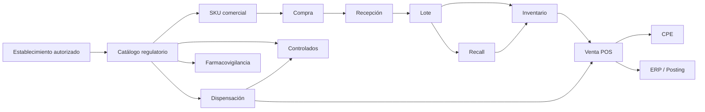

# DOM-FAR-001 — Modelo de Dominio de la Cadena de Farmacias

**Versión:** 0.1  
**Estado:** Borrador de dominio trazable  
**Dependencias:** BPM-FAR-001..013, RF-FAR, RN-FAR, CU-FAR y CA-FAR.

## 1. Objetivo

Construir un modelo de dominio que represente el negocio de una cadena de farmacias sin reducirlo a un conjunto de tablas CRUD. El modelo deberá preservar:

- regulación sanitaria del establecimiento y del producto;
- identidad regulatoria del producto separada de la identidad comercial del SKU;
- trazabilidad de lote, vencimiento, ubicación y movimientos;
- diferencia entre venta, dispensación y comprobante fiscal;
- reglas especiales para productos controlados;
- devoluciones sin reingreso automático a stock vendible;
- alertas, inmovilización y retiro/recall por producto/lote;
- farmacovigilancia independiente de la existencia de una venta propia;
- cierre retail separado del posting financiero/ERP;
- seguridad, privacidad y auditoría como capacidades transversales.

## 2. Principios de modelado

### 2.1. El modelo no replica la base de datos

Un agregado DDD no equivale a una tabla. Una entidad regulatoria, una posición de stock y una proyección de consulta pueden tener persistencias diferentes.

### 2.2. El dominio regulatorio y el comercial se relacionan, pero no se fusionan

Ejemplo:

```text
Producto Regulado
    │
    ├── registro sanitario
    ├── condición de venta
    ├── forma farmacéutica
    ├── concentración
    ├── clasificación/control
    └── estado regulatorio
            │
            ▼
       SKU Comercial
            │
            ├── código interno
            ├── código de barras
            ├── presentación comercial
            └── atributos retail
```

La separación es de dominio (`DOM`). DIGEMID publica atributos regulatorios como registro sanitario, condición de venta, forma farmacéutica, principio activo y clasificación; la noción de SKU es una necesidad comercial/retail y no una entidad normativa. [REF-06][REF-07]

### 2.3. Lote y stock son conceptos diferentes

```text
Lote
├── número
├── producto/SKU
├── vencimiento
├── origen
└── condición sanitaria

Posición de inventario
├── establecimiento
├── almacén
├── ubicación
├── SKU
├── lote
├── cantidad
└── estado de disponibilidad
```

El lote conserva identidad y trazabilidad. La posición expresa **dónde** y **cuánto** existe en un momento dado. DIGEMID/BPA utiliza número de lote y vencimiento como datos de trazabilidad; la estructura `PosiciónInventario` es una decisión de dominio para representar existencias multi-local. [REF-31]

### 2.4. Vencido no debe modelarse solo como un estado manual

`vencido` se deriva principalmente de `fecha_vencimiento` respecto de una fecha de referencia. Puede coexistir con un estado sanitario/operativo como `BLOQUEADO`, `CUARENTENA` o `RECALL`.

No debe depender de que un usuario cambie manualmente un enum para impedir la venta. La comercialización de productos vencidos está prohibida y DIGEMID fiscaliza este supuesto. [REF-02][REF-38]

### 2.5. Dispensación y venta no son sinónimos

```text
Prescripción
    ↓
Validación farmacéutica
    ↓
Dispensación
    ↓
Venta retail / POS
    ↓
Pago
    ↓
CPE
```

Una dispensación tiene propósito sanitario y competencia profesional. La venta tiene propósito comercial. El CPE tiene propósito fiscal. [REF-25][REF-27]

### 2.6. Venta y CPE tienen ciclos de vida separados

Una venta puede estar confirmada y su CPE todavía estar pendiente de envío/aceptación. Una nota de crédito referencia un comprobante anterior y no modifica destructivamente la venta original. [REF-27][REF-28]

### 2.7. Recall trabaja sobre producto/lote, no únicamente sobre SKU

DIGEMID publica retiros con Registro Sanitario, producto, lote, motivo, fecha de inicio y situación. El dominio debe poder identificar inventario y movimientos históricos afectados por esos criterios. [REF-30]

### 2.8. Farmacovigilancia no depende del ticket

Un reporte de sospecha de reacción adversa puede originarse en un paciente/profesional aunque el producto haya sido adquirido fuera de la cadena. La venta propia, cuando exista, es evidencia opcional, no una precondición. [REF-33]

## 3. Subdominios

| Subdominio | Clasificación DDD inicial | Motivo |
|---|---|---|
| Catálogo farmacéutico regulatorio | Core | Condiciona venta, dispensación, control y trazabilidad. |
| Inventario y trazabilidad por lote | Core | Esencial para disponibilidad, vencimiento, recall y operación multi-local. |
| Retail/POS | Core | Operación diaria de la cadena y alta concurrencia. |
| Prescripción y dispensación | Core | Diferencia una farmacia de un retail genérico y contiene reglas sanitarias. |
| Productos controlados | Core/Supporting regulatorio | Reglas especializadas, retención, libros/balances y supervisión QF. |
| Organización y cumplimiento de establecimientos | Supporting crítico | Autoriza dónde y bajo qué responsabilidad se opera. |
| Compras/abastecimiento | Supporting | Alimenta inventario y ERP. |
| Precios/promociones | Supporting | Política comercial y reportes de precios. |
| Fiscal/CPE | Supporting crítico | Cumplimiento tributario y documentos fiscales. |
| Recall/seguridad del producto | Supporting crítico | Inmovilización y trazabilidad sanitaria. |
| Farmacovigilancia | Supporting crítico | Seguridad poscomercialización y privacidad. |
| ERP financiero | Supporting/Generic | Contabilidad, tesorería y CxP; detalle contable aún debe profundizarse. |
| Reporte regulatorio de precios | Supporting | Obligación/reportabilidad según sujeto y mecanismo vigente. |
| IAM, auditoría, integraciones | Generic | Capacidades transversales reutilizables. |

La clasificación es inicial y podrá cambiar con la estrategia comercial de la cadena. DDD recomienda identificar un modelo coherente por Bounded Context, sin imponer un modelo único a todo el sistema. [REF-34][REF-35]

## 4. Mapa conceptual del núcleo



## 5. Límites transaccionales

Los límites candidatos serán los agregados. Como regla DDD, una transacción debe intentar preservar invariantes dentro de un agregado y evitar transacciones gigantes que abarquen varios contextos. [REF-36]

Ejemplo: confirmar una venta no debe abrir una transacción de base de datos que incluya simultáneamente:

- inventario;
- SUNAT;
- ERP;
- auditoría remota;
- farmacovigilancia.

El caso de uso puede coordinar acciones y publicar eventos, pero cada contexto conserva su propio estado y reglas.

## 6. Consistencia inmediata vs posterior

### Consistencia inmediata candidata

- cantidad vendida no superior a la cantidad reservada/autorizada en inventario;
- lote seleccionado no vencido/bloqueado/recalled;
- turno de caja abierto para registrar venta presencial;
- receta válida cuando el producto la exige;
- actor competente para la dispensación;
- idempotencia de confirmación de venta/posting.

### Consistencia posterior candidata

- transmisión/aceptación del CPE cuando el canal fiscal permita reintentos;
- posting financiero;
- notificaciones;
- actualización de reportes/BI;
- sincronizaciones regulatorias externas;
- propagación a canales no transaccionales.

La estrategia exacta será decisión arquitectónica posterior.

## 7. Modelo rico donde hay reglas; CRUD donde no aporta DDD táctico

No todos los módulos necesitan agregados complejos. Un catálogo técnico simple puede ser CRUD. Se aplicará DDD táctico en dominios con invariantes, transiciones y reglas cambiantes, evitando un modelo anémico en áreas críticas como inventario, venta, dispensación, controlados y recall. [REF-34]

## 8. Elementos que no se fijan todavía

- microservicios vs monolito modular;
- offline POS;
- Event Sourcing;
- motor externo de promociones;
- contabilidad completa/plan contable;
- integración directa con DIGEMID/SUNAT vs proveedor/archivo;
- FEFO como política universal;
- mecanismo físico de stock (ledger, balance materializado o híbrido).

Estas decisiones aparecen en `10-decisiones-abiertas.md`.
