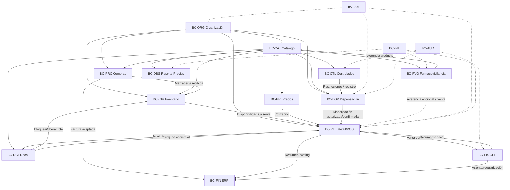

# DOM-FAR-002 — Bounded Contexts y Context Map

**Versión:** 0.1  
**Estado:** Candidatos de diseño estratégico DDD

## 1. Regla

Un Bounded Context es el límite dentro del cual un modelo y su lenguaje son coherentes. No equivale automáticamente a un microservicio, módulo Maven o esquema PostgreSQL. La arquitectura física se resolverá posteriormente. [REF-35][REF-37]

## 2. Bounded Contexts candidatos

| Código | Contexto | Responsabilidad principal |
|---|---|---|
| `BC-ORG` | Organización y Cumplimiento | Empresa, establecimiento, autorización y responsabilidades profesionales. |
| `BC-CAT` | Catálogo Farmacéutico Regulatorio | Identidad regulatoria, RS, condición de venta, clasificación y SKU. |
| `BC-PRC` | Compras y Abastecimiento | Proveedores, solicitudes, OC, recepción y conciliación operativa. |
| `BC-INV` | Inventario y Trazabilidad | Lotes, ubicaciones, posiciones, reservas, movimientos, transferencias, conteos. |
| `BC-PRI` | Precios y Promociones | Listas, precios efectivos, promociones y cotización comercial. |
| `BC-RET` | Retail/POS y Caja | Turnos, ventas, pagos, devoluciones comerciales y operación de caja. |
| `BC-DSP` | Prescripción y Dispensación | Recetas, validación farmacéutica, dispensación y competencia profesional. |
| `BC-CTL` | Productos Controlados | Reglas especiales, receta especial, registros, conciliación y balances. |
| `BC-FIS` | Fiscal/CPE | Factura, boleta, notas y relación con SUNAT/PSE. |
| `BC-RCL` | Seguridad de Producto y Recall | Alertas, afectación por producto/lote, inmovilización y conciliación. |
| `BC-FVG` | Farmacovigilancia/Tecnovigilancia | Reportes de seguridad, seguimiento y notificación externa. |
| `BC-FIN` | ERP Financiero | CxP, posting retail, reversas y consolidación financiera. |
| `BC-OBS` | Reporte Regulatorio de Precios | Preparación y evidencia del reporte periódico aplicable. |
| `BC-IAM` | Identidad y Acceso | Usuarios, autenticación, roles, permisos y ámbitos. |
| `BC-AUD` | Auditoría | Evidencia inmutable de operaciones críticas y accesos. |
| `BC-INT` | Integraciones | ACL/adaptadores, idempotencia, reintentos y contratos externos. |

## 3. Context Map



## 4. Relaciones relevantes

### 4.1. `BC-CAT` como upstream de hechos regulatorios

Otros contextos no deberían redefinir por su cuenta la condición de venta o clasificación controlada. Deben recibir una referencia/versionado del catálogo.

```text
Catálogo
   └── ProductoReguladoSnapshot
             ↓
      Venta / Dispensación
```

Cuando una condición regulatoria cambia, los contextos consumidores deben conocer la nueva versión sin reescribir históricamente operaciones cerradas.

### 4.2. `BC-INV` no entrega entidades internas a `BC-RET`

Retail debe solicitar disponibilidad/reserva mediante contrato:

```text
ReservarStockCommand
→ ResultadoReserva
```

No debe modificar directamente `PosicionInventario` desde el módulo POS.

### 4.3. `BC-DSP` entrega una decisión sanitaria, no un descuento

```text
DispensacionAutorizada
├── dispensacionId
├── prescripcionId
├── productos/cantidades autorizadas
└── restricciones/evidencia necesaria
```

El precio pertenece a `BC-PRI/BC-RET`.

### 4.4. `BC-FIS` protege al dominio de vocabulario/protocolos SUNAT

El dominio retail no debería depender de códigos internos de un PSE o de estructuras XML externas. Se utilizará una capa anticorrupción (`ACL`) en `BC-INT/BC-FIS`.

```text
Venta
  ↓
EmitirComprobante
  ↓
Modelo Fiscal Interno
  ↓
ACL SUNAT/PSE
  ↓
Contrato externo
```

### 4.5. `BC-RCL` coordina, pero no edita stock directamente

Un caso de recall identifica el alcance y ordena bloqueo:

```text
CasoRecall
  ↓
BloquearLoteCommand → BC-INV
  ↓
Stock no vendible
```

La evidencia de inventario permanece propiedad de `BC-INV`.

### 4.6. `BC-FVG` mantiene privacidad propia

Puede referenciar `ProductoReguladoId`, `SKUId` o `VentaId`, pero la existencia de `VentaId` es opcional. [REF-33]

## 5. Shared Kernel

Debe ser mínimo. Candidatos:

- identificadores tipados (`TenantId`, `EmpresaId`, etc.);
- `Money`;
- `Quantity` + unidad;
- `DateRange`;
- infraestructura de Domain Events/Result, si posteriormente la arquitectura lo adopta.

No deben ubicarse en un `shared/common` conceptos de negocio como `Producto`, `Venta`, `Receta`, `Lote` o `Cliente`.

## 6. Integraciones externas como modelos separados

| Sistema/fuente | Modelo interno que protege |
|---|---|
| DIGEMID catálogo/estándares | `BC-CAT` |
| DIGEMID retiros/alertas | `BC-RCL` |
| DIGEMID NotiMED/NotiVAC | `BC-FVG` |
| SUNAT/PSE | `BC-FIS` |
| ERP contable externo, si existiera | `BC-FIN` |
| Pasarela de pago | `BC-RET` mediante adaptador |

## 7. Bounded Contexts futuros, no incluidos todavía

- CRM/Fidelización avanzada;
- e-commerce/delivery;
- Workforce Management;
- planeamiento avanzado de demanda;
- data platform/ML.

El mapa de dominio actual no debe crear esos contextos hasta que existan RF suficientes.
