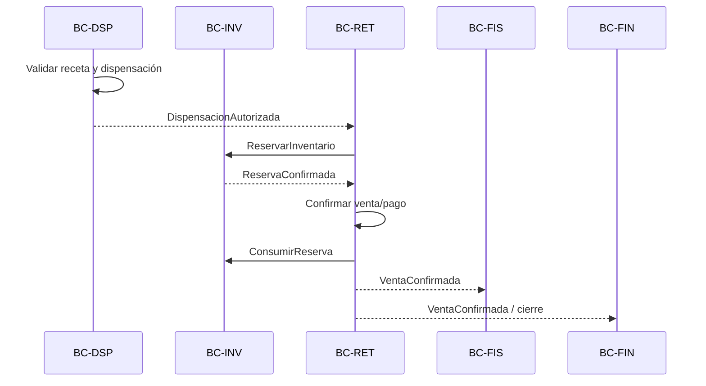

# DOM-FAR-005 — Comandos, Eventos y Servicios de Dominio

**Versión:** 0.1  
**Estado:** Catálogo inicial

## 1. Principio

- **Command:** intención de cambiar estado.
- **Domain Event:** hecho de negocio que ya ocurrió.
- **Domain Service/Policy:** regla que no pertenece naturalmente a una sola entidad/agregado.

No se asume todavía un broker externo. Los eventos son conceptos de dominio; su transporte se decidirá en arquitectura.

## 2. Comandos por contexto

### BC-ORG

- `RegistrarEstablecimiento`
- `HabilitarEstablecimiento`
- `SuspenderEstablecimiento`
- `AsignarDirectorTecnico`
- `AsignarProfesional`

### BC-CAT

- `RegistrarProductoRegulado`
- `PublicarProductoRegulado`
- `ActualizarAtributosRegulatorios`
- `RegistrarSku`
- `BloquearSku`

### BC-PRC

- `CrearSolicitudCompra`
- `AprobarSolicitudCompra`
- `EmitirOrdenCompra`
- `RegistrarRecepcionCompra`
- `AceptarDiferenciaRecepcion`

### BC-INV

- `RegistrarLote`
- `IngresarInventario`
- `ReservarInventario`
- `LiberarReserva`
- `ConsumirReserva`
- `BloquearLote`
- `LiberarLote`
- `SolicitarTransferencia`
- `DespacharTransferencia`
- `RecibirTransferencia`
- `RegistrarConteo`
- `AprobarAjusteInventario`

### BC-PRI

- `PublicarListaPrecio`
- `ProgramarPromocion`
- `SuspenderPromocion`

### BC-RET

- `AbrirTurnoCaja`
- `AgregarLineaVenta`
- `CotizarVenta`
- `ConfirmarVenta`
- `CancelarVenta`
- `SolicitarDevolucion`
- `ConfirmarReembolso`
- `CerrarTurnoCaja`

### BC-DSP

- `RegistrarPrescripcion`
- `ValidarPrescripcion`
- `AutorizarDispensacion`
- `ConfirmarDispensacion`
- `DenegarDispensacion`

### BC-CTL

- `RegistrarRecetaControlada`
- `ValidarRecetaControlada`
- `RegistrarMovimientoControlado`
- `CerrarPeriodoControlado`
- `PrepararBalanceControlado`

### BC-FIS

- `EmitirComprobante`
- `TransmitirComprobante`
- `RegistrarRespuestaFiscal`
- `EmitirNotaCredito`

### BC-RCL

- `AbrirCasoRecall`
- `AgregarLoteAfectado`
- `OrdenarBloqueoRecall`
- `ConfirmarInmovilizacionLocal`
- `ConciliarRecall`
- `CerrarCasoRecall`

### BC-FVG

- `RegistrarReporteSeguridad`
- `ComplementarReporteSeguridad`
- `EnviarReporteSeguridad`
- `RegistrarAcuseReporte`

### BC-FIN

- `GenerarCuentaPorPagar`
- `SolicitarPostingRetail`
- `ConfirmarPosting`
- `RegistrarErrorPosting`
- `ReversarPosting`

## 3. Domain Events

### Organización

- `EstablecimientoRegistrado`
- `EstablecimientoHabilitado`
- `EstablecimientoSuspendido`
- `DirectorTecnicoAsignado`

### Catálogo

- `ProductoReguladoPublicado`
- `CondicionVentaModificada`
- `EstadoRegistroSanitarioModificado`
- `SkuPublicado`
- `ProductoBloqueado`

### Compras

- `OrdenCompraEmitida`
- `MercaderiaRecibida`
- `DiferenciaRecepcionRegistrada`
- `FacturaProveedorAceptada`

### Inventario

- `LoteRegistrado`
- `StockIngresado`
- `InventarioReservado`
- `ReservaLiberada`
- `StockConsumido`
- `LoteBloqueado`
- `LoteLiberado`
- `TransferenciaDespachada`
- `TransferenciaRecibida`
- `AjusteInventarioAprobado`

### Precios

- `PrecioPublicado`
- `PromocionActivada`
- `PromocionSuspendida`

### Retail

- `TurnoCajaAbierto`
- `VentaConfirmada`
- `VentaCancelada`
- `DevolucionAceptada`
- `ReembolsoConfirmado`
- `TurnoCajaCerrado`

### Dispensación

- `PrescripcionValidada`
- `PrescripcionRechazada`
- `DispensacionAutorizada`
- `DispensacionConfirmada`
- `DispensacionDenegada`

### Controlados

- `RecetaControladaValidada`
- `MovimientoControladoRegistrado`
- `BalanceControladoPreparado`

### Fiscal

- `ComprobanteGenerado`
- `ComprobanteEnviado`
- `ComprobanteAceptado`
- `ComprobanteRechazado`
- `NotaCreditoEmitida`

### Recall

- `CasoRecallAbierto`
- `LoteAfectadoPorRecall`
- `BloqueoRecallSolicitado`
- `InmovilizacionConfirmada`
- `RecallConciliado`
- `CasoRecallCerrado`

### Farmacovigilancia

- `ReporteSeguridadRegistrado`
- `ReporteSeguridadComplementado`
- `ReporteSeguridadEnviado`

### ERP

- `PostingRetailSolicitado`
- `PostingRetailConfirmado`
- `PostingRetailFallido`
- `PostingRetailReversado`

## 4. Servicios y políticas de dominio

### 4.1. `ResolverEstadoRegulatorioProducto`

Entrada:

- producto;
- fecha referencia;
- fuente regulatoria disponible.

Salida:

- condición regulatoria efectiva;
- evidencia/versión.

No debe inferir estado por nombre comercial.

### 4.2. `EvaluarVendibilidad`

Combina:

```text
Producto regulatoriamente comercializable
AND SKU activo
AND lote no vencido
AND lote no bloqueado/recalled
AND posición disponible
AND canal permitido
AND reglas de dispensación cumplidas si aplican
```

Debe devolver razones estructuradas de denegación.

### 4.3. `SeleccionarLotesParaSalida`

Política configurable:

- FEFO;
- FIFO;
- selección manual autorizada;
- otras estrategias documentadas.

No se declara FEFO como obligación universal. Odoo/benchmarks y normas específicas muestran su utilidad; su universalidad para toda la cadena queda como política. [REF-24][REF-31]

### 4.4. `ResolverPrecioVenta`

Combina lista, ámbito, canal, vigencia y promociones compatibles. Debe generar una `PriceDecisionSnapshot` reproducible.

### 4.5. `ValidarPrescripcionPolicy`

Debe considerar:

- condición de venta;
- datos mínimos;
- vigencia aplicable;
- uso previo cuando sea relevante;
- enmendaduras/consistencia;
- reglas especiales si es controlado.

DIGEMID recuerda que la dispensación bajo receta debe circunscribirse a una receta vigente y no usada previamente, con datos mínimos y sin enmendaduras. [REF-39]

### 4.6. `EvaluarCompetenciaDispensador`

Decide si el actor puede ejecutar el acto de dispensación según perfil profesional, establecimiento, asignación vigente y tipo de producto. Un permiso informático no sustituye competencia profesional.

### 4.7. `ValidarRecetaControladaPolicy`

Encapsula reglas por lista/tipo normativo y evita constantes globales como `vigencia=3` para toda receta. [REF-26]

### 4.8. `ResolverDisposicionDevolucion`

Entrada:

- producto/lote;
- condición física;
- cadena de custodia;
- política/regla sanitaria aplicable.

Salida:

- cuarentena;
- devolución proveedor;
- disposición/destrucción;
- excepcional liberación si está sustentada.

Una nota de crédito nunca equivale a la salida de este servicio. [REF-27]

### 4.9. `ResolverImpactoRecall`

Identifica:

- stock actual por establecimiento;
- reservas;
- transferencias;
- ventas históricas;
- pedidos/canales afectados.

Produce instrucciones de bloqueo y una fotografía de impacto.

### 4.10. `ConciliarOcRecepcionFactura`

Servicio de dominio/ERP configurable de three-way match. No se presenta como norma sanitaria.

### 4.11. `ConstruirPostingRetail`

Transforma hechos de cierre/venta/reembolso en una solicitud financiera idempotente. No decide la estructura completa del plan contable hasta profundizar `BC-FIN`.

### 4.12. `PrepararReporteObservatorio`

Resuelve el conjunto de precios/establecimientos/período y conserva la fuente que originó cada dato reportado.

## 5. Eventos entre contextos

Ejemplo de venta bajo receta:



## 6. Eventos que no deben disparar efectos ocultos no controlados

- `NotaCreditoEmitida` no reingresa stock automáticamente.
- `ComprobanteAceptado` no confirma la dispensación.
- `ReporteSeguridadRegistrado` no crea automáticamente recall.
- `ProductoReguladoActualizado` no reescribe ventas históricas.
- `VentaConfirmada` no debe producir dos postings por reintento.
