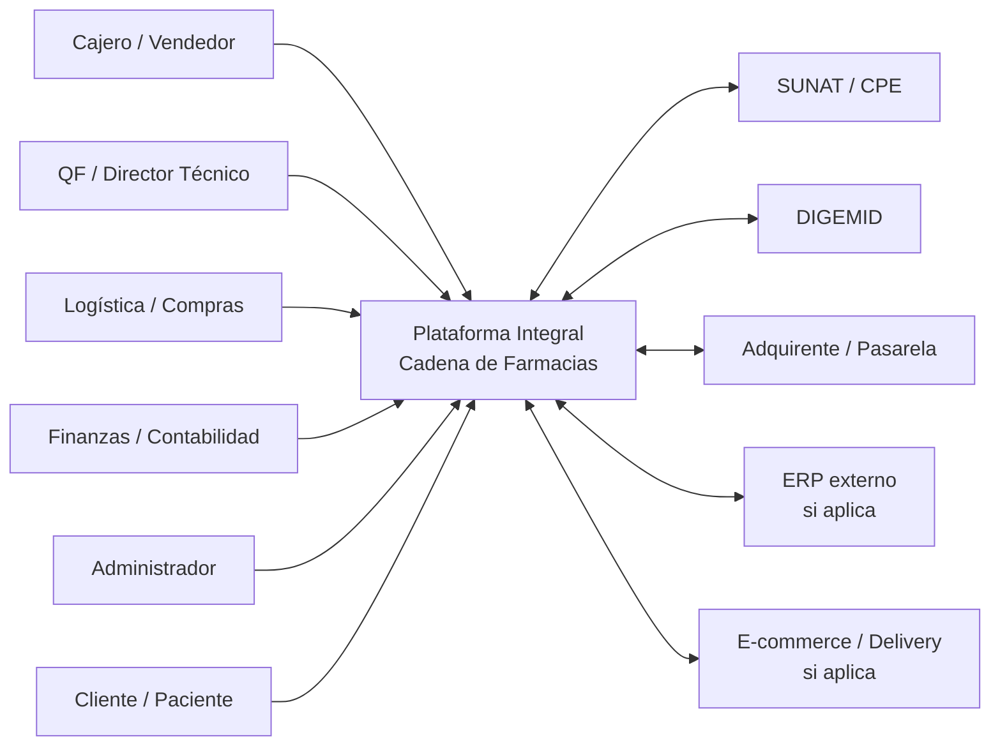
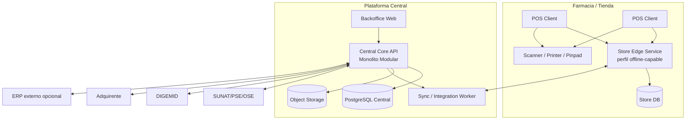
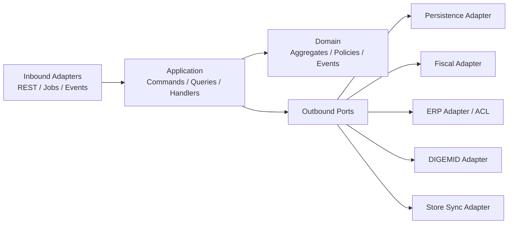
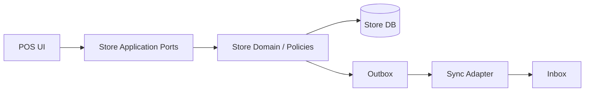

# ARC-FAR-002 — Modelo C4

**Versión:** 0.1

C4 se utiliza para comunicar arquitectura a distintos niveles. El sitio oficial C4 recomienda Context y Container para la mayoría de equipos; Component se utiliza solo cuando aporta valor.

## C1 — Contexto del sistema

## C2 — Contenedores

### Nota

Si una tienda opera solo online, `Store Edge Service`/`Store DB` pueden no desplegarse o actuar como capa local liviana según la decisión técnica final.

## C3 — Core Central

## C3 — Store Edge

El Store Edge no debe reimplementar todo el Core Central. Contiene solo capacidades necesarias para continuidad de tienda y validaciones locales autorizadas.
