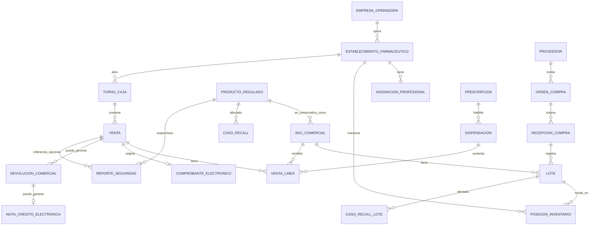

# DAT-FAR-001 — Modelo Conceptual de Datos

**Versión:** 0.1  
**Estado:** borrador derivado del dominio validado.

## 1. Objetivo

Representar los hechos relevantes del negocio sin asumir aún el diseño físico de la base de datos.

## 2. Macro-modelo

## 3. Separaciones obligatorias del modelo

### 3.1 Producto regulado ≠ SKU comercial

`ProductoRegulado` representa identidad y atributos regulatorios. `SKUComercial` representa la presentación/unidad comercial operada por retail. Un cambio de descripción, código interno o código de barras no debe reescribir la identidad regulatoria histórica.

### 3.2 Lote ≠ posición de inventario

`Lote` conserva identidad, vencimiento y condición. `PosicionInventario` representa cantidad en un ámbito concreto de establecimiento/almacén/ubicación/estado.

### 3.3 Venta ≠ dispensación ≠ CPE

- `Dispensacion`: decisión/acto farmacéutico.
- `Venta`: hecho comercial.
- `Pago`: liquidación de la venta.
- `ComprobanteElectronico`: hecho fiscal y su ciclo SUNAT/PSE.

### 3.4 Devolución ≠ reingreso a stock

La devolución comercial puede generar reembolso/nota de crédito. La decisión de reincorporar el producto a inventario vendible pertenece a una evaluación de disposición/estado del inventario.

## 4. Identidad e historia

Los hechos cerrados deben conservar snapshots mínimos de la regulación o decisión que los justificó, por ejemplo:

- condición de venta aplicada;
- clasificación controlada aplicable;
- precio/promoción resueltos;
- lote consumido;
- establecimiento y actor;
- documento fiscal asociado;
- versión/regla utilizada cuando sea material.

## 5. Conceptos aún no cerrados

- `ClienteRetail` y `Paciente` no se asumen como la misma entidad.
- CRM/fidelización permanece fuera del Core actual.
- e-commerce/delivery tendrá su propio análisis antes de incorporarse.
- stock offline no se modela todavía como fuente de verdad independiente.
