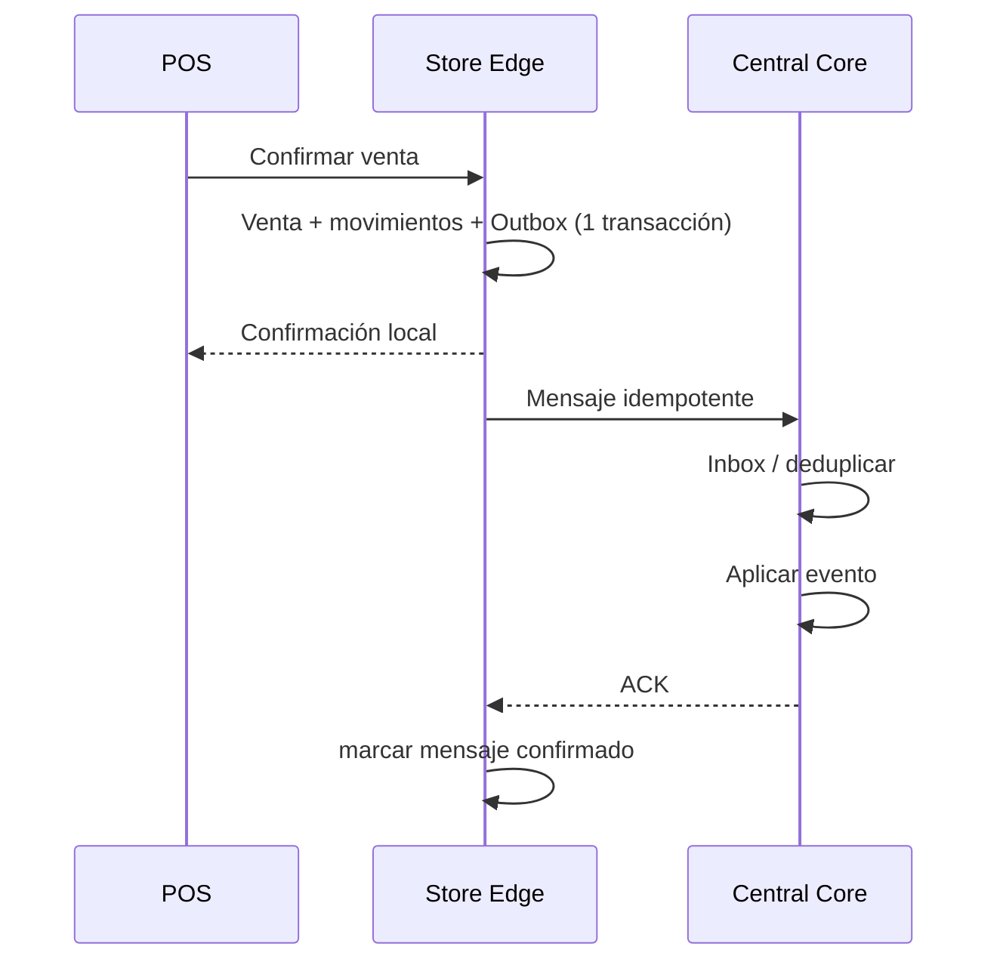

# DAT-FAR-003 — Propiedad de Datos: Central Core vs Store Edge

## 1. Principio

El Store Edge es una capacidad de continuidad operativa, **no una segunda fuente maestra corporativa**. Cada conjunto de datos debe declarar propietario (`system of record`) y naturaleza de la copia local.

## 2. Clasificación

| Dato | Propietario | Store Edge | Dirección principal |
|---|---|---|---|
| Empresa/establecimiento | Central | Proyección | Central → tienda |
| Producto regulado/SKU | Central | Proyección versionada | Central → tienda |
| Lista de precios/promociones | Central | Proyección efectiva | Central → tienda |
| Lotes/stock corporativo | BC-INV central | Proyección operativa local | bidireccional controlada |
| Turno de caja | Tienda durante operación | Autoritativo local hasta sync | tienda → central |
| Venta offline | Tienda | Autoritativo local hasta ACK | tienda → central |
| Pago | Tienda/adquirente | referencia local | tienda → central |
| CPE | BC-FIS central o fiscal edge según modalidad | estado/proyección | configurable |
| Dispensación | dominio DSP | copia mínima necesaria para POS | controlada |
| Usuarios/permisos | Central IAM | caché/proyección limitada | Central → tienda |
| Auditoría de tienda | tienda + consolidación central | buffer local | tienda → central |

## 3. Reglas

1. Una proyección local debe tener `version` o cursor de sincronización.
2. Una transacción originada offline debe tener `message_id`, `business_id` e `idempotency_key` estables.
3. El ACK central no puede cambiar la identidad comercial ya entregada al cliente.
4. Un retry no genera otra venta ni otro movimiento económico.
5. Datos regulatorios vencidos localmente deben poder provocar modo restringido según política; no se asumirá venta ilimitada con catálogo desactualizado.
6. La resolución de conflictos de stock offline queda en ADR-008 y no se hardcodeará todavía.

## 4. Datos que no deberían replicarse indiscriminadamente

- secretos de integración;
- credenciales completas;
- historial masivo de clientes;
- reportes de farmacovigilancia no requeridos por tienda;
- payloads externos de SUNAT no necesarios para operación local;
- datos personales que no tengan finalidad operacional.

## 5. Flujo de sincronización

